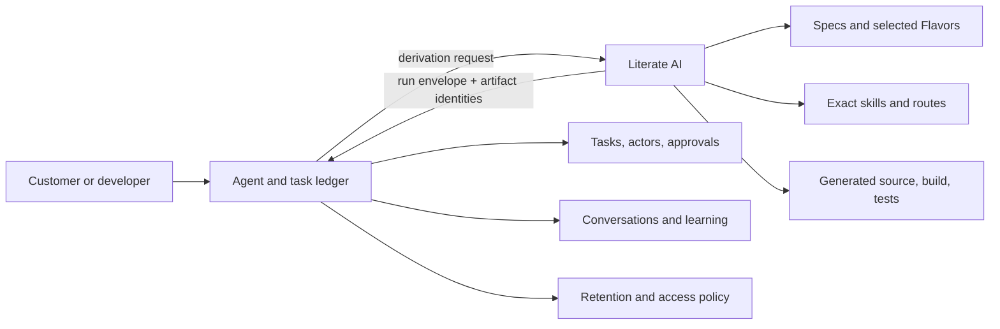
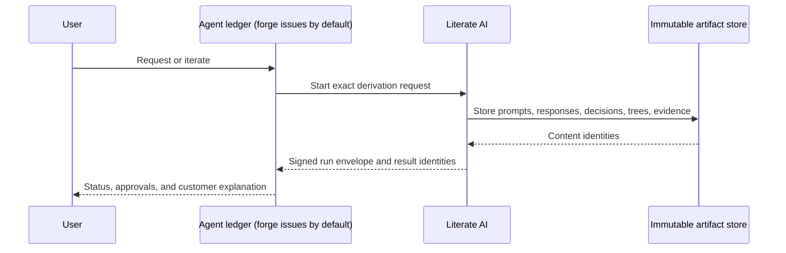

# Literate AI and an agent ledger

Literate AI is a derivation engine. An agent ledger is a control plane. They meet at
one content-addressed run boundary; neither system subsumes the other.

By default the ledger is the forge that hosts the repository receiving issues and pull
requests, GitHub or GitLab as `litai project tracker inspect` detects it: issues record
problems and requests and coordinate agents, and PRs/MRs submit changes against the
project's target branch. A project or user may override that default with an external
agent ledger, another task tracker, or another review system such as Gerrit
([ADR 0050](../decisions/0050-forge-issues-and-reviews-are-the-default-tracker.md)).
Everything below applies to whichever ledger is in effect.

## Ownership

| Question | Owning system |
| --- | --- |
| What behavior and target were requested? | Literate AI specs and selected Flavors |
| Which exact skill, workflow, model route, and tool produced this candidate? | Literate AI derivation records |
| Did the candidate build, run, and satisfy current tests? | Literate AI evidence and acceptance records |
| Who requested, organizationally consented to, retried, or stopped the work? | Agent ledger |
| Which exact operation and resources were granted execution privilege? | Literate AI typed authorization evidence |
| Which conversation, task, lease, or customer iteration led to the request? | Agent ledger |
| Which retained experience should be proposed for future work? | Agent ledger |
| When does learned experience become generation authority? | Only after review and pinning as a Literate AI spec, Flavor, skill, workflow, or routing-policy revision |

The ledger may schedule a derivation and retain its organizational history. Its customer
or organizational consent is not the execution grant that authorizes a build, test, or
publication step; Literate AI owns that exact typed privilege binding. Literate AI must
still be usable without the ledger, and a ledger must not silently mutate a generation
prompt, Flavor set, route, or authorization.

Before this join boundary, direct and ledger-driven requests take different prompt
translation paths. A user invoking Literate AI or a supported coding agent directly may
use the pinned `skills/agent/prompt-master/` adapter to sharpen a rough request into a
bounded provider task, and a forge issue is such a direct request. A request from an
external task system that already translated it (`LITAI_EXTERNAL_TASK_ID`) bypasses
that adapter: that system applied its own translation between its task and provider
layers. Literate AI never applies both paths to one request, and neither path can
change locked derivation authority or grant execution privilege.

## Join protocol

One future `derivation-run` envelope should carry semantic identities rather than host
paths or mutable URLs:

- the request identity plus parent task/correlation metadata;
- the complete Literate AI input closure;
- selected Component, specification, Flavor, skill, workflow, route, model, and tool
  identities;
- framework-visible prompt and response blob identities for every model call;
- typed decision records and approval identities;
- generated-tree, source/resolved CycloneDX graph, build, test, package, and
  publication identities; and
- terminal outcome plus an identity for the complete journal.

Large blobs belong in an immutable content-addressed store. Each system stores the
identities and typed relations it owns. A ledger can register Literate AI results as
artifact and evidence records (an issue or PR/MR comment by default) without copying
source or teaching its task schema about build internals.

Task and correlation identifiers join records across systems but are not semantic
generation inputs. They stay in envelope metadata and are excluded from derivation,
source-cache, build-cache, and artifact identities; retrying the same exact derivation
under another task must not manufacture different content.

## Journals and customer explanations

“Complete prompt journal” means every prompt, response, tool request, tool result, and
decision visible at the Literate AI framework boundary. It does not promise access to a
provider's hidden system instructions or private chain of thought. Raw journals can
contain source, customer data, secrets, or security findings, so retention, encryption,
redaction, and access control belong to ledger and artifact-store policy.

The normal customer artifact should be a derived explanation: requirements and target
choices, important recorded decisions, exact skills and models, generated outputs,
tests, approvals, and exceptions. The sealed raw journal is forensic evidence, not the
default user interface.

## Current status

This document fixes the boundary but does not claim the join protocol is implemented.
Today, Literate AI records many input and result identities, while some coding-CLI
request files and bounded process streams are transient. A durable injected journal
sink, portable run-envelope schema, and retained canonical input blobs are required
before claiming complete enterprise derivation replay or audit.

Retained experience becomes reusable project behavior only through the separately gated
[authority learning loop](authority-learning-loop.md); neither a ledger entry nor a
candidate repair may silently change future generation authority.
