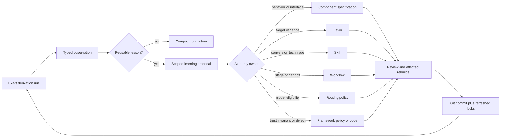
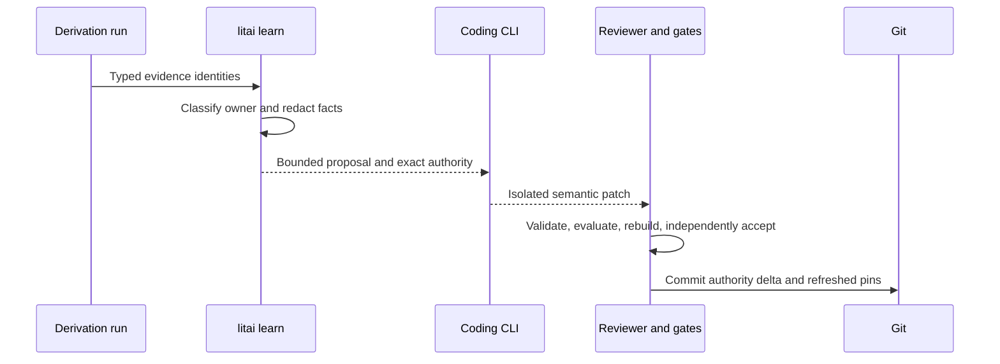

# Authority learning loop

Literate AI does not train or modify a coding model. A project learns when observed
evidence produces a reviewed change to the durable authority supplied to future model
calls. Retry feedback repairs one candidate; Git-tracked authority prevents the same
class of mistake in later derivations.

## Present boundary

The framework already records typed derivation, build, test, acceptance, and candidate
rejection evidence. Bounded sample replacement can give a later candidate sanitized
rejection facts. Literate AI does **not yet** automatically turn those observations into
an authority-change proposal or update a Component, Flavor, skill, workflow, or route.
The agent-ledger boundary permits a ledger to retain experience, but retention is not
generation authority and does not close this loop.

This distinction is deliberate. Automatically copying a model's workaround into a spec
would let generated implementation detail redefine product behavior, leak a private
acceptance oracle, or teach a platform-specific rule globally. A lesson must be scoped,
reviewed, and proven before it changes future prompts.

## Classification rule

Choose the narrowest durable owner that covers every place where the lesson should
apply:

| Evidence says | Durable owner |
| --- | --- |
| Observable behavior, data contract, or public interface was missing or ambiguous | Component specification or public interface |
| The rule varies by OS, CPU, language ecosystem, build system, packaging, or deployment target | Flavor |
| The rule is reusable technique for converting many specifications into or from source | Skill |
| Stage order, artifact handoff, approval, or evidence production was wrong | Workflow |
| A model/tool was ineligible, unavailable, or consistently weak for a bounded stage | Routing policy |
| A trust invariant, validator, adapter, or framework-wide default was wrong | Framework policy, decision record, or code |
| The candidate made a one-off mistake already forbidden by exact authority | No authority change; retain compact evidence and use bounded repair |

Do not promote compiler diagnostics, source layout, or a successful workaround into a
behavioral specification merely because that was the first place the problem appeared.
Likewise, do not hide a genuinely missing product requirement in a coding skill.

## Current protocol boundary

`litai learn RUN` is implemented as a read-only operation over one versioned
`LearningPlanInput`. It deterministically emits exactly one content-identified proposal
containing:

- the exact run and failed/passed evidence identities;
- a stable defect class and the evidence-safe facts supporting it;
- the proposed authority owner and why narrower or broader owners were rejected;
- a minimal suggested semantic delta, with no private oracle values or host paths;
- affected Component/Flavor/skill/workflow/routing identities and rebuild scope; and
- an explicit `candidate-specific` disposition when no durable change is warranted.

The current planner does not infer confidence or recurrence, edit authority, invoke a
coding CLI, or write a learning record. Those remain separate admission milestones.

The future `litai learn apply` may ask the selected coding CLI to draft the isolated
change, but
must not admit it merely because that same CLI endorses its own proposal. Admission
requires human review or an explicit project policy, validation of the changed authority,
skill evaluation when a skill changes, refreshed locks, and clean affected rebuilds with
independent acceptance. A cross-cutting skill or Flavor lesson requires representative
multi-Component and platform evidence.

The accepted authority diff is the project's durable memory. Compact run/learning
records retain why it changed; generated sources and rejected candidates remain cache or
ledger artifacts, not repository authority. Future generation naturally consumes the
lesson through the updated pinned input and invalidates only the affected derivations.

## Relationship to an agent ledger

The agent ledger (forge issues by default, or an external ledger by override) may own
conversations, tasks, recurrence statistics, retention, and organizational approvals.
Literate AI owns the semantic proposal, authority classification, derivation
identities, and proof that the accepted change passes its lifecycle. The ledger may
recommend a lesson, but it cannot silently mutate a generation input. See [Literate AI and an agent ledger](agent-ledger-boundary.md).
