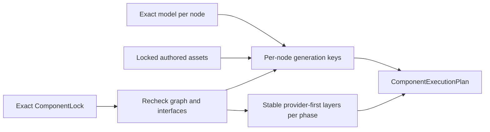
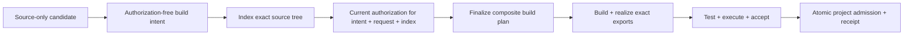
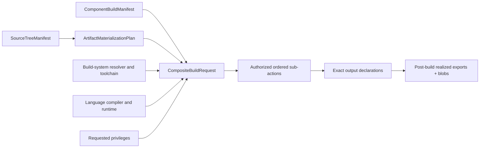

# Per-Component execution plans

A locked project is planned as independently cacheable Component work, not as one
flattened coding-agent request. `plan_component_execution` converts one exact
`ComponentLock` into a versioned `ComponentExecutionPlan` before any model egress.

## Generation-key boundary

Each `ComponentGenerationKey` binds the node's ordered specification set and document
identities, selected target/Flavors, specification-to-source skills, workflow, routing
policy, model, authored assets, its own exported public-interface identities, and the
public-interface identities of its direct generation dependencies.

It deliberately does **not** bind aggregate Component/authoring revisions because those
would smuggle acceptance-oracle and dependency-selection identities across the narrow
generation boundary. It also does not bind a dependency's revision, private
specifications, source tree, build output, tests, routing policy, or skills. Consequently:

- changing a leaf's private specification invalidates the leaf only;
- changing the leaf's exported interface invalidates the leaf and its direct consumers;
- a diamond leaf appears once in each provider-before-consumer layer; and
- a consumer key remains stable when private graph depth or implementation changes.

`ComponentGenerationPlan` retains the exact direct edges for audit, but cache
membership uses its `generation_key.identity`. The audit plan may change when a provider
revision changes even when the consumer source key correctly remains reusable.

## Stable action layers

A `ComponentActionPlan` names one lifecycle phase and schedules every locked revision
in explicit zero-based layers. Revisions within a layer are ordered by content-identity
URI, and every applicable edge requires the provider to occupy an earlier layer than
the consumer. `ComponentExecutionPlan` carries one action plan for every canonical
phase: generate, validate, build, run, package, and deploy.

The planner rechecks closure, cycles, and exact public-interface bindings even though
the lock contract already validates them. A missing/incomplete generation interface,
an open graph, or a cycle is therefore a stable planning error before a coding CLI can
run. It never repairs an interface failure by exposing a dependency's private material.

## Bounded incremental generation

Remote `build` and `test` preserve `--jobs` through the canonical dispatch request
and worker lifecycle, using the same 1–256 bound as local execution. The request
identity binds this scheduling policy; the shared artifact-input authority does
not, so a retained parallel build remains replayable with `run`. Omitted `jobs`
means one and retains the existing default request representation. Workers that
do not understand a nondefault `jobs` field reject that request during contract
validation. Dependency ordering and failed-predecessor cancellation still belong
to the lifecycle scheduler within the selected worker.

`schedule_source_generation` consumes the generation action layers, one exact
invalidation decision, the prepared bounded request for every node, and any typed
`SourceGenerationResumeCandidate` values. It revalidates every request against the
current per-node plan before starting a worker. A candidate is reusable only when its
generation key, context manifest, complexity budget and decision, prompt, recipe,
workspace allocation, and complete typed output all match. Missing, stale, over-budget,
or explicitly invalidated candidates run again.

The Standard lifecycle has a separate accepted-source membership path. Matching
Component revision and generation-key identities authorize reuse of the immutable
source artifacts across application roots; they do not authorize reuse of the old
request, plan, lock, recipe, workspace, provenance, or acceptance custody. The service
creates a new candidate/output/provenance projection bound to the current prepared node,
retains the input membership as origin evidence, and then runs the complete current
index, authorization, build, test, execution, and acceptance sequence. A different key
fails closed before reuse, explicit regeneration bypasses membership, and any prepared
recipe lock must equal the current execution-plan lock. Historical generation runtime
metrics remain on the input membership rather than being charged to the cache hit; the
new output reports no model execution. A hit is not republished.

Independent nodes in one layer may run concurrently up to the explicit bound. Results
are emitted in canonical Component-revision order rather than completion order. A
failed provider cancels dependent generation nodes before their adapters are called;
independent branches continue. Reused nodes report no current runtime observation.

The runner returns one `SourceGenerationRunOutput`: an immutable
`GeneratedSourceCandidate`, generation-only provenance, and optional runtime observation.
The candidate separately identifies its generated tree, source bundle, source manifest,
source SBOM, and generated-test suite. The per-node result is the common journal,
benchmark, and receipt-facing evidence surface. It binds the current context and budget
identities. A generation adapter may report actual model attempts, wall time, model
tokens, and cost; each absent measurement remains `null`, never an invented zero.
Supplied measurements that exceed the exact budget fail the node and retain the observed
values for diagnosis.

This boundary stops at source. Neither a candidate nor its provenance grants build,
acceptance, cache-membership, or publication authority. Reuse means only that the exact
source-only output remains eligible to enter the current post-source lifecycle.

The older host orchestrator is now a typed facade over the same authority distinction.
`GenerationRequest` names one exact locked Component, carries a
`GenerationContextBinding`, and supplies a `BuildRequestDeclaration` whose builder,
toolchain, sandbox, privileges, and outputs are known before generated bytes exist. The
declaration deliberately cannot name a source bundle. After the generated tree, current
test manifest, and source SBOM pass admission, the orchestrator realizes exactly one
source-bound `BuildRequest`, records exactly one `build-request-realized` event, and keeps
the typed request on `GenerationRun` for every downstream adapter and resume check.
Generation provenance v4 binds both the declaration and realized-request identities, as
well as both the application root and generated Component identities. Historical v3 wire
contracts remain readable rather than being rewritten.

## Standard project lifecycle

Worker routing primitives are available in `application/component_workers.py`.
An explicit assignment for every locked revision binds the execution plan, lock,
private catalog identity, worker identity, target profile and locked Flavor
selection. Revalidation rejects drift before dispatch. The public record contains
no worker endpoint, workspace, command or environment values.

The handoff planner selects direct build/runtime/package predecessors from the
existing action plans. Generation-only and transitive implementations are excluded.
The lifecycle caller must supply already accepted products; an acceptance identity
in this contract does not authenticate evidence. The filesystem custody adapter
uses the existing CAS to verify source bytes, copy regular files with bounded reads,
compare the resulting blob identity and verify destination bytes. Its receipt binds
the exact handoff, consumer worker and complete export set, preserving original
target, ABI, source, authorization and toolchain metadata.

The Standard scheduler now applies those primitives at its existing complete-node
boundary. One current routing record selects local, command, or SSH handlers without
creating a second scheduler. Every handler result must bind the exact request, worker,
Component and lifecycle-result identity, and its import receipt must bind the complete
handoff before the result enters downstream scheduling. Existing artifact contracts
retain target, ABI, authorization and toolchain evidence; final project acceptance is
unchanged. Byte custody alone still establishes neither ABI compatibility nor native
acceptance.

Failed predecessors remain undispatched. A caller-owned cancellation signal is shared
with active transports and prevents later actuation; transports receive an explicit
cancel callback for work they own. Recovery candidates bind the current routing,
request, worker, import receipt and result identities, so changed plans, assignments,
inputs or reuse selections run or fail instead of replaying stale evidence.

Independent portable and library acceptance distinguishes product data from canonical
contract JSON v1. Product JSON preserves finite fractional arguments and results with
sorted UTF-8 object keys, compact separators and shortest round-trip binary64 number
spelling. Invocation and evidence preserve those bytes, while result comparison
checks exact JSON values: integral numbers such as `1` and `1.0` compare equally.
Booleans remain distinct from numbers, negative zero retains its sign, and neither
tolerances nor integer-to-float rounding are introduced. Numeric application values
are not converted to strings.
Integer-only documents retain their previous bytes and identities. Contract JSON v1
remains integer-only. Oracle loading and invocation reject non-finite product values,
and non-finite observed output cannot enter passing evidence.
Retained library qualification stores and reopens the actual finite product bytes
for oracles, cases and results. The observed result identity may differ from the
expected value's encoding identity; reopening validates its exact bytes, canonical
product encoding and value against the current oracle. Its general contract JSON
reader remains integer-only.

`StandardProjectLifecycleService` is the reusable application-layer path above that
scheduler. It depends only on injected ports for project validation, generation,
indexing, source-bound build intent, current authorization, build-plan finalization,
building, generated tests, execution, acceptance, atomic project admission, and receipt
issuance. CLI and adapter packages remain outside this boundary.

The locked `litai plan` and source-only `litai generate` commands now reach this boundary
through filesystem Standard adapters and `StandardProjectApplicationService`. The
adapters own host PATH selection, locked per-node model resolution, fresh workspace
allocation, cache lookup, and model invocation; the CLI owns arguments, error mapping,
and JSON presentation. The filesystem planner projects every locked
`ResolvedComponentAsset` into the same typed authored-binary-asset tuple accepted by the
application service; an explicit tuple remains an adapter seam for tests and external
runtimes. Each asset identity enters the per-node generation key, its metadata enters
bounded model context, and its verified CAS blob is merged only after text generation.
An adapter never silently drops those identity-bearing inputs. Generation returns one
versioned custody record per Component,
binding its exact plan and generation key to the retained workspace, result, candidate,
and provenance. It grants no build authority and does not index, build, test, accept, or
publish the candidate. The outer rebuild command remains on its existing contract until
it can consume these distinct workspaces and preserve cache membership and project
authorization end to end.

The post-source authority flow is deliberately split:

The build-intent factory runs only after one node has generated or exactly resumed its
source. Its typed intent binds the Component, the exact source-tree identity used by the
indexer, a distinct source-bundle identity used by `BuildRequest`, and every completed
provider `ArtifactExport`. It carries no current authorization. Only after the source
tree is indexed may the authorizer issue a grant binding the exact intent, build request,
and index. The finalizer then creates the validated `ComponentBuildManifest`, isolated
materialization plan, and authorization-bearing `CompositeBuildRequest`. The service
rejects substitution at every edge.

Before compilation the manifest contains exact `ArtifactExportDeclaration`
values—role, producer, ABI, target, media type, toolchain, authorization, and dependency
closure, but no impossible future byte digest. The builder realizes each declaration as
an `ArtifactExport` with its exact `BlobRef`; one validator rejects missing, additional,
reordered, or shape-changing results before the realized manifest can enter the artifact
graph. The local Standard adapter binds a regular-file export directly to its bytes and
normalizes a directory export into a deterministic stored ZIP byte stream, so both forms
have retrievable immutable blob custody without confusing an operational host path with
artifact identity.

The local production lifecycle schedules source generation separately from subsequent
build work. Generation consumes locked public interfaces, and indexing consumes only
that Component's exact source, so both can overlap provider build or acceptance.
Build intent waits for accepted providers before resolving and importing their exact
exports. A rejected provider cancels that barrier without invoking the intent factory
or retrying the consumer. Index, build intent,
authorization, plan, build, test, execution, and acceptance each dispatch as a distinct
local operation. A continuation validates each response before submitting its next
operation, including repair attempts. Every queued host phase rechecks its grant at
execution time, so queue delay cannot authorize work after expiry. All operations
use one bounded pool, so generation does not create extra capacity outside `--jobs`.
Original generation evidence and
checkpoints survive the handoff, including source produced before a later dependency
failure. Candidate repairs retain fresh workspaces and their existing bounded retry
contract. Explicit complete-node worker routes retain their transport custody until
the transport supports separate phases. Completion order remains operational only;
result and aggregate-plan evidence use canonical Component-revision order.

The finer action-DAG projection in ADR 0044 preserves that artifact-admission boundary:
build/toolchain consumers wait at BUILD for provider ACCEPT; runtime consumers wait
at EXECUTE for provider ACCEPT. Interface-only generation remains independent of
provider execution. A rejected provider cancels artifact-consuming descendants while
unrelated branches continue. Full phase-specific predecessor admission and remote
request/result custody remain open under RELEASE-INTEGRATION-003. The local
continuations contain process-local operations and are not a portable worker protocol.

Deterministic build-intent construction receives explicit candidate, generation-plan,
command-contract, dependency-artifact, SDK and dependency-mode inputs. Candidate
revision and generation-plan bindings must agree before request creation. Host source
validation, live SDK admission, library-import bindings and evidence retention remain
local custody responsibilities; portable construction alone does not dispatch a phase.
Input capture must not register an intent. A returned intent is admitted only after
recomputation from current local inputs and successful library-import validation;
refusal must leave all intent registration maps unchanged.

The one-shot command/SSH action receiver implements INDEX, BUILD_INTENT, AUTHORIZE and PLAN.
BUILD_INTENT receives a [bounded index handoff](../../schemas/v2/standard-build-intent-action.schema.json)
with the execution plan, candidate, contract, SDK inputs and actual disabled-index
result. Each provider ACCEPT predecessor carries its complete typed acceptance
record. The receiver reconstructs the canonical DAG, matches every ordered predecessor,
and derives provider exports from accepted build evidence. Missing, extra, reordered
or substituted predecessors fail closed; packaging-only inputs are not build inputs.
It returns a typed intent without materializing source or executing host code.
The shared ready queue captures the completed index identity and exact accepted
provider records before reserving BUILD_INTENT capacity. Returned bytes are checked
independently and retained before current local intent admission. Missing provider
receipts fail closed. Cache and checkpoint composition preserve this dispatch port.

AUTHORIZE consumes a closed BUILD_INTENT handoff containing the exact intent,
completed disabled-index record, execution/generation identities and controller
issuance time. It reconstructs the existing fixed constrained grant, refuses
changed source/index custody and future or expired grants, and executes no host
code. The production authorizer captures issuance after reserving shared worker capacity,
compares returned bytes, retains the result and rechecks current SDK custody and
grant validity before recording authorization evidence. Cache/checkpoint
recomposition preserves the port. Refusal does not renew the grant or retry locally.

PLAN consumes one [bounded input record](../../schemas/v2/standard-plan-action.schema.json)
containing the exact intent, authorization, command contract, dependency records and
resolution mode, bound to execution/generation plans. It verifies worker, phase,
predecessor, byte identities, deadline and current grant before returning the existing
build-plan document. It runs no build command and creates no source workspace.
Standard rebuild composes remote INDEX and, when live admission includes capable
workers, remote BUILD_INTENT, AUTHORIZE and PLAN in the shared ready queue. All reserve from one per-worker
slot pool before occupying a shared executor thread. The controller independently
recomputes returned plans against current intent/provider/SDK authority before local
registration. A transport or authority failure fails the phase without a local retry.
Phases without admitted remote support retain their explicit local implementation.

Accepted node candidates are reusable only when both their bounded generation evidence
and complete typed build-plan identity remain current. Independent accepted nodes stay
reused when another branch fails. Failed nodes cancel their dependents, while unrelated
work may finish. Admission and receipt ports are project-wide and are not called until
every node has generated or resumed, indexed, authorized, built, tested, executed, and
passed acceptance. The Python `service-stack` sample is the first ordinary sample wired
through this service: its money library, invoice service, and executable root each
generate into a fresh bounded workspace, compile, run node smoke and acceptance probes,
and exchange declared artifacts before the root produces its pinned invoice result.
Authenticated conformance exposes this as additional operational adoption evidence;
the existing flattened Python path remains the receipted record until Standard executes
the generated test manifests and reconciles post-build CycloneDX per Component. The
legacy C++ sample and promotion paths remain separate until they receive equivalent
adapters.

This is the implemented core boundary, not the whole advertised product lifecycle.
Standard-bound projects now reach Standard membership and durable stage-by-stage
interruption through `litai rebuild`. Link/package/release stages and migration of the
remaining sample and qualification paths remain deferred. This repository itself still
selects the content-pinned external sample-conformance driver.

### macOS adoption observation (2026-08-07)

This experimental path was exercised with the authenticated coding CLI against fresh
temporary `BUILD_DIR` and `OBJ_DIR` roots. The deterministic three-node lifecycle took
1.406 seconds. The first live attempt took about 65 seconds before rejecting the money
node because its generated test reused the pinned acceptance arguments; that separation
remains mandatory. After adding the exact forbidden vector to the bounded node request,
a roughly 129-second cold attempt completed the money node and reached the invoice
node, which failed after generation as `node-lifecycle-failed`; the root was correctly
cancelled. No warm result is claimed. This is diagnostic evidence, not a benchmark:
generation visibly dominates local compilation, but the lifecycle still needs
phase-specific index/build/test/execute failure detail before another qualification run.

## Typed build boundary

Generated text and authored binary assets first become one exact `SourceTreeManifest`,
then an `ArtifactMaterializationPlan` projects those blobs into a fresh execution root.
A per-Component `ComponentBuildManifest` describes adapter-neutral actions and exports.
The `CompositeBuildRequest` is the authorization-facing envelope above those unchanged
`BuildActionRequest` records.

The composite request binds the Component and manifest identities, source-tree and
materialization identities, target, build-system resolver/toolchain, language
compiler/runtime, authorization, contiguous typed sub-action order, requested
privileges, and the complete output set. Every nested action must bind the same
Component, source, target, compiler toolchain, and authorization. Reordering the wire,
omitting a manifest action or output, changing one of those identities, or removing the
explicit build-tool execution privilege fails closed.

The v2 reader remains compatible with earlier manifests whose `exports` already contain
realized blobs. Canonical output expands their declarations explicitly; declaration-only
manifests require a builder result before graph construction.

The language runtime identity is required even for native builds: it identifies the
selected runtime/loader ABI rather than implying that a separate interpreter must be
launched. The pure constructor derives build-system toolchain, manifest, output, and
action membership from exact typed inputs. A separate pure validator rechecks a
deserialized request against the exact manifest and materialization plan before an
adapter may use it. The Standard lifecycle now consumes this envelope through its
authorization-bound build-plan finalizer. Compatibility builder decorators and the
sample-specific host path remain transitional integrations; their continued existence
does not weaken or complete the Standard boundary.

Remote BUILD preparation uses a worker-owned toolchain registry. Its inventory
contains exact identities; worker-local bindings retain private paths and runtime
drift guards. Selection rejects missing or duplicate identities and revalidates
selected toolchains. Worker startup discovery, phase-compatible placement and
BUILD execution remain required before enabling that phase.

The local command adapter accepts an explicit, nonempty canonical command-phase
scope, defaulting to all phases. It requires exactly the launchers used by that
scope, including per-entrypoint tools and both npm and Node for npm BUILD. Calls
outside the scope fail before custody lookup, artifact staging or process launch.
Independent project acceptance requires the full lifecycle scope and its verifier
toolchain. Phase scoping changes neither locked command authority nor execution
grants; it is preparation for the worker BUILD receiver.

Before a worker admits BUILD, portable authority validation must check the current
grant against the exact intent, bind its classification to the source index and
its privileges to the requested privilege set, and reconstruct the finalized plan
from the locked contract and exact providers. A different finalized plan is refused
before source, cache or executable access. This check must not renew a grant or
depend on controller-local custody maps; adapters retain their separate live SDK
and materialized-input checks.

Transferred generated source must carry the exact validation inputs captured from
the admitted recipe: recipe identity, managed dependency graph, allowed specification
references, acceptance argument vectors and result shape. Workers revalidate actual
SBOM and test-suite bytes with these inputs before recording source custody. The
portable document must be closed and bounded; its identity must be bound by the
action envelope when transport is integrated. It does not itself grant execution.

INDEX and BUILD source preparation share one bounded CAS materializer. It validates
the canonical file manifest before fetch, verifies every fetched blob, checks the
action deadline during transfer, and removes temporary source custody on exit.
BUILD source preparation additionally checks the exact current grant/plan, candidate
bundle, recipe-derived validation inputs and expected source-custody identity before
yielding a strict registry. Expiry during transfer prevents access to that registry.
This prepares source bytes only; the BUILD receiver must separately constrain host
execution and retain its artifacts and evidence.

BUILD worker children must run under the shared bounded process-tree owner. A
worker-owned launcher receives only the exact previously admitted input record;
the supervisor verifies its hash and size, checks the current plan/grant, and uses
the earlier of grant expiry and action deadline as the execution timeout. Live
authorization/deadline and cancellation checks continue while the process runs.
Output is bounded, descendants are terminated on success and failure, and failures
expose stable codes rather than private argv, environment or child stderr. This
resource boundary complements the BUILD input decoder; it does not replace record
admission, compiler selection, source/provider checks or result verification.

BUILD child input admission must decode the exact identity-bound bytes before any
launcher access. Its closed record binds execution and generation identities,
source candidate and canonical file manifest, captured source validation/custody,
and the exact intent, authorization, command contract, providers and finalized plan.
Admission reconstructs the intent from the candidate and contract, reconstructs the
plan, and checks the current grant and action deadline. The supervisor derives its
authority from that record, rather than accepting unrelated plan arguments beside
opaque child bytes. A child must repeat admission before materializing or executing;
record admission does not establish actual source/provider custody or validate a
returned artifact. Worker executable paths and environment are never record fields.

Transferred BUILD artifacts are admitted against the controller's retained exact
plan and current grant, local command/provider authority, verified source custody,
and expected Standard build evidence. Require bounded, hash-verified supporting records
and run the existing build process/artifact-tree verifier before opening the tree. Reopen the transferred manifest and resolved
SBOM, recompute every declared export and the artifact custody identity, and compare
the complete evidence before registering any export. Recheck the current grant and
artifact tree immediately before registration. Failed artifact-output
validation must not publish partial export-path, blob or build-evidence registrations.
Previously retained process observations remain execution evidence, not successful
artifact admission.
A transferred artifact root belongs to the receiver's private object storage; input
records cannot nominate arbitrary filesystem locations. Transport must separately
retain the referenced evidence records before admitting the result into a lifecycle.

Artifact-tree records order files by their case-sensitive relative path components,
independent of native filesystem comparison. This preserves POSIX component ordering
(including directory boundaries) on Windows. Content hashes and exact path spelling
remain authoritative. Older Windows records with different native ordering require
rebuilding; receivers do not accept an alternate legacy hash in place of current
custody verification.

BUILD results use a closed, identity-bound control record naming the exact admitted
input, Standard build evidence, one canonical artifact-directory archive, and unique
canonical evidence BlobRefs. Control records retain the existing 16 MiB bound;
archives are at most 256 MiB and 65,534 files, and supporting evidence is at most
4,096 records / 64 MiB with each record at most 16 MiB. Check bounds before fetch or
allocation. The archive preserves file modes and must reproduce every export and
the build's exact artifact-tree record; links, special files and unbound directories
are refused. Verify supporting process/artifact evidence before staging, and retain
its bytes before registering a received build. Delete a still-owned private stage
on failure; preserve replaced foreign nodes. Verified CAS blobs may remain but do
not constitute successful admission. Check the action deadline and current grant
through transfer and immediately before registration. Final registration also
rechecks the staged nodes and modes. Result decoding re-admits the identity-bound
input bytes instead of trusting a separate decoded value.

Verified BUILD artifact admission is a data operation and does not require the
receiver to own the BUILD command phase or compiler binding. A TEST-only receiver
may admit the exact result under the same retained plan, current grant, source,
provider, SBOM, supporting-record and staged-custody checks. Actual BUILD and every
other host operation retain their independent command-phase and exact-tool guards;
artifact admission grants no new execution phase.

The BUILD child input must retain the complete Component generation plan, including
its direct public-interface edges, not only its identity. Admission checks the
plan's computed identity and Component revision against the admitted candidate and
intent before launch. A child must not reconstruct or invent missing generation
edges from the final command contract. The existing control-record bound applies
to this additional context.

The child also retains the complete execution plan. Its identity and selected
generation-plan membership must match the BUILD input. Before BUILD, the child
admits the existing intent through `accept_build_intent` and the existing plan
through `accept_finalized_plan`; decoding a request alone is not lifecycle
registration. This preserves native SDK lock checks and library interface binding
through the ordinary lifecycle admission path.

Worker BUILD execution uses one production operation over a privately composed
lifecycle runtime. It requires bounded evidence recording to be installed before
provider admission, rechecks source custody and ordinary intent/plan admission,
executes only BUILD, and returns the verified CAS-backed result record. Runtime
composition owns source, provider, tool, and specialized target bindings; the
input record cannot nominate host launchers. The operation runs inside the
existing bounded BUILD supervisor, which owns interruption and process cleanup.

Private worker composition and full project composition share the same Standard
lifecycle-port factory. Adapter selection must preserve Bazel/Cargo targets,
npm/Python targets, explicit Python wheelhouse admission, native SDK custody,
provider environment, dependency observations, and shared-cache configuration.
Creating BUILD ports must not require a generation runner or construct the full
project application service. This shared factory does not itself advertise worker
capabilities or replace exact per-phase tool placement.

The shared port factory accepts a nonempty canonical command-phase scope and
selects exactly the bindings required by that scope, using the same calculation
as the lifecycle adapter. BUILD includes npm's Node dependency; entrypoint tools
follow their phases, and independent library acceptance tools require full scope.
The supplied projected closure still requires all of its recorded observations to
be current. Scoped port creation is not evidence that unobserved remote-only tools
have been admitted, nor a replacement for worker-specific observation custody.

The CAS-backed worker operation owns exact input admission, temporary source
materialization, bounded evidence recording, runtime lifetime, BUILD execution,
and verified result capture. A trusted worker-startup runtime factory receives
the admitted input, source registry, and recorder and yields its privately
composed adapter. It installs recording before provider admission and owns private
provider/SDK resources through result capture. Neither a factory nor launcher
path is accepted from request bytes. Source and runtime contexts unwind on
normal return and exceptions; result bytes are returned only after both contexts
close successfully. Abrupt-process cleanup remains the supervisor/recovery owner.

The supervised BUILD child entry point reads at most the control-record bound
plus one byte, uses pre-existing absolute private CAS/workspace bindings, and
writes only a completed result record to stdout. Startup supplies its runtime
factory directly; requests cannot select a module or factory. An unconfigured
child refuses execution. The supervisor sets reserved input-identity and deadline
environment values after merging startup environment, replacing stale values
(including case variants). Child errors expose a fixed diagnostic, not private
paths or exception text. Ordinary runtime logging goes to bounded stderr.

Receiver code hashing must read every admitted file without allocating the
entire remaining package budget for each small file. After opening and checking
the regular-file descriptor and maximum size, read at most its observed size plus
one byte and refuse a size change. Preserve content-based identities, per-file
and aggregate limits, symlink refusal, and the existing hardware challenge
deadline; no timestamp-only identity cache or stale hardware fallback is allowed.

Bazel and Cargo lifecycle adapters accept and forward the same explicit command
phase scope as local command adapters. The shared factory must compose all three
with either the full-phase default or an admitted narrower scope; specialization
cannot discard scope restrictions or reject the factory's public arguments.

The BUILD receiver operation binds a single PLAN input handoff to the canonical
BUILD action ID, component revision, execution/generation payload, selected worker
and action deadline before launching a privately configured child. The handoff is
the complete identity-bound BUILD input, including the finalized plan and current
authorization. Only its record and the canonical action payload are admitted;
record bounds and content identities precede any process creation. The child
launcher, working directory and environment come exclusively from trusted startup
composition. Re-admit child result bytes against the same input before returning
an action result. This operation does not itself advertise a configured worker or
substitute for controller-side artifact/evidence verification.

Native worker dependency graphs keep their complete evidence and bounded record
limit. If an observed graph exceeds that limit, report byte/count diagnostics only:
component count, edge count and each section's serialized size. Do not log private
graph contents, silently truncate dependencies or parse oversized incoming JSON to
produce diagnostics.

The EXECUTE handoff carries completed BUILD custody separately from its full runtime
provider closure. Recompute the execution input scope from the current execution
plan, exact built exports and provider acceptance receipts; never trust a supplied
scope alone or mutate compilation provenance to include runtime-only inputs. Every
provider receipt requires a bounded artifact/proof transfer, and overlapping BUILD
providers must retain the same acceptance. Descriptor admission is not proof of
provider acceptance or authorization to launch: reopen those records and artifact
bytes before executing under a current grant.

An EXECUTE-only worker reopens source, completed BUILD and the full provider
artifact/proof closure, then runs scoped execution without rebuilding or running
TEST. Return envelopes bind the input, current execution grant and bounded evidence
references. Controller import verifies each returned blob, retains the response and
supporting proof, and rechecks live authority before publishing stdout or evidence.
Worker/provider staging is owned and cleaned on both success and failure.
A measured private EXECUTE child receives exact input identity, deadline and owned
CAS/workspace controls; ambient control overrides are removed. Shared supervision
rechecks authorization and cancellation while enforcing bounded output and process
termination. The child accepts a privately supplied runtime factory only, redirects
factory diagnostics away from protocol stdout and returns no partial evidence on
failure. This boundary does not itself advertise or dispatch EXECUTE work.

EXECUTE action admission binds the selected worker, deadline, exact prepared
handoff and phase payload to the canonical EXECUTE node, including every runtime
provider ACCEPT predecessor. The controller scheduler owns readiness; matching node
metadata alone never establishes that predecessors completed. A configured receiver
selects every EXECUTE runtime, rechecks its startup profile and current grant, and
reopens source, complete runtime provider transfers and completed BUILD before
allocating a child workspace. Missing or corrupt custody refuses before allocation;
owned job cleanup runs on success, failure and cancellation.

A receiver advertises EXECUTE only when explicitly configured, with a distinct
startup profile, canonical runtime inventory and optional standard-tool identity.
Absent EXECUTE configuration preserves existing capability facts and refuses EXECUTE
actions. Tool-observation, selector and dependency replies bind the combined phase
profiles and recheck them before return. Advertisement and main-entry routing alone
do not establish controller placement, readiness or production dispatch.

An admitted executor reserves compatible EXECUTE capacity from the lifecycle ready
queue before occupying a local executor thread. It receives the current runtime
scope and exact provider artifacts. Exhausted capacity leaves other ready phases
runnable; every acquired slot is released after success or failure. Reopen the
current runtime scope and validate returned execution authorization for both local
and reserved operations before ACCEPT; reservations cannot bypass that admission.

Before remote EXECUTE reservation, deliver the current full runtime-provider
acceptance receipts to an executor that declares receipt custody. Every receipt
must match its accepted node's Component, BUILD plan, exports, BUILD, TEST, EXECUTE
and ACCEPT identities. Recompute the scope from receipts and require equality with
the scope derived from current lifecycle results. Missing or inconsistent receipts
prevent reservation and launch. Input revalidation may deliver the same receipts
again; receivers retain them idempotently and reject conflicting authority. Provider
proof and artifact bytes still require reopening at the transfer boundary.

The command EXECUTE controller retains exact receipts by BUILD plan and runtime
scope, rejects conflicting receipt delivery, and admits the full handoff against
current source and registered BUILD custody. It selects workers supporting every
EXECUTE runtime before reserving shared INDEX/BUILD/TEST capacity. Dispatch and return
import recheck worker and input authority; source publication and evidence retention
remain bounded. Remote execution requires scoped inputs and has no implicit local
fallback. Returned process proof and acceptance stdout are admitted before the
reserved operation completes. Production composition selects command EXECUTE when
advertised, independently of BUILD and TEST placement, and requires explicit return
transport for all selected workers. Local BUILD is wrapped once to retain completed
custody when either downstream phase needs it. EXECUTE reopens the full runtime
provider proof and artifacts, including runtime-only dependencies absent from BUILD,
under current source and BUILD guards before constructing the bounded handoff.
Provider transfers contain the records opened by BUILD, TEST, EXECUTE, source and
artifact verification. Unrelated retained dispatch records cannot change their
identity; every required proof record still has to reopen successfully.
EXECUTE wire inputs contain one record per canonical DAG predecessor: the completed
BUILD handoff at the consumer TEST position, and exact ACCEPT receipts at each direct
runtime-provider position. Recompute and verify that ordered mapping at the receiver;
missing, reordered, substituted or erased runtime predecessors refuse before launch.
The handoff still contains the full transitive runtime closure.
Repeated admission reopens provider archives; LAN throughput remains a separate
qualification requirement. Factory selection alone does not qualify cross-host
execution or remove the controller's production toolchain closure.

Transferred EXECUTE evidence is admitted as controller data custody, without running
local commands. Reopen exact BUILD and process records, every selected entrypoint's
command/runtime/export, artifact custody and retained stdout/stderr. Scoped execution
must bind the caller's current runtime input scope and provider artifacts, with a
current execution grant; unscoped evidence must bind the existing BUILD providers.
Retain all supporting records and recheck current plan/source/build/worker authority
before publishing execution evidence or acceptance-visible stdout. Failed retention
or final admission leaves both unpublished. This boundary alone does not dispatch
EXECUTE or establish scheduler predecessor readiness.

Production composition selects command TEST when the admitted pool advertises TEST,
independently of whether BUILD executes locally or remotely. Require explicit return
transport for every selected BUILD/TEST worker before assembly. A local BUILD retains
its existing implementation and captures its completed artifact, exact inputs and
accepted provider closure for TEST only after successful BUILD evidence verification.
Do not rerun BUILD to prepare TEST or grant BUILD to a TEST-only worker. Both BUILD
paths produce the same admitted TEST handoff and share source/provider capture rules.

The command TEST controller binds the exact successful BUILD input/result handoff
and completed exports to current controller plan/source custody. Select every TEST
runner before reserving from the same capacity owner as INDEX and BUILD. Retain
the prepared handoff and canonical TEST payload before dispatch; revalidate worker,
plan and handoff authority across execution and returned-evidence transfer. A failed
or missing handoff, incompatible runner, changed worker or invalid returned proof
must not trigger local TEST fallback. Only verified transferred evidence can become
controller TEST custody. The lifecycle scheduler still owns canonical predecessor
readiness, including validation edges.

An admitted TEST port offers the same nonblocking capacity reservation as BUILD.
A TEST action with no available worker stays ready without occupying an executor;
other ready phases can proceed. Run current authorization checks before invoking a
reservation, release its slot on every outcome, and validate returned TEST evidence
before permitting execution. Ports without a reservation interface retain local
TEST behavior. Reservation alone does not establish command-worker dispatch.

An admitted BUILD port offers a nonblocking reservation to the production lifecycle
ready queue. No slot means the action stays ready without occupying an executor
thread; other runnable phases may proceed. The queue rechecks the current build
authorization immediately before invoking the reserved operation and releases its
slot on every outcome. Existing typed build-output and manifest checks still gate
TEST readiness. Explicit local builders retain their direct execution path.

Controller plan registration retains the complete immutable finalization inputs,
including the actual authorization grant, beside the latest plan for each Component.
A BUILD handoff may obtain those inputs only while the exact plan remains current,
its live contract/provider/package/SDK inputs still agree, and its grant is valid.
Superseded or unregistered plans cannot recover authority by presenting a matching
identity. This is data custody and grants no host command phase by itself.

The command BUILD controller uses the same admitted catalog and capacity owner as
INDEX. It captures bounded current source into CAS, retains the exact input and
payload, and dispatches one BUILD action. Worker result blobs come only from the
explicitly configured result-CAS source or already verified shared CAS; source
upload configuration does not imply a return transport. All supporting records
must enter the controller's installed bounded recorder before artifact admission.
Revalidate the selected worker during final result admission, before registration;
failed fetch, retention or admission leaves no registered artifact. A command BUILD
failure does not silently invoke the controller's local builder.

A configured BUILD receiver takes its launcher, tool inventory and environment from
trusted startup composition. Incoming records select exact declared tool identities
only. Admit the dispatch and current grant before source fetch; verify bounded CAS
source blobs before allocating the job directory. The supervisor supplies the
child's CAS/workspace controls authoritatively, overriding inherited case variants;
explicit child path arguments must agree with those controls. Sources and ordinary
build output belong beneath that per-job workspace. Cleanup may remove only the
still-owned directory, preserving a foreign replacement. Child failure and timeout
must not leave ordinary job custody. This cooperative cleanup is not a claim that
receiver-parent death or hostile-process containment has been solved.

Configured BUILD capability observations include the startup profile identity and
canonical exact tool inventory (at most 256 identities in a 32 KiB document). The
unconfigured response retains its existing shape and excludes BUILD. Profile and
inventory changes alter capability facts and invalidate existing admission. BUILD
placement filters the shared pool by the current Component's compiler, build-system
and BUILD command identities, including npm runtime where required, before taking a
slot. No compatible worker is an explicit refusal; occupied compatible slots retain
the nonblocking ready-queue behavior. Discovery does not establish provider/SDK
runtime composition or result-CAS reachability; those remain required independently.

Private action configuration may declare `result_sources` by worker ID. Each entry
is either `{"kind":"shared-cas"}` or an `http-cas` binding with `endpoint`, optional
`token_env` and optional boolean `allow_http` (default false). Endpoints and resolved
credentials are validated without fetching. Advertised BUILD requires explicit
result transport before standard runtime composition, including when the shared CAS
is intended. Reads bind the exact admitted worker and unchanged private config before
and after transfer, and retain the action deadline and digest checks. The standard
factory installs the command builder after cache/checkpoint composition, sharing the
INDEX slot owner. Request content never selects result endpoints or credentials.

The lifecycle hands accepted build-provider receipts to builders implementing the
receipt-custody port before BUILD capacity reservation. The command builder retains
one current-plan receipt set per Component revision and includes canonical, unique
receipts in its bounded BUILD input. Direct receipts' complete sorted exports must
equal the finalized provider descriptors; remaining receipts must belong to their
artifact dependency closure at both controller and child admission. Receipt
transfer does not by itself prove artifact bytes or the receipt's referenced evidence
closure; those must be transferred and reopened before dependency registration.
Package-only dependencies retain their separate packaging authority.

Historical provider-build transfer binds an externally supplied accepted receipt to
bounded artifact and build-proof CAS references. Capture and read reopen the original
build plan and use the existing build-proof verifier, then compare every archived
file and export to that proof. Both operations require the caller's current consumer
admission guard and deadline throughout IO; they do not reauthorize historical
provider execution. A verified build archive is not yet registered provider custody:
receipt process proof, library contracts and transitive inputs must be validated
before registration. The transfer cannot select its own trusted acceptance receipt.

The BUILD wire input includes one closed provider-build transfer descriptor per
accepted build-provider receipt, preserving receipt order. Across the action, unique
provider archives are limited to 256 MiB and unique proof records to 64 MiB and 4096
records. Conflicting metadata for a shared digest is refused. Controller capture uses
current consumer authority; the configured receiver verifies and hydrates all provider
build data before allocating a child job. This hydration does not register provider
paths or substitute build proof for independent acceptance proof.

Provider archive admission reopens the exact retained acceptance receipt, TEST and
EXECUTE evidence, Standard acceptance-policy document and source-custody links. The
existing generated-test and execution verifiers check their underlying successful
process observations in addition to build proof. Retained process integrity does not
establish current recipe or library-contract authority; those remain separate from
historical process verification and must be checked before dependency registration.
In-plan component dependencies use the Standard component acceptance policy.
Standalone library qualification additionally reopens its independent oracle and
root-integration evidence; that later package evidence is not a prerequisite for
building an in-plan consumer.

Provider transfers also carry the controller's recipe-derived source-validation
snapshot. The receiver binds the retained candidate to the provider generation plan
in the admitted execution plan, revalidates source and resolved SBOMs, and matches
all retained generated-test cases to the validated suite. A transfer cannot select a
replacement generation plan. These checks preserve source authority during transport;
library-contract and transitive dependency admission remain required before
registration. Independent package acceptance remains a separate lifecycle gate.

BUILD provider receipts cover the complete artifact dependency closure, including
shared transitive providers once. The controller derives it from accepted lifecycle
results; the wire validator follows exact artifact identities and rejects missing,
unrelated or cyclic receipt inventories. Each reached receipt transfers all its
exports, while direct provider descriptors must still match their complete receipt
export sets. BUILD_INTENT retains only its direct-provider receipt inputs. This
closure supplies dependency data for subsequent worker registration; it does not
itself authorize a provider command or admit a library contract.

During worker BUILD, provider archives are reopened from CAS, staged beneath owned
object custody and registered only for the consumer operation. Registration verifies
the complete receipt closure, original plan export shapes and current command
contract identities, retains supporting records, and exposes file or canonical
directory blobs through the existing artifact registry. Current consumer authority,
provider contracts and staged bytes are checked before and after the operation.
Registration entries and owned stages are removed on success or failure; a failed
post-BUILD custody check suppresses the result. Provider commands are not rerun.

An explicitly empty local command scope is artifact custody only. It requires zero
host tool bindings and can verify and retain transferred BUILD data under exact
source, plan and current authorization custody. Every command phase and independent
acceptance remain refused, and local command readiness reports false. This adapter
scope does not replace the worker's measured toolchain authority or itself integrate
remote-only tool observations into the production controller factory.

Toolchain projection also declares its local command scope. Only that scope's
launchers must exist locally; the complete locked toolchain identity set still
requires explicit observed authorities and live drift guards. Assembly may narrow
the projected scope but cannot widen it. An empty scope cannot infer authorities
from absent launchers or report host execution readiness. Python wheel targets in
that scope retain their exact target and command identities without requiring a
controller-local interpreter or wheelhouse. Any executing Python scope retains its
interpreter and wheelhouse prerequisites. Scope does not change the portable locked
closure identity or make fixture-supplied observations into remote discovery.

Lock-based projection preserves the same local scope. Empty scope requires an
explicit target platform, toolchain discoverer, dependency observer and observation
identity. npm uses the explicit generic discoverer with its merged locked
constraint unless a dedicated npm discoverer is supplied; either path must retain
the selected Node identity. It must not fall back to
controller-local discovery or create executable bindings for remote command paths.
The exact locked Flavors still derive contracts and targets, and every supplied
tool observation retains its current identity and drift guard.

Worker tool observations retain named Standard roles, exact toolchain identities,
argument vectors, explicit tool environments, version observations and the npm/Node
relationship. Their closed canonical document is bounded to 64 KiB; unknown roles,
duplicate role/environment entries, invalid version tuples and inconsistent npm
relationships refuse. These records carry data, not controller executable bindings.
Worker capture checks live observation guards before and after reading metadata.
Transport must separately bind the record to the selected worker, challenge,
configured profile, receiver identity and deadline before controller use.

Remote closure dependency evidence must come from native observation on the worker,
not synthesized tool names or versions. Requests select exact registered tool
identities; private bindings supply commands and environments. Observe each selected
tool under its effective private loader environment and retain its complete native
graph, with distinct references for separate tool contexts. Bound the canonical
record, reject dangling or unreachable graph entries, and reobserve dependencies
under live registry and caller guards before reuse. Transport and controller
assembly must preserve the exact selection and graph identity.

The dependency observation endpoint accepts only a bounded selection of admitted
tool identities, a graph root and an optional previously observed graph identity.
Its challenged response binds the complete request, current capability/profile and
canonical dependency record. Commands and loader configuration remain private.
Only this operation may return the larger dependency-document bound; existing
capability, hardware and tool-inventory bounds remain unchanged.

Remote locked projection binds the received native graph to the exact commands
selected by locked discovery. Its closure retains a live dependency guard that
reobserves the selected graph identity before reuse, once per closure validation.
This guard is separate from per-tool admission checks. Data-only projection cannot
create controller launchers or infer missing local tools. Tool aliases sharing an
identity retain all observation guards and must agree on command and environment.

Hardware admission preserves its earlier caller deadline and 60-second operation
limit. If an admitted probe expires, its bounded error identifies whether receiver
code observation, transport, or response validation was active. Already-expired
requests retain their initial deadline refusal; other errors keep their existing
codes. Diagnostics must not disclose private command or environment values.

Structured compiler versions derive from the observed, identity-bound banner.
Recognized Clang, GCC, Swift, normalized MSVC and CUDA banners expose numeric
major/minor/patch versions; CUDA release and compiler version prefixes must agree.
Unknown or ambiguous banners remain unstructured and cannot satisfy numeric remote
constraints. Parsing must not change compiler identity or consult controller tools.

Authored command selectors resolve only against worker-private PATH and platform
suffix authority. Missing authority, relative path segments and empty/relative
search directories refuse. Argument tails must match exactly. Preserve invocation
paths for tools whose identities distinguish launch environments; only adapters
that canonicalize compiler paths may use resolved-path equivalence. Recheck
resolution and tool guards before returning evidence. Never execute the incoming
selector merely to determine whether it matches a registered tool.

Challenged selector verification uses bounded unique role/command pairs. The
response binds the full request and current capability/profile/inventory to the
exact registered role identities. Remote discovery must retain and reverify
accepted selectors before reuse, including new PATH shadowing that leaves the
registered executable unchanged. No selector response creates a controller launcher.

Remote TEST admission reopens the complete retained successful process and case
records against the controller's current finalized plan, registered BUILD evidence,
validated source suite and locked TEST command contract. Every selected entrypoint
must bind its exact export, command, runner and source custody. Retain bounded
supporting records before registering test evidence, rechecking live authority and
the worker admission guard after retention. Admission grants no local TEST phase
and never substitutes a controller test run for missing worker evidence.

A worker TEST handoff binds the exact admitted BUILD input and completed BUILD
result in one bounded canonical record. Revalidate their identities, grant and
source/plan/export relationship before fetching artifacts or running tests. TEST
results bind that complete handoff identity and carry bounded canonical references
to the exact retained test evidence records. A BUILD result alone cannot select a
new TEST plan, suite, command or provider context.

Controller TEST result import fetches evidence only from verified local CAS or the
explicit worker result source. Enforce admitted record sizes and hashes on fetched
bytes, retain the result envelope before registering TEST evidence, and revalidate
worker admission and current plan context before transfer and final registration.
Unavailable, corrupted or changed evidence leaves no registered TEST result and
does not trigger a local TEST command.

TEST child execution uses the same bounded process supervision as BUILD, with
separate supervisor-owned TEST input, deadline, CAS and workspace controls. Admit
the complete TEST handoff before launch, cap runtime by the earlier grant/action
expiry, poll cancellation and current authority, bound both output streams and
terminate descendants on completion or interruption. The TEST child accepts only
a private startup runtime factory, enforces owned workspace containment and keeps
runtime logging off its result stream. These cooperative bounds do not establish
receiver-parent-death recovery or hostile-process containment.

TEST dispatch binds its prepared BUILD/result handoff to the selected worker,
action deadline and exact execution/generation payload. Validate the TEST action
identifier and complete canonical predecessor list from the execution plan,
including validation edges. The controller scheduler owns predecessor readiness;
the receiver accepts exactly the prepared handoff and payload records, rejects
extra or substituted authority before launch, and re-admits returned TEST bytes
against the same handoff after supervised execution.

A configured TEST receiver owns a separate startup profile, measured launcher,
private environment and exact TEST tool inventory. Every selected entrypoint's
TEST runner must be registered; BUILD-only tool requirements do not become TEST
requirements. Validate source, provider evidence and the completed BUILD archive
before allocating a TEST job. Recheck the startup profile and current grant across
transfer and execution, and remove only the still-owned job directory on every
outcome. Shared startup observation plumbing preserves existing BUILD identities.

Capability responses advertise TEST only with a private TEST profile and exact
registered runner identities. Bind these facts into the stable capability identity;
reject missing, extraneous or malformed phase facts. Omitting TEST configuration
preserves the prior BUILD-only document shape. The one-shot receiver routes TEST
only to its startup-supplied TEST worker and refuses unconfigured TEST dispatches;
request records cannot supply a launcher or enable another phase. When both phases
are configured, BUILD tool-observation, selector and dependency responses retain
the TEST facts in their capability snapshots and recheck that profile before return.

The receiver-owned `LITAI_DISPATCH_PROTOCOL` marker is transport context, not a
build setting. Configured BUILD workers validate the supplied environment and then
remove that marker, including case variants, before computing their profile or
launching a child. Capability, hardware, tool-observation and BUILD requests must
therefore identify the same private runtime. Every actual private build environment
setting remains bound into the profile identity.

Configured workers may bind named Standard observations at private startup. The
observations must cover exactly the registered BUILD tool identities and match each
registered command and explicit environment. Their target platform comes from the
worker host. Capture is repeated under current registry and caller guards; changed
metadata refuses even if an underlying tool's guard misses it. The initial inventory
identity is part of the configured profile. Unconfigured workers retain their
existing profile shape and cannot publish Standard tool observations.

BUILD capability facts may additionally commit the Standard observation inventory
identity. The opt-in `--describe-tools` receiver operation returns that inventory
with the exact challenged capability response under a total 64 KiB bound. The
controller requires current prior capability admission and compares complete stable
facts, receiver code, worker, deadline and inventory identity before using the data.
Unconfigured observations refuse; existing capability documents retain their shape
when no Standard inventory is configured.

Controller tool discoverers retain the admitted inventory as data and use live
worker admission guards. They enforce exact roles, observed command vectors,
version prefixes, minimums and exclusive maximums before returning a tool. Unknown
structured versions cannot satisfy a bound; relative command aliases cannot be
resolved using controller PATH or accepted by basename. Zig and Zig-CC are Standard
roles as well. Fresh probe nonces/timestamps do not change the stable observation
authority used in the projected closure. Full worker-side alias resolution remains
required for relative authored selectors that differ from observed command vectors.

Failed command observations retain a nonzero exit status. Receivers may return a
closed, canonical `literate-ai/action-observation-failure@1` diagnostic containing
only a bounded symbolic code and allowlisted nonnegative numeric graph measurements.
Controllers preserve the existing `action_capability.probe_failed` classification
and include valid diagnostics in its message. Reject unknown fields, duplicate keys,
noncanonical bytes, invalid codes, numeric overflow and diagnostics over 2 KiB;
legacy failures remain opaque. Never copy arbitrary receiver stderr, exception text,
private paths or graph contents into this diagnostic. A refusal cannot be admitted
as a successful capability or dependency observation, and graph/deadline limits
remain unchanged.

Controller ACCEPT admission requires the exact registered BUILD, TEST and EXECUTE
records for the current plan and source custody. Reopen the complete retained source,
process, suite and fixed Standard acceptance-policy proof; the receipt cannot select
a weaker policy or substitute another successful run. Verify current artifact bytes,
retain supporting records and recheck worker/source/plan/stage/contract and artifact
custody before returning the receipt. Retained bytes alone do not publish acceptance;
the lifecycle consumes only the successfully returned receipt. This data-admission
boundary does not dispatch ACCEPT or execute commands or independent package oracles.

The closed `accept-worker-input@1` descriptor contains the complete scoped EXECUTE
input and completed TEST and EXECUTE results. Reconstruct TEST input from that exact
BUILD rather than accepting a second independently selected build. Both stage results
must bind their exact input identities. Bound the combined distinct BUILD/TEST/EXECUTE
proof references, reject contradictory descriptors for a shared identity, and preserve
all existing source, runtime-provider, scope, authorization and deadline checks.
The descriptor has no policy selector. Descriptor admission alone is not acceptance:
the worker operation must reopen the referenced source, artifact and process proof.

The bounded `accept-worker-result@1` receipt must exactly compose the handoff's
BUILD, TEST and EXECUTE evidence, generation identity and fixed Standard policy.
Its canonical, unique proof references include the receipt, policy and composed
stages; the controller fetches their bytes through an explicit return transport,
checks content identities and then invokes complete ACCEPT admission. Missing deep
process proof, mutated bytes or changed worker authority refuse admission even
when the result envelope is valid. No local acceptance or command fallback applies.

The ACCEPT worker imports verified BUILD artifacts and exact TEST/EXECUTE proof
into a private lifecycle instance with no application command phases. It materializes
and verifies the full runtime-provider closure, composes the fixed-policy receipt,
and reopens complete acceptance proof and current artifact custody before and after
storing return records. The CAS entry point materializes exact source under an owned
workspace and checks containment; source and runtime cleanup remain mandatory. This
operation does not substitute for supervised dispatch or independent package oracles.

ACCEPT runs through the shared admitted-child supervisor with private, case-insensitive
control-variable replacement, bounded stdin/stdout/stderr, current grants, deadlines,
cancellation and descendant termination. Its child entry point takes a trusted runtime
factory, opens the declared CAS and owned workspace, and returns only a complete bounded
result. Runtime stdout is redirected and failures disclose no partial result or private
exception text. This child boundary does not itself provide worker routing or scheduling.

ACCEPT action admission binds the receiver identity, canonical action id and payload,
current deadline, exact completed-stage handoff and canonical EXECUTE predecessor.
Recompute predecessor structure from the embedded execution plan; do not trust a
caller-edited edge list. Missing, extra, corrupt or oversized dispatch records refuse
before child launch. Re-admit returned ACCEPT bytes against the same input before
reporting action success; a child exit code alone cannot establish acceptance.

A configured ACCEPT receiver measures its private launcher and needs no application
command tools. Before allocating an owned job, it hydrates source and full runtime
provider artifacts, verifies the completed BUILD archive, and fetches and reopens all
TEST/EXECUTE proof under current authority. The bounded handoff governs the combined
proof references. It launches only the admitted ACCEPT action, removes the exact owned
job on success or failure, and rechecks its startup profile and grant throughout.

The one-shot action receiver accepts an explicitly startup-configured ACCEPT worker
and routes encoded ACCEPT requests through it. An absent configuration returns
`action_accept.not_configured`; inbound requests cannot create worker configuration.
This execution route does not yet advertise ACCEPT in worker capability discovery.

ACCEPT capability discovery carries only its configured startup profile identity:
application command tools are not required for proof acceptance. The action and profile
must both be present or both absent. Reject additional ACCEPT fact fields, malformed
profiles and action/profile mismatches. Include this profile in capability identity and
in combined tool, selector and dependency observations, with profile drift checks.

Worker dependency graph format v2 preserves component documents and represents edges
as integer pairs into `[root, *sorted_component_refs]`. Require canonical unique pairs,
valid integer indices (not booleans), reachability and no self edges. Decode to the exact
original component/edge observation; retain v1 decoding for stored evidence. The wire
limit remains 4 MiB. V2 additionally bounds edge count at 65,536 and expanded edge JSON
at 16 MiB before expansion, preventing a compact document from amplifying unchecked.
This removes repeated reference text without omitting dependency or loader-context proof.

ACCEPT participates in shared ready-queue admission through
`AdmittedComponentAcceptor.try_reserve_accept(plan, test, execution)`. Exhausted
capacity leaves the action ready without occupying a lifecycle executor thread.
Reservations are released after success, invalid results or exceptions. Current
authorization and exact source/BUILD/TEST/EXECUTE receipt validation remain applicable
to reserved results, just as they are to local acceptance. The command acceptor owns
worker selection and shares the existing admission pool; this protocol adds no pool.

`CommandComponentAcceptor` uses the same admitted catalog and shared INDEX slots.
Its private handoff must match current registered BUILD, TEST and EXECUTE stages,
source candidate, execution plan and input authority before reservation and again
around dispatch/import. Phase availability is checked before reserving capacity.
Stage lookup is read-only and cannot compose a local acceptance receipt. Returned
proof uses the explicit return transport and full controller ACCEPT admission;
there is no local fallback on dispatch, proof or current-authority failure.

Completed-stage ACCEPT handoff capture reconstructs canonical TEST and EXECUTE results
from exact registered stages and the privately composed scoped EXECUTE input. Reopen
both process proofs under current source, contract, scope and provider authority, and
copy only records actually read by those verifiers into the handoff CAS. Unrelated
retained dispatch records must not perturb input identity. Recheck stage/input/source
authority during capture and before returning; this operation never calls local ACCEPT.

The lifecycle delivers the same validated full runtime-provider receipt closure to
each EXECUTE or ACCEPT adapter that declares receipt intake, including an ACCEPT
worker paired with local execution. A shared receiver receives it once. Receipt
refusal prevents execution and acceptance; dispatch cannot silently omit providers.

The production factory selects command ACCEPT independently of BUILD, TEST and
EXECUTE placement, wrapping local BUILD custody when necessary. ACCEPT receives
validated scoped runtime receipts before execution, retains them under plan/scope
identity, and composes its handoff through the completed-BUILD EXECUTE capture.
Missing or changed receipts refuse dispatch. ACCEPT workers require an explicit
result transport and share the admitted indexer's capacity pool.

Runtime-only provider qualification carries locally produced BUILD custody through
real command TEST, EXECUTE and ACCEPT children into a controller with no command
tools. The private ACCEPT runtime supplies the full contract set while exposing no
application tools. Acceptance preserves the exact tested/executed stages and the
full runtime-provider identities; provider staging is cleaned after the operation.

Placement qualification also runs local BUILD, TEST and scoped EXECUTE through the
production completed-stage handoff into a tool-free ACCEPT child. Two-entrypoint
qualification imports each EXECUTE observation, then runs ACCEPT and checks that
its receipt retains both entrypoints and the exact generated-test evidence. Local
acceptance and controller commands are disabled during these transfers.

Source generation participates in the shared ready queue through optional
`try_reserve_generate` capacity admission. Apply the same exact resume predicate
before reserving: valid resumed source uses no worker slot. New work reserves
without blocking other phases, then passes the reserved result through existing
source-output identity and runtime-budget admission. Always release the reservation,
including exceptions and refused outputs. This queue boundary is separate from the
still-required remote generation input, execution and result-transfer implementation.

The GENERATE input record binds the complete execution plan, selected generation
plan, bounded request, recipe identity, opaque workspace allocation identity and
prompt blob reference. It does not serialize a controller workspace locator or
private runtime configuration. Envelope admission bounds the record and prompt
reference and requires exact plan/request linkage. Before model egress, reopen the
prompt bytes, verify each manifest segment, and recompute the complete context and
budget decision using the existing authority projection. Self-consistent hashes
alone do not establish valid prompt measurements. Execution additionally requires
private recipe/definition resolution and a worker-owned workspace binding; the
input record by itself does not implement remote generation.

A private `GenerationWorkspaceBinding` maps an admitted GENERATE allocation to a
canonical, empty worker directory while retaining the controller's opaque logical
allocation identity. Pin both directory and parent nodes, bind the exact plan,
request and concrete recipe, and verify prompt authority before constructing the
worker preparation. The source runner checks freshness before generation and
rechecks directory custody before and after recording output. Replaced directories
cannot publish a candidate. Ordinary local generation keeps its original exact
path/allocation check. The worker supervisor remains responsible for allocation
and cleanup; this binding alone grants no remote model execution or recipe trust.

GENERATION results bind the exact input record, typed source output and a sorted,
unique bounded set of source/provenance record references. Check both candidate
and provenance against the plan, request, recipe, allocation, lock and root; enforce
the request's measured runtime limits. Capture the existing source bundle and its
generation proof, then reopen it with the shared source and generation verifiers.
Transferred records must exactly match declared identities and sizes: missing
records, corrupt bytes and undeclared extras refuse. This establishes result
custody; controller source registration and worker execution remain separate steps.

The GENERATE worker operation verifies prompt bytes and authority before invoking
its private runtime factory. Allocate one fresh owned directory beneath the pinned
worker root, require a concrete source runner bound to that directory and the
worker CAS, and run the existing source-generation output admission. A live private
authority guard surrounds generation and result capture. Return only fully verified
source/provenance records; clean owned staging on success or refusal, while leaving
a substituted directory untouched. Process supervision, command routing and
controller source registration still require their separate integration.

GENERATE child supervision shares bounded stdin/stdout/stderr, finite deadlines,
private control-variable replacement, launcher checks, cancellation and owned
descendant termination with the other lifecycle children. Its authority comes from
a mandatory private model-admission guard; BUILD/TEST/EXECUTE/ACCEPT retain their
existing build-grant checks. The GENERATE entry point requires both a private
runtime factory and guard, opens only supervisor-bound CAS/workspace paths, and
returns generic failure diagnostics rather than private factory exceptions.

GENERATE dispatch admission reconstructs the production action DAG and binds the
selected worker, deadline, component, payload and bounded input before launching a
child. Its graph node has no scheduling predecessors: locked interface authority
is already present in the generation plan. The version-two dispatch record carries the exact
input identity separately from predecessor results; this does not add a graph
dependency. Requests without explicit inputs retain their version-one encoding
and identity, and predecessor completeness checks remain unchanged. Child results
must reopen against that same input, including the logical workspace allocation.
Private runtime resolution and controller source import remain separate obligations.

The configured GENERATE receiver binds a measured launcher, optional model tools,
private environment and explicit model-authority identity. Its private admission
callback receives the exact generation input before prompt transport and remains
live during child supervision. Prompt hashes, authority projections and budgets
are verified before job allocation. The one-shot action receiver accepts GENERATE
only with this startup configuration and removes only directories it owns.
Capability discovery and production runtime construction remain separate work.

Capability discovery advertises GENERATE only when the receiver has its private
startup configuration. The profile digest covers model authority, launcher,
optional tools and private environment, without publishing their values. Combined
BUILD tool, dependency and selector observations retain that same GENERATE profile
and reject a profile change during observation. Capability advertisement does not
authorize a model call; execution still requires input-specific private admission.

Controller GENERATE import fetches only the bounded result's declared records,
using an explicit return transport when a blob is absent locally. Corrupt local
custody never triggers fallback. Verify every byte, source manifest and generation
provenance relationship before publishing fetched records to the controller CAS;
recheck live admission during transfer and publication. Storage or authority
failure cannot return an admitted result. This immutable proof import does not
register a source workspace or publish an accepted source-cache entry.

Controller source publication binds the returned generation proof to the original
prepared request, recipe and allocated workspace. Materialize the verified bundle
in a private sibling stage, then run the existing tree, source-SBOM and generated-test
validation before publishing into the still-empty allocation. Publication uses an
exclusive rename so a concurrent destination is preserved. Register final source
custody only after publication and live admission succeed; failed staging removes
only the owned stage. This step does not publish accepted cache entries.

`CommandSourceGenerator` shares the INDEX worker pool and slot reservations. Its
nonblocking reservation path keeps occupied workers out of the lifecycle executor;
direct calls acquire the same slots. Dispatch uses the production GENERATE node,
explicit input records and current worker capability admission. Return transport is
selected privately for the chosen worker, and results pass complete proof import,
source staging and registry validation before returning to the lifecycle. Refusal
never falls back to local generation. Production runtime and accepted-cache
composition remain required before enabling this adapter in Standard rebuild.

Standard source registration preserves optional GENERATE reservations. A worker
admitted delegate receives a wrapper that exposes its nonblocking capacity check
and registers the returned source after the reserved operation completes. A plain
local delegate retains the ordinary registration wrapper and does not advertise
worker admission. Releasing a reservation or failing registration releases the
underlying worker slot; wrapping must never hide remote capacity from the ready queue.

The command generator requires a private cache-key planner. Capture its exact
recipe-bound derivation key before dispatch, recheck it during result transfer,
and reject a worker result naming another planned coding-CLI request. Record the
candidate-to-key mapping only after source import and registration succeed. The
same adapter records typed, recipe-bound keys for restored candidates without
allowing an existing candidate mapping to change. These methods support Standard's
existing accepted-source publisher and restorer; generation itself publishes no
accepted cache entry.

Standard rebuild selects `CommandSourceGenerator` when live admission advertises
GENERATE, requires explicit result transport, and composes the existing accepted
source publisher/restorer around its key methods. Returned proof is imported into
Standard's candidate CAS while prompt transfer and INDEX keep the admitted action
CAS. The registration wrapper preserves shared-capacity admission. Retained-source
input uses the explicitly reviewed transfer record; Standard passes its existing
project, target and lock authorization into the command generator. The existing
single-Component restriction on retained source remains in force.

The command-generation integration fixture exercises live capability admission,
HTTP prompt transfer, the configured receiver, a supervised child running the
production source runner with a deterministic delegate, separate worker/controller
CAS import, and subsequent command INDEX through the same pool. This verifies the
transport and custody chain without external model calls. Qualification with
private provider runtimes and full accepted-cache lifecycle remains separate
from this fixture.

The retained-generation transfer record carries the path-free retained-source
metadata, exact review identity, and bounded CAS file references. Admission binds
those references to the reviewed tree before fetching bytes, rejects nonportable
or reserved paths, and enforces retained-source size limits. Reading verifies each
blob and UTF-8 content before returning the complete tree. This record preserves
input custody only; the private worker must still check current authorization and
lifecycle acceptance remains separate. GENERATE input schema v2 embeds this
record and binds its component lock to the execution plan; ordinary requests retain their v1 encoding. Private runtime and
result admission require the requested generation mode and exact retained review
identity. The startup admission guard remains responsible for current project and
target authorization. Retained result proof reopens the exact reviewed metadata,
binds its tree and component lock to the candidate and provenance, and requires
the invocation, execution plan and stage request without claiming model output,
route execution or provider evidence. Standard uses this proof path for retained
remote generation.

The configured GENERATE receiver and supervised operation fetch retained file
references before allocating a generation workspace or constructing the private
runtime. Only missing CAS blobs may use the explicit transfer source; corrupt
local custody is an error. The whole retained tree is verified before fetched
bytes enter worker CAS, with live admission and deadline checks around reads and
writes. CAS transfer alone does not materialize the private retained-source root
or grant lifecycle acceptance.

The supervised operation materializes verified retained bytes in a separately
owned input directory. The private runtime receives that captured input through
its workspace binding and must use that exact object; the generation workspace
remains empty until execution. Rechecks reject input mutation, and context cleanup
removes only the owned input directory, preserving a foreign replacement. A real
source-runner fixture verifies returned proof with the original input directory
unavailable, no model call, and cleanup on success and mutation failure. Standard
composition passes the exact retained authorization into the controller. The live
command fixture covers both ordinary and retained generation, including HTTP file
transfer, supervised private materialization, verified return import and INDEX
through the same admitted pool. The retained child refuses any model call.

Pre-package artifact assembly is a shared application operation over the exact
Component lock, execution plan, project build plan, accepted results and primary
root export ID. It checks complete accepted membership and each result's build
plan identity before realizing manifests and deriving the link closure. The local
adapter delegates to this operation. This is shared LINK logic; a command LINK
receiver and its production scheduling composition remain to be implemented.

The per-Component LINK input embeds the exact ACCEPT input and result descriptors,
re-admits their stage bindings, and realizes the manifest from accepted exports.
Its dependency-result references must name precisely the non-ACCEPT predecessors
of that Component's production LINK node in canonical order. Unrelated Components
cannot introduce a project-wide wait. This descriptor is not a completed link:
worker proof reopening, dependency-result verification, result transport and
production scheduling remain required before LINK is advertised by a receiver.

LINK proof reopening uses the existing accepted-provider verifier to reopen source
validation, BUILD, generated tests, EXECUTE and fixed-policy ACCEPT records, then
checks the artifact archive against that proof. Live admission and authorization
checks bracket transfer; a missing proof record, corrupt archive or lost authority
cannot produce a verified Component manifest. This verifies the Component's own
accepted artifacts; dependency LINK proof assembly and command dispatch remain
separate required work.

A LINK result descriptor binds its exact input record, ACCEPT result identity,
realized Component manifest and ordered dependency LINK references. Result
admission recomputes that descriptor from the admitted input and requires identical
canonical bytes. This rejects substituted manifests, acceptance origins and
predecessor results even when their envelope hashes are recomputed. Descriptor
admission does not replace Component or dependency proof reopening.

Dependency LINK traversal snapshots a bounded map of input/result bytes, admits
each referenced descriptor against the same execution plan and exact action ID,
and rejects missing or unrelated records before blob transfer. It then reopens
each unique Component's accepted proof and artifact archive under live admission.
Repeated references share verification; caller mutation cannot replace admitted
record bytes during transfer. Initial qualification covers leaf and repeated-root
closures; a real multi-Component dependency chain and command dispatch remain open.

LINK dispatch admission binds the worker identity, deadline, canonical action
payload, production DAG predecessor list and ordered predecessor result IDs. The
first explicit input record is the Component's LINK handoff; additional records
carry the exact reachable dependency input/result closure. Execution reopens that
closure and the Component's own accepted artifact proof under live admission and
cancellation, then returns the recomputed LINK result. The command receiver exposes this handler and advertises LINK as a built-in
verification phase; production controller scheduling remains separate work.

The encoded command LINK fixture transfers accepted proof and artifact bytes over
HTTP into a separate worker CAS, verifies the returned result and leaves no
workspace artifacts. Without local bytes or explicit transport, the receiver
returns failure. LINK discovery requires no compiler or model launcher because
it verifies existing accepted artifacts and executes no generated host code.

The command ACCEPT controller exposes a typed LINK handoff only after complete
return-proof import succeeds and current worker/stage checks pass. Lookup by exact
acceptance identity rechecks the requested plan, TEST and EXECUTE evidence and
re-admits the retained wire result. Failed imports expose no handoff, and later
stage-custody changes refuse it. This preserves a verified boundary for the pending
controller LINK reservation and scheduling integration.

The command Component linker reserves from INDEX's admitted slot pool and takes
its own ACCEPT input/result from a private verified handoff. Missing dependency
LINK completion returns no ready reservation; completed dependency descriptors
supply the exact transitive wire records. The controller rechecks handoff and
worker authority, dispatches the production LINK node, admits the returned result,
and independently reopens its complete proof before recording completion. A real
command-receiver fixture covers leaf LINK, shared-capacity refusal and release,
authority loss after reservation, and corrupt return-proof refusal. Standard
ready-queue composition and a multi-Component link chain remain required.

The Standard lifecycle can schedule a typed Component LINK port in the same
executor as the source and acceptance stages. Accepted Component results become
available to build and runtime consumers immediately; pending LINK work does not
hold that acceptance behind a project-wide barrier. LINK dependencies come from
the production action DAG. A reserved LINK operation consumes shared worker
capacity before using an executor thread, and its returned manifest must exactly
match the accepted Component exports. Project assembly and packaging wait for
every successful Component LINK; a LINK failure cannot publish a package.

Configured rebuild workers advertising LINK now select the shared-capacity
command linker. Remote ACCEPT supplies its verified retained handoff. Local
ACCEPT retains the exact completed receipt and reopens its source and stage proof
before supplying LINK; it forwards runtime provider custody to the same completed
stage handoff. LINK-only placement also installs the local build handoff and
requires an explicit result transport. No remote ACCEPT worker is required for
that placement.

Controller LINK snapshots the complete accepted handoff before dispatch and
rechecks it before and after proof return. Per-blob guards retain live worker
admission, deadline, and proof-specific build authorization checks; they do not
recursively recapture the entire accepted handoff for every record. The separate
worker and controller both reopen the exact dependency proof closure. A changed
handoff at completion refuses LINK even when all returned content hashes match.

Ready Component LINK operations share canonical action-identity ordering with
ready source and acceptance stages. LINK has no lower-priority second queue.
Dependency and capacity checks still run before dispatch, so an unavailable
worker does not occupy an executor thread or prevent another eligible action
from using a free slot.

The bounded `package-worker-input@1` descriptor retains the exact execution plan,
artifact graph, and full PackagePlan, including resource executable flags, runtime
requirements, and native-library layout. It requires the production PACKAGE
node's complete ordered LINK result references, with no duplicate results, and
reconstructs the package plan against the graph to reject substituted artifact
bytes or graph authority. Descriptor admission does not establish acceptance:
workers must independently reopen the referenced LINK proof closure before
packaging or admitting a result.

PACKAGE proof admission reopens every referenced LINK result and its complete
accepted proof closure. It compares verified manifests to the supplied graph,
derives late assembly bindings from typed acceptance receipts and the locked
execution plan, and reconstructs the graph and link closures. A self-consistent
package plan that omits required provider assembly edges is rejected. Receipt
projection shares the lifecycle assembly implementation without manufacturing
source-generation or lifecycle results.

PACKAGE execution receives a privately composed package adapter and checks its
identity against the admitted plan. It reopens LINK proof before reading package
inputs, restricts reads to declared blobs, and bounds unique input and output
bytes. Only missing CAS blobs use the explicit source transport; corrupt existing
content is not replaced. New adapter-produced bytes are independently checked
before CAS admission. The canonical `package-worker-result@1` binds the input
identity and typed PackageResult; admission verifies exact plan metadata and every
logical and output blob. This result check complements, and does not replace,
LINK proof verification or archive-format-specific verification.

PACKAGE dispatch validates the receiver worker, finite deadline, production root
action and payload, exact ordered LINK predecessors, and the closed set of
content-addressed input records before execution. Its input record is the first
explicit input; the remaining records carry the complete LINK proof closure.
Cancellation and live admission guard proof reads, input transfer, packaging, and
result verification. A dispatch record supplies no adapter implementation.

The command receiver accepts an optional privately constructed
ConfiguredPackageWorker. Its fixed packager identity, adapter factory and live
configuration guard come from startup composition, never from dispatch JSON.
Wrong worker or packager authority, cancellation, and revoked configuration are
rejected before adapter creation. Each dispatch receives a fresh adapter. An
unconfigured receiver refuses PACKAGE explicitly; capability discovery and
controller scheduling must separately admit this placement.

PACKAGE capability facts include the privately configured package-worker profile
only when PACKAGE is available. The phase and profile must occur together; the
profile participates in capability identity, so a changed packager invalidates
prior facts. Capability encoding rechecks private PACKAGE configuration before
and after observation. Responses without PACKAGE retain their existing shape
and identity semantics.

Controller PACKAGE selection matches the exact requested packager profile before
reserving capacity. A capability observation for another packager is ineligible,
and later profile drift invalidates live admission. The LINK controller exposes
PACKAGE custody only after every planned Component LINK has completed. It
rechecks each accepted input, matches verified manifests to the proposed graph,
and returns canonical input/result records in a caller-owned snapshot. An
incomplete or changed acceptance chain cannot become a PACKAGE handoff.

Controller PACKAGE result import reopens the complete LINK proof, checks the
canonical result against exact package intent, and verifies every returned blob
under live admission. It requires a private format verifier before accepting the
result. Deterministic format verification independently reconstructs the package
from declared inputs and compares the full result, rejecting arbitrary archive
bytes even when their returned hashes and metadata are self-consistent. The
verifier can read only the admitted logical/output closure. Missing blobs alone
may use explicit return transport; revoked admission cannot complete import.

`CommandProjectPackager` reserves from the INDEX/LINK shared capacity pool and
selects only workers advertising the exact requested private packager profile.
Its production PACKAGE request binds all completed LINK result identities, the
canonical package input, execution plan, admission, and deadline. Both blocking
and reservation-based entry points revalidate the handoff on execution. Worker
admission is checked throughout result import; the full LINK handoff is checked
before dispatch and before/after import. Failed dispatch or verification releases
capacity and cannot return a package or invoke a local packaging fallback. Standard composes this controller when PACKAGE is advertised, requires completed
command LINK proof and explicit result transport, and selects the exact directory
packager profile. Local ports retain package-plan construction, resource capture,
materialization and package custody. Before dispatch, the bridge bounds and
publishes declared input bytes into CAS; after return it rechecks those bytes.
The result is verified against the exact plan before any local materialization.
SDK resource scopes, Python sealed resources, native layout and entrypoints stay
on the existing plan/custody path. Configured PACKAGE does not silently fall back
if LINK proof, the exact packager or return transport is unavailable.

FINALIZE input descriptors use a bounded, closed canonical envelope carrying the
complete Component lock and authored definitions needed to reconstruct it, the
canonical project Component build plans, the exact PACKAGE input, and a referenced
PACKAGE result identity. Admission checks the lock/root/execution identities,
complete canonical Component membership and every realized manifest against the
package graph. It preserves each full build plan rather than replacing it with a
manifest projection. Descriptor admission does not prove PACKAGE output or LINK
acceptance, grant permission to execute root integration tests, or establish final
project acceptance. Those require independent proof reopening and the configured
worker execution/acceptance boundary before FINALIZE can be composed in production.

FINALIZE proof reopening snapshots and bounds the predecessor records, checks
record identities, and compares every complete project build plan with its exact
LINK input before blob transfer. A matching manifest alone is insufficient: the
full plan also carries runtime and other invocation bindings. The PACKAGE importer
then independently reopens all accepted LINK proof and verifies package format and
bytes under live admission. Missing, additional or corrupt predecessor records,
changed plans, and revoked admission refuse the handoff. The result is verified
input/package custody, not root execution authorization or final acceptance.

FINALIZE dispatch admission binds the selected receiver, deadline, production
FINALIZE action/payload and its sole exact PACKAGE-result predecessor. The closed
record set includes the explicit FINALIZE input and required LINK proof records;
missing, extra or hash-mismatched records refuse admission. The action reopening
boundary checks cancellation before proof transfer and maintains live admission
through proof reopening. It returns verified input/package custody only and does
not advertise FINALIZE capability or invoke root host commands.

FINALIZE package materialization independently reopens the complete input proof
before staging. Export shape comes from verified BUILD archive file tables: a
regular file stays a file even when its bytes form a ZIP, while a directory export
expands its canonical members beneath the exact package destination. Export bytes
are rechecked against the declared BlobRef; package resources come from verified
CAS reads. Aggregate byte/file bounds apply before staging. Canonical path checks
and exclusive writes reject collisions and unsafe paths. Retained package-tree
custody preserves intended modes (and observes physical modes on Windows), checks
bytes before/after use, and removes only the owned stage on exit or failure. This
step creates no execution grant and does not register root acceptance evidence.

FINALIZE runtime-input materialization composes verified package custody with the
root Component's exact generated source and test-suite registry. The root BUILD
input is selected from independently verified LINK records, and every Component's
full BUILD input is retained for private runtime/toolchain/SDK composition. Source
reconstruction checks the accepted source-custody identity; the generated test suite
comes from that same strict registry. Source and package bytes are rechecked before
and after use and their disposable workspaces are cleaned up together. Source
hydration/materialization supports a live admission guard at blob transfer and
file-copy boundaries, in addition to current build-authority checks. This context
still grants no host execution and records no root acceptance.

The FINALIZE stage runner consumes the prepared input context and privately composed
runtime ports. Before and after every stage it rechecks live admission, package
and source custody, the exact root build plan/test suite and all configured command
contracts. A mandatory private execution-authority callback must also succeed
before and after each root test, packaged execution and independent acceptance
call. Failed authority, changed custody, invalid stage identities or stage failure
prevent downstream stages and final evidence. The runner constructs the existing
typed root-integration evidence from the exact returned stage identities. Runtime
construction, grant implementation, supervision and independent returned-evidence
verification remain required before this runner is exposed through worker dispatch.

Private FINALIZE runtime binding temporarily registers the exact prepared package,
realized exports, root export, Component plans and provider inputs in Standard local
ports. It requires the prepared source registry and exact locked command contracts,
refuses overlapping registrations, and removes its registrations on normal or
exceptional exit. SDK resources are reconstructed from private SDK consumer inputs
and checked against the package; linked SDK scope retains exact plans/contracts.
Python wheel targets require a private dependency observer bound to the root plan,
authorization, source, contract, runtime and packaged resources. Missing SDK/Python
runtime state is refused. This binding grants no execution: the stage runner still
requires its separate authority callback, and worker supervision remains required.

The private FINALIZE process supervisor admits the exact descriptor before launch
and requires an explicit authority callback bound to that descriptor before, during,
and after the child runs. It uses the shared bounded process runner for deadline,
output bounds, cancellation and descendant termination. Reserved FINALIZE control
variables are replaced case-insensitively. Callers still own proof admission and
private grant validation; children must reopen proof and returned stdout remains
untrusted pending independent result admission. No worker capability is advertised
by this supervisor alone.

FINALIZE result envelopes bind the exact input, lock, execution/project plans,
artifact graph, package plan and original PACKAGE result receipt. The closed
canonical descriptor includes bounded, unique, sorted evidence references retaining
the root evidence and all three stage records. Descriptor admission does not attest
the referenced bytes or independent oracle truth; receivers must reopen those
records and the upstream package proof before trusting the result.

FINALIZE return import reopens upstream PACKAGE/LINK custody before loading bounded
returned evidence records. Only explicitly missing CAS blobs may be fetched; bad
cached or transferred bytes are refused. Exact root evidence bytes must match the
returned typed descriptor. A mandatory private stage verifier receives the reopened
intent, root evidence and immutable record snapshot. Live admission is checked
around reads and after verification; CAS presence alone is never acceptance. The
private verifier still owns stage/oracle semantics and full proof closure.

Portable FINALIZE stage verification checks exact successful process observations,
all generated cases from reopened root source custody, and independent acceptance
against current private oracle cases. It verifies stdout/result agreement, exact
case identities and package/stage links. This verifier deliberately refuses other
entrypoint kinds, multi-entrypoint records and SDK-specific observation shapes;
those require their own semantic verifiers. It verifies reported evidence, not
remote process authenticity, which still requires admitted worker authority.

FINALIZE execution composition reconstructs verified inputs in an owned workspace,
opens a private runtime context, scopes exact custody, executes the three root
stages and retains bounded result evidence into CAS. The private runtime output
root must be strictly inside the owned workspace. Source/package staging and
registered custody are released on success or error; the factory owns runtime
cleanup. This function requires explicit live admission and execution authority
callbacks and must run under process supervision; it does not grant execution.

The FINALIZE child entrypoint accepts bounded descriptor bytes on stdin and private
CAS/workspace controls from its supervisor. Startup must provide the runtime
factory, proof loader, package verifier and live authority callbacks; input bytes
cannot select plugins. Proof lookup follows descriptor admission and execution
reopens the returned records. Runtime diagnostics go to stderr; caught failures
emit a generic refusal and no result bytes. Result descriptors and live admission
are rechecked before stdout. Parent supervision remains required.

The private FINALIZE proof loader retrieves only the PACKAGE receipt and each
planned LINK result/input pair from staged CAS. Identity-only records obtain a
bounded size from filesystem metadata before the CAS same-handle verified reader
opens them. Record count and aggregate bytes are bounded, LINK descriptors are
admitted, and live admission surrounds reads. It neither enumerates unrelated CAS
objects nor fetches missing proof remotely. Execution still reopens all nested
acceptance/artifact proof; descriptor loading alone conveys no trust.

The portable command-chain qualification also launches the FINALIZE child through
the bounded process supervisor. A private fixture startup composes the production
proof loader, directory package verifier and Standard runtime. After child exit,
the controller reconstructs custody and imports returned evidence through the
portable semantic verifier. Fixture authority callbacks are synthetic; this proves
process composition and returned proof, not production execution-grant admission.

Private FINALIZE execution authority uses the existing BuildRequest/BuildAuthorization
protocol with an execute-project privilege. The request binds the complete FINALIZE
input identity (including exact package receipt, graph and component plans), root
revision and measured private runtime identity. The runtime identity must cover
commands, tools, oracles and configuration. Grant classification binds the same
input identity. Each supervision/stage check rereads the private current grant,
checks time/revocation/request/privileges/profile and reobserves runtime identity.
This adapter issues no grants, accepts none from the wire and cannot substitute
component BUILD/EXECUTE permission for project execution. Private startup still
owns trusted grant lookup and runtime measurement.

Portable FINALIZE runtime observation binds measured startup/tool registries,
command contracts/phases, current private oracle identity and exact case identities,
child environment, provider environment and dependency inventory. Specialized
SDK/npm/Python/browser/service/shared-cache runtime configuration is refused until
a corresponding complete observer exists. Callers must supply the actual child
environment and measured startup registry on every observation; the returned
identity contains no raw configuration values.

Configured FINALIZE workers bind private launcher/environment/runtime-profile and
authority/verifier callbacks. Dispatch admission precedes owned job creation.
Preflight reconstructs verified package/source custody, stages exact predecessor
records, supervises the private child and independently imports its returned proof
while preflight custody remains live. Cleanup removes only the owned job. Current
receiver admission, runtime profile, execution authority and cancellation are
checked through this path. Capability advertisement/selection is separate.

The one-shot action receiver routes FINALIZE only to an explicitly configured
private FINALIZE worker. Unconfigured dispatch returns action_finalize.not_configured.
The receiver rechecks its bound worker identity through the worker admission guard.
A configured receiver advertises the exact private FINALIZE profile during
capability discovery; an unconfigured receiver advertises no FINALIZE support.

FINALIZE capability facts carry the exact configured private worker profile. The
phase and profile must occur together; malformed, missing or unrelated facts are
refused. Receiver discovery rechecks the profile after encoding, and worker-pool
eligibility compares the requested profile exactly. Full capability revalidation
continues to detect profile drift before dispatch.

CommandProjectFinalizer derives exact FINALIZE intent from current LINK handoff,
project/lock plans and the package receipt. It uses the indexer shared slot pool
for blocking dispatch or nonblocking reservations, requires exact private-profile
eligibility, and revalidates worker plus handoff around dispatch and import.
Returned proof must pass private package/stage verifiers before records are retained.
Failed workers/imports propagate without a local execution fallback.

The Standard lifecycle accepts an optional ProjectFinalizer port after exact package
creation. A configured finalizer owns all three root stages and must return typed
verified root integration evidence. The service compares the complete lock,
execution/project plans, artifact graph, link, package plan and package result
before source publication, project admission or receipt issuance. Finalizer failure
propagates without invoking local root-stage fallback. Unconfigured lifecycles retain
the existing local stage sequence.

The public Standard rebuild factory composes CommandProjectFinalizer when admitted
workers support FINALIZE. It requires command LINK proof, an explicitly pinned
private profile, a controller stage verifier, and result transport. Private action
configuration supplies the profile and the named portable verifier policy; direct
factory callers may instead supply private profile/verifier arguments. Mixing the
two policies is refused. The factory never infers the expected profile from an
arbitrary worker advertisement. FINALIZE result
transport participates in the configured admitted-worker transport binding. The
factory forwards the controller to the Standard project-finalizer port.

The command-chain FINALIZE qualification probes the actual configured receiver
profile, reserves shared controller capacity and dispatches through the real command
transport. The receiver starts a supervised FINALIZE child; controller import then
reopens proof and checks portable stage semantics. The fixture publishes its source
CAS files through HTTP and reads returned records from the separate worker CAS.
Worker hardware admission and execution permissions remain fixture-controlled.

Configured FINALIZE workers exclude the receiver-owned LITAI_DISPATCH_PROTOCOL
marker case-insensitively from their private environment and identity. Capability
discovery and execution may use different wire protocols without changing the
measured runtime; ordinary private environment values remain identity-bound.

Private action execution configuration can pin a FINALIZE worker profile and
select the built-in portable-application@1 verifier. The Standard factory supplies
its own acceptance oracle and binds verification to the unchanged configuration.
CommandProjectFinalizer accepts either an explicit stage verifier or a controller
verification context, never both. The latter reconstructs package/root-source
custody from verified proof in an owned temporary directory, performs stage proof
checks, and removes that directory on success or refusal. Full LINK handoff checks
bracket import; bounded per-read guards check current worker/profile/deadline.
The command-chain fixture exercises this context through a real receiver and child.
Production grant provisioning and complete CLI rebuild qualification remain open.

Private startup may use FileFinalizeExecutionAuthority for both the configured
parent execution callback and the child's require_stage callback. Its grant path
is private startup state, never a request field. PrivateFinalizeGrantProvider
reopens a bounded exact BuildAuthorization document on each check, rejects duplicate
fields/nonregular files/links and same-read replacement, and pins the parent
directory. Atomic grant-file replacement permits live revocation; replacement of
the directory requires fresh startup. The existing exact-intent/runtime grant guard
still decides validity. The adapter neither issues permission nor creates storage;
the deployment must protect the operator-owned directory from generated code.
A real supervised-child regression verifies that file revocation stops execution.

The direct supervised-child qualification now provisions an exact test grant and
uses FileFinalizeExecutionAuthority in both supervisor and child-stage checks.
The child measures its actual portable ports/tools/oracle/environment after
consuming and removing transport-only controls from the project-command environment.
The same input/runtime grant succeeds in both processes. A revoked-file case bypasses
the parent check and independently refuses at the child boundary, with workspace
cleanup. The separate command-controller fixture still uses synthetic authority;
this qualification does not complete deployment issuance or all startup wiring.

PortableFinalizeRuntimeFactory provides reusable private child startup instead
of requiring a custom runtime context for the portable case. Startup supplies
reviewed contracts, observed tools/startup registry, independent oracle, pinned
runtime identity, a private grant path outside the child workspace, and a live
admission callback. The factory owns disposable LocalStandardLifecyclePorts,
measures their actual runtime environment, validates file-backed grants before
opening execution and at each stage, and restores transport controls on cleanup.
A process-wide nonblocking lock prevents overlapping environment-mutating child
runtimes. The full execution adapter still reopens transferred proof and binds
exact runtime custody before running stages. This is a private composition API;
it does not issue grants, select configuration from requests, or provision workers.
