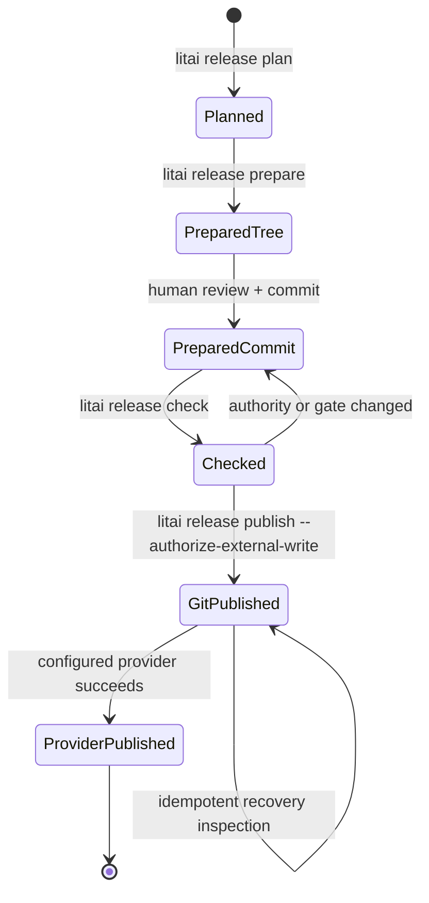

# Project release protocol

Local release gates own their subprocess tree. Interruption or timeout terminates
and reaps that tree before returning control, for both streamed and captured
output. The gate retains its transcripts and failure, and unfinished descendant
evidence receives a terminal failure with the same exception category. Completed
child results remain unchanged. This local cleanup does not establish remote
worker cancellation or production-containment qualification.

An optional `authenticated_receipt` policy requires fresh signed current-receipt
verification independently of the process gate's exit status. It declares
`plan_path`/`plan_identity`, `policy_path`/`policy_identity`, `revocations_path`,
`bundle_store`, and a nonempty `stores` list of `{id, kind, location}` records. Store
kinds are `filesystem`, `monorepo`, and `https`; local paths are portable and relative
to the release root. The two identity pins are canonical plan and trust-policy
identities, supplied by independent release authority. The plan must bind the prepared
project authority, not a prior version's authority. Changing pins changes release
policy identity and requires a new release plan; never copy identity pins from an
untrusted current map merely to make verification pass.

Check verifies the configured map after artifact qualification and records only its
identity in `authenticated_receipt_identity`. Publish independently repeats full
signature, finalization, revocation, expiry and original-store availability checks,
requires the same current-map identity, and rechecks before tagging and pushing.
Changed verification inputs or release policy refuse publication. An unsigned local
receipt cannot satisfy this policy. A completed process gate or an earlier successful
verification does not substitute for fresh authentication. Policies without this
option retain their prior local behavior; repository CI provisioning and enabling
this required policy for the 1.1 release remain outstanding.

An optional `artifact_gate` policy runs a declared argv after the release gates and
requires a fresh manifest under `_build`. It declares `timeout_seconds`, `manifest`,
and exact `required_roles`. The manifest schema is
`literate-ai/qualified-release-files@1`: revision, version, files (role, relative
path, positive size and SHA-256 identity), plus its canonical identity. Check binds
that manifest into prepared evidence and rechecks the source revision. Publication
rejects missing, altered, duplicate or unexpected roles before tag mutation, uploads
the retained bytes, and downloads each asset to verify its size and digest. It does
not rebuild those files. Policies without this option retain their prior behavior;
the Literate AI 1.1 policy requires wheel, Codex plugin and Claude plugin roles.

`make wheel-check` also retains the exact wheel it installed and tested, not a
subsequent rebuild, beneath `_build/ci-wheels/run-*/`. Each successful run writes
a `manifest.json` using that same schema with only the `wheel` role. Its file path
is relative to the manifest's directory so the directory can be downloaded intact
and checked with `validate_release_files`, using the CI job's independently observed
Git revision and expected version. Qualification refuses changed tested bytes,
changed copied bytes, linked output paths, or a checkout that changed during the run.
Linux/macOS and Windows wheel CI jobs upload these directories as distinct
`qualified-wheel-*` artifacts; a missing artifact fails the upload step. The source
revision is the actual tested checkout (which can be a PR merge revision), not an
inferred branch head. Hashes provide integrity checks, not signer authentication.
This wheel-only CI evidence does not satisfy the release's complete artifact-role
set, other release gates, or publication authorization. Interrupted retention can
leave bytes without a manifest; those bytes have no qualification claim.

A Literate AI release is an evidence-bound transition of one exact project revision.
It is distinct from packaging a generated Component artifact: the project release
versions and publishes the repository authority that can reproduce those artifacts.

`literate.release.json` is the project-owned policy. It declares one version authority,
explicit mirrors, permitted semantic transitions, one shell-free gate command, changelog
authority, tag policy, Git remote, an optional provider adapter, an optional continuous
contribution disposition contract, and policy-bound release collateral. Its
`version_scheme` must explicitly select `semver` for release operations. Historical
PEP 440 policies remain readable, but require an explicit policy and version-binding
migration before releasing. Every mirror must contain the same canonical SemVer
spelling. Derived projects
receive their own policy during `litai init`; they do not inherit this repository's
version number, remote, or provider.

Version bindings use JSON pointers, uppercase Python constants, quoted identifier
assignments (including lowercase TOML keys), or `cargo-lock-package` selectors.
For Cargo, bind the unique `version` assignment in the workspace Cargo.toml as a
quoted constant and declare Cargo.lock as a mirror whose selectors are exact
workspace package names. Each selected lockfile package must be uniquely named
and have no registry/git `source`. Dependencies on selected uniquely named packages
must use the ordinary unqualified Cargo names; stale version-qualified references
are rejected. Missing, ambiguous, sourced or drifted entries
fail before any planned file is replaced. Dependency collections must be lists of
strings. Selected package versions and their replacements must be canonical SemVer,
and no automatic version spelling conversion is performed. Preparation changes only selected
version strings and preserves unrelated dependency versions, comments and line
endings. Declare every workspace package sharing the release version.

## Release Policy

The repository has one trunk, normally `main`, and two explicit states:

- **Free:** `main` is writable for ordinary new work and has no release target.
- **Pre-release:** `main` remains writable for ordinary new work, but the state names one
  canonical `major.minor` target. A green release-candidate tag may be created only from
  the exact `main` revision that passed the declared gate.

Cutting `release/<major>.<minor>.x` starts lockdown for that release line. The branch is
not an integration branch and never replaces writable `main`: only release-critical,
trunk-first backports and release-authority commits belong on it. Only GitHub identities
listed as exact ``- `login` `` bullets under the repository README's exact `## Release
Engineers` heading may merge release-line pull requests, mutate release state, create or
publish a major/minor release, or create an RC tag. The release line is not merged back;
forward development continues on `main`.

Patch authority is per-project repository policy:

- **`strict`:** only README Release Engineers may prepare, check, backport, or publish a
  patch on a locked release line.
- **`loose`:** Release Engineers retain normal authority. A login in the configured
  `writers` list may use the explicit break-glass patch path only with a non-empty reason
  and only for a commit that landed on the trunk first. Break-glass does not authorize
  release-state changes, RC tags, major/minor creation, or major/minor publication.

Every pull request carries exactly one line: `Literate-AI-Release: major.minor` for the
active target, or `Literate-AI-Release: none`. Missing, duplicate, malformed, stale, and
other-line values classify as unknown; tooling must not infer release relevance from
branch names or prose.

These are CLI enforcement rules, not a claim about live forge configuration. LitAI
release commands fail closed on unauthorized actors, branches, states, and revisions.
GitHub/GitLab branch protection and required-review settings are separate administrative
controls and should mirror the lockdown; a repository must not claim they are active
until its forge settings have been configured and inspected.

Repository governance is centralized in `literate.project.json`'s
`repository_policy`, loaded and updated through the project configuration store. It owns
`default_branch`, `main_state`, `pre_release_version`, `default_component`,
`sample_component_roots`, `work_queue`, `remote`, `merge_method`,
`pull_request_labels`, `release_engineer_source`, `patch_authority`, `writers`, and
`branch_gc_minimum_age_days`. Defaults that vary by repository belong there where the
implementation supports the field, rather than in agent prose or command-specific
constants. `literate.release.json` remains the separate project-owned artifact policy for
version syntax and bindings, gate, changelog, tag, remote, provider, and publication
evidence.

## Four deliberately separate commands

- `litai release plan --bump patch|minor|major` or `--version VERSION` is
  read-only. It binds the current version, policy, Git revision and branch, declared
  fields, gate, tag, remote, provider, derived release class and stable predecessor,
  current contribution sweep, and required collateral into a portable plan identity. A dirty tree is
  visible and prevents preparation. When the policy names `default_branch`, a plan
  from that trunk records `release_line.create: true` only if
  `release/<major>.<minor>.x` for the planned version is absent; a plan from the
  matching line records `create: false`. The command refuses any other name,
  and refuses the default branch when that line already exists.
- `litai release prepare PLAN` validates and renders every declared version field plus
  the changelog before replacing any of them. A failed replacement rolls back prior
  replacements. When it inserts a new `## {version} - {date}` heading, and the policy
  names a GitHub provider, the first line under that heading is a tag-pinned blob
  link to that revision's `README.md` — not a heading URL, so heading matching stays
  `^## {version}(?:\s|$)`. When `release_line.create` is true, it creates that branch
  from the plan revision (no force), checks it out, then writes. It does not commit,
  tag, push, run providers, or synthesize claims.
- `litai release check PLAN` requires a clean descendant commit on the named
  release line whose diff contains
  only declared release-authority paths. It runs the exact policy gate and writes a
  compact prepared-release record under ignored `_build/` by default.
- `litai release publish PREPARED --authorize-external-write` revalidates the exact
  commit, policy, contribution state, and collateral, creates an annotated or signed tag,
  performs ordinary non-forced Git pushes, and then calls the optional provider adapter.
  Before tagging or pushing, it independently checks the prepared canonical version,
  policy tag prefix and declared release-line requirements. Publication and read-only
  verification share this check; rehashing a prepared record cannot authorize an
  unrelated tag name. Its receipt distinguishes Git publication from provider publication.
- `litai release verify-published PREPARED` is read-only. It requires the remote
  annotated tag and named release-line branch to select the prepared revision, and
  the configured provider release and policy-bound collateral to remain valid. It
  independently checks the canonical version and policy tag prefix and re-applies
  declared release-line policy before reading remote refs. A self-consistently
  rehashed record cannot substitute an unrelated tag or bypass a declared release
  branch requirement merely because those refs select the same commit. It never retags.

`make release RELEASE_PLAN=/path/to/plan.json` is a thin alias for the check phase.
The Makefile does not contain a second release implementation.

## Tiered qualification: local first, CI only when needed

A release policy may declare `qualification`: the platforms the release must provide
(N, each `linux`, `macos` or `windows`, optionally suffixed with a CPU architecture
such as `linux-x86_64`), the actions that must pass on each (M, named argument
vectors such as code generation, build and test; the policy `gate` by default), and
the platforms an exact-revision CI run covers. Every one of the N x M cells is
covered by the leftmost tier that can run it:

1. the host running the coding CLI covers the platforms it provides;
2. one configured `workers.json` SSH worker covers each remaining platform, tried in
   worker-id order; an unreachable worker or one checked out at another revision
   falls through to the next worker, then to CI;
3. a successful exact-revision CI run covers its declared platforms.

A runner proves a platform only through facts it declares or observes; a worker
without a declared architecture cannot satisfy an architecture-qualified platform.
An action's `argv` runs on Linux and macOS. Windows runners have no POSIX shell, so
an action runs there only through its own `windows_argv`; a Windows host or worker
covers a platform only when every action declares one, and otherwise leaves it to
CI. Windows workers run their command through PowerShell over OpenSSH, from the
workspace checked out at the exact revision, with the same live-test environment as
POSIX workers.
A failing action is never retried on another tier. CI is optional while the host
and workers cover every cell. It becomes required only when some platform has no
left tier (CI must then declare it, or qualification fails closed) or when the
policy sets `ci.mandatory`.

`litai release check` uses this tiered target whenever the policy declares
`qualification` and no explicit `--target` is given; the prepared record lists every
cell, the tier that covered it, and whether CI was required. `litai release qualify`
runs the same matrix at the exact clean `HEAD` and writes a revision-bound
`literate-ai/release-qualification@1` record. `litai release rc` and `litai release
merge-pr` accept that record with `--qualification FILE`: when it covers every cell
without CI, RC tagging does not require a green CI run, and a release-line merge is
not blocked by pending or absent checks. A check that completed and failed still
blocks the merge. Without such a record both commands require CI as before.

This repository declares `linux`, `macos` and `windows`. `make release-check`
needs a POSIX shell, so its `windows_argv` is `scripts/windows_release_gate.py`,
which runs exactly the steps hosted CI runs for Windows (the `windows-gates` and
`windows-tests` jobs): tool preflight, an isolated environment, compilation, lint
and format, OpenSpec and documentation checks, the installed-wheel smoke test and
the full test suite. It never installs system tools; a missing MSVC, Rust, LLVM,
Node or Git is a preflight failure. With a reachable Windows worker at the exact
revision, the repository's release needs no CI.

## Versioned release lines

Every release belongs on `release/<major>.<minor>.x`, including releases using
historical policies. When repository policy declares `default_branch`, product
work lands on that branch. `plan` may run there only to cut a *missing*
`release/<major>.<minor>.x` line. `prepare` creates that branch from the plan
revision and checks it out, then writes declared paths. `check` and `publish`
never run on the default branch: they require the named line. If the line
already exists, planning on the trunk fails with
`release.default_branch_cut_forbidden` — cherry-pick onto the existing line
with `litai release backport` and plan there. A per-patch name such as
`release/0.7.0` fails `release.branch_not_release_line`. Projects that omit
`default_branch` must check out the matching release line before planning. They
cannot create a line implicitly from an arbitrary branch. Historical plans without
a release-line field do not bypass preparation, check, publication, or published
verification branch requirements.

Use `litai release state` to inspect Free or Pre-release state and `litai release state
set --mode pre-release --pre-release-version MAJOR.MINOR` for an authorized transition.
`litai release rc --version VERSION --authorize-external-write` creates an annotated RC
tag only after the exact `main` HEAD is green, or when `--qualification FILE` names a
tiered record that covers every platform and action without CI. These commands do not configure forge
protection.

## Who decides release content

Humans own the *schedule* of the next minor or major (`0.8.0`, `1.0.0`, …).
Agents own *patch content* on the current `release/<major>.<minor>.x` line:
which already-landed default-branch fixes are small enough to cherry-pick, and
which wait. Record that decision in `docs/roadmap/active-work.md` and execute
it; do not stall a patch for a human cherry-pick list unless they override.

A patch is correctness, safety, or reliability work with a bounded blast
radius. It is not a catalog-wide identity re-pin, a protocol or schema version
bump, a Flavor directory rename, overview regeneration, or a significant
feature under [ADR 0006](../decisions/0006-significant-feature-request-governance.md).
Those wait for the next human-scheduled minor or major. Land on the default
branch first, then `litai release backport`.

## Continuous contribution disposition

A release snapshot is stale as soon as another human or agent can contribute. When a
policy declares `contributions.current_milestone`, the virtual release engineer runs
`litai release contributions sweep` at cycle start, after every merge or scope change,
immediately before planning, immediately before publication, and after publication.
The sweep inventories open issues, open reviews, unmerged local and remote branches,
and attached worktrees. It is read-only unless a separate, explicitly authorized
`disposition` command is invoked.

The configured milestone may be a literal forge name such as `1.1`, or a template
containing one `{version}` placeholder. Package version `1.1.0` does not imply that
the forge milestone has that name. Sweeps use the declared milestone even when
`--version` is explicit; `--current-milestone` remains an explicit override. With an
explicit version and no policy file, standalone sweeps retain the version-name
fallback. A malformed or unreadable policy refuses instead of silently changing scope.

Every open issue or review must carry one current-cycle machine-readable disposition
comment and a matching milestone:

- **include** means the contribution is release-critical. While it remains open it is a
  blocker; merge, test, comment, and close it before the candidate can progress.
- **defer** names a later or maintenance milestone and a reason. It begins the next cycle
  from durable tracker state rather than from an agent's memory.

An unmerged branch is resolved only by proven ancestry, patch equivalence, an open review,
or a valid exact-head branch-lifecycle marker stored under a fetchable Git ref. A tracker
comment may explain a branch but is not its durable lifecycle authority because closing
the issue removes it from the open-item inventory. A dirty or prunable secondary worktree
is a blocker, not disposable litter. Release lines are lifecycle infrastructure and
remain exempt. The release plan records the sweep summary, and later phases re-run the
inventory; old comments do not authorize a new cycle.

## Upgrade path between consecutive minor releases

A clean upgrade path from the previous minor's latest published patch is preferred.
A project may make that compatibility a hard release gate; when it does, a user on
that patch installs the candidate and their existing initialized projects either
continue to verify cleanly or follow a documented, evidence-tested migration (`litai
update`, re-lock, changelog migration notes). An upgrade failure that is not a
documented migration step then blocks publication.

A human release owner may explicitly defer direct compatibility for a particular cut.
Record the decision in the release queue, do not claim the unproven compatibility, and
retain a concrete migration or compatibility-patch follow-up. This exception changes
release scheduling, not the candidate's version, authority, or evidence contracts.

Users who are several minors behind may need to upgrade through each
intermediate minor tip in sequence; there is no obligation to preserve
compatibility across arbitrary version spans.

Major releases may break compatibility at the developers' discretion. A
major cut's changelog must still document every breaking change, but the
release is not required to provide a mechanically clean single-step
migration from the previous minor.

When compatibility is gated, verify it mechanically with an installed-wheel upgrade
smoke from the previous minor's latest published patch to the candidate before `litai
release check` succeeds. Never claim an untested path and never describe a migration
the release does not actually ship. Distribution version numbers alone are not
evidence of compatibility.

## Recovery and trust

A remote tag selecting another revision, or a lightweight tag where policy requires an
annotated release tag, fails before publication. A branch or tag push failure reports
possible partial Git publication; a provider failure reports that Git publication has
already occurred. Retrying reuses only an exact annotated local/remote tag, exact branch
revision, and existing provider release. Never delete, move, overwrite, or force-push a
published tag automatically.

GitHub publication is optional. When selected, it requires an installed authenticated
`gh` command and verifies that the tag already exists remotely. Published verification
requires a stable release rather than a draft or prerelease, non-empty reviewed notes,
and a non-empty version-matching wheel asset; a URL alone is not provider evidence.
Projects without a provider still receive a complete Git release. Future GitLab,
registry, signing, and artifact-store integrations belong in independent adapters
without changing the core phase contract.

Release notes are reviewed changelog authority, not commit-prefix inference. Each
published changelog section includes a tag-pinned link to that release's `README.md`
so the GitHub release page and the historical changelog both open the README that
shipped with that tag. Credentials and provider diagnostics never enter the plan
or compact receipt. Component, Flavor, Skill, workflow, routing, protocol, and
schema versions remain narrow semantic authorities; a distribution bump must not
blanket-rewrite them.

## Branch lifecycle and safe collection

Release lines are protected from peer-work collection. For an ordinary topic branch,
`litai project peer-work survey --when end` inspects local branches, attached worktrees,
and open pull requests. `litai project peer-work mark --state merged|dead --branch NAME
--actor LOGIN` stores a durable marker against the exact branch head; `dead` additionally
requires `--reason`. A merged marker is accepted only when that exact head is already an
ancestor of the configured default branch.

`litai project peer-work gc` is a plan by default. A candidate is rejected if its marker
is stale, its pull request remains open, it is the current/default/release branch, its
head is not merged, an attached worktree is dirty, or any inspected worktree makes the
repository state dirty. Deletion requires both `--apply` and `--authorize-delete`, removes
only clean non-current worktrees, prunes worktree metadata, and uses ordinary safe
`git branch -d`. Marking is evidence for inspection, never permission to bypass these
checks.

## Documentation artifacts before `litai release plan`

A project that declares a terminal Component requiring `literate-ai.document-pair` (see
[Documentation artifacts as Components](documentation-artifacts.md)) owns a narrative
and/or presentation whose claims describe the project's implementation state. Those
claims go stale the same way code does. The exact regeneration and provider mutation
mechanics remain owned by the authoring package, while `litai release` validates and
binds the resulting verification report and publication receipt when policy declares
that collateral (for this repository, see
`docs/presentations/literate-ai-manager-overview/SKILL.md`).

- **Major or minor** (`x.y.0` with `y` or `x` advancing): regenerate the pair from the
  current factual ledger before `plan`, then publish the ecosystem copies the Flavor
  binding allows. The publisher first validates the explicitly intended active account
  and both exact stable destinations without mutation, then updates both, exports both
  back, and writes a resumable receipt after each member. Record the resulting URLs as
  that major/minor *edition* in the authoring-package `README.md` and the repository-root
  `README.md`.
- **Patch** (`x.y.z` with only `z` advancing): do not regenerate. Keep both README files
  pointing at the last major/minor edition of those documents. A skipped minor (this
  repository's `0.7.0`) is recovered on the next published cut that still describes that
  line — `0.7.1` is that catch-up — and later patches on the same line keep citing it.

The effective release class is derived against the highest lower stable tag, not from the
candidate's patch component alone. Thus an already-bumped `0.10.0` authority still counts
as a minor release when the stable predecessor is `0.9.0`. A configured required class
cannot skip collateral by prose exception. The receipt binds candidate version, source
revision, account, source hashes, stable provider IDs, and exported read-back hashes;
drift in any of them invalidates the candidate. Never retag a published distribution tag
to carry a later overview refresh.
