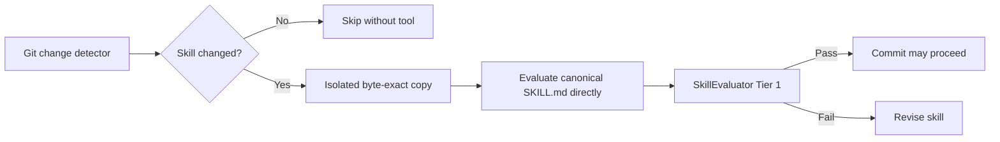

# Skill architecture

Literate AI uses the word *skill* for two related artifacts with different execution
boundaries. Keeping them separate is the important part.

| Skill layer | Location | Consumer | Enters a generation prompt? |
| --- | --- | --- | --- |
| Project onboarding | root `SKILL.md` | Any agent working on the project | No |
| Agent catalog (parent) | `skills/agent/SKILL.md` | Nested agent skills; wrap Python, keep deltas | No |
| Worker assignment | `skills/agent/configure-test-workers/` | Agent selecting private static or dynamic workers | No |
| Host bootstrap | `skills/agent/detect-before-install/` | Agent or routed worker preparing a host | No |
| Project release | `skills/agent/release-project/` | Agent planning or publishing a project release | No |
| Nested release deltas | `skills/agent/release-project/{backport,evidence,advance,ci-status,verify-published,notify-descendants}/` | Agent wrapping those CLI verbs; parent stays the four-phase cut | No |
| Package artifacts | `skills/agent/package-artifacts/` | Agent constructing native packages without publication | No |
| Instructional videos | `skills/agent/author-instructional-videos/` | Agent creating evidence-backed narrated courses with captions | No |
| CI test plan | `skills/agent/ci-test-plan/` plus `shard/` and `impact/` | Agent authoring fail-closed shard/impact CI | No |
| Convert project | `skills/agent/convert-project/` | Agent adopting an existing tree into the harness | No |
| Bind lifecycle evidence | `skills/agent/bind-lifecycle-evidence/` | Agent confirming rebuild/SBOM/cache identities | No |
| HTML observability | `skills/agent/render-html-observability/` | Agent rendering and verifying declared single-file authority graphs | No |
| Agent development posture | `skills/agent/develop-in-production-workflow/` plus `staging/` and `staging/dev/` (`survey-peer-work/` and `land/` under `dev`) | Agent surveying peer PRs/worktrees and choosing when remote CI gates a land | No |
| Project requirements | `skills/agent/track-project-requirements/` | Agent maintaining `PROJECT.md` | No |
| User-directed work queue | `skills/agent/record-user-directed-work/` | Agent recording queue items and changelog outcomes | No |
| Operator MCP catalog | `skills/agent/configure-operator-mcp/` | Agent discovering session MCPs and writing platform-resolved user `mcps.json` | No |
| Release Jira association | `skills/agent/associate-release-jira/` | Agent associating a major/minor cut with Jira when that MCP is available | No |
| Channel work ingest | `skills/agent/ingest-channel-work/` | Agent admitting inbound recipient envelopes into the queue | No |
| MAC contract projection (opt-in; not installed by `litai init`) | `skills/agent/write-mac-project-contract/` | Agent connecting a project to MAC/OpenShell build/test runners | No |
| Direct prompt-to-task translation | `skills/agent/prompt-master/` plus `litai prompt translate` | Direct Literate AI/coding-agent user, or a forge issue, without an external task envelope | No |
| Specification to source | `<declared-skill-root>/specification-to-source/` | One exact generation recipe | Yes, only through a content pin |
| Source to specification | `<declared-skill-root>/source-to-specification/` | The inverse authoring workflow | Only in that workflow |

## The root onboarding skill

For deterministic catalog maintenance, run
`PYTHONPATH=src python3 scripts/normalize_skill_authoring.py --plan` and inspect
the changed paths and old/new digests. `--check` writes nothing and exits nonzero
on dependency/version-pin drift. Apply the reviewed plan with
`--expected-plan-identity sha256:DIGEST`; repeat `--mirror CATALOG-PATH` only for
templates deliberately intended to match their source. Existing divergent templates
are preserved by default. Skill version decisions remain with the author; the helper
propagates the selected versions and content pins. It uses atomic file replacement
and rolls back an ordinary I/O failure, but a process crash is not an atomic
multi-file transaction: rerun check before committing after interruption.

`SKILL.md` is the provider-neutral front door. It routes: wrap `litai`, open only
the nested `skills/agent/` skill that matches the task, preserve authority
boundaries, and keep generated source out of the repository. Protocol, flags,
deadlines, and error catalogs stay in Python (`litai help`). `AGENTS.md`,
`CLAUDE.md`, `.cursor/rules/literate-ai.mdc`, and `agents/openai.yaml` are
deliberately thin compatibility entrypoints. They must not fork the framework's
rules or become another policy source.

The onboarding skill helps an agent use Literate AI; it does not become part of an
application recipe and cannot grant build or execution authority. Its local Markdown
links must resolve into `documentation_roots` declared by `literate.project.json`.
It points at `skills/agent/SKILL.md` instead of inlining nested agent skills. There
is no persistent daemon: operator MCP catalog authoring, optional
`litai --discover-mcps`, Jira association, and inbound channel ingest run when an
interactive coding session follows those nested skills. Mutagenic posts are
`litai`'s job (ADR 0025); nested skills wrap that CLI and do not re-post.

## Filesystem nesting is the catalog scope

Catalog item names are the path under the declared root. `skills/agent/release-project/SKILL.md`
is the skill `agent/release-project`. A parent `SKILL.md` in that directory chain is a
separate catalog item whose files stop at the next nested sentinel: children are not
flattened into the parent. The same rule applies to Components (`components/shared/nested`)
to workflows (`workflows/production/staging/dev/workflow.md`), and to routing
policies (`routing/production/staging/dev/routing.json`). Each catalog kind uses
a directory-owned sentinel (`SKILL.md`, `workflow.md`, `routing.json`,
`component.md`, `flavor.md`) so a parent never owns a child's files.

Agent skills inherit by that nesting. `skills/agent/SKILL.md` is the shared wrap-Python
rule. `develop-in-production-workflow/` is the outer development posture;
`staging/` and `staging/dev/` underneath it are deltas, not copies. `dev` also
nests `survey-peer-work/` (green PRs and leftover worktrees) and `land/` (forge
PR/MR). An agent following a nested skill reads every ancestor `SKILL.md` from
the catalog root down to that file.

Where a deterministic command exists, the skill names it and does not restate its
algorithm. `release-project` wraps `litai release`; nested deltas wrap the
narrower verbs. `package-artifacts` wraps `litai package`; `detect-before-install`
wraps its `scripts/`. Generation skills under
`specification-to-source/` are the exception: they *are* the prompt, so they stay
compact for that reason.

Flavors may nest the same way when a child is a narrower realization of the same axis.
Cross-axis co-requisites (portable `swift` plus `swift-apple` / `swift-linux` /
`swift-windows` toolchains) stay siblings: different axes must not be hidden inside one
directory tree.

## Worker-assignment and host-bootstrap skills

The `configure-test-workers` Agent Skill keeps machine identity out of repository
authority. The tracked example contains only roles and invalid placeholder destinations.
A user may create durable files at the paths reported by `litai config paths`, pass an
absolute private file for one CLI session, or invoke a private routing skill that
materializes a temporary matrix. The resolved node
names, credentials, and routing implementation remain outside version control.

The `ci-test-plan` Agent Skill (with nested `shard` and `impact` deltas) wraps
`litai project ci-plan`. Python detects test frameworks and records which maintained
shard or impact mechanism exists — pytest-split, Jest `--shard`, Go test-split,
cargo-nextest `slice` partitions, gtest-parallel, or an explicit unavailable result
for Swift and for this repository's linear checkpointed unittest runner. Impact
selection fails closed to the full suite when its map is missing or untrusted, then
sharding parallelizes what remains. The skill never enters a generation prompt.

The repository's `detect-before-install` Agent Skill treats each macOS, Linux, or
Windows worker as a vanilla host. Its deterministic script detects the sample-worker
capability set, invokes only the native package manager for missing packages, emits a
versioned JSON report, and leaves final executable selection and version enforcement to
the framework. Remote workers run it before installing Literate AI or invoking the SDLC
driver. The same bootstrap attempts NTP synchronization to `time.nist.gov` and records
failures under `clock_sync` without failing capability readiness. This operational skill
never enters a generation prompt and cannot alter a Component, Flavor, workflow, route,
or build authorization.

The `release-project` Agent Skill keeps release judgment outside Component-generation
prompts while binding every release action to the project's versioned release policy.
It separates read-only planning, declared authority updates, gates, and explicitly
authorized external publication. Nested deltas wrap `backport`, `evidence`,
`advance-default-branch`, hosted CI argv from tracker inspect,
`verify-published`, and operator-named descendant notify. When the
policy names `default_branch`, `plan` may
run on that trunk only to cut a missing `release/<major>.<minor>.x` line;
`prepare` creates and checks it out; `check` and `publish` fail closed unless the
checkout is already that line. Provider adapters own service
authentication; the generic skill forbids tag-only version inference, force pushes,
hidden rebases, and commit-message-derived product claims. Every mandatory Markdown
path named by the copied release skill resolves inside the initialized project; the
bounded significant-feature governance sequence is self-contained rather than linked
to a framework-only ADR.

The `configure-operator-mcp` Agent Skill discovers MCP servers already connected in
the current coding session, optionally consults a reachable registry, and writes the
operator-local catalog at the `mcp_catalog` path reported by `litai config paths`.
Python owns the platform path,
schema, a thin TTY ids-only fallback, mutagenic fan-out, and optional
`--discover-mcps` probing. The skill never stores tokens and never enters a
generation prompt.

The `associate-release-jira` Agent Skill is a release-engineering overlay: it associates
a major/minor cut with a Jira Epic, Story, or Task only when that MCP is listed in the
operator catalog and connected, and records
`institutional_channels.jira_issue` so `litai` can comment. It does not re-post
envelopes the CLI already sent, does not replace GitHub or GitLab tracker access, and
never enters a generation prompt.

The `ingest-channel-work` Agent Skill admits inbound Outlook (then Slack/Jira)
messages that name Literate AI as **recipient**. Unmarked mail is ignored. Admitted
text becomes a `record-user-directed-work` queue draft and never mutates locks or
catalogs by itself.

The `write-mac-project-contract` Agent Skill projects `.mac/project.yaml` from one exact
post-build CycloneDX BOM. Its deterministic adapter does not inspect Component, Flavor,
skill, manifest, source, or PATH authority independently. If the BOM omits selected
Flavor or skill dependencies, the upstream SBOM projection is incomplete and must be
fixed there. MAC owns validation, runner routing, and OpenShell policy composition;
Literate AI only supplies a compatible repository-contract view plus an identity
sidecar binding it to the source BOM, resolved BOM, and resolved graph. It is a
build/test runner contract only and is opt-in: `litai init` does not install it, and
issues, reviews, and agent coordination stay on the project's tracker
([ADR 0050](../decisions/0050-forge-issues-and-reviews-are-the-default-tracker.md)).

The `prompt-master` Agent Skill adapts
[`nidhinjs/prompt-master`](https://github.com/nidhinjs/prompt-master) 1.7.0 at exact
upstream commit `d15eabbe5d2122eedc060bae8a771381e9873d1b` (MIT). It is a direct-use
boundary only: when a user invokes Literate AI or a supported coding CLI (or files a
forge issue) without an external task envelope, the skill turns the rough request into
one provider-aware task with scope, constraints, evidence, stop conditions, and a
completion contract. It never
enters the generation recipe and cannot paraphrase or replace locked Component,
Flavor, skill, workflow, routing, or authorization authority. When an external task
system supplies an already translated task (`LITAI_EXTERNAL_TASK_ID`), this skill is
bypassed because that system applies its own translation between its task and provider
layers; task/correlation metadata remains outside semantic identities.

## Specification-to-source skills

A generation skill is one canonical `SKILL.md`: strict constrained-YAML frontmatter
projects into the public
`urn:literate-ai:schema:v1:specification-to-source-skill` contract, while the Markdown
body is the sole authority for instructions supplied to the coding agent. It declares:

- a stable skill ID and semantic version;
- the workflow stages it assists;
- exact dependency references, including dependency version and SHA-256 identity;
- the instructions supplied to the coding model;
- limitations and a trust classification.

Components pin general planning and portable implementation skills. Flavors pin only
the target-specific technique they add, such as Python or C++ entrypoint rules. The
resolver preserves Component order followed by selected Flavor order, then rejects a
duplicate ID, missing or late dependency, identity mismatch, cycle, changed manifest,
or stage absent from the workflow.

Nested specification-to-source skills are deltas of a parent `SKILL.md` in the same
directory tree: `mcp-application/webmcp`, `frontend-application/react-application`,
and `backend-application/python-service-application` pin the parent identity and add
only the leaf. WebMCP is in-page MCP, not a second protocol and not an operator
catalog. Back-end language chapters are indexed off selected Flavors; missing
`lang-elixir` is a named skip.

Common authoring and integration guidance is also a skill concern. A Component spec
should not repeat how to assemble ancestor/reference context, prevent private transitive
dependency leakage, generate the current test suite, or keep disposable source outside
the authority repository. The general planning/implementation skills state those rules
once. A spec retains only observable product intent and an explicit override when the
product genuinely requires a different technique. See
[Mission specifications, hierarchy, and readable authoring](mission-specification-composition.md).

The `bazel` build-system Flavor demonstrates a removable technique preference. Its
`bazel-build-system` skill tells the coding model to prefer Bazel, but explicitly yields
to Component specifications and selected Flavor requirements. Because the skill enters
only through that Flavor's exact pin, `-bazel` removes the instructions before prompt
assembly. The skill preserves the important escape hatches for Mix semantics,
executable Zig build graphs, dynamic metaprogramming/image environments, and opaque
code generation. Those are model guidance, not hard-coded language branches in the
framework.

The current Bazel skill records exact, tested Bazel 9-era rule baselines and their
public target shapes: explicit `rules_cc` and `rules_python` loads, shared C++ code in a
`cc_library`, explicit Python `main` attributes, and JavaScript `entry_point` targets
with auxiliary files in `data`. These are intentionally skill knowledge. A later Bazel
or ruleset migration revises and repins the technique without rewriting the Component
specification. The portable application skill similarly defines one JSON-array
positional-argument ABI across Python, C++, Rust, and JavaScript so host shell quoting is
not part of application behavior.

## Multi-output skills

A specification-to-source skill may authorize more than one generated tree in a single
run when one shared schema, IDL, protobuf, OpenAPI document, or custom protocol is the
single source of truth for several language targets. This is an extension of the
ordinary single-output pattern, not a second generation mechanism. The coding agent
still receives one exact recipe and must finish every declared tree before the
generation is complete.

Layout:

- keep all generated product source under `source/`
- give each language or runtime target its own subdirectory, such as
  `source/backend/` and `source/frontend/`
- do not treat `source/` itself as an output tree, and do not escape with `..`

Optional skill-manifest field `output_trees` records those POSIX paths. Omit it when
the skill writes the usual single tree so existing skill identities stay unchanged.
Do not re-pin parent skills solely to mention this convention; the architecture
document is the catalog note.

Acceptance still owns completeness: every declared tree must satisfy the Component's
acceptance contracts before the run is admitted. The VFI Editor's paired Python
backend and TypeScript frontend is the external reference shape. The initialized-project
CLI regression in `tests/e2e/test_project_cli.py` authors a catalog skill with both
output trees, validates it through `litai project validate`, and rejects unsafe paths.
This fixture proves catalog admission; generated execution still needs acceptance for
every target.

Changing a dependency manifest changes its identity. Dependents must be reviewed and
repinned explicitly; a matching skill ID alone is never enough. The complete ordered
closure is part of the recipe identity, readiness evidence, model request, and result.

Creating or modifying any skill also crosses an admission boundary. Before committing,
run `make skills-check`. The gate detects only changed skill directories and runs the
repository-pinned [NVIDIA SkillEvaluator](https://github.com/NVIDIA/SkillEvaluator)
Tier 1 schema, PII, license, quality, Unicode, and script-lint checks. With no changed
skill it exits successfully without requiring or invoking the evaluator. Install the
pinned tool only when authoring skills with `make skill-evaluator-install`.

Static admission is necessary but not a claim that a model follows the skill under
pressure. For a new or materially behavior-shaping skill, maintainers should also run a
fresh-context application scenario with and without the candidate guidance, retain the
prompt and result as review evidence, and prove the affected E2E sample. The comparison
must not leak the intended answer to the evaluated agent. This practice is informed by
the skill-testing discipline in
[obra/superpowers](https://github.com/obra/superpowers), whose complete suite was
reviewed and deliberately not imported; see the
[skill-by-skill assessment](superpowers-skills-assessment.md). SkillEvaluator remains
the mandatory change-triggered gate and exact Literate AI skill bytes remain the sole
recipe authority.

Literate AI's generation and inverse skills are compact, content-pinned `SKILL.md`
contracts. Each canonical file directly includes the standard Agent Skill discovery
fields (`name`, `description`, and maintainer metadata) and a matching top-level title,
alongside Literate AI's stricter typed fields. The framework validates the complete
bytes, removes only that validated discovery envelope while projecting its internal
contract, and treats the remaining body as the exact model instructions.
The broader Markdown-versus-JSON boundary and migration procedure are summarized in
[Authoring and record formats](authoring-and-record-formats.md).
The gate copies each canonical skill byte-for-byte into an isolated, correctly named
evaluation directory; it never synthesizes or edits an evaluator view. Sibling resources
are copied only for repository skills that own them. This keeps unrelated repository
files and private test-target addresses out of scan inputs without introducing a second
skill authority. CI compares the proposed revision with its base and installs
SkillEvaluator only when that comparison contains a new or modified skill. Deeper
similarity and live-agent evaluation remain available for major skills, but are not a
credentialed or cost-bearing default commit gate.

That exact closure guides the whole major rebuild, not only implementation files. The
coding CLI must also create `source/tests/manifest.json` from current non-acceptance
base and selected-Flavor specifications and the CycloneDX 1.7 source SBOM at
`source/.literate/sbom.cdx.json`. The framework supplies the exact managed Component and
repository-source graph; a skill can explain ecosystem dependency discovery but cannot
omit or rewrite that graph. Tests and the source SBOM are regenerated with the source.
The suite is disposable current-state evidence and cannot reuse acceptance invocation
vectors.
A skill may improve test-generation technique, but it cannot reveal the hidden verifier
oracle, turn generated expectations into specification authority, or preserve a prior
generated suite as input.

## Source-to-specification skills

Case-driven inverse authoring discovers its project from the case descriptor and loads
only manifests below every declared skill root's `source-to-specification/` subcatalog.
Multiple and differently named roots compose one catalog; a duplicate skill ID is
ambiguous and fails. No conventional directory gains authority from proximity.

`litai project validate` reports this inverse catalog separately from generation
skills. It strictly parses every inverse manifest, rejects duplicate IDs and missing
dependencies, and proves that dependency and conditional `after` edges form an
executable acyclic order. `--skills-root` (with `--skills` as an alias) is an explicit
case-catalog override. Arbitrary-source derivation retains the stronger rule that every
selected manifest must exactly match the packaged reviewed built-ins.

The common architecture, API, behavior/state, tests, security, and operations skills
run first. Inert source inventory then selects independently pinned `language-python`,
`language-cpp`, `language-rust`, and `language-javascript` translators when applicable.
Their observations remain in separate language Flavor proposals. The analyzed source
cannot select a different translator or turn language-specific implementation evidence
into base behavior. Review grants intent authority; the separate
[regenerative qualification](source-promotion.md) gate determines whether that intent
can replace the source baseline as release implementation authority.

The skill manifests are the pin around the semantic model call. In
`--translator coding-cli` mode is unavailable. The static translator partitions admitted evidence by
language, selects the exact common skills plus exactly one matching language skill, and
passes their pinned references, prompt templates, facets, evidence kinds, and limitations
to one bounded coding-CLI task. The response is rejected if it names an unselected skill
or facet, cites evidence outside that partition, changes the output schema, or uses a
non-canonical confidence value. The complete prompt and response journal binds the
source inventory, coding CLI, model selection, isolation claim, egress policy, and
skills. This makes skills durable conversion technique without letting them become
product intent or review authority.

## Authority boundary

A skill can explain *how* to implement already selected requirements. It cannot add
product behavior, choose a Flavor or model, reorder the workflow, broaden network or
filesystem access, weaken validation, authorize a build, or authorize host execution.
It also cannot declare its own generated tests passing or replace the project receipt.
Those decisions stay with the specification, Flavor, routing, workflow, security, and
test-result contracts that own them.

Use `litai plan COMPONENT ...` to inspect exactly which skills will be supplied
before invoking a coding CLI. Use `litai project validate` to verify the project-wide
skill graph, including manifests not selected by that one recipe.
