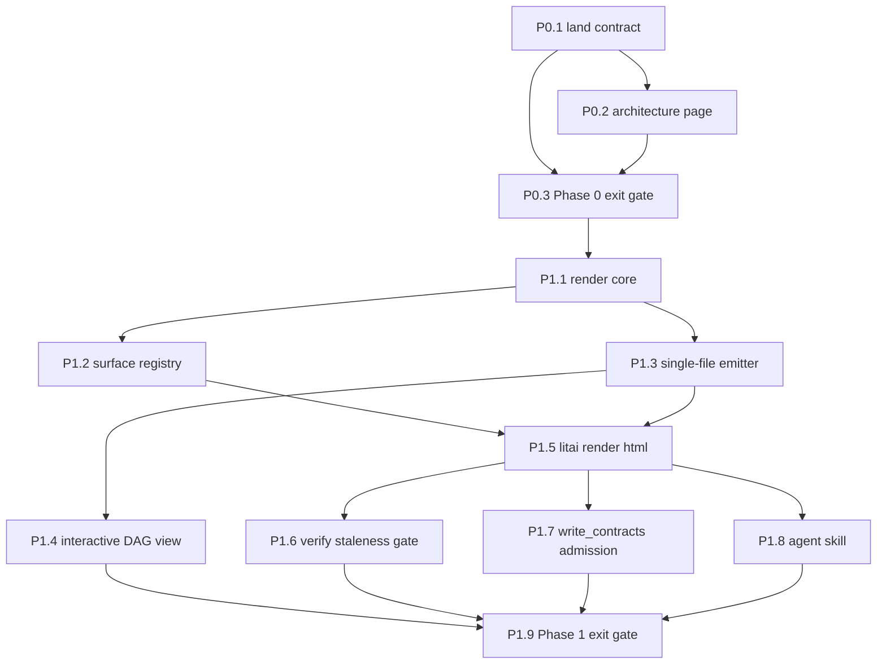

# HTML5 visual observability — Phase 0 and Phase 1 execution plan

- **Status:** historical
- **Owning queue item:** [OBSERVE-HTML-001](../../roadmap/active-work.md#observe-html-001-generate-single-file-html5-visual-observability-artifacts)
- **Completion / archival evidence:** [Scope reconciliation](../../roadmap/html-observability-completion.md). Phase 0 passed at main `2f09c295`; Phase 1
  exit passes locally on wheel `23898155` with post-update browser evidence below.
  Hosted integration passed all 15 checks at `33630a4f` in run `34664827991`,
  and PR #386 merged as `cf71a4fc` on 2026-09-12. The owning queue records
  reverified retained artifacts. [Tracker annotation](https://github.com/NVIDIA-dev/literate-ai/issues/296#issuecomment-5651388557)
  is complete. Archived by the scope audit; the
  [current completion plan](../../roadmap/html-observability-completion.md) owns
  remaining Phase 2/3 obligations. This audit did not reopen historical artifacts.

This is the executable work breakdown for GitHub
[#295](https://github.com/NVIDIA-dev/literate-ai/issues/295) (product intent and
artifact contract, accepted 2026-09-08) and
[#296](https://github.com/NVIDIA-dev/literate-ai/issues/296) (phased plan), milestone
**1.1**. It exists because twelve work items with distinct acceptance contracts cannot
stay readable inside one queue item.

Each item below is written to be executed by an agent that has not read this
conversation. It is mirrored into the MAC ledger as one task per item; MAC is the
execution control plane and this file is the durable project authority, per
[Literate AI and an agent ledger](../../architecture/agent-ledger-boundary.md).

## Standing constraints

These apply to every item. Violating one is grounds for rejecting the change.

- **JSON stays canonical.** HTML is a derived, regenerable view. Never replace, weaken,
  or reshape an existing JSON output to suit the HTML.
- **No daemon, no persistent UI process, no second planner, no new operator-adoption
  verb.** Rendering projects data that already exists.
- **Artifacts are single-file.** Inline `<script>`/`<style>` only; no companion asset
  tree, no bundler, no local dev server. Charting libraries load from CDN with
  Subresource Integrity — never vendored inline, never unpinned.
- **Generated artifacts are derived cache output**, the same status as
  `generated/committed-source-cache/`. Never source of truth.
- **Fail closed.** A render that cannot be pinned refuses with a typed code from the
  closed set in `…-render-refusal` rather than emitting a partial artifact.
- **Reuse existing identity machinery** (`urn:literate-ai:schema:v1:content-identity`).
  Do not invent a second identity, hashing, or cache mechanism.

Mandatory reading before implementing any item: the root `SKILL.md`,
`skills/agent/record-user-directed-work/SKILL.md`, and the accepted contract
`schemas/v2/html-observability.schema.json`.

Verification: `make python-check`, `make lint format-check`, `litai verify`. Note the
`receipt` gate already fails on a clean `main` checkout
(`project.test_receipt_stale`); that is pre-existing. The `authority` gate must stay
`pass`.

## Dependency graph



## Phase 0 — establish the contract

### P0.1 — Land the accepted contract

Branch `agent/html-observability-contract` carries the accepted Phase 0 contract in
three commits (`305e49d1`, `ba72a7cc`, `b3718778`) touching five paths: the new
`schemas/v2/html-observability.schema.json`, its `schemas/v2/index.json` registration,
the new `tests/unit/test_html_observability_schema.py`, `docs/roadmap/active-work.md`,
and `CHANGELOG.md`.

Open a PR into `main`, rebase if `main` moved, preserve both sides of any
`active-work.md`/`CHANGELOG.md` conflict, and merge once green.

**Acceptance:** merged; the 12 schema tests pass on `main`; `index.json` lists exactly
11 `public_ids`; `authority` gate `pass`.

**Out of scope:** any renderer, CLI verb, or `.html` output; adding the contracts to
`compatibility.json` (that is P1.7 — nothing writes them yet).

The contract is accepted. Do not redesign it. If you believe it is wrong, say so on
#295 and stop.

### P0.2 — Document the contract

Add `docs/architecture/html-observability.md`: the JSON-canonical/HTML-derived
boundary; a table of the eleven contracts; **why provenance excludes the artifact's own
digest** (a file cannot contain its own hash, so `artifact_identity` lives on the
enclosing artifact record while the embedded block carries `provenance_identity` and
`render_inputs_identity`, and the staleness gate compares the latter); the single-file
and SRI rules and why CDN-with-SRI beat vendoring; the fail-closed refusal model; and
explicitly that this is not a dashboard daemon. Link it from `docs/README.md`.

**Acceptance:** `make documentation-check` passes; `authority` stays `pass`; no schema
field lists are duplicated.

### P0.3 — Phase 0 exit gate (report)

Adversarially confirm #296's three Phase 0 requirements are satisfied on `main`:
the artifact schema and its embedded provenance block; the single-file constraint being
structurally unrepresentable to violate; and the rendering contracts genuinely
supporting a future Phase 2 surface. Try to find a Phase 2 surface (verify gate,
component locks, perf timeline, workflow routing, build history) that could **not** be
expressed through them — that would be the finding.

Confirm the test is non-vacuous by weakening a schema rule and observing failure.
Note that the in-test `SchemaCatalog` validator does not implement `allOf`/`if`/`then`,
so conditional rules must be gated with a real `Draft202012Validator`.

**Deliverable:** a per-requirement report with file and line evidence. A contract defect
goes to #295, not into a unilateral patch of an accepted contract.

#### Adversarial review evidence

The reviewed contract and architecture are in candidate
[`66fd355e`](https://github.com/NVIDIA-dev/literate-ai/commit/66fd355eda3b676a39df2505654592c56bbb385c).
PR [#375](https://github.com/NVIDIA-dev/literate-ai/pull/375) landed as main
[`2f09c295`](https://github.com/NVIDIA-dev/literate-ai/commit/2f09c2954e138c99e57d7425ea5badea5037f087)
after [all 15 exact-head CI jobs passed](https://github.com/NVIDIA-dev/literate-ai/actions/runs/34594250773).
Fetched main contains `66fd355e` and has the identical complete Git tree
`942aacf5792519449b51af2a62283da00872223f`. A fresh run of the 12 existing
HTML schema tests on that tree passed; the index still declares exactly 11
public IDs. **Phase 0 exit is satisfied; P1.1 is the next implementation step.**
The supplementary mutation and prospective-surface tests described below are
locally verified follow-up changes, not additions already present in that merge.

| Phase 0 requirement | Finding and immutable source evidence |
| --- | --- |
| Artifact schema with embedded provenance | Satisfied at the contract boundary: [provenance](https://github.com/NVIDIA-dev/literate-ai/blob/66fd355eda3b676a39df2505654592c56bbb385c/schemas/v2/html-observability.schema.json#L106-L140) binds inputs and renderer; [artifact](https://github.com/NVIDIA-dev/literate-ai/blob/66fd355eda3b676a39df2505654592c56bbb385c/schemas/v2/html-observability.schema.json#L141-L182) holds the final file digest outside that closed block. [Architecture](https://github.com/NVIDIA-dev/literate-ai/blob/66fd355eda3b676a39df2505654592c56bbb385c/docs/architecture/html-observability.md#L29-L37) explains why. Schema-valid identities are still claims: P1.1 must compute them from actual content. |
| Single-file constraint structurally unrepresentable to violate | Satisfied for the [declared attestation](https://github.com/NVIDIA-dev/literate-ai/blob/66fd355eda3b676a39df2505654592c56bbb385c/schemas/v2/html-observability.schema.json#L162-L182): required `single_file: true` and `companion_asset_count: 0` reject contradictory declarations. [External assets](https://github.com/NVIDIA-dev/literate-ai/blob/66fd355eda3b676a39df2505654592c56bbb385c/schemas/v2/html-observability.schema.json#L69-L83) require HTTPS and SRI. This is not proof about emitted bytes; P1.3 must reconcile counts, references and actual HTML. |
| Rendering contract supports future surfaces | No structural counterexample found among verify-gate, component-locks, perf-timeline, workflow-routing and build-history. [Surface/request](https://github.com/NVIDIA-dev/literate-ai/blob/66fd355eda3b676a39df2505654592c56bbb385c/schemas/v2/html-observability.schema.json#L183-L223) uses open identifiers and a schema binding, not a graph-only enumeration. A source can have several supported views, and provenance supports several ordered source bindings. |

Repeatable evidence is in
`test_html_observability_schema.py` (`tests/unit/test_html_observability_schema.py`, since removed):

- Fifteen tests pass, including five prospective surface/request/artifact shape
  probes backed by existing catalog resource identifiers. They do not register
  production surfaces or claim existing CLI envelopes match those resources.
- Seven in-memory schema weakenings make the corresponding acceptance tests fail:
  companion-count and single-file constants, external-asset required fields,
  nonempty source bindings, closed provenance, render-result conditionals and
  staleness conditionals. The checked-in schema bytes remain unchanged.
- These checks use the real `Draft202012Validator`, including `allOf`/`if`/`then`.
  The simpler `SchemaCatalog` helper alone is not the conditional-rule gate.
- Adding the completed file digest inside provenance is explicitly rejected,
  preventing the self-reference mistake described by P0.2.
- The focused HTML/catalog batch passes 35 tests. Read-only `litai verify`
  reports authority `pass`, locks and source-intelligence `skipped`, and the
  pre-existing project receipt `fail` (`project.test_receipt_stale`). That stale
  receipt is not replaced or counted as release evidence by this review.
- Lint, formatting (879 files) and documentation review pass. The complete
  documentation gate passes its zero-finding dependency audit, nine parser tests
  and rendering of 121 diagrams across 530 Markdown files.

Remaining implementation obligations, not reasons to rewrite the accepted contract:
the actual authority-graph JSON needs its own reviewed catalog schema (P1.2);
registered adapters must validate the actual producer output, not relabel it as a
different resource. Runtime code must verify real hashes, safe filesystem paths,
valid UTC observations, SRI values and actual HTML references. The schema's path,
time and SRI patterns are shape checks, not a filesystem boundary, calendar parser
or browser integrity verifier. No renderer, daemon, CLI verb, compatibility write
promise or schema change is introduced by this review.

## Phase 1 — one real end-to-end vertical slice

Target surface: the repository/catalog provenance DAG behind `litai graph` — chosen by
#296 because it is already a graph, already JSON, and unambiguous to visualize.

### P1.1 — Render core

A module providing typed request/result/refusal/provenance/artifact records that
serialize exactly to the accepted contracts, plus `render_inputs_identity` (a canonical
digest over ordered source bindings + view + renderer) and `provenance_identity`
(over the canonical provenance object excluding itself). Reuse the existing
`canonical_identity`/`canonical_value` helpers; do not write a new hasher.

`artifact_identity` is computed after the bytes exist and lives only on the artifact
record. Task and correlation identifiers and `generated_at` must not enter
`render_inputs_identity` — per the agent-ledger boundary, re-rendering the same inputs
under a different task must not manufacture different content.

**Acceptance:** round-trip and unknown-field-rejection tests; identity stability across
runs differing only in `generated_at`; identity change when a source identity changes.

**Implementation evidence (fully qualified locally; hosted landing pending):**
`contracts/html_observability.py` provides immutable typed records and uses the
existing canonical identity helper for the exact ordered input projection and
provenance. Completed artifact bytes have a separate raw-byte identity. Fourteen
public-record tests cover schema round-trips, every required/unknown field,
nested mutations, independent identity-byte calculation, time/source/view/renderer
changes, rehashed input substitution, immutable ownership, byte tampering,
cross-field counts, closed refusal combinations and portable path/SRI/calendar
failures. The combined core/HTML/schema-catalog batch passes 49 tests.

Lint/format (881 files), repository layout, OpenSpec (two items), and the complete
documentation gate pass (zero audit findings, nine parser tests, 121 diagrams
across 530 Markdown files). Driver and documentation identities were reviewed and
recorded. The fresh full Python gate passed 3,844 tests in 2,166.675 seconds
(3,814 passed, 30 skipped, zero failures); its checkpoint was absent before the
run and removed on success. This satisfies P1.1's local gate; hosted integration
remains required. The implementation does not yet register an actual graph surface
or emit an HTML file.

### P1.2 — Surface registry

Implement the `…-surface` registry and register exactly one surface, `authority-graph`.
Adapt the existing JSON from `authority_graph.py` (which already renders json/text/
mermaid/dot/svg and computes an `identity()`) and `project_authority_graph.py`. **Do
not re-derive the graph** — a second derivation path is the forbidden second planner.

**Acceptance:** unknown surface yields `render.unsupported_surface`; unsupported view
yields `render.unknown_view`; both as typed refusals, not exceptions.

**Implementation (local; full integrated qualification pending):** P1.1 is committed
as `81a8da7a` after the full local gate. A typed surface declaration and a read-only
source adapter in `adapters/html_surfaces.py` register only `authority-graph`, supporting the
project-scoped `dag` view at version `1.0.0`. A new catalog resource
`urn:literate-ai:schema:v2:authority-graph` describes the existing
`literate-ai/authority-graph@2` document without changing that wire value or any
existing exporter. The adapter binds the producer's graph, not the CLI wrapper's
absolute project/output paths, and preserves its existing graph identity. The real
schema validator checks actual producer JSON; unavailable or invalid authority
refuses rather than producing a partial snapshot. Eleven source-adapter tests cover
real project and CLI equivalence, immutable snapshot ownership, schema-negative
cases, source identity drift after a real authored-file edit, stability after project
relocation, and typed refusals including malformed lineage. No HTML emission or
compatibility-write admission belongs to this step. P1.3 is the next implementation
action; the full integrated and hosted gates still have to qualify these additions.

The combined surface/core/schema/graph batch passes 80 tests in 9.924 seconds.
Lint, formatting (883 files), repository layout, both OpenSpec changes and the
complete documentation gate pass (zero audit findings, nine parser tests and 121
diagrams across 530 Markdown files). Driver and documentation review identities
are current. Read-only verification keeps authority `pass`, the two unconfigured
gates `skipped`, and the pre-existing project receipt `stale`. These are local
surface checks, not the remaining end-to-end HTML or release qualification.

### P1.3 — Single-file emitter

Emit one `.html` satisfying the `embedding` attestation: inline `<style>`/`<script>`
only, the provenance block embedded as
`<script type="application/json" id="litai-provenance">`, external libraries only as
SRI-pinned https CDN references, and `external_asset_policy: inline-only` refusing with
`render.external_asset_forbidden` when a needed library cannot be inlined.

`external_reference_count` must equal the number of declared `external_assets`; the
schema cannot express that cross-field equality, so code enforces it and a test proves
it. Escape all interpolated content — node labels and paths are untrusted for escaping
purposes. **Test explicitly** that a node label containing `</script>` or `<!--` cannot
terminate or corrupt the embedded JSON block.

**Acceptance:** the file opens from `file://` with no console errors; a test extracts
and validates the provenance block; injection tests pass.

**Current implementation action:** Add a deterministic byte emitter over the
registered source adapter and typed core, with a readable static graph and native
HTML disclosures before P1.4 adds the interactive graph library. Escape embedded
JSON independently from HTML text/attributes. Inspect the completed markup against
the declared asset list and embedding counts before binding the final file bytes.
The renderer template identity must include the exact external asset declarations
so a changed CDN URL or SRI pin cannot retain the same render-input identity.
Filesystem publication and cache custody remain P1.5; preview files must be produced
from the emitter's actual bytes in ignored test output, not hand-authored substitutes.

Use the existing documentation-tooling Puppeteer installation for browser inspection
(Playwright is not installed); do not add a product dependency or install another
browser. Verify desktop and narrow mobile screenshots, accessibility-visible
structure, disclosure interactions, no document overflow, and console/page/request
failures from `file://`. Include empty and hostile-label fixtures. A static preview
does not claim P1.4's pan/zoom/filter or source-excerpt interactions.

**Implementation evidence (local; integrated qualification pending):**
`adapters/html_emitter.py` consumes the existing registered source and returns
immutable bytes plus an artifact record without writing the requested destination.
It renders a type-grouped catalog, keyboard-native node/relationship disclosures,
fragment navigation and visible provenance. Exact template/asset bindings, separate
HTML/JSON escaping and a completed-markup inspection precede final byte hashing.
Unexpected tags, inline executable scripts, style changes, companion references,
pin/count drift, broken fragments and substituted JSON blocks refuse rather than
returning a partial artifact. The inspection is for this closed template, not a
general-purpose HTML sanitizer. No accepted contract, compatibility-write promise,
installed-distribution resolver, cache or CLI verb is added by this step.

Fourteen emitter tests pass, including the real repository graph, independent
final-byte hashing, repeatability, timestamp/input separation, hostile values in
all graph fields, empty state, asset URL/SRI/kind/order identity changes, actual
reference/count mutations, unavailable renderer, invalid observations and preserving
an existing requested output file. Pinned external assets in these unit fixtures
are not fetched or claimed to be qualified third-party libraries.

The existing Puppeteer 25.10.0 opens actual emitter-produced files at 1280×900 and
375×812 for the repository graph (156 nodes / 257 edges), an empty graph and a
hostile long-label graph. All six inspections pass: keyboard disclosures and edge
fragment navigation visibly work; no console/page errors, failed requests, HTTP
errors, injected images/frames or document overflow occur, including after expansion.
Only the file document itself is requested. Full-page screenshots and accessibility
trees are retained under ignored `_build/html-emitter-proof/`; desktop, mobile and
hostile-label screenshots were visually inspected for legibility and wrapping.
These are explicitly labeled development fixtures with a synthetic distribution
identity, not P1.5 installed-wheel or P1.9 derived-project/update proof.

The combined emitter/surface/core/schema/graph batch passes 94 tests in 11.482
seconds. Lint, formatting (885 files), repository layout, both OpenSpec changes
and the documentation gate pass (zero audit findings, nine parser tests, 121
diagrams across 530 Markdown files). Driver and documentation review identities
are current. Read-only verification passes authority, skips the two unconfigured
gates and reports the pre-existing stale project receipt; no receipt is replaced.

This P1.3 checkpoint is superseded by the combined P1.2–P1.4 qualification below;
hosted integration remains a separate requirement.

### P1.4 — Interactive DAG view

**Current implementation action:** Build on the locally checked P1.3 emitter.
Use the existing graph node's `properties.path` and raw-byte `properties.identity`
to read a bounded local Markdown/JSON excerpt only after checking the exact file
bytes. The graph identity already binds that pair; preserve the graph JSON and
its identity rather than adding another graph producer. Reject drift, unsafe paths,
links, non-regular files and size/encoding violations. Nodes without an exact local
path/hash pair expose an explicit unavailable excerpt, not a guessed path, remote
fetch or model-generated explanation. Include excerpt projection code and display
limits in renderer-template identity. No excerpt authorizes source writes.

The selected library candidate is Cytoscape.js 3.34.3, MIT, whose immutable upstream
commit is `716a1cb6c6015d57b674abe626deaeb5e817ee30`. Its plain-script build and built-in
breadth-first layout, pan/zoom and tap events satisfy the single-library constraint
without extensions or companion CSS. Verify CDN bytes against that exact upstream
distribution and pin SRI before using it. See the
[upstream release](https://github.com/cytoscape/cytoscape.js/releases/tag/v3.34.3)
and [official API](https://js.cytoscape.org/). Preserve native keyboard controls and
the static fallback; prove normal CDN success, failed loading and integrity rejection
separately, including iframe embedding and no unexpected fetches. Browser fixture
identities remain explicitly synthetic until P1.5 installed-distribution qualification.

**Excerpt and library groundwork (local, not an interactive-view completion):**
`adapters/html_source_excerpts.py` now reopens only the graph's exact local bindings,
checks complete raw SHA-256 bytes and UTF-8 before displaying at most 80 lines or
8,000 characters, and bounds each source to 2 MiB, the aggregate to 8 MiB and file
observations to 2,048. Ten focused tests pass; the combined graph/HTML/catalog batch
passes 104 tests. Coverage includes real repository sources without graph changes,
truncated-tail drift, aggregate limits, unsafe paths, symlinks, a FIFO rejected before
opening, and changes during reads. This adapter is not yet wired into emitted HTML;
template-closure binding, interactive selection and browser excerpt evidence remain
the next implementation action.

The exact-version [CDN asset](https://cdn.jsdelivr.net/npm/cytoscape@3.34.3/dist/cytoscape.min.js)
contains 435,503 bytes and matches the upstream distribution at the reviewed commit
byte-for-byte by independently computed SHA-384. Its retained header contains the MIT
notice. The pin for the forthcoming renderer is:

```text
sha384-qPKQxl9uMXOw7vSTUDAnpUilhLuulovw6P5Z4db4bqxW5VhumS7przEmHX0iM0Oc
```

The GitHub global-advisory query for npm `cytoscape@3.34.3` returned no published
matching records on 2026-09-11; this is a scoped advisory observation, not a security
guarantee. No library has been vendored into product authority or loaded by this
renderer yet. The downloaded development fixture lives only under ignored build
output; normal CDN loading and SRI enforcement still require browser qualification.
Lifecycle-driver and documentation review markers are current after including the
new adapter. Lint/format (887 files), layout, both OpenSpec changes and documentation
checks pass (zero audit findings, nine fence tests, 121 diagrams across 530 Markdown
files). Read-only `litai verify` passes authority, skips absent locks and the disabled
source-intelligence provider, and reports the pre-existing stale receipt. No current
release receipt or full integrated Python qualification is claimed for this slice.

**Interactive integration decision:** Evolve the not-yet-exposed `emit_html` entry
point to the complete DAG view: exactly the reviewed Cytoscape asset, embedded
identity-checked excerpts and fixed inline controls. Keep the existing static byte
assembly as a private tested primitive and as the same artifact's native fallback,
not an alternate public `dag` mode. `inline-only` must refuse this library-dependent
view. Resolve excerpt paths from the actual discovered project root, including calls
from nested directories. Bind the emitter, excerpt adapter and inline-view module
in template identity. Extend completed-byte inspection only for the exact fixed
script, controls and excerpt JSON; unknown executable content remains a refusal.
The native catalog contains the source text even when scripts cannot run. Local
filter/node controls operate without CDN access; pan/zoom/layout require the pinned
library and expose an explicit unavailable state when it fails. No public schema,
CLI publication or cache semantics change in this step.
The first real pointer test exposed an unusable single-rank layout for 40 isolated
filtered Components: the minimum zoom clipped the first node outside the canvas.
Use the library's compact grid for an edgeless projection and circular breadth-first
layout for connected authority, retaining the canonical edges and directions. Do
not weaken the pointer test or count a nearly blank canvas as a usable DAG view.
The private static-assembly primitive must also carry a distinct template profile:
reusing the same asset tuple cannot give it the complete DAG's render-input identity.
Visual inspection subsequently rejected the circular overview: its labels overlapped
on the real 156-node graph. Keep the isolated grid, seed connected nodes from that
deterministic grid and use the same library's built-in
[CoSE layout](https://js.cytoscape.org/#layouts/cose), with bounded iterations and
randomization disabled. This changes presentation only, not graph edges, source
identity or the library dependency set. Qualify the unfiltered overview visually as
well as the filtered interactions.

Pan, zoom, filter by catalog type, and node click revealing the source `.md`/`.json`
excerpt. One SRI-pinned OSS graph library, justified in the PR body. No runtime fetches
beyond that library. Must degrade honestly to a readable static form if the library
fails to load, work embedded in an `<iframe>` as a Phase 3 pane, stay keyboard
reachable, and not encode meaning in colour alone.

**Acceptance:** rendering this repository's own graph produces something a human learns
from; screenshot attached; the single-file attestation still holds with exactly one
declared external asset.

**Implemented locally:** `emit_html` now produces the complete DAG with exactly
one deferred, SRI-pinned library, four inspected inline script blocks (source,
provenance, excerpts and fixed application code), one inline stylesheet and no
companion files. All three projection modules and the presentation profile enter
template identity. Eight new DAG tests cover real graph emission, nested-root
resolution, byte determinism, required-CDN refusal, hostile source text, source
drift, template/profile separation and mutated completed bytes. The combined
graph/HTML/catalog suite passes 112 tests in 30.893 seconds.

Actual browser inspection passes 14 scenarios across 1280×900 desktop and 375×812
mobile viewports: the real 156-node/257-edge graph, empty and hostile fixtures load
the real CDN; separate fixtures abort that exact request or return altered bytes
and prove the browser rejects the retained SRI pin. Both failure states preserve
local filtering/selection and verified native source. JavaScript-disabled fixtures
open source disclosures with the keyboard; iframe fixtures exercise the same
controls inside the pane. Focus, zoom and pan change rendered pixels, Home fits,
and real pointer events select the expected node and exact embedded source text.
All cases prohibit unexpected requests and document overflow. Normal cases have
zero console/page/request/HTTP failures; negative cases retain only the expected
CDN failure or integrity diagnostic, not a waived unrelated error.

Full-page screenshots, initial/selected graph captures, accessibility trees and
machine-readable observations are retained in ignored development output. Visual
review covered each viewport/state and corrected clipped isolated nodes, overlapping
long labels and the empty-graph blank canvas. The full overview remains dense;
type filtering and focus expose its local structure without dropping canonical
nodes or edges. These are development observations with an explicitly synthetic
framework distribution binding, not installed-release qualification. Final fast
checks pass: current driver/documentation identities, lint/format over 889 files,
repository layout, both OpenSpec changes and documentation (zero audit findings,
nine fence tests and 121 diagrams across 530 Markdown files). The fresh full
Python gate for the combined P1.2–P1.4 work passes: 3,887 tests run, 3,857 passed,
30 expected skips and zero failures in 2,127.324 seconds. Its checkpoint was absent
before the run and removed on success. The complete tested diff remained unchanged
at SHA-256 `1ef99dca43d6e7da3182f272e916207c794fe1c591f8d884ccdefbab141702ff`;
only this proof summary and the owning queue's evidence were updated afterward.
P1.5 is now the next implementation item. Hosted integration, installed-wheel
publication/cache qualification and the derived-project/update journey remain open.

### P1.5 — `litai render html`

**Current status:** public CLI/cache acceptance passed on the real non-editable
`46d8b3fd` wheel; the explicit HTML-retention follow-up also passed on `09dff624`.
P1.6–P1.8 are implemented locally; P1.9 and hosted integration remain open. Implementation/qualification history
and exact evidence follow.

**Implemented behavior:** wire the existing emitter through the CLI and
complete its filesystem/cache custody using the existing CAS and reference index
under the resolved object directory, adding a genuinely non-writing index lookup
for read-only cache mode. Default read-write hits retain their verified original
observation and bytes; off/write-only deliberately render a fresh observation.
Revalidate sources, templates and actual imported non-editable distribution/catalog
bytes before publication. Never substitute a synthetic fixture or another installed
wheel for the running renderer. Preserve foreign output files and refuse indirect
paths; replace only recognized derived output through serialized atomic publication.
The CLI does not fetch CDN assets or open a browser.

**Locally implemented prerequisites:** `ReferenceIndex(read_only=True)` resolves
verified CAS references without creating roots, index files or locks, and refuses
writes, oversized/unreadable snapshots and observed publication drift. The writable
default and existing reference format are unchanged. `adapters/html_framework.py`
reuses the Standard wheel observer, requires actual imported modules to be recorded
in that wheel, and compares both active catalogs with its inventory and exact bytes.
Editable/ambiguous installations, another wheel standing in for a source checkout,
mixed import roots and changed catalog overrides refuse using the accepted code.
Synthetic wheel fixtures are explicitly labeled as tests, not installed-release proof.
The real development checkout also refuses instead of minting a wheel identity.

The final combined installation/index/Standard-binding/emitter/DAG batch passes
73 tests in 26.023 seconds. Lint, formatting (892 files), layout, both OpenSpec
checks and documentation pass (zero dependency-audit findings, nine fence tests,
121 diagrams across 530 Markdown files); driver and documentation review markers
are current. Read-only verification passes authority, skips absent locks and the
disabled intelligence provider, and retains the pre-existing stale receipt finding.
No receipt was replaced. These prerequisites do not complete P1.5: the next action remains
the cache/publication service and public CLI, followed by actual non-editable-wheel
and repeat-render acceptance. Full integrated and hosted qualification remain open.

**Public service implemented locally:** the parser, command reference and thin CLI
adapter now expose `litai render html`, wrapping the accepted typed result with
nonzero refusals. The service connects actual installation observation, the existing
emitter, managed object-root ownership, CAS/reference reuse and project-locked atomic
publication. Cache hits reproduce the completed bytes at their original timestamp;
off/write-only modes observe the clock anew at the contract's whole-second precision.
Read-only misses may emit the requested output without creating an object cache.
Incidental CLI performance-cache writes are suppressed. Existing output must match
the supported template exactly; foreign/edited files are preserved, stale recognized
output may be regenerated, and output inside repository metadata or the managed HTML
cache is refused. Last-boundary source/installation revalidation precedes publication.
New destinations use no-clobber publication; failures preserve old or concurrently
replaced files and clean up only owned temporary files. These are cooperative-lock
checks, not an OS sandbox. No CDN library is fetched by the command.

The 34 new CLI/service/publication tests pass with the existing help, performance,
lifecycle-lock, installation, storage and HTML suites: 129 tests in 23.472 seconds.
The first test pass exposed a fractional-timestamp violation, corrected without
changing the accepted contract, and a missing public command-reference entry.
Source-change tests edit an actual graph-bound skill, not an unobserved root file.
Synthetic installation fixtures do not replace real wheel qualification. The next
action is the fresh complete Python gate, then non-editable-wheel CLI/cache proof;
P1.6 staleness, P1.7 wire admission and P1.9 derived-project/update proof remain open.

Final fast checks for the public service pass: lint/format across 897 files,
repository layout, both OpenSpec checks and documentation (zero dependency-audit
findings, nine fence tests, 121 diagrams across 530 Markdown files). The driver
and documentation review markers are current. The fresh full Python gate passed
3,941 tests (3,911 passed, 30 expected skips, zero failures) in 2,164.802 seconds.
The checkpoint was absent before the run and removed on success; the exact tested
diff remained unchanged throughout (`sha256:75d36ab49c9bf41a2adf7cfc884e8bfc5a78761e95c0752c8c2a71a28cdac59c`).
Actual non-editable-wheel CLI/cache qualification is next. This full local result
does not complete installed-wheel, hosted, staleness or derived-project/update evidence.

The renderer is now consolidated locally with main and the monorepo checkpoint
(`0afa3e66`). The combined checkout passes 118 HTML tests and the fast gates.
`scripts/installed_html_smoke.py`, invoked by `make wheel-check` with the isolated
wheel interpreter in `-I` mode, now owns real public-CLI/cache qualification on the
existing onboard-created project. Its 11 synthetic oracle tests pass; the full
probe/wheel/storage/installation/CLI focused set passes 68 tests in 3.016 seconds.
Those tests prove the qualification checks, not installed-wheel success. The probe
compares embedded JSON, completed bytes and actual distribution/graph identities,
exercises all four cache modes and nonzero typed refusals, and retains the artifact
in the smoke workspace. It explicitly does not attest the P1.9 update/browser journey.

**Installed-wheel qualification passed:** `make wheel-check` on clean `46d8b3fd`
passed the actual non-editable CLI probe and the existing create/adopt, graph,
Standard-binding and worker-runtime checks. The retained wheel is
`sha256:117643d2c48c5a202c1901c6463f236342bfde142b3d7fd0d3315d5edeea3ad6`;
its observed distribution is
`sha256:e8e24dcd5993ff4fd7806720334d01cd75f4ac907ed5dd35e0a945b424fbb089`.
The 997,136-byte HTML binds the derived `golden-created` graph and matches
`sha256:25db81d18b82a9001e3e7df365c63a807f98f82b14225904cff54e5e73722cc0`.
All four cache modes, byte/observation-preserving hits and four nonzero refusal
cases passed. This is real installed-wheel evidence, not a synthetic binding.

The successful workspace cleanup exposed an evidence-retention gap: it preserved
the wheel and JSON result but pruned the generated HTML with the temporary project.
Before the browser journey, retain and recheck the exact completed HTML plus its
existing typed artifact record under a separate per-run object-directory location.
Do not add HTML to the release wheel manifest, keep entire disposable environments,
or label a copied artifact as post-update/browser acceptance. Test source/copy drift,
repeat preservation and unsafe destinations; require retention before publishing a
qualified wheel manifest. P1.6–P1.9 and hosted integration remain open.

The retention follow-up is implemented: capture a bounded, verified source snapshot,
write it to a fresh per-run `ci-html` directory, reopen and verify copied bytes, then
write and reopen the existing typed artifact record. Only then may the wheel manifest
be retained. The six new custody tests pass with the probe and wheel suites (34 tests
in 0.366 seconds), covering source/copy/record drift, repeat preservation, survival
after source removal, unsafe destinations and ordering before the wheel manifest.
The first pass exposed macOS's `/var` alias; canonicalize only the trusted harness
roots before applying child-path no-indirection checks. Lint/format, layout, OpenSpec
and documentation pass. The actual wheel rerun with durable HTML retention passed
on clean `09dff624`: wheel
`sha256:f8c9c108a878e4b3c7459896ca4d26e211fe5320d247e76b546633640dab7aec`,
observed distribution
`sha256:18bf07a87e4453c7f5b59f5142cf2d37a66823923a697cc18758c68db3669c22`.
After the disposable runtime was removed, the retained 997,136-byte HTML was
reopened and matched its retained artifact record and CLI result:
`sha256:bea18416f69b312a796a4d6a6212a79d2d82174e3d7836925985729f739910fa`.
The run evidence is `20260911T174343Z-cb8820`; retained HTML/record and wheel
manifest paths are in that run's result. This closes the retention gap, not the
post-update browser journey.

A `render` command group in `cli/dispatch.py` with an `html` subcommand following the
existing `add_parser` conventions, covering the `…-render-request` fields and emitting
a `literate-ai/cli-result@1` envelope wrapping a `…-render-result`. Every typed refusal
maps to a non-zero exit and its closed-set code. `litai help` describes it; flags and
error catalogs stay in Python, not Markdown.

**Acceptance:** CLI tests for success, unknown surface, unknown view, and output path
outside the project; envelope validates; two runs with unchanged inputs produce
byte-identical output.

### P1.6 — `litai verify` staleness gate

**Current status:** the gate is implemented and passes local CLI/filesystem
qualification. Fresh full-suite and real installed-wheel/update acceptance remain
required. The foundation checkpoint and implementation evidence follow.

**Foundation checkpoint:** the accepted immutable staleness-report record and
optional `ProjectDefinition.html_render_requests` inventory are implemented locally.
The report's five states enforce identity presence,
current/equal versus stale/different input identities, and unique bounded portable
changed-source labels. Missing, unreadable and unpinned records retain the required
expected identity but cannot invent an observed identity. Tests exercise every state,
contradictory fields, malformed wire input and published-schema parity. This slice
does not claim filesystem observation or public-gate completion.

The subsequent gate needs an explicit artifact inventory: scanning arbitrary HTML
would misclassify application pages and cannot identify a missing file. The new
inventory reuses typed render requests, bounds declarations to 128, and rejects
output-path duplicates ignoring case. Empty declarations are omitted so existing
project serialization and identities stay unchanged. Verification must ignore their cache mode,
compute expected inputs from the actual installed renderer and canonical source,
and skip before installation observation when no artifacts are declared. Do not
fabricate an expected identity when the current renderer/source is unavailable.
Parsing old provenance must not require the current renderer's markup; a current
claim additionally requires byte/content inspection and comparison of embedded
source and excerpts to the current authority. Incidental verify telemetry must not
create cache files. This design led to the non-writing gate below.

**Gate implementation decision:** expose `html-observability` alongside the existing
verify gates, with accepted reports under its `artifacts` field. Keep existing gate
records unchanged. A declaration whose current source/renderer cannot be observed
fails with a diagnostic rather than a fabricated report identity. For a current
claim, reproduce bytes with the existing pure emitter at the retained timestamp;
this also checks current embedded JSON/excerpts without a second markup renderer.
Reobserve source/installation and the artifact snapshot before returning a verdict.
Stale reports identify `authority-graph` for changed source bindings and the input
labels `renderer` or `view` for those non-source changes. Old parseable provenance
may be stale even when its markup predates the current template; malformed/missing
provenance and edited purportedly-current content are unpinned. No cache, publication,
clock refresh, model, browser or CDN operation belongs to this gate.
Inspection also found that shared CLI startup calls host self-update and operator
MCP-catalog initialization before verification. Exclude `verify` from both implicit
mutators, as well as performance spans, and test the dispatch boundary with all
three hooks forbidden. Other commands retain their existing startup behavior.

Local qualification passes 95 tests in 22.856 seconds: 17 new report/declaration
tests plus existing HTML/schema-catalog, project authority, verify, lifecycle-driver
and CI-target coverage. Lint/format (902 files), layout, both OpenSpec changes and
documentation checks pass (zero audit findings, nine fence tests, 121 diagrams
across 531 Markdown files). The initial declaration fixture used a nonexistent
disabled-policy helper; it now constructs the existing typed policy explicitly.
No active or historical v1 schema was changed. Full integrated/hosted qualification
and the actual filesystem gate remain open; these are contract tests, not a claim
that `litai verify` checks declared HTML yet.
After reviewing and refreshing the driver/documentation pins, the same 95-test
batch passes again in 22.385 seconds and all fast checks pass. `litai verify`
passes authority, skips absent locks and the disabled intelligence provider, and
retains the existing stale-receipt finding; no receipt was replaced.

For each committed artifact, read the embedded provenance, recompute
`render_inputs_identity` from current state, and emit a `…-staleness-report`, mirroring
the lock-currency gate. `unpinned` covers an absent or unparseable provenance block and
is a finding, not "fine". A project with no artifacts must `skip`, not `fail`. The gate
writes nothing and builds nothing.

**Acceptance:** tests for current, stale (naming the changed source), missing,
unreadable, unpinned, and skip.

**Local gate evidence:** the first broader batch passes 149 HTML tests plus 51
project/schema/help/performance tests. The subsequent startup-hook regression and
existing host-update/user-config tests pass together (60 tests in 24.393 seconds).
Only installation discovery is synthetic; real project JSON, source edits, emitted
HTML, CLI envelopes and filesystem observations are exercised. A separate P1.9
installed-wheel run must qualify declared-artifact verification without that fixture.
The first documentation check ended with a browser protocol timeout rendering the
unchanged `agent-ledger-boundary.md` diagram; its audit and nine fence tests passed.
The unchanged-diagram retry passed: zero audit findings, nine fence tests and 121
diagrams across 531 Markdown files, with lint/format (904 files), layout, both
OpenSpec changes and driver review also passing. The final P1.6–P1.7 focused batch
passes 151 HTML tests in 33.404 seconds plus 99 project/catalog/CLI/host/config tests
in 34.444 seconds. No full-suite or hosted acceptance is claimed yet.

### P1.7 — Admit the contracts as written wire contracts

**Admission decision:** the render CLI writes result/artifact/provenance/view,
source-binding/renderer-binding/external-asset and refusal records; the verify CLI
now writes staleness reports; project serialization writes declared render requests.
Admit exactly these ten HTML contracts in both compatibility authorities. The
surface registry is internal and does not emit its record, so its contract remains
unadmitted. Test the exact set recursively against actual CLI result dictionaries,
verification output and serialized project declarations, not just a hand-written
allowlist. Preserve both legacy schemas and the published v0.1.1 manifest.
The writer-inventory test and existing catalog/version tests pass together: 60
tests in 13.975 seconds. This proves exact local admission, not installed-wheel
qualification. The internal surface contract is deliberately still excluded.

Now that code writes them, add exactly the contracts actually written on the wire to
`schemas/v2/compatibility.json` `write_contracts` and the matching
`_COMPATIBILITY_WRITE_CONTRACT_ALLOWLIST` in `schema_catalog.py`. Be exact — this list
is a public compatibility promise, so do not bulk-add all eleven if some are only ever
inputs. Nothing under `schemas/v1/` may change; `published-v0.1.1.json` is immutable.

### P1.8 — `render-html-observability` agent skill

**Implementation decision:** use a short agent-catalog delta over the existing
render/help/verify verbs, mirrored byte-for-byte into the initialized project
template like the CI wrapper. Keep field/error catalogs in the CLI. Require the
non-editable wheel, declaration before rendering, refusal handling and matching
provenance; do not turn the artifact into authority. Run the existing static
SkillEvaluator Tier 1 gate (`--no-llm --no-dedup`) before accepting either copy.

Author `skills/agent/render-html-observability/SKILL.md`, deferred from Phase 0 until
the verb existed — `docs/architecture/skills.md` defines agent skills as wrappers over
`litai` verbs, so a skill written earlier would have documented a nonexistent command.
Cover preconditions, the command form, `inline-only` vs `pinned-cdn`, how to act on
each typed refusal, and what not to do (never hand-edit generated `.html`; never commit
an artifact whose provenance does not match its inputs; never treat HTML as authority).
Keep it a delta. Update the `skills.md` table and mirror into
`src/literate_ai/project_template/skills/agent/` if that is the convention for
comparable skills.

**Acceptance:** `make skills-check` passes; the skill is shorter than its own task
description.

**Static admission passed:** the 91-word wrapper is shorter than the original
104-word task description. Framework and template copies match byte-for-byte.
`make skills-check` passed all six static checks on both copies (quality B, 83.2)
and the impacted root onboarding skill (B, 84.8); advisory findings remain non-fatal.
The template-parity regression now explicitly covers this wrapper. No live model
call was used or claimed as application proof; P1.9 remains the operator exit gate.
The catalog/template/skill-gate/initialization batch passes 72 tests in 65.072
seconds. Final fast checks pass again (904 Python files, both OpenSpec changes,
zero audit findings, nine fence tests, 121 diagrams across 533 Markdown files,
current driver pin and static admission). A final 25-test gate/parity batch also
passes after separating directory refusal from the platform-dependent symlink
fixture; a host unable to create links skips only that fixture. `litai verify`
passes authority, skips three undeclared/disabled gates, and retains the existing
stale receipt without rewriting it. Fresh full Python qualification of the frozen
P1.6–P1.8 candidate `70beaf7f` passed: 4,019 tests run, 3,989 passed and 30 skipped
in 2,155.862 seconds. The checkpoint was absent at launch and cleared on success;
the tested checkout remained clean and unchanged. Evidence run
`20260911T182810Z-e4f6bd` records the terminal passing Python step. The subsequent
installed/update/browser evidence is below; consolidated exact-head and hosted
qualification remain separate gates.

### P1.9 — Phase 1 exit gate

Prove #296's exit criteria verbatim: a `litai`-derived project runs one command and gets
an openable, genuinely useful `graph.html` with the provenance block **present and
correct after a `litai update`** — the easily-missed clause. Use a real derived project,
not the framework repository, since "derived project" is the claim under test. Confirm
single-file-ness by opening the artifact from an empty directory elsewhere.

Implementation in progress: extend the installed-wheel probe with a separate
`graph.html` declaration and a controlled local parent revision. Preserve the
original cache-probe artifact. Require a read-only update plan, apply the exact
immutable parent revision through `litai update --follow-ref`, prove inherited
authority bytes changed, and require current → stale → current HTML verdicts.
Compare regenerated embedded JSON/provenance with fresh public graph and installed
distribution observations, then retain both HTML results independently of the
temporary runtime. This harness must reject a no-op update or an unchanged graph.
Browser inspection from an otherwise empty directory remains a separate mandatory
exit check; neither synthetic oracle tests nor a passing CLI probe discharge it.
Keep the running full-suite checkout frozen while authoring this harness change.

The acceptance harness and local Git fixture now pass 28 oracle tests (including
the existing cache and retention checks). After combining the P1.6–P1.8 commits
into the working branch, 76 HTML/declaration/update tests pass in 20.397 seconds.
These are harness and framework tests, not installed-wheel or browser proof.
The separate full-suite run remains frozen at `70beaf7f`; its result is pending.
Next qualify the combined wheel, then open the retained post-update artifact in a
browser from an otherwise empty directory before checking the Phase 1 exit box.

**P1.9 exit evidence passed (2026-09-11):** `make wheel-check
LITAI_SESSION_KEY=rc1-prep` terminated successfully against clean commit
`238981550b9a2a66b7df4c4fbedc36db78a2e002`. The created project advanced its
local parent from that exact commit to fixture revision
`d8a30278ac0326a7dc2cd9184ef315255a13cbcc` through a read-only plan and an
explicit `litai update --follow-ref … --apply`. The baseline parent HEAD stayed
unchanged. The fixture's hello Component bytes and canonical graph changed;
verification returned current → stale → current, naming `authority-graph` during
staleness. Regeneration bound the new graph and the same actual installed wheel.

Retained identities, independently reopened after disposable-runtime cleanup:

- Wheel: `sha256:9fb9cb90b2b739173ab9729c38f6772b54f2ba1b8adbe39e24c68a8958f8c01b`,
  `_build/ci-wheels/run-svbvcfuw/literate_ai-1.1.0-py3-none-any.whl`, with its
  qualified `manifest.json`.
- Imported distribution:
  `sha256:c907a6062d8196d83eb9e65c30ca99d7716269b23d4f2baf5d3785e3bbed2548`.
- Changed authority:
  `sha256:422f3f2ed3cd514a5042438cbd0f2aa4fe9c39be45d08970184184b8bdac1b03`.
- Post-update graph:
  `sha256:70b732d34f2f90819c42eb297e70eddac16459c741bf95899181250bedf6afce`.
- Post-update HTML: 999,530 bytes,
  `sha256:1a4184e52cba55e86d400070a60df8862ef76b424489123a4011dd7ca37f9808`,
  `_build/ci-html/run-amo12zhm/graph.html`. Its retained `artifact.json` exactly
  matches the returned CLI artifact. The earlier cache-probe artifact is retained
  separately under `_build/ci-html/run-t46vymj4/`; it is not post-update currency.

Actual Chromium inspection copied only `graph.html` into a fresh otherwise empty
directory outside the project. All six scenarios passed: desktop 1280×900 and
mobile 375×812, each with the live pinned CDN, deliberately unavailable CDN, and
JavaScript disabled. Interactive cases prove filtering, the exact source preview
and changed complete-file digest; CDN cases additionally prove visible zoom/pan,
keyboard fit and real pointer node selection. Native disclosures remain readable
without JavaScript. The copied and retained bytes stayed identical, the directory
still contained only the HTML, and controls made no additional requests. There
were no unexpected console/page errors, HTTP failures, bad numbers or overflow;
the intentionally aborted CDN produced only its expected failure diagnostic.

Evidence is retained in `_build/html-update-browser-proof-layout/`: six full-page
and graph-region PNGs, six accessibility trees, and `results.json`. Visual review
confirmed stacked mobile controls, readable source/identity text, explicit offline
status and native catalog/relationship/provenance sections. Accessibility review
confirmed named headings, selectors and graph controls. The initial no-script
capture used pre-collapse document height; waiting for native disclosure layout
fixed the inspection artifact (375×2250 rather than 375×6026), with no product
change. The repeat run asserts the footer-to-page-bottom geometry in every mode.

This closes the Phase 1 operator exit test, not the full observability program or
release. Subsequent consolidated qualification completed: all 15 hosted checks
passed at `33630a4f` and PR #386 merged as `cf71a4fc`. The retained wheel and
post-update HTML have been reopened and their above identities verified again;
the six-scenario browser report is retained with SHA-256
`56acd588db168be463860b25af323a09bc106fbae08e2f16443deac89360d010`.
At that checkpoint Phase 2–4 and both parent issues remained open. The parent
issues subsequently closed on 2026-09-17; current obligations are reconciled in the
[current completion plan](../../roadmap/html-observability-completion.md).

Record evidence against OBSERVE-HTML-001 per the record-user-directed-work skill, add a
`## Unreleased` changelog outcome, and comment on #296 with a commit-pinned permalink.
The maintainer's subsequent direction to resolve all open 1.1 roadmap work
authorizes continuing the later phases. That historical direction did not result in a reconciled completion record when
#295 and #296 were subsequently closed; do not treat it as a current tracker action.

## Explicit non-goals for this plan

Phase 2 fan-out (verify/locks/perf/workflow/build-history surfaces), the Phase 3
multi-project shell, and Phase 4 multimedia. Each is additive and independently
shippable once Phase 1 proves the pattern; none is gated on the others.
