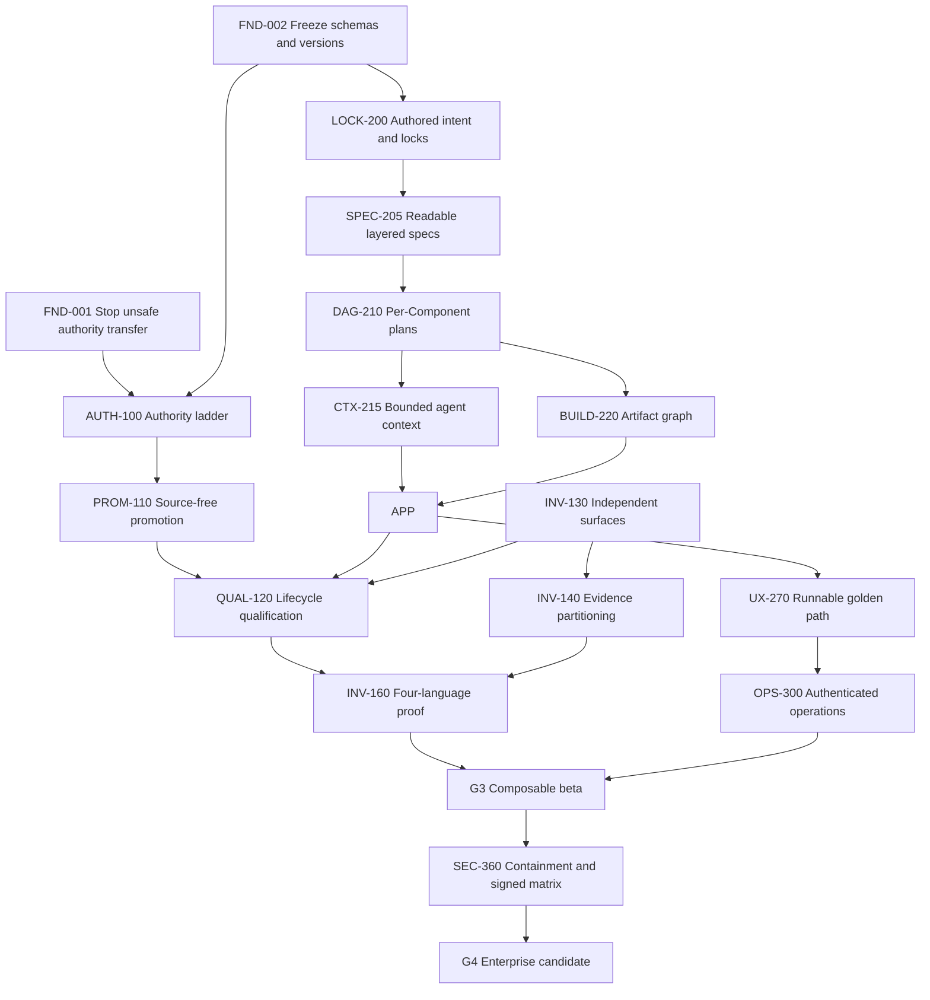
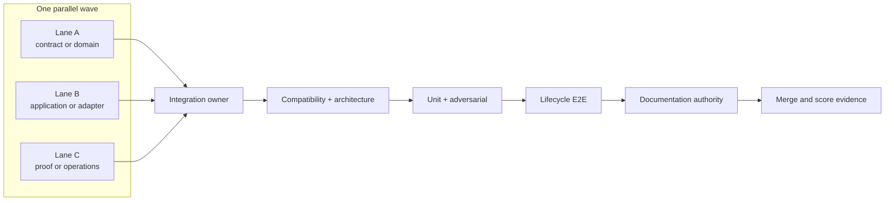

# Framework score-improvement program

- **Status:** active
- **Owning queue item:** [Framework score-improvement program](active-work.md#framework-score-improvement-program)
- **Completion / archival evidence:** pending while the program retains unchecked gates
- **Release target:** 1.1.0 under RELEASE-INTEGRATION-001. Each of the 21 milestones
  with remaining unchecked tasks now has a same-ID owner in `active-work.md`.
  The detailed tasks and dependency order below remain authoritative; creating queue
  owners is scope reconciliation, not implementation or acceptance evidence.

- Plan date: 2026-08-05
- Baseline snapshot: `8e4ebdb`
- Parent assessment: [Framework premise and implementation assessment](../architecture/framework-premise-assessment.md)
- Program state: active implementation; checked items identify tested core slices only, while
  mixed milestones remain split until their complete acceptance evidence passes

This program turns the assessment into an executable plan. It is deliberately most
detailed around the lowest scores and highest-risk correctness gaps: maturity,
brownfield/inverse support, end-to-end execution, portability, source fungibility, and
enterprise safety.

The first milestone is not feature growth. It is making every authority claim truthful.
In particular, no current qualification record may make generated source disposable
until the source-free and lifecycle-backed qualification work in this plan lands.

## Outcome and scoring contract

The external scorecard uses six one-to-five dimensions:

| Dimension | Baseline | What earns a five |
| --- | ---: | --- |
| Specification authority (**S**) | 4 | immutable versioned contracts, separated authored intent and locks, and exact authority transitions |
| Runnable end to end (**E**) | 3 | a fresh project and a multi-Component project generate, build, test, link, run, repair, cache, and publish through one standard lifecycle |
| Trust and provenance (**T**) | 4 | audited input closure plus authenticated, resolvable evidence for every release claim |
| Brownfield and inverse (**B**) | 2 | independently measured, multi-language and multi-Component source-to-specification fidelity with honest uncertainty |
| Portability (**P**) | 3 | signed proof of the same selected application on macOS, Windows, and supported Linux targets |
| Operational maturity (**M**) | 1 | repeatable releases, current receipts, regression budgets, incident procedures, and sustained external-project evidence |

Scores move only when a gate's evidence exists. Merging a schema, writing documentation,
or passing a fake-provider unit test does not by itself raise a score.

| Gate | Required outcome | Score after gate | Total |
| --- | --- | --- | ---: |
| G0 — assessed baseline | Reviewed snapshot | 4/3/4/2/3/1 | **17/30** |
| G1 — truthful alpha | Frozen wire contracts, blocked legacy authority transfer, honest CodeGraph state, and audited source-free promotion | 5/3/5/2/3/2 | **20/30** |
| G2 — usable alpha | Standard lifecycle, lifecycle-backed qualification, runnable scaffold, and one authenticated golden application | 5/4/5/3/4/3 | **24/30** |
| G3 — composable beta | Per-Component generation/build/cache, bounded repair, four-language inverse proof, and dependency-rich execution | 5/5/5/4/4/4 | **27/30** |
| G4 — enterprise candidate | Signed platform matrix, production containment, complete evidence closure, and strong brownfield benchmark | 5/5/5/5/5/4 | **29/30** |
| G5 — mature | Several releases and independent projects meet published reliability, cost, support, and recovery objectives | 5/5/5/5/5/5 | **30/30** |

G5 is intentionally not obtainable by adding code. It requires longitudinal evidence.

## Program rules

These rules apply to every task and agent lane:

1. **Truth before compatibility.** Published contracts remain readable, but unsafe
   authority decisions are not grandfathered.
2. **One lifecycle.** Samples, qualification, cache reacceptance, and ordinary projects
   use the same public application service.
3. **One Component, one derivation unit.** Each Component owns its generation, source
   cache, build, tests, artifacts, SBOM, and evidence.
4. **Context is compositional, not transitive.** A coding agent receives one Component's
   local authority plus the well-formed public contracts of its direct dependencies. It
   never receives an application's flattened transitive implementation context.
5. **Independent acceptance stays hidden.** A failed verifier oracle never becomes a
   repair prompt.
6. **No claim outruns its observation boundary.** SBOM, provenance, source exclusion,
   containment, and platform claims state exactly what was measured.
7. **No feature broadening before the golden path.** New languages, publication
   transports, OVA features, and evidence record types wait unless a task below requires
   them.
8. **Contracts merge before consumers.** One integration owner controls shared schema
   catalogs, public exports, CLI registration, and design traceability in each wave.

## Critical path



## Workstream A — release truth and immediate containment

This workstream is P0 because the framework's trust claims depend on immutable contracts
and honest authority decisions.

### `FND-001` Stop legacy qualification from transferring authority — P0

Dependencies: none. Owner: qualification contracts agent.

- [x] Make the current qualification path return `source-baseline` with blocker
  `qualification-v2-required`.
- [x] Treat existing v1 qualification records as historical evidence only.
- [x] Correct user and architecture documentation that presently implies the legacy
  command proves source exclusion or test sufficiency.
- [x] Replace the permissive unit fixture with a regression proving that a successful
  command and an `assert True` generated test cannot transfer authority.

Acceptance evidence:

- no public command can create a new fungible/specification-authority decision through
  the legacy path;
- existing records remain parseable and inspectable; and
- an empty, skipped, assertion-only, or unparsed suite remains source-authoritative.

Score effect: removes an unsafe claim; it does not raise a score by itself.

### `FND-002` Restore contract immutability and release identity — P0

Dependencies: none. Owner: wire-contract agent.

- [x] Inventory every published schema URI and exact digest at tag `v0.1.1`.
- [x] Restore every v1 schema byte-for-byte, including a
  `source-to-specification-result` that does not require `component_graph_draft`.
- [x] Check in a frozen-schema digest catalog and genuine historical golden fixtures.
- [x] Introduce v2 URIs for every post-v0.1.1 changed contract family: Components,
  Flavors, model routing, publication, security, source-to-specification, graph,
  qualification, and authority-projection records. No current writer may rely on an
  extension that exists only in the unreleased-drift fixture.
- [x] Add explicit deterministic v1-to-v2 migration. A missing graph migrates to an
  uncertainty, never to an invented graph.
- [x] Recognize the unreleased post-v0.1.1 development shape through a narrowly named
  adapter instead of redefining v1.
- [x] Make the schema catalog explicitly versioned and package all supported catalogs.
- [x] Establish one distribution-version authority; bump the next release to at least
  `0.2.0`.
- [x] Add `litai version check` covering wheel metadata, CLI output, tag, schemas,
  project protocol, lifecycle driver, suite, and Component contract versions.
- [x] Recompute derived driver and runner identities through tooling after the migration.

Acceptance evidence:

- all v0.1.1 fixtures validate against their original schemas;
- any byte change under a frozen URI fails CI;
- new writers emit v2 and old supported readers have an explicit compatibility matrix;
- unknown or ambiguous future versions fail closed; and
- installed-wheel tests prove version and schema agreement.

Score effect at G1: S 4→5 and M 1→2, together with the rest of this workstream.

### `FND-003` Characterize the migration baseline — P0

Dependencies: none. Owner: test-fixture agent.

- [x] Freeze current Component graph decisions, recipe identities, welded manifests,
  cache entries, SBOM projections, lifecycle receipts, and sample-runner behavior as
  migration fixtures.
- [x] Mark fixtures as observations, not endorsed architecture.
- [x] Record which identities must change because old serialization participated in
  authority.

Acceptance evidence: every current sample has content-addressed manifest and
host-platform recipe observations. The `service-stack` Component composition is an
explicitly representative graph observation, not a claim of repository-wide behavioral
coverage. The immutable before-state is anchored to an exact Git revision, tree, capture
protocol, and capture-tool identity. Cache, source/resolved SBOM, bundle, and receipt
wires are captured in full with canonical identities and replay from the pinned Git tree
through the exact byte-addressed capture program; the capture, runtime, invocation,
complete wires, and enclosing characterization are separately identity-bound.
Same-shape semantic mutations must change those observations. The bounded
identity-impact model is backed by real
Flavor-definition, Flavor-revision, TargetProfile, resolution-policy, lock, effective
revision, and recipe mutations, and explicitly excludes identities outside the observed
sample-planning/cache/SBOM/receipt scope. The actual before/after migration and atomic
rollback gate belongs to `LOCK-200`, after that task defines the target authored-intent
and lock contracts; Wave 0 must not invent an unreviewed `after` shape merely to satisfy
a fixture.

### `FND-004` Separate operational CodeGraph state from frozen evidence — P0

Dependencies: none. Owner: source-intelligence agent.

- [x] Define `OperationalSourceIndexStatus` separately from
  `FrozenSourceIndexEvidence`.
- [x] Make `source-intelligence check` non-mutating and compatible with a healthy active daemon.
- [x] Create frozen evidence from one typed closure containing the exact race-checked
  source mirror, source snapshot/tree identity material, file digests, provider status,
  and consistent SQLite backup; never checkpoint or delete a daemon-owned live
  database. Untyped engine mappings cannot bypass this closure.
- [x] Exclude PID, socket, WAL, and other operational sidecars from semantic evidence.
- [x] Reject static symlink and escaping-path aliases and bind the snapshot to
  source-tree identity, counts, provider/runtime/extraction versions, executable
  identity, and project path. Portable SQLite pathname lookup leaves the same-user
  filesystem namespace inside the explicit TCB; this is not a same-user sandbox.
- [x] Use `CODEGRAPH_NO_DAEMON=1` only for framework-owned short-lived calls.

Acceptance evidence:

- `litai project validate` passes locally with and without an active CodeGraph MCP
  daemon; the three-OS CI gate exercises a real CodeGraph process against an active
  SQLite WAL writer and representative daemon sidecars;
- validation and queries change no observed daemon-owned file;
- concurrent mutation yields a consistent snapshot or a bounded explicit failure; and
- macOS, Windows, and Linux source-intelligence gates agree.

## Workstream B — earned fungibility and trustworthy inverse translation

This is the most detailed workstream because current brownfield support scores 2/5 and
the existing authority-transfer defect is the highest correctness risk.

### `AUTH-100` Implement the Component authority ladder — P0

Dependencies: `FND-002`.

Define source-derived Component states separately from native spec-first Components:

1. `source-authoritative`;
2. `spec-assisted`;
3. `derived-source-retained`; and
4. `regeneratively-qualified-fungible`.

- [x] Add a content-addressed `ComponentAuthorityProjection` outside authored
  `component.json`.
- [x] Bind each projection to every state-applicable exact input: source snapshot,
  specifications, Component revision, selected target-profile lock,
  Flavor/skill/workflow/routing closure, verifier, policy, evidence, and prior
  projection. Use explicit null for facts that cannot yet exist; never mint placeholder
  hashes. `target_lock_identity` means the exact selected target-profile lock until
  `LOCK-200` introduces the canonical Component lock.
- [x] Implement a pure transition state machine; derivation, human acceptance, and v2
  qualification each have distinct transitions.
- [x] Invalidate qualification when any semantic input or verifier changes.
- [x] Add `litai spec status --json` explaining current state and blockers.
- [x] Keep retention policy separate from authority. Retain the baseline as evidence or
  escrow by default even after qualification.

Acceptance evidence:

- no state can be skipped or rewritten in place;
- all transitions reproduce from exact evidence;
- accepted legacy specs migrate only to `derived-source-retained`; and
- qualification never automatically deletes retained source.

### `PROM-110` Make promotion demonstrably source-free — P0

Dependencies: `FND-002`. The allowlisted materializer, provenance store, audit, and
migration core may proceed in parallel with `AUTH-100`; the authoritative acceptance
transition and status integration wait for `AUTH-100`'s transition API.

Define three disjoint closures:

- the generatable Component closure;
- inverse provenance and prompt-journal closure; and
- optional source-baseline escrow closure.

Implementation tasks:

- [x] Store raw CodeGraph excerpts, source intelligence, prompts, responses, and inverse
  journals under `provenance/source-promotion/<identity>/`, outside Component and spec
  roots.
- [x] Replace whole-tree copying with an allowlisted materializer for accepted specs,
  authored Component intent, reviewed Flavors, and exact forward skill/workflow/routing
  references.
- [x] Place only a typed provenance reference in the authority projection.
- [x] Emit a generation-input audit listing every read file, kind, and identity.
- [x] Derive source exclusion from the audited closure; delete the hard-coded true flag.
- [x] Add atomic migration for legacy `.literate/source-translation.json` files with
  identity, overlap, traversal, and symlink checks.
- [x] Extract this behavior into an application service; leave CLI code as argument and
  presentation wiring.

Acceptance evidence:

- unique source/prompt/journal canaries never enter a Component, forward prompt, recipe
  identity, or generated tree;
- changing a journal leaves generation identity unchanged while changing a spec does
  not;
- all nodes of a promoted graph are source-free; and
- the audit, rather than a provider assertion, proves exclusion.

### `QUAL-120` Qualify through the normal lifecycle — P0

Dependencies: `AUTH-100`, `PROM-110`, and `APP-240`.

- [x] Introduce `QualificationLifecycleRunner`, backed by the same public service as
  `litai rebuild`.
- [x] Force a new external workspace, source-cache bypass, normal planning, generation,
  indexing, validation, authorization, dependency resolution, build, generated tests,
  execution, and independent acceptance.
- [x] Require an unchanged project-pinned lifecycle-driver identity before and after.
- [x] Consume a finalized typed lifecycle receipt, never successful shell-command
  counts.
- [x] Bind generation-input audit, tree/index, build, resolved SBOM, test-suite identity,
  typed case results, verifier evidence, cache decision, workspace, and parity evidence.
- [x] Derive totals from stable parsed case IDs in `ProjectTestSummary`.
- [x] Pin a verifier-owned case-to-surface map and compute coverage only from passing
  independent cases.
- [x] Keep baseline parity in a separate provider after generation ends. It may read
  retained source; the generation provider may not.
- [x] Require two clean runs per required target. Binary-cache hits may pass only with
  exact action evidence; source-cache hits may not establish regeneration.

Acceptance evidence includes negative tests for fabricated totals, substituted case
IDs, claimed surfaces, stale driver, skipped or empty tests, assertion-only tests, source
cache hits, failed SBOM/index/build/test/verifier/parity phases, and reused workspaces.
Only two complete clean runs may create `regeneratively-qualified-fungible`.

Current implementation status: the filesystem qualification adapter allocates a fresh
outer root for each of two Standard runs and composes run-private generated-source,
accepted-source, CAS, object, checkpoint, CodeGraph, and per-Component workspace roots.
It forces cache bypass, consumes only the typed `StandardProjectLifecycleResult` and its
project receipt, rechecks the pinned driver around each run, derives cases and totals
from typed evidence, applies a verifier-owned case/surface map, and invokes baseline
parity only after generation. The persisted `QualificationLifecycleResult` is parsed
again at the promotion boundary; legacy command-count evidence remains fail-closed and
cannot authorize fungibility.

### `INV-130` Discover behavioral surfaces independently — P1

Dependencies: `FND-002`; integrates with `QUAL-120`.

- [x] Define `BehavioralSurfaceInventory` with stable ID, detector, language, interface
  kind, path/symbol, evidence, required status, and disposition.
- [x] Run a deterministic CodeGraph/manifest collector before model translation for
  public entrypoints/exports, I/O protocols, configuration, errors, state, test-observed
  behavior, Component boundaries, and dependency edges.
- [x] Merge collector surfaces, verifier-contract surfaces, and model-proposed additions
  deterministically. The translator cannot remove a required surface.
- [x] Make unmapped required surfaces blocking uncertainties; human exclusions require
  reviewed reasons.
- [x] Require the collector and translator to have distinct identities.

Current implementation status: a strict versioned inventory and item contract now owns
stable detector-derived surface IDs, exact evidence, requirement/disposition state,
translator mappings, and separately reviewed exclusions. The existing deterministic
CodeGraph evidence collection is projected into this inventory before any inverse model
call; well-known npm, Python, Cargo, and Bzlmod manifests contribute conservative
entrypoint/export/Component/dependency surfaces. After translation, both exact evidence
and an interface-compatible skill facet are required to reconcile observations without
changing surface identity, and a required unmapped surface blocks the derivation.
Collector and translator-set identities are distinct and enforced. The inventory is
retained in current semantic result bundles and re-derived during acceptance,
so an edited, missing, or journal-inconsistent record fails. The remaining unchecked work
is ordinary-path verifier-surface collection, more complete Component-boundary detection,
and an operator-facing reviewed-exclusion input path rather than merely its application
contract. Model-only facet/evidence combinations are retained as translator-owned
advisory proposals, and the provider-neutral merge accepts independently required
verifier surfaces without allowing translator deletion; the ordinary verifier contract
still needs to supply that input.

Acceptance evidence: deliberate omission of a public error branch cannot produce 100%
coverage; traversal order is irrelevant; empty or unsupported inventories cannot
qualify.

### `INV-140` Partition evidence without silent truncation — P1

Dependencies: `INV-130`.

- [x] Give every inventory path exactly one disposition: full, sliced,
  sensitive-excluded, unsupported, duplicate, budget-partitioned, or blocking-omitted.
- [x] Distinguish complete inventory, safely indexable paths, model-admitted paths, and
  exclusions.
- [x] Add a content-addressed partition manifest with byte counts, identities, language,
  and ordinals.
- [x] Permit bounded multiple calls per language and merge structured observations
  deterministically.
- [x] Block qualification when budgets cannot cover required evidence. Promotion
  now retains a content-addressed inverse custody document, and qualification
  independently rebuilds the exact path dispositions and bounded batch plan before
  any host execution and again before authority transition.
- [x] Keep raw partitions in provenance storage, outside Component authority.

Acceptance evidence covers first-file-over-budget, exact-boundary, missing, duplicate,
tampered, reordered, and sensitive-exclusion cases. `included_paths` may never name
content the model did not receive.

The current v1 `EvidencePartitionManifest` projects every retained source-inventory path
before model egress and refuses required safe paths with no admitted evidence. Bundle v4
persists the strict manifest, complete source inventory, provider identity, byte counts,
evidence IDs, and canonical ordinals. Acceptance reparses both records and reconstructs
the manifest from the exact persisted intelligence, so an edited or substituted manifest
fails closed. Duplicate source bytes do not excuse missing path-specific evidence. A
separate content-addressed `ModelEvidenceBatchPlan` greedily partitions each language in
canonical path/evidence order under an operator-visible byte ceiling (262,144 bytes by
default). Oversized individual evidence blocks; every admitted evidence ID occurs in one
batch; v2 journals bind ordinal, count, and IDs; and v4 translation acceptance reconstructs
the plan and deterministically merges all observations and Component graph fragments. The
remaining work is qualification-level budget coverage, more boundary-size adversarial
cases, and an independent qualification-time reopening of the budget evidence. Accepted
sets and promoted projects already retain the exact provider evidence and every raw
partition prompt/response under the content-addressed
`provenance/source-promotion/<digest>/source-translation.json`; that subtree is evidence
custody and is never part of Component intent authority.

### `INV-150` Recover real Component semantics — P1

Dependencies: `INV-130`.

- [x] Add reviewed kind, profiles, entrypoints, capability contracts, and node-specific
  build needs to graph-node drafts.
- [x] Permit libraries without runnable entrypoints and distinguish services from CLIs.
- [x] Remove fabricated `portable-application/run` defaults.
- [x] Treat unknown kind or entrypoint semantics as blocking for promotion.
- [x] Generate each node manifest from its own evidence and reviewed contract.

Acceptance evidence: library, CLI, and service fixtures retain distinct semantics; a
multi-node graph fails rather than inventing a missing contract.

<a id="inv-160"></a>

### `INV-160` Four-language bidirectional qualification — P1

Dependencies: `QUAL-120`, `INV-130`, `INV-140`, `INV-150`, and `UX-270`.

For Python, C++, Rust, and JavaScript on the host platform:

- [ ] generate from the same stable behavioral specification;
- [ ] build, run generated tests, and pass the full verifier;
- [ ] derive a v2 inverse specification with complete evidence disposition;
- [ ] review, accept, and promote a source-free Component;
- [ ] perform two forced standard-lifecycle rebuilds;
- [ ] run baseline parity and reach fungible authority; and
- [ ] inject one behavior mutation and prove a gate detects it.

Replace the 13-of-16 keyword heuristic with a normalized requirement graph covering
inputs, outputs, invariants, normalization, aggregation, ordering, tie-breaking, errors,
and invalid inputs. Require all reference behaviors. Ordinary CI uses deterministic
adapters; nightly and release CI use authenticated agents and fail, rather than skip,
when a declared credential or toolchain is unavailable.

Score effect at G3: B 2→4. B reaches 5 only after the benchmark corpus demonstrates
strong precision/recall on independent brownfield projects.

## Workstream C — executable Components and the standard lifecycle

This workstream addresses the 3/5 end-to-end score and the current gap between the
Component design and one flattened generation tree.

### Why flattening is a P0 architectural failure

Flattening a Component graph into one generation recipe is not merely inefficient prompt
assembly. It destroys the main economic and cognitive boundary of the framework:

- context bytes and model tokens grow with the transitive application rather than the
  Component being authored;
- the coding agent must solve several implementation problems and reconcile unrelated
  constraints in one attempt, increasing failure and repair cost;
- dependency-private details become tempting coupling points instead of being hidden
  behind stable contracts;
- a private leaf change perturbs the root recipe and invalidates otherwise reusable
  source;
- prompt cost is paid repeatedly for unchanged dependencies and cannot benefit from
  Component-level generation parallelism; and
- evidence, failures, review, and qualification become attributable only to a giant
  application prompt instead of a bounded unit.

The target boundary is therefore measurable. For Component `C`, generation context is:

```text
context(C) = framework envelope
           + local authority(C)
           + selected target/Flavor/skill/workflow/routing inputs(C)
           + public interface contracts(direct generation dependencies of C)
```

It is independent of unrelated siblings, dependency-private specifications and source,
and private descendants below a direct dependency. A transitive interface is visible
only when a direct dependency deliberately re-exports it as part of its own public
contract. Total project work may grow with the number of Components that genuinely need
generation; the context and reasoning problem for any one Component must not grow with
the private transitive graph.

### `COMP-190` Decide executable-Component semantics — P0

Dependencies: `FND-002`.

- [x] Record an ADR making Component the generation/cache/build/test/publication unit.
- [x] Define generation, build, runtime, validation, toolchain, packaging, and deployment
  edge semantics.
- [x] Define public capability interfaces as the only dependency material visible
  during consumer generation; planner enforcement remains in `DAG-210`/`CTX-215`.
- [x] Define a well-formed public interface contract: provided capability and version,
  exported types/protocols, behavioral preconditions/postconditions/errors, compatibility
  promise, content identity, and any intentional re-export. It contains no implementation
  instructions or verifier-only facts.
- [x] Define target and Flavor-slot resolution for every graph node; per-node planning
  remains in `DAG-210`.
- [x] Define authored binary assets, repair-as-replacement, and standard versus external
  lifecycle-driver trust.
- [x] Include a diamond graph and an exact invalidation table.

### `LOCK-200` Separate authored intent and exact resolution — P0

Dependencies: `COMP-190`, `FND-002`, `FND-003`.

Implement the detailed [Component authoring and lock separation roadmap](component-authoring-and-locks.md):

- [x] classify every field;
- [x] define readable authored intent under a new v3 schema/catalog (or a distinctly
  named authoring contract) using constrained Markdown frontmatter rather than another
  hand-maintained JSON envelope; never mutate or reuse the frozen welded
  `urn:literate-ai:schema:v2:component-definition` URI;
- [x] define canonical target-specific `component.lock.json` node and edge contracts;
  file parsing and atomic materialization remain below;
- [x] separate the selected derivation identity from catalog-audit evidence: rejected or
  unrelated Flavor candidates remain explainable audit records but MUST NOT perturb a
  node lock, effective specification, recipe, or cache key;
- [x] implement atomic `litai lock`, `--check`, `--diff`, and target/Flavor selection;
- [x] bind plan, generate, rebuild, cache, SBOM, and publication to one lock identity;
  and
- [x] migrate welded v1 manifests with an explicit compatibility exit;
- [x] record a semantic before/after comparison for every current sample through the
  repository-wide migration conformance test; and
- [x] stage the multi-file migration atomically and prove an injected failure restores
  every original file byte-for-byte.

Current hardening: cache-hit selection and post-acceptance source-cache publication now
reject every entry whose accepted derivation names a Component lock outside the exact
outer-owned rebuild lock set. The lifecycle-binding item remains open until typed artifact
publication and the ordinary Standard runtime consume the same lock authority.
The typed bridge now retains the Standard lifecycle's typed build plan, derives its
artifact graph from accepted exports, and creates a `ReleaseArtifactSet` without
accepting a caller-supplied lock, root, target, workspace, or evidence identity. Explicit
package choices come from a pre-package `StandardReleaseDeclaration`, not from the
package result being verified. The release binds the accepted root source tree record,
every referenced source-file blob, compiled export bytes, and a canonical compact index
of every project/node lifecycle evidence identity. Publication independently verifies
the typed lock and derives its revision, target, package roots, complete source closure,
and compact provenance manifest from that release.
This is not yet authenticated evidence storage. The item remains open until the
evidence-store milestone supplies signed resolvable locators. The provider-neutral
`StandardProjectReleaseService` now invokes packaging, performs exact CAS ingestion,
authorizes and publishes, validates the transfer receipt, and returns a typed aggregate
release receipt. `FilesystemStandardProjectRuntime.execute_and_publish` exposes that as
an explicit caller-authorized phase while preserving lifecycle-only `execute`; its typed
request binds the exact lock, declarations, complete source closure, evidence, policy,
destination service, actor, and reason. Release declarations and aggregate receipts have
strict versioned wire contracts and public v2 schemas. A fresh-CAS regression imports a
published closure and reconstructs every generated source path and byte.
Source-to-specification promotion now writes canonical `component.md` directly and
never manufactures a welded `component.json`; authority status and legacy qualification
revalidate the exact current lock instead of invoking the legacy composer. Legacy-only
project authoring fails with an actionable migration diagnostic. The exit is fixed:
deprecated in 0.2.0, final migration/equivalence series 0.2.x, removed in 0.3.0. The
now-unreachable legacy generation composer and dedicated migration fixtures remain until
the scheduled 0.3.0 removal; they are not ordinary project or generation fallbacks.

Acceptance evidence: a small manifest fits on one screen; two locks are byte-identical;
stale or forged locks fail before model egress; lock diffs explain selection; every
sample migrates without a semantic graph change; and rollback leaves no partial lock or
authored-definition state. Changing an unselected Flavor or its skill changes the
catalog-audit identity only; selected locks and recipes on every unaffected axis remain
byte-identical.

### `SPEC-205` Make layered specifications readable and bounded — P0

Dependencies: `FND-002`; Component-authoring integration depends on `LOCK-200`.

- [x] Add versioned schema-v2 contracts for concise specification-node authoring, exact
  node projections, and deterministic effective-context projections.
- [x] Implement `literate-markdown@1` with required `name`, `summary`, and `kind`;
  optional local references/status; path-derived IDs and parents; strict unknown-key,
  missing-parent, drift, unresolved-reference, and cycle rejection.
- [x] Feed one canonical node/edge/context graph plus one copy of each original document
  into Component generation.
- [x] Put shared context, direct-public-interface, generated-test, source-disposal, and
  contradiction-handling guidance in pinned skills and the top-level onboarding skill
  instead of repeating it in product specs.
- [x] Map the VFI app/constraint/core/contract/component/part proposal onto local spec
  hierarchy, Flavors, skills, external dependencies, public capability contracts, and
  independently generatable Components.
- [x] Make the source-to-specification coding-agent translators emit or migrate this
  provider when a recovered Component benefits from multiple narrow documents.
- [x] Add `litai spec format` and a non-mutating corpus validation/explanation command so
  an author can inspect derived IDs, parents, references, and effective context without
  planning a target.
- [x] Add reviewed semantic-refinement evidence: an LLM may identify a conflict, but
  natural-language “narrow, never contradict” must not be misrepresented as a static
  schema proof or resolved through silent nearest-wins precedence.
- [x] Add a VFI-shaped multi-Component fixture proving that 50 sibling feature nodes do
  not enlarge any one Component's prompt beyond its local nodes and direct public
  interfaces.
- [x] Make `component.md` the complete single-file authored default: its Markdown body
  carries the Component story, observable behavior, public contract, examples, and
  measurable acceptance while its frontmatter points back to that same document as the
  specification root. Do not require a second prose file merely to satisfy a provider
  abstraction.
- [x] Permit additional authored specification or interface documents only when each
  file names a real independently useful domain, module, protocol, or public Component
  boundary. A directory name, serialization format, test phase, or tool provider is not
  by itself a boundary.
- [x] Keep exact selections in generated `component.lock.json`; derive normalized JSON
  projections on demand instead of checking them into ordinary Component examples.
- [x] Enforce this shape in initializers and conformance: the smallest Component has one
  authored file, and every retained extra authored file has a declared boundary reason.

Acceptance evidence: every example frontmatter document fits comfortably at the top of
one Markdown file; derived IDs eliminate synchronized path metadata; context projection
is byte-stable under catalog traversal reordering; invalid graphs fail before model
egress; shared skill prose occurs once; and adding private descendants or unrelated VFI
features changes neither a fixed Component's context bytes nor identity. The canonical
starter remains fully lockable, generatable, buildable, and independently testable after
deleting every redundant authored projection, and a fork begins with `component.md`
rather than a seven-file directory ritual.

### `FMT-207` Finish the human-authoring and machine-record format split — P0

Dependencies: `LOCK-200`, `SPEC-205`.

Before 0.1, make the format boundary deliberate and remove pre-release accidents from
the public taxonomy:

- [x] Make constrained Markdown plus strict YAML frontmatter the canonical form for
  every human-authored intent document: Components, layered specifications, Flavors,
  conversion/build skills, and prose-rich workflow policy.
- [x] Replace repository-native `skill.json` authoring with canonical `SKILL.md` files;
  preserve the typed skill contract, exact content identity, dependency selection, and
  trust metadata through a strict Markdown loader rather than weakening validation.
- [x] Define and migrate `flavor.md` as the readable authoring form for Flavors while
  keeping resolved target/Flavor selections in generated locks.
- [x] Keep JSON for strict machine protocols and derived evidence: project bootstrap,
  locks, plans, cache/publication records, receipts, harness vectors, compact test
  history, CodeGraph metadata, and CycloneDX SBOMs.
- [x] Keep normalized JSON projections available at CLI/API boundaries, but generate
  them on demand and do not ask humans to maintain prose duplicated across formats.
- [x] Remove the temporary JSON-to-Markdown SkillEvaluator projection after all native
  skills have migrated; reject ambiguous dual-authority directories containing both
  canonical Markdown and legacy JSON.
- [x] Publish a one-page format decision table and migration guide, with round-trip,
  canonical-identity, unknown-key, and compatibility-exit tests.

Acceptance evidence: a new user authors only Markdown to define a Component and its
generation policy; every machine record has a versioned schema and canonical identity;
the same semantic field has exactly one authority; and deleting all derived JSON leaves
enough authored material to reproduce it byte-for-byte.

### `DAG-210` Plan generation per Component — P0

Dependencies: `COMP-190`, `LOCK-200`, `SPEC-205`.

- [x] Add versioned Component execution/action/generation plans and per-node derivation
  keys with explicit topological layers.
- [x] Include a node's specs, Flavors, skills, workflow/routing, model, assets, and direct
  public-interface identities in its generation key.
- [x] Exclude dependency implementation/build identities unless their exported interface
  changes.
- [x] Resolve Flavors independently per node under one named target, including
  coordinate-qualified overrides.
- [x] Replace flattened dependency documents with an interface projector that excludes
  private child specs, skills, routing, and acceptance oracles.
- [x] Make a missing, ambiguous, cyclic, incompatible, or incomplete direct interface a
  planning error. The planner must never compensate by injecting the dependency's full
  specification or source.

Acceptance evidence: root-only, leaf-internal, and exported-interface changes invalidate
exactly the expected nodes; diamonds deduplicate their leaf; deep prompts stay bounded;
cycles and stage/Flavor conflicts fail before generation.

### `CTX-215` Enforce bounded coding-agent context and complexity budgets — P0

Dependencies: `COMP-190`, `DAG-210`.

- [x] Add a versioned `ComponentGenerationContextManifest` enumerating every prompt
  segment, authority kind, source Component, reason for inclusion, exact identity, byte
  count, token estimate, and visibility class.
- [x] Permit only the framework envelope, the node's own selected authority, and public
  interface contracts of direct generation dependencies. Reject private dependency
  specs/source/tests, full dependency manifests or locks, inverse journals, acceptance
  oracles, and undeclared transitive material.
- [x] Add project-policy `GenerationComplexityBudget` limits for prompt bytes, estimated
  tokens, document count, direct-interface bytes, dependency fan-in, model attempts,
  wall time, tokens, and cost. Exact model/runtime observations are recorded after the
  run; deterministic limits are enforced before model egress where possible.
- [x] If a Component exceeds its budget, fail with an explanation of the largest local
  and interface contributors and recommend an explicit Component/interface refactor.
  Never silently truncate context or fall back to a flattened prompt.
- [x] Bind the context manifest and budget decision into the bounded generation request,
  source candidate, node result, and generation provenance.
- [x] Carry those bindings through the durable prompt journal, benchmark corpus, and
  aggregate current receipt.
- [x] Add prompt canaries proving that private dependency material cannot cross the
  projection boundary even when names collide or a dependency document asks the model to
  read it.
- [x] Make generation scheduling proportional to the invalidated node set:
  reuse unaffected accepted Component candidates and generate independent nodes in
  bounded parallel layers.

Required graph-scaling tests:

1. Adding or changing an unrelated sibling leaves a fixed node's context bytes and
   identity unchanged.
2. Changing a leaf's private source/specification while preserving its public interface
   leaves every consumer context and source key unchanged.
3. Changing an exported interface changes the direct consumer; it propagates further
   only through a deliberate public re-export or affected local behavior.
4. Extending a chain beneath a direct dependency with private nodes does not enlarge the
   consumer prompt.
5. Increasing direct fan-in grows context only by the selected public-interface bytes;
   exceeding policy fails before invoking a coding agent.
6. Diamond, chain, and wide-fanout fixtures prove zero private-transitive leakage and
   deterministic manifests under catalog reordering.

Acceptance evidence reports, per node, local-authority bytes, direct-interface bytes,
framework/skill overhead, estimated and actual tokens, attempt count, elapsed time, and
cost where available. For a fixed node with fixed local authority and direct interfaces,
private graph depth and width must have zero effect on context identity or size.

<a id="build-220"></a>

### `BUILD-220` Define assets, artifacts, and linking — P0

Dependencies: `DAG-210`.

- [x] Keep model output a `GeneratedTextTree`; assemble content-locked authored binary
  assets separately into an arbitrary-byte `SourceTreeManifest`.
- [x] Define `ArtifactExport`, per-Component build manifests, build action requests with
  dependency artifacts, and exact link plans.
- [x] Require role, ABI/target, media type, producer, source, toolchain, authorization,
  dependency closure, and blob identity.
- [x] Materialize exact blobs in isolated execution roots rather than passing ambient
  host paths.
- [x] Add adapter-neutral build-graph support, with Bazel as the removable preference and
  native/Mix/Zig-style overrides consuming the same contracts.
- [x] Define one typed composite build request that binds the selected build-system
  resolver/toolchain, language compiler/runtime, ordered typed sub-actions, requested
  privileges, declared outputs, exact source/materialization plans, and authorization.
- [x] Make the Standard lifecycle finalize and validate one typed composite build request
  only after current source indexing and authorization, then pass that exact plan through
  build, test, execution, and acceptance.
- [ ] Replace compatibility build decorators in ordinary CLI/sample wiring. Until then, a
  Bazel conformance decorator must preserve the native request unchanged, label the native
  artifact producer honestly, and expose Bazel only as separately identity-bound
  dependency/build-system evidence.
- [x] Until that replacement lands, bind Bazel's exact local `buildfiles(//...)` and
  `deps(//...)` source-file results to the admitted source digest with typed
  `BuildInputConsumption`; pass it only through the explicit consumption-aware delegate
  seam and retain both raw and canonical evidence in the composite artifact.

Current implementation status: typed Standard command authority now separates the
build-system resolver/toolchain, language compiler/runtime, and exact launcher for each
phase without an inferred single-tool fallback. The projector reads exact-singleton
`standard-command-profile` contributions only from the locked language, platform, and
optional build-system Flavors. Those profiles determine source/test entrypoints,
artifact shape, native strategy, runtime mode, toolchain constraints, and the single
`//:litai_artifact` Bazel target. It discovers the selected host tools, observes their
recursive dependency graph, rechecks the lock and toolchain closure, and emits shell-free
build/test/execute commands whose artifacts implement `--litai-test` and
`--litai-smoke`. Real macOS conformance compiles and runs Python, JavaScript, Rust, and
C++ through those projected commands. Installed-project smoke proves the Bazel profile
is packaged and copied by `litai init`. `StandardBazelLifecyclePorts` binds one
exact local Bazel target and output, lets Bazel produce those bytes directly in isolated
custody, and rejects output escapes or links. Ordinary sample wiring still selects the
compatibility decorator. The ordinary `hello-component` sample now routes both its
Python and C++ variants exclusively through the public Standard runtime. The
dependency-bearing `service-stack` Python variant now likewise uses its existing
three-node Standard service as its ordinary execution, including on the authenticated
live path, rather than running a legacy execution plus a duplicate Standard adoption
proof. Its C++ variant and other ordinary samples still retain legacy routes, so the
remaining unchecked item is intentionally not closed.
The Standard three-Component service-stack now declares an exact build-system slot and
therefore resolves the project's `+bazel` preference normally. Its ordinary conformance
handler routes that selection through the real executor: Bazel produces one declared
deterministic bytecode archive per Component, generated-source custody remains
unmodified, all three archives are executed and tested, and a second run proves three
cache hits with no rebuild misses. This closes the executor and one ordinary sample
proof, not the still-open default CLI and remaining-sample routing migration.

Acceptance evidence: binary bytes round-trip on three OS families; a model cannot
overwrite locked assets; wrong producer/ABI/role/target fails before launch; the root
artifact traces to every child; Bazel avoids unchanged actions.

<a id="app-230"></a>

### `APP-230` Extract public application services — P0

Dependencies: `DAG-210`, `LOCK-200`.

- [x] Move catalog loading, lock resolution, execution planning, recipe creation, and
  authority review out of private CLI helpers.
- [ ] Make CLI modules argument/presentation adapters only.
- [x] Add architecture tests: domain imports no application/adapters/CLI; application
  depends only on contracts and ports; adapters and samples import no CLI-private code.

Current implementation status: locked `litai plan` and source-only `litai generate`
delegate through the public Standard application services. Plan output carries the exact
typed Component execution plan; generation output carries canonical per-Component
workspace custody and full source results. Filesystem project/catalog validation and
authority-review calculation now live behind a public adapter and pure application
records; CLI commands only translate their stable failures into presentation envelopes.
Canonical project initialization, starter-catalog creation, and explicit documentation
authority-review recording likewise live behind a public filesystem adapter; the CLI
retains only its stable version-three presentation projection.
The locked generation CLI is presentation-only and architecture-tested. External
lifecycle-driver discovery, implementation attestation, safe environment construction,
argv expansion, drift checks, and bounded invocation now also live in a public adapter.
Locked generation preparation, execution-plan compilation, authority review, and repeated
input-drift checks now compose through one public filesystem application adapter. The CLI
no longer contains its unreachable unlocked-generation fallback or duplicate Flavor,
toolchain, role-entrypoint, and SBOM policy implementations.
The Standard driver composition and ordinary CLI route are implemented, although the
remaining sample and qualification migration keeps the presentation-only boundary from
being complete repository-wide. A public
provider-neutral lifecycle assembly function and an explicit component-scoped filesystem
composition root now exist without CLI-private imports. The v2 project contract can bind
either the byte-compatible external driver or a Standard framework-distribution/policy
pair. The CLI selects that Standard binding when declared, and its
filesystem composition root now consumes provider-neutral shell-free command contracts
through exact phase-local tool bindings and distinct build-system resolver/toolchain and
language compiler/runtime identities. Its readiness report still blocks incomplete command
coverage, stale tool bindings, unverified toolchain closure, and unconfigured production
CodeGraph or durable cache ports. Strict post-source evidence contracts now define the
build, generated-test, execution, and Component-acceptance shapes. The real local and
Bazel ports construct that complete chain on fresh runs from revalidated source-suite and
source-BOM custody, an exact post-build CycloneDX transition, every-and-only attributable
generated case results, artifact-bound execution observations, and composed acceptance.
Durable Standard cache publication now retains the complete typed source, BOM,
generated-test, build, execution, acceptance, and provenance closure. A newly assembled
runtime can resolve the exact derivation key, materialize the tree into its newly
allocated workspace, rebind current workspace custody, and then re-index, re-authorize,
build/test/execute, and re-accept it without invoking generation or republishing the
historical hit. Durable process-restart stage checkpoints now append typed pass/failure
evidence and retry lineage while retaining source bytes in a CAS. A new runtime restores
only source custody, then deliberately repeats current CodeGraph indexing, authorization,
build, generated tests, execution, and acceptance; historical checkpoint evidence never
impersonates current authority. A separately isolated verifier remains open. Generated-test,
resolved-SBOM, execution, Component-acceptance, lifecycle-membership, and aggregate
project-receipt projection are complete typed outputs of every successful Standard run.
Compiler/runtime transitive closure is attested by the locked command projector.

Acceptance evidence: `litai plan` and `generate` delegate to public services, and neither
tests nor samples import `literate_ai.cli` internals.

<a id="app-240"></a>

### `APP-240` Implement the topological standard lifecycle — P0

Dependencies: `APP-230`, `DAG-210`, `CTX-215`, `BUILD-220`.

Implement one reusable `StandardProjectLifecycleService` that:

1. validates the project and target lock;
2. plans the Component action DAG;
3. resolves or generates and indexes each node tree;
4. validates, classifies, and authorizes each node;
5. builds topological layers from exact dependency artifacts;
6. links/packages the root;
7. runs node and integration generated tests;
8. executes the root and runs independent acceptance;
9. admits accepted node workspaces; and
10. emits aggregate evidence and a provisional receipt.

Current implementation status:

- [x] The reusable core consumes complete per-Component preparation, runs only the
  source-only generation boundary, retains the full tree/bundle candidate, and schedules
  dependency-safe bounded layers.
- [x] Every generated or reused source is currently indexed and authorized before the
  authorization-bound build plan is finalized; changed authorization or provider exports
  rebuild without regenerating source.
- [x] The core runs build, node test, execution, acceptance, project admission, and
  receipt ports exactly once, cancels dependents after failure, and preserves independent
  accepted branches.
- [x] Integrate typed per-Component cache membership decisions, including mixed hits and
  misses, current re-index/re-authorization, forced regeneration, and publication only
  after exact node acceptance plus root packaging, execution, and independent project
  acceptance.
- [x] Construct a typed aggregate lifecycle membership and receipt with exact equality
  across planned nodes, cache decisions, lifecycle results, admission, and receipt
  members, including complete failure membership without admission or receipt.
- [x] Expose preparation plus execution through the public filesystem Standard runtime;
  the three-Component service-stack sample now uses that facade, typed locked command
  contracts, and verifier-owned invocation vectors instead of assembling lifecycle ports
  or recovering private harness data from generation recipes.
- [x] Make fresh local/Bazel node success carry strict build, resolved-SBOM,
  every-and-only generated-test, execution, and Component-acceptance evidence; reject
  missing case attribution and producer occupation of framework evidence paths.
- [x] Integrate lock discovery, link/package actions, and root integration acceptance
  into this service.
- [x] Add durable stage-boundary interruption/resume and retry lineage across process
  restart. The filesystem store records every attempt, every successful boundary, and
  typed post-source terminal failures; source-internal failures retain their existing
  generation journal. It restores exact source bytes into a new workspace and starts a
  predecessor-bound attempt. Safety-sensitive post-source stages replay rather than
  being skipped.
- [x] Make this service the ordinary CLI/default-driver path for Standard-bound projects.
- [ ] Make this service the path for the remaining samples and qualification workflows.

The root-integration boundary now realizes an exact multi-Component artifact graph,
materializes an immutable root package, runs package-owned integration tests, executes
the packaged root, and compares canonical output against an independently injected
verifier oracle whose arguments and expected result are unavailable during generation.
The qualification workflow uses this same Standard composition. Remaining sample
migration—not qualification—is what keeps the final checklist item open.

Parallelism is bounded; output order is canonical. Failure cancels dependents and leaves
accepted siblings unpublished. Resume must revalidate every saved identity.

Acceptance evidence: the same service runs ordinary projects, samples, and qualification;
a failing node leaves unrelated independent node evidence visible to the caller but not
reusable from the accepted cache; no node builds before its inputs are accepted;
interruption at each stage is safe.

### `CACHE-250` Make cache membership per Component — P0

Dependencies: `APP-240`.

- [x] Separate predictable requested derivation keys from complete candidate derivation
  identities and membership.
- [x] Store only final accepted trees; keep failed attempts in external runtime evidence.
- [x] Treat hits as current-acceptance-untrusted and support mixed hit/miss graphs.
- [x] Publish only current accepted non-hit nodes after complete project acceptance.
- [x] Prove exact set equality among plan nodes, cache decisions, lifecycle evidence, and
  receipt aggregation.

Acceptance evidence covers corruption, ambiguity, target mismatch, leaf-hit/root-miss,
forced bypass, and omitted/extra membership.

### `REPAIR-260` Add bounded replacement attempts — P0

Dependencies: `APP-240`.

The Standard lifecycle now implements typed `CandidateAttempt`,
`CandidateRepairRequest`, and `CandidateAttemptChain` contracts with a filesystem
repair adapter. Each replacement has a fresh workspace, retains the original
recipe, binds its exact predecessor chain, and must complete the lifecycle before
accepted-source admission. The production adapter retries only attributable
build/test failures with the closed codes `builder.generated-source-rejected`,
`dependencies.import-bom-mismatch`, and `generated-test.failed`. Its feedback uses
bounded, sanitized facts rather than raw compiler output or verifier-oracle data.
This is implemented support, not evidence of live provider or all-platform
qualification, nor general repair of arbitrary compiler failures.

The following sample-specific pilot remains a distinct, narrower implementation.
The conformance driver can replace a closed static Bzlmod source-validation rejection,
an exact terminal generated-test behavior mismatch, a typed application/backend nonzero
exit during generated implementation tests, or a terminal C++ generated-source rejection
up to twice after the initial candidate, with
fresh roots, sanitized typed rejection feedback in every subsequent generation request,
category-specific complete identity bindings, no rejected-tree
admission, and compact versioned success/exhaustion evidence. The validation category
requires an exact failed `validate` event, a matching `DependencyObservationError`,
generated tree/source-bundle/suite bindings, and no admitted lifecycle result. Its exact
closed set is `dependencies.bzlmod-authority-unsupported`,
`dependencies.bzlmod-dependency-duplicate`,
`dependencies.bzlmod-generated-lock-forbidden`,
`dependencies.bzlmod-literal-invalid`, `dependencies.bzlmod-module-ambiguous`,
`dependencies.bzlmod-module-invalid`,
`dependencies.bzlmod-module-location-invalid`,
`dependencies.bzlmod-module-name-invalid`,
`dependencies.bzlmod-source-composition-invalid`,
`dependencies.bzlmod-source-intent-invalid`, and
`dependencies.bzlmod-workspace-unsupported`. Resolver, dependency-evidence, unknown-code,
toolchain, framework, and
already-admitted failures remain terminal. The execution category requires
`host_execution.nonzero_exit`, an application/backend role, a nonzero integer return code,
and stdout/stderr digests; verifier failures, timeouts, launch/authorization, invalid
output, and missing process evidence remain terminal. The build category requires
completed validate/classify/authorize stages, no build result or downstream step, and an
event-matching `builder.cpp_generated_source_rejected` `BuildError`; that code is emitted
only when the candidate compile/link fails but a same-pinned-toolchain compile/link canary
succeeds. A failed canary remains terminal `builder.cpp_compile_failed`. Python, Rust,
JavaScript, generic native, Bazel build/resolve/analyze, toolchain, authorization, and
all other dependency failures also remain terminal. These pilot-specific categories
do not broaden the Standard adapter's retry allowlist. The checked implementation
below refers to the reusable Standard contracts and lifecycle, not to the pilot alone.

Default to one initial attempt and at most two repairs. Compiler/linker and generated-test
diagnostics may trigger repair; authentication, missing tools, policy denial, dependency
trust, verifier-oracle failure, publication, and deployment may not.

- [x] Give every attempt a fresh empty node workspace and a complete replacement tree.
- [x] Feed only sanitized, content-identified diagnostics with the original recipe.
- [x] Re-run indexing through tests for each replacement.
- [x] Bind every request, response, tree, diagnostic, and result into an attempt chain.
- [x] Exclude failed attempts from accepted source-cache objects.

Acceptance evidence: secrets, absolute paths, and hidden-oracle facts never enter repair
prompts; limit exhaustion mutates no accepted state; attempt N+1 cannot exist without the
exact failed N.

<a id="learn-265"></a>

### `LEARN-265` Close the authority learning loop — P0

Dependencies: `REPAIR-260`.

Retry evidence currently improves only a bounded attempt chain. It does not make a
reviewed lesson durable for later derivations. Implement the protocol in
[the authority learning loop](../architecture/authority-learning-loop.md):

- [x] Add a versioned `LearningObservation` contract over exact derivation, build, test,
  acceptance, and rejection evidence; exclude private-oracle values, secrets, and host
  paths.
- [x] Add a deterministic classifier for Component behavior/interface, Flavor variance,
  skill technique, workflow handoff, routing eligibility, framework defect, and
  candidate-specific/no-change dispositions.
- [x] Add read-only `litai learn RUN` planning that emits one content-identified proposal,
  affected authority identities, minimal semantic delta, and rebuild scope.
- [ ] Add isolated `litai learn apply` drafting through the selected coding CLI without
  granting that CLI authority to approve its own patch.
- [ ] Gate admission with human or explicit project-policy review, authority validation,
  `make skills-check` for changed skills, refreshed locks, affected clean rebuilds, and
  independent acceptance.
- [ ] Write a compact versioned Git-friendly learning record binding observation,
  proposal, review, admitted authority diff, and replacement identities; retain large
  journals in the configured CAS or agent ledger.
- [ ] Aggregate recurrence without allowing task IDs, conversation metadata, or retry
  count to perturb generation/cache identities.
- [ ] Prove a missing behavior updates only its Component, an OS issue updates only its
  Flavor, a reusable conversion defect updates its skill, and a one-off candidate mistake
  produces no authority mutation.

Acceptance evidence: after an admitted lesson, a clean derivation with no prior candidate
or journal receives the updated pinned authority and avoids the original defect; rejected
or mis-scoped proposals leave Git authority, locks, caches, and receipts unchanged.

<a id="ux-270"></a>

### `UX-270` Ship a runnable initialized project — P0

Remaining fanout acceptance is owned by [UX-270](active-work.md#ux-270).

Dependencies: `APP-240`, `CACHE-250`.

- [x] Add a `standard` driver binding identified by the exact installed package artifact
  and policy; preserve content-pinned `external` drivers as an advanced option.
- [x] Make default `litai init` create a standard driver, receipt policy, verification
  root, initial lock, and a minimal portable starter Component/spec. Keep `--empty`.
- [x] Let rebuild allocate secure external runtime/candidate paths and support
  `--keep-runtime` and `--update-receipt`.
- [x] Show a concise DAG, cache/repair/build status, and final execution command; retain
  complete stable JSON mode.

Required fresh-project proof:

```console
litai init demo
cd demo
litai lock --check
litai plan components/app
litai rebuild components/app --allow-host-execution --update-receipt
```

This path must produce a runnable artifact and current receipt without custom driver
code or hand-selected temporary directories, including on Windows without a POSIX shell.

Dependency-ordered delivery sequence (do not enable the default driver early):

1. Define and resolve a versioned Standard lifecycle policy plus the exact installed
   framework distribution; reject unknown or drifting bindings before workspace
   allocation.
2. Project locked Component and selected-Flavor authority into complete phase commands,
   Bazel/native targets, provider bindings, and an observed toolchain-closure record.
3. Require strict source-index, build, resolved-SBOM, per-case generated-test, execution,
   independent acceptance, link/package, and root-integration evidence. A passing suite
   process alone does not prove that every declared generated case ran.
4. Compose production CodeGraph custody, CAS materialization, accepted Standard cache
   publication, current re-index/re-authorization, and identity-checked cross-process
   resume checkpoints.
5. Project the complete Standard result into the existing project-receipt policy and
   finalization boundary without inventing an external command for the in-process path.
6. Expose one filesystem Standard rebuild adapter and prove it directly before routing
   the CLI to it.
7. Only then make initialization install the Standard binding, policy, cache, receipt
   root, portable starter Component, selected Flavors/skills, and initial lock; `--empty`
   keeps infrastructure while omitting the starter and lock.
8. Route the ordinary CLI through that adapter, preserving explicit host-execution
   authority, secure external runtime allocation, cleanup/retention controls, stable JSON,
   and atomic receipt updates.
9. Run the five-command proof from an installed wheel, execute the returned artifact,
   repeat for a cache hit, and fan it out across macOS, Linux, and Windows.

<a id="ux-275"></a>

### `UX-275` Make initialized projects safely upgradable — P0

Dependencies: `UX-270`.

- [x] Have `litai init` discover and record the repository from which the installed
  Literate-AI distribution originated, including an operator's fork rather than silently
  substituting the canonical repository.
- [x] Bind that repository to the exact Git revision, framework/template protocol, and
  a content-addressed manifest of every initialized framework-owned file.
- [ ] Add `litai update` as an explicit three-way migration:
  `initialization baseline → current project → selected upstream revision`.
- [x] Apply byte-identical upstream-only changes mechanically and preserve project-only
  changes: `litai update --apply`, with `--adopt-added` for upstream additions.
  Conflicts are refused and surfaced as work items rather than written.
- [ ] Give the coding CLI overlapping semantic migrations plus the exact old/new
  framework guidance, so conflicts can be resolved rather than only reported.
- [ ] Re-run project validation, locks, CodeGraph synchronization, tests, and receipt
  finalization before committing a replacement checkpoint. Any ambiguous origin,
  unavailable revision, dirty authority change, or failed gate must leave both the
  project and its prior checkpoint unchanged.
- [ ] Support an explicit, recorded upstream reassignment command for intentional fork
  changes; never infer a new upstream from the currently installed `litai` executable.

Current milestone: the top-level `litai update` command implements a deterministic,
read-only three-way plan over the recorded baseline, local files, and current installed
static templates. It records exact old/new origin provenance, rejects repository
substitution, classifies upstream-only/local-only/conflicting and added files, and
preserves dynamic initialized outputs. It truthfully reports that apply, upstream
removal inference, semantic migration, checkpoint replacement, and lifecycle gates are
not implemented yet.

Acceptance evidence: initialize from two distinct repository origins, modify both
framework-owned and project-owned files, advance both upstreams, and prove deterministic
three-way updates preserve local intent on macOS, Linux, and Windows. Offline planning
from the recorded checkpoint must explain what cannot be fetched without mutating the
project.

<a id="tutorial-280"></a>

### `TUTORIAL-280` Make every tutorial a complete LitAI project — P1

Dependencies: completion of the first implementation milestone backlog, `UX-270`, and
the stable portion of `UX-275` needed to keep tutorial scaffolds current.

- [ ] Create `tutorials/` as a catalog of independently valid, nested LitAI projects;
  every tutorial owns `literate.project.json`, `SKILL.md`, Components, Flavors, locks,
  documentation, and verification evidence rather than borrowing hidden root state.
- [ ] Begin each tutorial with the initialized portable hello Component and teach one
  purposeful mutation at a time until it becomes a useful application Component.
- [ ] Keep authored content specification-led: do not check generated implementation
  source into a tutorial. Use configured source/object caches for execution cost without
  confusing cache entries with authority.
- [ ] Give every tutorial a known-output E2E command and an independently testable
  acceptance contract. Validate and plan all tutorials in the non-live gate; rebuild a
  representative ladder in the release gate.
- [ ] Add illustrated Markdown and Mermaid diagrams inside each tutorial project so its
  narrative, specifications, contracts, and lifecycle evidence remain literate and
  forkable as one unit.
- [ ] Add a tutorial catalog command or documentation index only after at least two
  complete projects prove the common shape; avoid inventing a framework abstraction from
  a single lesson.

Acceptance evidence: copy any tutorial directory outside this repository, install
`litai`, run its documented validation and rebuild commands, and obtain the documented
runnable output without relying on repository-relative implementation source.

Dependency step 1 is implemented. The versioned Standard policy is a packaged,
schema-validated authority over phase order and receipt evidence. The binding resolver
inventories the complete logical wheel payload without host paths, rejects editable or
ambiguous installations, projects the existing typed lifecycle trust binding, and
rechecks distribution and policy bytes before any specification or runtime path is
allocated. Wheel conformance builds from a clean Git-visible projection, compares two
clean installations, resolves a pin created from the first in the second, and proves that
changing one installed policy byte trips the drift guard. The ordinary Standard runtime
remains intentionally unavailable until steps 2 through 6 are complete.

Dependency step 2 is implemented. A versioned Standard
toolchain-closure record binds the exact execution plan, per-node generation key and
selected-Flavor identity, complete phase-command contract, optional Bazel target,
provider bindings, every build/compiler/runtime/launcher toolchain identity, and one
content-identified recursive host-dependency graph. The filesystem composition root
consumes only that coherent projection; the loose command-input compatibility seam has
been removed,
rechecks every tool guard and graph byte projection, and selects the Bazel-native port
when targets are present. The policy-backed projector derives exact shell-free commands,
tool bindings, and optional Bazel targets from locked Component and Flavor authority;
real macOS conformance compiles and runs Python, JavaScript, Rust, and C++ through those
commands.

Dependency step 4 now has production CodeGraph custody and both recovery paths. The
three-Component invoice application publishes full Standard entries on a clean Bazel
run; a separately assembled runtime restores all three source trees, performs fresh
final-path CodeGraph indexing and current authorization, hits all three Bazel artifacts,
reruns generated tests and executables, and issues new acceptance without generation or
cache republishing. The distinct pre-acceptance checkpoint path persists each stage and
failure with retry lineage; a second independently assembled invoice runtime restores
all source with zero generator calls, replays CodeGraph and every trust gate, and hits all
three Bazel artifacts.

Dependency steps 5 through 8 now have a real installed-wheel proof on macOS. A clean
0.2.0 wheel initialized the portable starter with the exact Standard distribution and
policy binding, produced a current initial lock, planned the selected Bazel/Python/macOS
closure, allocated and optionally retained an external runtime, generated source through
Codex, built `//:litai_artifact` with Bazel 9.2.0, ran all six generated cases plus the
smoke execution, committed a current receipt, and returned the exact executed command.
The exported artifact produced the deterministic ordinary result
`{"greeting":"Hello, Literate AI!","name":"Literate AI"}`. A second rebuild reused the
accepted source, reported one build-cache hit and zero misses, reran tests and execution,
and committed another current receipt without invoking the coding agent. A subsequent
installed-wheel qualification forced the explicit `rules_python@2.2.0` override, retained
the six-file Bzlmod evidence closure, projected the exact selected and transitive modules
into CycloneDX, built and ran the known-output artifact, and proved a warm source reuse
with one build-cache hit. Its interactive terminal projection showed the Component DAG,
cache, repair, tests, artifact, shell-escaped execution command, working directory, and
current receipt; noninteractive and `--json` modes retained the complete stable envelope.
Step 9 remains open until this installed-wheel proof passes the private
macOS/Linux/Windows fanout.

<a id="sample-280"></a>

### `SAMPLE-280` Replace sample orchestration with a real diamond app — P0

Dependencies: `UX-270`, `BUILD-220`.

- [ ] Reduce `tests/conformance/support/sample_runner.py` to discovery, fixture selection, and
  independent oracles; delete duplicate lifecycle orchestration.
- [ ] Add `invoice-cli → {pricing, reporting} → money`, with the shared node generated
  and built once.
- [ ] Add synthetic chain and wide-fanout variants that reuse the same root interface and
  prove bounded root context as private graph depth/width increases.
- [ ] Include a locked binary currency-table asset and deterministic known output.
- [ ] Exercise leaf/root/interface invalidation, mixed cache outcomes, link evidence,
  generated tests, and independent acceptance.
- [ ] After project-root lock discovery and the sample and qualification migrations are
  complete, replace the root `literate.project.json` `sample-host-conformance` external
  lifecycle driver with the Standard binding and remove its obsolete implementation,
  argv, environment, and phase authority closure.

Acceptance evidence: each node owns its source and artifact; the runnable root links real
children; samples invoke the public standard lifecycle and no private CLI helpers.

<a id="sample-285"></a>

### `SAMPLE-285` Expand the reusable sample portfolio — P1

Dependencies: the catalog curation is independent; new stateful applications should use
the public lifecycle from `SAMPLE-280` rather than add more private runner behavior.

- [x] Score all current samples separately for product reuse and framework-test value.
- [x] Give every primary spec a problem-first story and Mermaid diagram, keep stable
  coordinates, and lead onboarding with useful Components rather than harness mechanics.
- [x] Add a conformance guard that requires the human narrative, diagram, useful
  description, curated catalog entry, and explicit portfolio-review disposition.
- [x] Migrate every forward Component sample to the single-file authored default,
  merging useful OpenSpec behavior and machine-projection facts into readable Markdown
  without weakening or silently deleting requirements.
- [x] Move repository-specific sample selection metadata and verifier-private execution
  vectors/oracles into one central conformance catalog outside Component directories.
  Bind them to exact Component/specification identities and prove they never enter a
  coding-agent prompt.
- [x] Retain only genuine public-interface or nested-Component documents beside a
  sample's `component.md`, and publish the boundary reason in the sample catalog.
- [x] Add a portfolio-wide guard that rejects legacy `component.json`, `sample.json`,
  `openspec/app.json`, `openspec/spec.md`, and `acceptance/` scaffolding beneath primary
  Component sample directories.
- [ ] Add a durable job queue with idempotency, leasing, retries, and restart recovery.
- [ ] Add a layered configuration Component with validation and secret references.
- [ ] Add a local HTTP API and browser UI around a real multi-Component application.
- [ ] Add a database-backed event/state machine with an explicit migration.
- [ ] Add an ingestion/index/search pipeline and an auditable authorization-policy
  Component.

Acceptance evidence: each new application has a recognizable adaptation path, bounded
portable dependencies, generated current-state tests, independent known outputs, and
Component boundaries that keep private child context out of the root prompt.

## Workstream D — operational proof, dependencies, and enterprise boundaries

This workstream raises portability and maturity only after the central lifecycle is real.

<a id="ops-300"></a>

### `OPS-300` Add authenticated evidence storage and verification — P0

Dependencies: `FND-002`; contracts can develop in parallel with the lifecycle.

- [x] Define versioned derivation-run, platform-run, matrix, and evidence-locator
  records in DSSE/in-toto-compatible envelopes. The four public v2 predicates and
  exact-byte statement verification pass the 73-test contract/security/schema
  regression suite; [OPS-300](active-work.md#ops-300) records qualification scope.
- [x] Add content-addressed `EvidenceStore` and `EvidenceResolver` ports for filesystem,
  monorepo, and remote storage. Configured filesystem, checked-out monorepo and HTTPS
  adapters and direct-reference resolution pass the 104-test storage/security/wheel
  regression suite, including real TLS publication and reads. Authenticated recursive
  closure and receipt admission remain under the following trust-policy/CLI tasks.
- [ ] Add a local Ed25519 test/self-hosting signer and a separately configured OIDC or
  Sigstore-style CI adapter.
- [x] Define trust policy for signer/issuer, repository, workflow, target, validity,
  revocation, and retention. Closed pinned-key policy/expectation/revocation records
  and complete run/retention graph checks pass the 146-test evidence/security suite,
  including independent scopes, post-I/O revocation/expiry and actual blob retrieval.
  Detached proof roots share graph resource bounds. The separately configured CI
  identity adapter and persistent receipt admission remain in their separate tasks;
  [OPS-300](active-work.md#ops-300) retains exact qualification scope.
- [x] Add `litai project test-receipt verify-evidence`. The read-only public command
  verifies complete retained graph custody against an independent project-bound
  plan, explicit pinned-key policy and fresh revocations. Twelve CLI regressions
  include a real initialized project, no-write snapshots and post-read authority
  changes; broad receipt/schema and final focused suites pass 94 and 33 tests.
  Fresh installed/integrated qualification remains with the owning queue item.
- [ ] Keep `verification/current.json` a compact canonical identity map, never a log.

Acceptance evidence rejects missing/substituted blobs, wrong media/subject/repository/
workflow/platform/revision, untrusted/revoked signers, replay, partial closure, and
mutable locator conflicts. Local unsigned mode must say it is unauthenticated.

<a id="ops-310"></a>

### `OPS-310` Establish trusted CI, receipt promotion, and release — P0

Implementation is owned by [OPS-310](active-work.md#ops-310).

Dependencies: `FND-004`, `OPS-300`, `UX-270`.

Create four trust-separated workflows:

- **PR:** no secrets; pinned actions; unit, schema, docs, wheel, architecture,
  deterministic lifecycle, dependency-free source intelligence with opt-in externally
  provisioned provider coverage (ADR 0019), and non-live three-OS samples.
- **Trusted main/nightly:** exact reviewed SHA, exact coding CLI, authentication preflight,
  daily forced generation plus cache-hit reacceptance, weekly provider matrix, explicit
  time/token/cost/concurrency budgets, retained signed evidence.
- **Receipt promotion:** a bot opens a receipt-only PR; protected main and human policy
  merge it. Failed generation never replaces the current receipt.
- **Release:** exact commit, current authenticated receipt, compatibility, wheel,
  generation, cache, inverse, dependency, mutation, containment, and platform gates;
  sign artifacts and tag only afterward.

Authentication failure is a failed named cell with actionable login/token guidance, not
a skip and never raw secret-bearing output.

<a id="ops-320"></a>

### `OPS-320` Record durable, privacy-aware derivation journals — P1

Dependencies: `OPS-300`.

- [ ] Record every framework-visible model boundary: exact prompt/response blobs,
  executable/version, provider/model, skill/route/stage/attempt, isolation, environment
  key names, bounded stdout/stderr identities, visible tool events, usage/cost, fallback,
  and terminal classification.
- [ ] Explicitly disclaim hidden provider system instructions and chain of thought.
- [ ] Support `metadata-only` and encrypted-complete policies; require the latter for the
  enterprise profile.
- [ ] Hash-chain or Merkle-bind events and retain incomplete crashes as non-releasable.
- [ ] Keep journals outside spec/source identity and expose a separately redacted
  customer explanation.
- [ ] Keep optional issue/task correlation outside semantic generation/cache identities.

Acceptance evidence uses secret canaries and proves every forward, inverse, repair, and
repository-planning model call appears in a complete journal.

<a id="dep-330"></a>

### `DEP-330` Prove real repository and package dependencies — P1

Dependencies: `APP-240`, `BUILD-220`, `OPS-300`, `SBOM-340`, `SEC-360`.

- [ ] Implement policy-bounded Git acquisition with exact `ls-remote` resolution, hooks
  disabled, clean temporary checkout, and initial LFS/submodule rejection.
- [ ] Index acquired source with the real CodeGraph adapter.
- [ ] Let a bounded coding agent produce argv-only build plans; repository prose never
  becomes authority.
- [ ] Resolve network dependencies first, lock and hash them, then compile offline in
  containment and admit immutable verified outputs.
- [ ] Add a realistic stateful full-stack sample using direct/transitive Cargo and npm
  packages plus one small permissively licensed Git dependency pinned to a commit.
- [ ] Produce deterministic useful behavior on macOS, Linux, and Windows.

Acceptance evidence: cold acquire/index/plan/build/link/test/run succeeds; a second run
works offline; a moved branch creates a new lock; build scripts cannot mutate inputs or
use undeclared network; all managed/package/repository nodes reach the receipt closure.

<a id="sbom-340"></a>

### `SBOM-340` State dependency completeness honestly — P1

Dependencies: `FND-002`; required before `DEP-330` completes.

- [ ] Define `DependencyKnowledgeProfile` with separate claims for managed graph,
  manifest/lock resolver closure, packages/features, static binary observation, dynamic
  runtime closure, exclusions, and unknown classes.
- [ ] Map these claims to CycloneDX 1.7 aggregate values and namespaced observation
  properties.
- [ ] Stop calling a whole root complete when only the Literate-AI-managed graph is
  complete.
- [ ] Bind observer/version/digest, exact environment, roots, resolver semantics, and
  exclusions.
- [ ] Carry the profile through source/resolved BOMs, cache, publication, and receipts.

Acceptance evidence covers Python extras/markers, npm optional/peer dependencies, Cargo
features/build dependencies, platform dynamic loading, unsupported ecosystems, and
omitted known dependencies. Unknown passes only when policy explicitly permits it.

<a id="sec-360"></a>

### `SEC-360` Establish production containment — P0 design, P1 delivery

Dependencies: architecture can start immediately; implementation uses `APP-240` and
`OPS-300`.

ADR 0041 was accepted on 2026-09-12. Its schema foundation is implemented: the
four existing non-authorizing records are registered in the current catalog and
exposed through the public security API. Full integration qualification and the
APP-240/OPS-300 authorization/evidence bindings remain open; this does not satisfy
any backend or enterprise acceptance below.

- [x] Threat-model hostile generated/repository source, prompt injection, toolchain
  compromise, credential theft, egress, exhaustion, and same-user races.
- [x] Define ordered isolation levels: `host-yolo`, `process-limited`, `os-sandboxed`,
  and `vm-isolated`; a weaker backend never satisfies a stronger request.
- [ ] Ship Linux as the first production reference with read-only inputs, separate
  outputs, minimal environment, no credentials/devices, post-resolution network denial,
  namespaces/seccomp, resource budgets, and process-tree termination.
- [ ] Use VM-isolated workers for enterprise macOS/Windows claims until hardened native
  backends exist; label local host samples accurately.
- [ ] Integrate the task router's on-demand runner profile: bind runner identity,
  containment level, provider credential *key names*, and expiration to the generation
  journal while keeping values out of project state. Pre-registered API keys satisfy
  authentication preflight but never imply filesystem or execution authority.
- [ ] Fail closed when a coding CLI silently weakens requested isolation (including
  native Windows Codex reporting `read-only` for `workspace-write`). Permit a broader
  provider sandbox only when an independently attested disposable runner supplies the
  requested VM-isolation boundary; never turn an ordinary host run into
  `danger-full-access` as an implicit compatibility fallback.
- [ ] Isolate acquisition, generation, build, and application execution with distinct
  privileges. Give coding CLIs only read-only specs and provider egress.
- [ ] Emit signed enforcement evidence and document incident, revocation, and retention
  procedures.

Acceptance evidence: malicious fixtures cannot read host canaries, escape outputs, use
network, retain children, or exhaust resources; unsupported containment fails closed;
an independent security review is required for the enterprise profile.

<a id="port-370"></a>

### `PORT-370` Produce a signed cross-platform matrix — P1

Dependencies: `OPS-300`, `SAMPLE-280`, and target containment policy.

- [ ] Pin SSH host keys, source acquisition mode, authority revision, exact centrally
  resolved sample sets, worker roles, OS/architecture, and trusted signer identity. A
  working-tree target binds its canonical manifest and archive digest, then validates the
  full archive before writes. A Git target proves that the same clean pushed revision was
  fetched into a persistent object store, verifies the commit's digest-bound guard, and
  materializes exact blobs directly without source copying or checkout/export semantics.
- [ ] Have each worker report actual OS, selected Flavor, toolchains, runner, source,
  artifact, SBOM, test evidence, and terminal outcome in a signed platform attestation.
- [ ] Aggregate only same-revision and same-policy records.
- [ ] Require user-configured macOS, Windows 11, and Ubuntu 26.04 roles. Admit Ubuntu 24.04 as
  an additional required role only when its replacement host is configured.
- [ ] Keep remote workspaces unique and retention-controlled. Working-tree workers need no
  repository access; Git workers use only their configured noninteractive credentials.

Acceptance evidence rejects a forged pass, swapped report, wrong archive/Flavor/worker,
missing sample/role, or duplicate target. The receipt resolves all underlying evidence.

<a id="test-380"></a>

### `TEST-380` Add property, fuzz, and mutation proof — P1

Dependencies: contracts as they stabilize; qualification coverage requires `QUAL-120`.

- [ ] Property-test canonical JSON, URI/path handling, DAGs, Flavor selection, locks,
  cache membership, receipts, and migrations.
- [ ] Fuzz bounded parsers and retain minimized regression inputs.
- [ ] Mutate generated code by constant replacement, comparator inversion, boundary
  deletion, error bypass, and dependency omission.
- [ ] Run verifier-only hidden properties against canonical sample mutants.
- [ ] Record seed, shrink, operator, equivalent-mutant review, and report identity.
- [ ] Replace raw test-count strength with required-surface coverage and a ratcheted
  mutation threshold; critical surfaces require 100% kills.
- [ ] At major rebuilds, challenge and replace the current generated suite instead of
  accumulating historical tests.

<a id="bench-390"></a>

### `BENCH-390` Publish a versioned benchmark and score ledger — P1/P2

Dependencies: `QUAL-120`, `UX-270`, `OPS-300`, `TEST-380`.

- [ ] Create public cases and verifier-private holdouts.
- [ ] Measure clean lifecycle/run success, cross-platform parity, forced versus cache
  latency, attempts/time/tokens/cost, journal completeness, dependency knowledge,
  mutation score, inverse precision/recall, time-to-first-binary, and containment.
- [ ] Measure per-Component local/interface/overhead context bytes, estimated/actual
  tokens, private-transitive leakage bytes, invalidated versus regenerated nodes,
  critical-path parallelism, and total cost over increasing chain depth and fan-out.
- [ ] Define `context amplification` as delivered dependency context divided by the
  selected direct public-interface bytes, reported separately from fixed framework and
  local-authority overhead. Require zero private-transitive leakage and explain any
  amplification above one.
- [ ] Define `invalidation amplification` as regenerated nodes divided by the minimal
  affected node set. The Component-DAG reference cases require exactly one.
- [ ] Add `litai benchmark run` and `compare`, binding exact framework, corpus,
  provider/model/CLI, toolchain, platform, and policy identities.
- [ ] Commit compact canonical baselines; store detailed evidence in content-addressed
  storage.
- [ ] Gate statistically meaningful regressions rather than one noisy model sample.
- [ ] Recompute this plan's scores only from published rubric and evidence.

G4 requires independent brownfield projects to meet a published inverse precision/recall
threshold. G5 additionally requires multiple release intervals of stable results.

## Workstream E — scope control, documentation, and release proof

<a id="mod-400"></a>

### `MOD-400` Decompose by existing boundaries — P1

Dependencies: `APP-230`; complete after `SAMPLE-280`.

- [ ] Reduce generation and rebuild CLI modules to presentation and outer protocol.
- [ ] Split coding-CLI selection/authentication, prompt construction, invocation, and
  output collection behind existing ports.
- [ ] Split dependency manifest/package-manager/host-observer adapters.
- [ ] Delete duplicated sample orchestration instead of redistributing it.
- [ ] Enforce architectural imports in CI.
- [ ] Use roughly 1,200 production lines and 500 sample-runner lines as review warnings,
  not as architectural laws.

The exit metric is ownership and dependency direction, not a cosmetic file count. New
scope remains frozen until `UX-270` and `SAMPLE-280` pass.

<a id="live-405"></a>

### `LIVE-405` Investigate an optional BEAM/ERTS live-development layer — P2

Dependencies: provider-neutral lifecycle contracts from `MOD-400`; the investigation
must not block or weaken the existing C++, Python, JavaScript, or Rust paths.

- [x] Record the architecture, official-source research, portability limits, risks,
  and decision gates in the
  [BEAM/ERTS investigation](../architecture/beam-live-coding-layer-investigation.md).
- [ ] Decide whether `elixir`, optional `erlang`, `mix-native`, `beam-dev-live`,
  `beam-release`, and `mix-release` are separate mutually constrained Flavors or a
  smaller initial slice; keep Component contracts language-neutral.
- [ ] Prototype one disposable spec-to-Elixir OTP application with generated ExUnit
  tests, Mix compilation, known-output execution, CycloneDX evidence, and an
  ERTS-inclusive release built separately on Linux, macOS, and Windows.
- [ ] Measure whether module-granular BEAM loading, the documented OTP/Hex ecosystem,
  and the JIT-capable thick ERTS runtime materially shorten the edit-to-observation
  loop and reduce repeated native compilation; compare cold, warm, and live iteration
  against representative Python, JavaScript, Rust, and C++ realizations without
  treating different workload semantics as equivalent.
- [ ] Bound the non-authoritative live session: module compile/load/restart and
  observation may propose reviewed spec changes but may not populate release caches,
  publish, or satisfy clean-regeneration authority.
- [ ] Prove the promotion path on one sample: specification to BEAM prototype,
  reviewed behavioral improvement, then clean regeneration in an existing native
  Flavor with the same independent acceptance contract.
- [ ] Measure feedback latency, release size, toolchain/dependency closure, OTP/ERTS
  compatibility, Windows behavior, NIF/port risk, and operational complexity before
  accepting the layer into the supported matrix.

The implementation gate is evidence, not enthusiasm: the prototype proceeds only if it
shortens the spec-feedback loop without creating a second orchestration core or making
BEAM semantics part of the neutral domain. The terminal investigation decision is an
explicit adopt, defer, or reject record; a useful experiment does not silently add BEAM
or Mix to the mandatory host toolchain.

<a id="doc-410"></a>

### `DOC-410` Make the golden path and guarantees obvious — P1

Dependencies: documentation follows the implemented contracts in each wave; final pass
after `UX-270` and `SAMPLE-280`.

- [ ] Put the five-command fresh-project path first in Getting Started.
- [ ] Update architecture, flow, Component, cache, build, assets, repair, authority
  ladder, inverse, SBOM, evidence, containment, and migration documentation.
- [ ] Add diagrams for per-Component execution, invalidation, evidence closure, authority
  transitions, bounded agent-context envelopes, agent/lifecycle boundary, and the
  diamond/dependency-rich samples.
- [ ] Update the top-level skill with required tools, bootstrap diagnostics, trust modes,
  and the standard lifecycle.
- [ ] Keep design traceability current and distinguish implemented guarantees from
  planned ones.
- [ ] Treat documentation authority review, diagram rendering, link checking, and
  installed-package onboarding as release gates.

<a id="rel-420"></a>

### `REL-420` Final release proof — terminal gate

Dependencies: every P0 and milestone-required P1 task.

A release candidate passes only when:

- [ ] published schema bytes and versions are clean;
- [ ] `verification/current.json` is present, current, compact, and resolves to
  authenticated complete evidence;
- [ ] source-free promotion and lifecycle-backed two-run qualification pass;
- [ ] forced generation and cache-hit current reacceptance pass;
- [ ] fresh init and the multi-Component diamond produce runnable known outputs;
- [ ] Component-context manifests prove zero private-transitive leakage, exact minimal
  invalidation, and budget enforcement across diamond, chain, and fan-out fixtures;
- [ ] the four host-language inverse proofs pass;
- [ ] the dependency-rich application cold-builds and offline-replays;
- [ ] the signed macOS/Linux/Windows matrix is complete;
- [ ] SBOM knowledge policy, journal completeness, mutation thresholds, and required
  containment are satisfied;
- [ ] wheel, CLI, migration, documentation, CodeGraph, benchmark, and architecture gates
  pass with no skipped central test; and
- [ ] artifacts and tag are signed only after those facts exist.

## Parallel agent execution

The program assumes four active lanes: three implementation agents and one integration
owner. A lane owns a coherent boundary, not a grab bag of files.

| Wave | Lane A | Lane B | Lane C | Integration owner and merge gate |
| --- | --- | --- | --- | --- |
| 0 — containment | `FND-001` | `FND-002` | `FND-003`, `FND-004` | freeze releases; merge schema truth before all consumers |
| 1 — contracts | `AUTH-100`, `PROM-110` | `COMP-190`, `LOCK-200`, `SPEC-205` | `OPS-300` contracts, `SEC-360` threat model | owns schema catalog, exports, CLI registration, traceability |
| 2 — cores | `INV-130`, `INV-140`, `INV-150` | `DAG-210`, `CTX-215`, `BUILD-220`, `APP-230` | CodeGraph snapshot and evidence-store adapters | contract conformance and migration gate |
| 3 — lifecycle | `QUAL-120` | `APP-240`, `CACHE-250` | `OPS-310`, `OPS-320` | prove one lifecycle; then delete duplicate paths |
| 4 — golden apps | `INV-160` split by language as lanes free | `REPAIR-260`, `UX-270`, `SAMPLE-280` | `SBOM-340`, then `DEP-330` | G2 and G3 evidence review |
| 5 — hardening | `TEST-380` | `PORT-370` | `SEC-360` implementation | signed matrix and adversarial gate |
| 6 — release | `BENCH-390` | `MOD-400`, then optional `LIVE-405` prototype | `DOC-410` | `REL-420`, score recomputation, signed release |

### Integration protocol

Each task lands as a narrow change set containing:

1. contract/schema and compatibility position when relevant;
2. neutral value or application seam before adapters;
3. unit, negative/adversarial, and one seam-level conformance test;
4. user-facing errors that distinguish unsupported, unauthenticated, unqualified, and
   failed states;
5. updated design traceability and any affected diagrams; and
6. regenerated identities through framework tooling rather than manual digest editing.

Agents should use separate branches/worktrees. Only the integration owner edits shared
schema indexes, package exports, top-level CLI registration, or the authority marker in a
wave. Do not let multiple agents edit `generation.py`, `rebuild.py`, or
`conformance_runner.py` concurrently: land the public seam first, then give one owner the
strangler deletion.



## Finding-to-delivery traceability

| Assessment finding | Primary tasks | Gate that closes it |
| --- | --- | --- |
| source-free promotion is false | `FND-001`, `AUTH-100`, `PROM-110`, `QUAL-120` | G1/G2 |
| qualification counts commands and trusts provider surfaces | `QUAL-120`, `INV-130`, `TEST-380` | G2 |
| Component graph and coding-agent context are flattened | `COMP-190`, `DAG-210`, `CTX-215`, `BUILD-220`, `APP-240`, `BENCH-390` | G3 |
| initialized project has no lifecycle | `APP-230`, `APP-240`, `UX-270`, `SAMPLE-280` | G2 |
| inverse coverage is circular and truncated | `INV-130` through `INV-160` | G3/G4 |
| published v1 changed and version stayed 0.1.1 | `FND-002` | G1 |
| current receipt and trusted CI are absent | `OPS-300`, `OPS-310`, `REL-420` | G2/G3 |
| CodeGraph daemon conflicts with validation | `FND-004` | G1 |
| execution is non-hermetic | `SEC-360` | G4 |
| repository dependencies are test doubles | `DEP-330`, `SBOM-340` | G3 |
| `component.json` is intent plus lock | `LOCK-200` | G2/G3 |
| human/LLM specs are flat or repeat shared guidance | `SPEC-205`, `LOCK-200`, `CTX-215` | G2/G3 |
| generated code has no bounded repair | `REPAIR-260` | G3 |
| run experience is not promoted into reviewed durable authority | `LEARN-265` | G3 |
| scope and private helper reuse outran proof | `APP-230`, `SAMPLE-280`, `MOD-400` | G3 |
| portability is exit-code aggregation | `PORT-370` | G4 |
| test strength is count-based | `QUAL-120`, `TEST-380` | G3 |

## Milestone definitions of done

### G1 — truthful alpha

- legacy qualification cannot grant authority;
- v1 bytes are frozen, v2 is explicit, and distribution versions agree;
- promoted Components pass source/provenance canary audits; and
- a live CodeGraph daemon coexists with non-mutating project validation.

### G2 — usable alpha

- `litai init` reaches a real binary through the standard lifecycle;
- qualification consumes that lifecycle's typed evidence;
- one authenticated golden application passes forced generation and reacceptance; and
- a current compact receipt is promoted through trusted CI.

### G3 — composable beta

- a diamond graph independently generates, caches, builds, links, tests, and receipts
  every Component;
- per-node context remains limited to local authority and direct public interfaces as
  private graph depth/width increases, with zero leakage and minimal invalidation;
- repair attempts are bounded replacement derivations;
- all four host languages pass bidirectional qualification; and
- the dependency-rich application cold-builds and offline-replays.

### G4 — enterprise candidate

- a signed four-role platform matrix is complete;
- the requested production isolation level is actually enforced and attested;
- journals, SBOM knowledge profiles, mutation reports, and benchmarks resolve from the
  receipt; and
- independent brownfield holdouts meet published inverse-fidelity thresholds.

### G5 — mature

- several tagged releases preserve compatibility and migration promises;
- independent projects reproduce the golden path and recovery procedures;
- reliability, cost, cache, security, and support objectives hold over a published
  observation window; and
- incidents and regressions demonstrate that rollback, revocation, and evidence
  retention work in practice.

## Anti-goals and explicit deferrals

- Do not make source deletion a qualification side effect.
- Do not make Bazel, CodeGraph, or a particular coding CLI universal domain invariants.
- Do not claim complete dynamic dependency knowledge without a bounded observer.
- Do not build a task/agent ledger inside Literate AI; use the forge's issues and
  reviews by default, or an external ledger by override, through correlation and
  evidence references.
- Do not retain every historical generated test. Retain compact execution history and
  regenerate the current suite at major rebuilds.
- Do not promise deterministic LLM output. Promise exact inputs, bounded attempts,
  current independent acceptance, and retained derivation evidence.
- Do not award Maturity 5 from repository self-tests alone.

## Maintaining this plan

The integration owner updates checkbox state only with a link or identity for the
acceptance evidence. A task may be implemented but remain unaccepted. At each release
candidate, `BENCH-390` recomputes scores and records the reason for every movement or
non-movement. If implementation teaches that a contract is wrong, revise this plan and
its ADR before adding a compatibility workaround in code.
