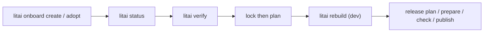
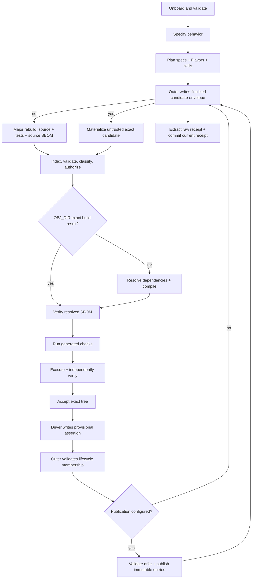
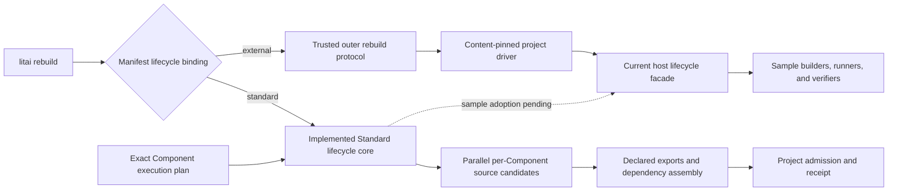
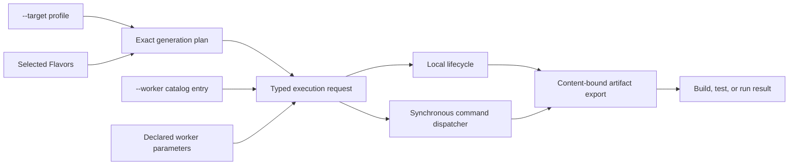
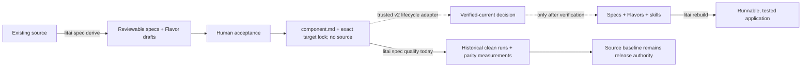
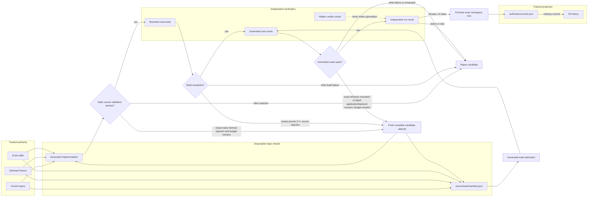
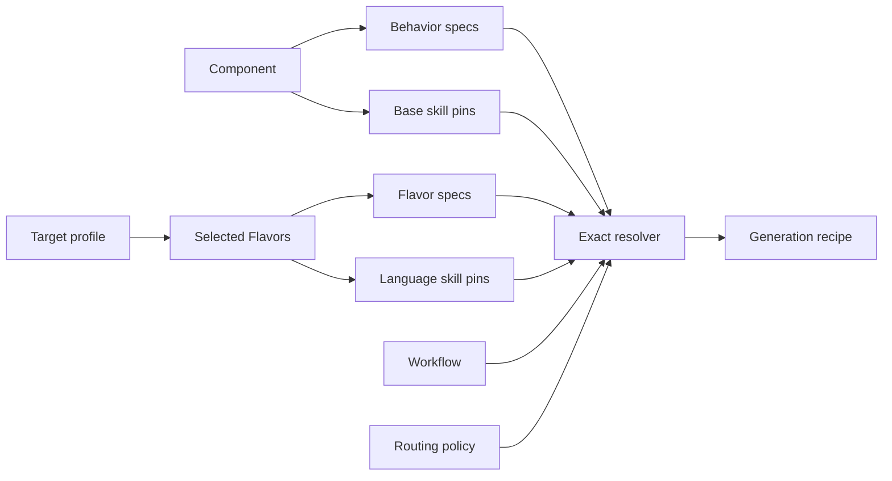
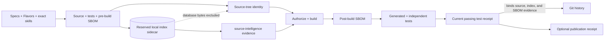

# The framework flow

The operator golden path is adopt, then prove the `dev` workflow, then cut a
release. You do not need every framework contract to start.



Staging and production workflow catalogs exist as opt-in nested directories;
they are not scaffolded into new projects by default and stay organization-
convention-dependent.

The diagram below is the **current external-driver rebuild path**. `litai rebuild`
validates project authority and selects the lifecycle binding declared by the project.
A Standard-bound project runs the provider-neutral in-process lifecycle as an exact
per-Component graph. This repository instead declares a content-pinned external driver
that uses the host lifecycle facade for its existing sample build and test work.



The two implementations should not be mentally collapsed:



The host facade is a compatibility and integration surface, not the architectural
definition of the framework. The Standard core already provides typed per-node
generation, invalidation, source-only scheduling, build-intent, authorization, artifact
assembly, execution, acceptance, accepted-source cache membership, and project-admission
seams. The filesystem composition can now publish a complete accepted-source entry and
restore it in a newly assembled runtime. Restored hits remain untrusted: they receive new
final-path source-intelligence evidence, authorization, build/test/execution, and acceptance, and
are never republished as if newly generated. The ordinary CLI now reaches that
composition for Standard-bound projects. Replacing the remaining sample facade and
completing link/package and root-integration coverage are explicit integration work. A
separate durable Standard checkpoint journal now records each attempt before source
exists and
each later successful or failed node boundary with append-only lineage and CAS-backed
source bytes. Source-generation-internal failures remain in the generation checkpoint
journal. After process restart it
restores only source custody; current indexing, authorization, build, generated tests,
execution, and acceptance always run again. This bounds recovery cost without treating
historical authority as current authority.

If a flow diagram, tutorial, or tool presents a different order, it should explain why.
This is the repository's golden path. The arrows express required dependencies, not a
globally fixed set of implementation stages: a pinned workflow may add or parallelize
work where those dependencies still hold.

## Target selects intent; worker selects execution

### Explicitly retained source (local development)

For an operator-authorized repair of generated source, the local Standard
lifecycle can review and qualify that exact tree under its existing Component:

```sh
litai rebuild components/example --retained-source path/to/source --retained-source-plan
litai rebuild components/example --retained-source path/to/source \
  --authorize-retained-source sha256:REVIEWED_PLAN_ID --allow-host-execution
```

Use the same project, target and Flavor selectors in both commands. The review
identity binds exact UTF-8 file bytes, the current Component lock, project
authority and target. The source directory is placed under the normal `source/`
workspace envelope without rewriting its bytes. It must already contain valid,
current test metadata and source SBOM; stale metadata is rejected, not repaired.
No model is invoked, no specifications are inferred, and the input is never
edited. Current dependency, payload, source/resolved SBOM, build, test, execution,
independent acceptance, packaging and cleanup gates remain mandatory.

This path supports one locked Component, without separately materialized binary
assets, on the local target. It rejects links, nonportable paths and oversized
or non-UTF-8 input. Keep interpreter caches outside the reviewed source tree.
Retained provenance is distinct from model generation. Retained runs do not
restore checkpoints or prior source, and their checkpoints cannot become
ordinary generated-source inputs. Accepted cache entries remain bound to the
retained review identity rather than a regenerative source key. A passing run
does not establish regenerative equivalence. `--update-receipt` still requires
the complete Standard lifecycle to pass; the read-only plan grants no admission.

### Target and worker selection

`litai build`, `litai test`, and `litai run` keep two independent choices explicit.
`--target NAME` resolves the target profile and selected Flavors used to derive source.
`--worker ID` resolves the private execution endpoint used for lifecycle work. Omitting
`--worker` selects the exact implicit local worker.



Local, synchronous `command`, and bounded SSH workers implement this single-component
lifecycle. SSH transfers one request-bound source archive into an attempt-scoped
workspace, verifies its accepted manifest and transport bytes, runs the installed
Standard receiver, and retains accepted artifacts in the worker CAS. Before any attempt
cleanup, the receiver emits a digest-bound manifest and deterministic bundle containing
the available source, object, artifact, receipt, lifecycle-result, and redacted failure
evidence. The coordinator downloads that bundle, verifies its outer digest, embedded
manifest, complete path set, per-file sizes/digests/executable intent, and then imports
the bytes into its own content-addressed evidence root. Only that imported custody can
form the per-cell receipt; a worker-local path cannot. The coordinator then acknowledges
the exact manifest and bundle identities, after which bounded idempotent worker cleanup
may run. Transfer or acknowledgement failure leaves the lifecycle failed closed and the
attempt available for retry. Archive
executable intent remains part of the accepted manifest even on Windows, where the
filesystem cannot reproduce POSIX mode bits; content and path drift still fail closed,
while POSIX materialization reapplies only canonical `0644` or `0755` modes.

A worker that lacks the project's exact Standard distribution is not authorized to use
an ambient installation or package index. The coordinator first exports a target-specific
binary dependency closure:

```console
litai worker wheelhouse export \
  --framework-wheel dist/literate_ai-0.3.0-py3-none-any.whl \
  --distribution-identity sha256:<project-pinned-installed-payload> \
  --platform manylinux_2_17_x86_64 \
  --python-version 3.12 --implementation cp --abi cp312 \
  --output _build/worker-wheelhouse-linux
```

After staging the complete output directory, invoke:

```console
litai worker bootstrap \
  --wheelhouse worker-wheelhouse-linux \
  --manifest worker-wheelhouse-linux/worker-wheelhouse.json \
  --closure-identity sha256:<exported-canonical-manifest> \
  --distribution-identity sha256:<project-pinned-installed-payload> \
  --install-root "$HOME/.local/share/literate-ai/venv" \
  --replace-existing
```

Use `--platform win_amd64` for the corresponding Windows export. The SSH receiver
discovers the conventional isolated root on POSIX and its `Scripts/litai.cmd`
equivalent on Windows. The manifest identity binds target selectors and every wheel's
filename, distribution name/version, size, SHA-256, and declared requirements. The
project pin continues to bind only Literate AI's logical installed payload.
Worker bootstrap does not pin a companion indexer when
a worker will run opted-in source-intelligence commands; it is not part of the
required bootstrap.

Bootstrap verifies the canonical manifest and every wheel before creating a movable
no-index installation, invokes pip only with the verified wheelhouse, verifies every
installed RECORD, and records both identities before atomic activation. Existing
mismatched environments fail closed unless the operator explicitly supplies
`--replace-existing`; replacement keeps the old directory until the verified new
environment is ready and rolls back if activation fails. A coordinator may upload the
stdlib-only
`literate_ai.remote_worker_bootstrap` module when the compatible verb is not installed;
this is a fixed capability, not arbitrary remote shell. Worker secrets
enter only through declared environment bindings. The request, worker identity,
non-secret parameters, artifact export, and lifecycle result are content-bound evidence.

There are only two authoring directions to remember. The forward path is the normal
product lifecycle. The inverse path is an onboarding tool for an existing codebase. It
can produce a complete, reviewable specification project today, but release authority
stays with the original source until a future lifecycle-backed verifier proves the
replacement:



`litai spec derive --translator coding-cli --allow-model-egress` is the semantic inverse
path. It inventories an inert classified mirror, invokes one exact
language-conversion skill and coding-agent call per detected language, and preserves a
complete versioned call journal. It never executes the analyzed source. The separate
qualification verifier may execute the exact baseline only after forward generation and
only with explicit host authorization. See
[source to specification](source-to-specification.md) for the promotion workflow.
Current qualification writers use v2 wire schemas, but their evaluator is deliberately
the historical v1 measurement model: every result carries
`qualification-v2-required`. Current qualification records persist separate
`claimed_authority` and `effective_authority` fields: a historical producer claim may
say `specification`, but effective authority is schema-constrained to `source-baseline`.
The local measurement path never creates that projection. A trusted lifecycle adapter
must supply complete typed evidence bound to the exact current Component lock; only the
locked admission service can append the distinct verified-current Component authority
projection and transfer authority.

`litai rebuild` is the public full-lifecycle front door. It delegates the project-specific
work to a manifest-declared lifecycle driver whose sorted implementation files, aggregate
content identity, argument template, allowed environment, timeout, and ordered phases are
project authority. The CLI verifies the driver and project before and after execution,
then validates the provisional assertion, current lifecycle membership, and any outer
publication before it exposes a finalized candidate envelope. Individual `plan`,
`generate`, project, and source-to-specification commands remain useful phase-specific
surfaces. See the
[constraint classification decision](../decisions/0003-constraint-classification.md)
for the line between invariant behavior, current policy, and delivery goals.

## What an application author does

An author has five jobs:

1. Start at the project root `SKILL.md`, keep the linked documentation graph reviewed,
   and keep `litai project validate` green. Validation is non-mutating and does not
   require a source-graph indexer.
   fail-closed only when a project has opted into that provider. `litai build`,
   `litai run`, and `litai rebuild` do not fail closed on a missing or stale
   optional index.
2. Describe observable behavior and known acceptance examples in OpenSpec.
3. Declare the Component's logical entrypoint and variation slots.
4. Choose concrete Flavors, such as macOS + C++, Linux + Python, standalone Rust, or
   Rust backend + JavaScript frontend. The Component and those Flavors select their
   exact specification-to-source skills.
5. Inspect the resolved plan, run the full rebuild, and inspect the built result and
   provenance. After a complete passing test run, replace and commit the one current
   project receipt; a failure or skipped test leaves the prior receipt untouched.

The Component remains a description of the application. It does not need to embed model
commands, compiler flags, cache algorithms, security decisions, or publication logic.

For a project whose lifecycle driver accepts one Component, the practical commands are:

```console
litai project source-intelligence sync
litai project validate
litai lock path/to/component --target linux-host --flavor=+flavor://literate-ai/lang-cpp --flavor=+flavor://literate-ai/os-linux
litai plan path/to/component --target linux-host --flavor=+flavor://literate-ai/lang-cpp --flavor=+flavor://literate-ai/os-linux
litai rebuild path/to/component \
  --project . \
  --runtime-root /tmp/generated-app \
  --candidate-receipt /tmp/generated-app-receipt.json \
  --flavor=+flavor://literate-ai/lang-cpp \
  --flavor=+flavor://literate-ai/os-linux \
  --allow-host-execution
litai project test-receipt update /tmp/generated-app-receipt.json --project .
```

Use `.` instead of a Component when the pinned driver has project scope, as this
repository does. `litai rebuild` compiles and executes generated host code, so it fails
without the explicit acknowledgement. It writes but never commits the external
finalized candidate envelope. The separate `update` command validates that envelope
and performs the policy-gated raw-receipt replacement;
the user or CI decides whether to commit it.

Fresh generation is a clean `major-rebuild`: a new empty output receives the complete
implementation, `source/tests/manifest.json`, and
`source/.literate/sbom.cdx.json`. After full acceptance it may enter the derived
`BUILD_DIR` cache, never an authority catalog. Exact `OBJ_DIR` artifacts may bypass
compilation while all tests and execution still run. `litai
generate` exposes only that source-generation phase. For this repository's complete
compile-and-run matrix, use `litai rebuild .` or the `make samples` convenience target.

## What the framework does

| Stage | Plain-language question | Durable result |
| --- | --- | --- |
| Onboard | Which project contract and authority boundaries apply? | Validated project root, provider-neutral agent skill, and reviewed documentation graph |
| Specify | What must the application do? | Content-identified behavior and acceptance contract |
| Plan | Which Flavors, skills, workflow, routing policy, model mappings, and lifecycle will apply? | Verified, inspectable generation preflight |
| Resolve source cache | Is there an exact reusable result for this request? | Zero or one structurally verified candidate; still acceptance-untrusted |
| Generate or materialize | What complete source tree implements that recipe now? | Coding-CLI implementation or immutable cache tree, plus current tests and the pre-build SBOM |
| Derive source intelligence | What symbols and relationships does the configured provider infer for this exact generated tree? | Detached source-tree-bound evidence when a provider is selected |
| Validate source and authorize | Is this exact tree internally valid, is every manifest/lock/import represented by its source SBOM, and is it allowed to build? | Dependency admission, findings, classification, and expiring build authorization |
| Compile | Does the selected host toolchain produce the requested artifact? | Bytecode, native executable, checked script bundle, or composite artifact with build provenance |
| Verify dependencies | What exact direct and transitive binary closure did the build resolve? | Strict CycloneDX 1.7 post-build SBOM bound to the managed Component graph |
| Test generated | Does every admitted generated case pass against that exact artifact? | Suite-, source-, and artifact-bound case results; failure prevents workspace preparation and commit |
| Verify independently | Does the candidate artifact satisfy the verifier-only known result contract? | Pinned-oracle and post-build entropy results with typed observation requests and execution authorizations |
| Accept | Which generated tree became the workspace truth? | Atomically committed, content-identified source tree |
| Record | Which exact all-passing result is current for this complete project authority revision? | One canonical replaceable receipt; Git retains earlier committed versions |
| Publish | Should an immutable result leave the local cache? | Exact policy-authorized publication manifest and destination record |
| Import | Is this published result currently trusted for this local destination? | Exact local import policy decision, authorization, and receipt |

At the new per-node boundary, “generate” has a deliberately narrower meaning. A
successful node returns one immutable `GeneratedSourceCandidate`, its
`SourceGenerationProvenance`, and an explicit runtime observation. It has not indexed,
classified, authorized, built, tested, executed, accepted, admitted, or published that
candidate. The scheduler may run independent nodes concurrently, but retains the full
output for each successful node so later stages do not reconstruct evidence from
summaries.

After all nodes terminate, the Standard core creates one canonical membership table.
Its Component set must equal the execution-plan set, its cache-decision set, and its
lifecycle-result set exactly. Successful admission produces a typed aggregate receipt
over that same membership identity and ordered result identities. A failed run retains
the complete table for diagnosis but cannot receive admission or a receipt.

A failure stops at its stage. The one repository-specific exception is the sample
driver's bounded replacement pilot. It admits exactly four categories: a static Bzlmod
source rejection with an exact terminal `validate` event, matching
`DependencyObservationError`, generated tree/source-bundle/suite identities, one code
from the closed finite allowlist, and no admitted lifecycle result; an exact terminal
`test-generated` behavior mismatch with complete run/build/suite/result bindings; an
application/backend `host_execution.nonzero_exit` occurring only during a
generated implementation case, with a nonzero integer return code and exact stdout and
stderr digests; or an exact terminal C++ generated-source rejection after validation,
classification, and authorization. The latter must have exact generated
tree/source-bundle/suite identities,
no build output or downstream step, and an event-matching
`builder.cpp_generated_source_rejected` `BuildError`. The C++ builder emits that code only
when the candidate compile/link fails but a second compile-and-link canary succeeds with
the same pinned toolchain. A failed canary remains terminal
`builder.cpp_compile_failed`. Python, Rust, JavaScript, generic native, Bazel
build/resolve/analyze, toolchain, authorization, other dependency, malformed-suite, and
independent-verifier failures remain fail-stop. So do execution timeouts, launch or
authorization failures, invalid output, and missing or malformed process evidence. An
unknown Bzlmod code, resolver or evidence failure, toolchain/framework failure, or any
failure after a lifecycle result is admitted also remains terminal. An
admitted failure discards the whole candidate and repeats the same recipe in a fresh
empty root, for no more than three total attempts. No prior source, generated
expectation, or verifier-only fact is feedback to the next coding-CLI call. A repair
receives only the prior attempt's sanitized typed rejection record, never its source tree
or private acceptance values. The framework does not quietly select another
Flavor, source revision, or privilege level. A pinned routing policy may permit model
fallback, but the chosen route and fallback decision are recorded. Test receipt
candidates are stricter still: the contract permits only a non-empty run with every test
passed and none failed or skipped.

## Three test artifacts, three jobs

The word “test” crosses three trust boundaries. Keeping them separate prevents a model
from grading its own work and prevents a tracked test tree from becoming stale source
authority.



The generated suite is a current-state check derived during the same rebuild as the
implementation. It must cite current non-acceptance specification documents, cover
example, boundary, and invariant cases, and use arguments distinct from the visible
acceptance interface. It is useful implementation evidence, but it is neither durable
project source nor the verifier's acceptance oracle.

An eventually passing sample execution records its total attempt count and an ordered
list of versioned rejection records. Build and generated-test mismatch rejections carry
a bounded, redacted `diagnostic_excerpt`; no other rejection carries raw diagnostic
text. All four kinds bind the failed run and generation-stage output. A validation
rejection adds its allowlisted code plus candidate-tree, source-bundle, and
generated-suite identities and proves that no lifecycle step was admitted. A behavior
mismatch additionally
binds its source bundle, artifact, generated suite, case, and expected/observed result
identities. An application nonzero record binds the same built subject plus its case,
expected-result identity, application/backend role, `host_execution.nonzero_exit`,
nonzero return code, and stdout/stderr digests. A build rejection instead binds its
candidate-specific `BuildError` code, generated tree, source bundle, and generated suite
and proves that no build result existed. Today
that code is only `builder.cpp_generated_source_rejected`, backed by the successful
same-toolchain canary.
Exhaustion writes the compact
`literate-ai/generated-candidate-attempts@1` envelope, including all three rejection
records and its own content identity, under the external attempt root before returning a
typed failure. Rejected candidates are never admitted to workspace or source cache. The
compact Git receipt retains the final report identity rather than rejected source or
diagnostic text.

The verifier-only oracle remains outside the generation closure. For a
`portable-application`, `verification/acceptance/<component>.json` keeps the existing
`literate-ai/component-acceptance-oracle@1` exact JSON argument/result cases. A
`persistent-service` uses the distinct
`literate-ai/persistent-service-acceptance@1` document at the same verifier-owned path:

```json
{
  "schema": "literate-ai/persistent-service-acceptance@1",
  "specification_set_identity": "sha256:<locked-specification-set>",
  "process": {
    "arguments": ["--host", "127.0.0.1", "--port", "{port}"],
    "environment": {"SERVICE_BASE_URL": "{base_url}"},
    "startup_timeout_seconds": 30,
    "timeout_seconds": 120,
    "shutdown_timeout_seconds": 5,
    "stdout_limit_bytes": 1048576,
    "stderr_limit_bytes": 1048576
  },
  "readiness": {
    "path": "/healthz",
    "expected_status": 200,
    "expected_text_contains": ["ready"],
    "timeout_seconds": 2,
    "response_limit_bytes": 4096
  },
  "requests": [
    {"path": "/v1/status", "expected_json": {"state": "ready"}},
    {
      "path": "/v1/events",
      "expected_headers": {"Content-Type": "text/event-stream"},
      "expected_sse_events": [{"event": "state", "data": "connected"}]
    }
  ]
}
```

A `kind: library` uses `literate-ai/library-acceptance-oracle@1` at that path.
The document binds the exact specification-set, public-interface, and import-surface
identities plus a sibling verifier harness by SHA-256. Its canonical cases name a
provided capability, arguments, and the exact expected result. The harness runs outside
generated-source custody against the sealed directory package and must emit one
`literate-ai/library-acceptance-results@1` observation per declared case. Python and
JavaScript load the exact packaged modules with ambient package paths removed; Rust
compiles the harness as a separate offline Cargo consumer using the sealed package as a
path dependency. A stale binding, undeclared capability, missing or extra case, changed
harness, escaped import, result mismatch, or package mutation fails closed.

The verifier substitutes only `{port}` and `{base_url}`, starts the packaged executable
with its locked execution command, retries readiness until the startup deadline, then
performs the requests in order. Requests support `GET`, `POST`, `PUT`, `PATCH`, `DELETE`,
and `HEAD`, optional string headers/body, exact status and JSON, exact response headers,
contained text, and an expected SSE event prefix (`event`, `data`, `id`, and `retry`).
Every request, response, process, startup, shutdown, stdout, and stderr bound is validated
against framework maxima. The child receives a loopback URL but this is process limiting,
not network sandboxing. The verifier sends graceful termination and forcibly terminates
the process tree after the shutdown deadline, then rechecks immutable package custody.
This supports one HTTP process that may internally coordinate workers; it does not yet
orchestrate multiple separately packaged processes, WebSockets, arbitrary streaming
protocols, TLS, or remote endpoints.

A project test runner produces a bounded provisional assertion whose raw receipt binds the complete
authority-review identity,
tested subject, compact versioned suite reference, positive all-passing test count,
normalized result, and an evidence-kind-to-identity map. The project policy independently
pins the admitted suite ID/version, exact runner identity, required evidence kinds, and
minimum count. A full rebuild policy also requires `source-sbom`, `resolved-sbom`, and
`source-cache-lifecycle` evidence. The last role deterministically joins every
derivation key to current build/test/acceptance/workspace/index/SBOM evidence. The outer
CLI exposes the distinct finalized envelope only after lifecycle and publication
validation. `litai project test-receipt update` accepts only that envelope and atomically
replaces the configured current raw receipt. The command does
not authenticate external evidence or commit Git: this remains a local Git assertion,
not remote attestation. The user or CI commits the replacement so ordinary Git history
carries prior passing states without an append-only log in the project.
The release-only `project test-receipt require-current` gate fails when policy is
unconfigured or the committed receipt is missing, stale, or mismatched; general project
validation still permits that onboarding state.

The phase-specific `litai generate` CLI stops at the source-generation boundary and
does not choose a project's build/test adapter or claim full lifecycle acceptance.
`litai rebuild` invokes the exact
content-pinned project driver instead. This repository's sample host driver
executes every generated case against the exact built artifact before preparing or
committing the tree, then runs the separate hidden-oracle and post-build cases as a
second pre-promotion gate. Only both passing results permit workspace preparation and
commit. A fully passing run can
emit the compact candidate with `--test-receipt`; generated expectations never become
the verifier's answer key.

## Where skills fit

The five generation inputs have deliberately small, non-overlapping jobs:

| Input | It decides | It cannot decide |
| --- | --- | --- |
| Base specification | Observable application behavior | Language technique or model |
| Selected Flavors | Target-specific requirements | Weakened base behavior or policy |
| Pinned skills | How to plan and implement those requirements | New behavior, target, model, or privilege |
| Workflow | Which stages run and in what dependency order | Their provider/model endpoint |
| Routing policy | Which eligible model handles each model stage | Behavior or lifecycle authorization |

Flavor and skill resolution is easiest to read as a merge of exact authorities:



The resolver verifies every content digest and skill dependency before producing the
recipe. A target selects Flavor requirements; it does not grant privileges or rewrite
the Component's behavior.

The project-level `SKILL.md` onboards agents but never enters a generation recipe. The
Component content-pins its general planning and implementation manifests in
`authoring_inputs`. A selected language Flavor can pin an additional language-specific
manifest. Resolution keeps Component skills first, then selected Flavor skills,
verifies exact dependency identities and order, and puts every skill hash into the
generation recipe.
Those same hashes appear in readiness evidence, the coding-CLI request, and the result
report. Skill content drift therefore fails before the coding CLI starts.

The framework does not discover ambient skills from the selected coding CLI. It sends
only the exact resolved manifests and their instructions. A skill is guidance inside
the recipe, not permission to override specifications, Flavors, workflow, routing,
validation, security, or host-execution policy.

## How to determine the flow from the implementation

Use state transitions, not the amount of frontmatter in `component.md`:

1. The Component and selected Flavors resolve exact skill pins into the recipe; missing,
   changed, duplicated, or misordered skills fail before generation.
2. The Component pins a workflow and routing policy. Their exact bytes compile into the
   model stages and guarded lifecycle order. The concrete route is selected only after
   generation chooses a coding CLI, then recorded in generation provenance.
3. `literate.project.json` pins the complete lifecycle driver. The driver must declare
   the minimum ordered phases from compose/cache/generate through independent acceptance
   and candidate-receipt production. Optional package, source-cache publication,
   artifact publication, and deployment phases are explicit extensions.
4. Concrete lifecycle adapters define the side effects at validation, authorization,
   build, workspace acceptance, and event-storage boundaries.
5. The generation orchestrator interprets that plan and records each transition; it
   does not replace the pinned policies with hard-coded routing or stage definitions.
6. The sample host runner adds executable acceptance: it validates the exact execution
   grant at its process boundary, starts the built result after explicit user
   acknowledgement, then compares its JSON output with verifier results independently
   derived from the specification. One invocation is created from fresh entropy only
   after the artifact exists, so checked-in examples cannot be the whole implementation.
7. A project test adapter may construct only a passing provisional assertion. The outer
   CLI validates exact lifecycle membership and configured side effects, then crosses
   the supported API/TCB boundary by writing the finalized envelope. The receipt CLI
   accepts only that envelope, validates its raw project-authority/result bindings, and
   performs an atomic raw-receipt replacement, but creates no Git commit.
8. Publication is a separate explicit operation; it is not an automatic side effect of
   a successful build.

The durable identities form a short provenance chain rather than an unstructured log:



Each arrow means the next record binds the relevant earlier identity. Operational paths
and timestamps may also be recorded, but they do not replace the semantic content
chain.

This distinction keeps the diagram stable even when implementations change. A product
may add approval UI, remote caches, or package formats without changing the author's
basic story.

After locking, each selected language and platform Flavor contributes one small,
machine-validated Standard command profile; a selected build-system Flavor may contribute
one more. These profiles describe entrypoints and artifact shape without embedding host
paths. The Standard projector resolves their declared tools on the current host and
creates exact shell-free build, generated-test, and smoke-execution commands. Generated
runnable artifacts expose `--litai-test` for current generated cases and `--litai-smoke`
for one real application invocation. Bazel projects additionally expose the portable
lifecycle target `//:litai_artifact`.

## Read deeper only when you need to

- To author an app, continue with [core concepts](concepts.md),
  [the project layout](project-layout.md), [Flavors](flavors-and-targets.md), and
  [samples](samples.md).
- To add conversion guidance, read [skill architecture](../architecture/skills.md).
- To select coding agents and models, read
  [model groups and generation](models-and-generation.md).
- To integrate lifecycle ports, read the
  [neutral domain model](../architecture/domain-model.md).
- To integrate environment preparation or dependency evidence, read the
  [CycloneDX SBOM and dependency graph](../architecture/sbom-and-dependency-graph.md).
- To change trust or execution policy, read
  [source trust and build security](security.md).
- To decide whether a rule is an invariant, a current default, or a future gate, read
  [constraint classification](../decisions/0003-constraint-classification.md).

Those documents explain mechanisms. This page remains the high-level product flow.
