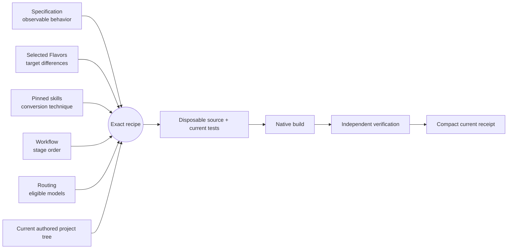
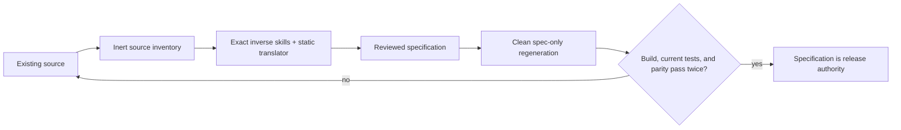
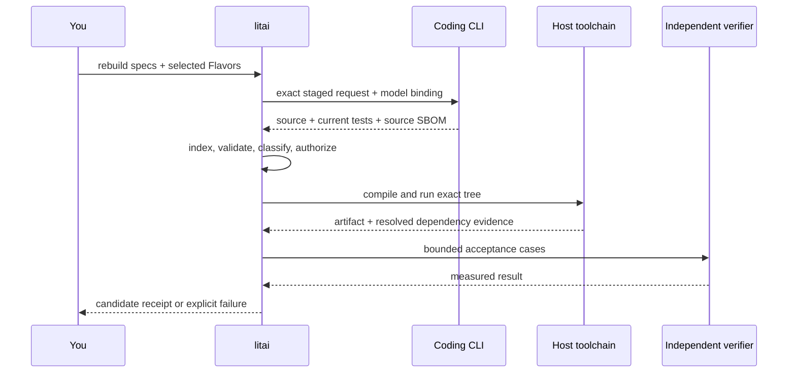
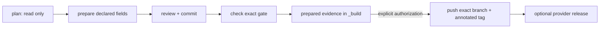
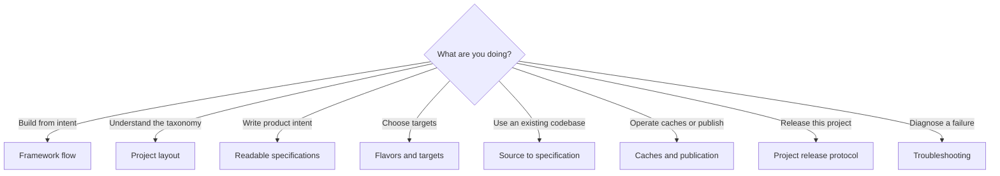

# Getting started

Literate AI treats the specification as durable project authority and generated source
as a disposable, verifiable build artifact. The shortest useful introduction starts
from an installed release wheel, checks the host, and follows one reviewed onboarding
plan into either a new project or an adopted source tree.

Prefer to watch first? The 13:38 onboarding film,
[It Builds. Can We Ship It?](https://github.com/jordanhubbard/literate-ai/raw/main/media/courses/sam-meets-literate-ai/video/sam-meets-literate-ai.mp4), follows a real
greenfield session and a real TinyXML2 adoption. The
[instructional courses](../courses/README.md) break the same ground into short lessons:
[your first greenfield project](../courses/01-greenfield-first-project/01-greenfield-first-project.mp4),
[using machines you already have](../courses/02-use-your-existing-machines/02-use-your-existing-machines.mp4)
and
[adopting an existing project](../courses/03-adopt-an-existing-project/03-adopt-an-existing-project.mp4).
Each has SRT and WebVTT captions.

## The five-minute mental model

Five inputs determine generation. None can quietly take over another input's job.



The Component says what the application does. Flavors say which variation is wanted,
such as Linux, Python, JavaScript, Rust, or Bazel. Skills tell the coding agent how to
perform a conversion without inventing product requirements. The workflow orders the
work, and routing chooses an eligible model. Exact identities make the resulting plan
inspectable before any model is called.

The reverse direction has an equally explicit boundary: existing source can be
translated into a reviewed specification and accepted as intent, but the original
source stays release authority until repeated clean spec-only regenerations build, test,
and match it through an independent verifier.



## 1. Prepare the host

You need Python 3.11 or newer, Git, and one authenticated coding CLI: Codex, Claude,
Cursor Agent, or OpenCode. The selected language and build Flavors add their own compiler or runtime
requirements at planning/rebuild time.

Download the wheel asset from the [latest published release](https://github.com/jordanhubbard/literate-ai/releases/latest), then
install that exact wheel into a virtual environment. This is the stranger path exercised
by the release gate; it neither imports this checkout through `PYTHONPATH` nor depends
on maintainer bootstrap state.

```console
python3 -m venv .venv
. .venv/bin/activate
python -m pip install path/to/DOWNLOADED_WHEEL.whl
litai doctor
```

On Windows, activate with `.venv\Scripts\activate` and use the same `python -m pip`
and `litai doctor` commands. Doctor reports platform-resolved configuration paths,
native tools, and coding-CLI authentication without requiring a project.

In PowerShell, activate with `.\.venv\Scripts\Activate.ps1`. Activation is
optional: invoke `.\.venv\Scripts\python.exe -m pip install path/to/DOWNLOADED_WHEEL.whl`,
then `.\.venv\Scripts\litai.exe doctor` to check the host.

For installation from a clean source checkout on Windows, the native entry point
does not require GNU Make to start:

```powershell
python scripts/install_litai.py
```

This checks the declared Windows prerequisites before installing the private
runtime and launcher. It asks before installing missing native tools. Run it in
your regular PowerShell session with access to your installed tool directories;
an inaccessible declared search directory produces a host-install diagnostic.
Contributor validation still requires the documented GNU Make toolchain.

Source builds embed the exact Git revision and repository origin. Recognized GitHub
HTTPS, SCP-style SSH and `ssh://git@` aliases use one HTTPS origin spelling in newly
built wheels, independent of a trailing `.git` or default transport port. Other
repositories and non-default ports remain distinct. This does not rewrite an
installed wheel or an existing Standard pin: recover a different installed payload
through reviewed Standard rebind, or reinstall the exact wheel that supplied the pin.
Transport credentials remain operator configuration; an explicit `--from` can select
the repository transport when creating or adopting a project.

To create a project, inspect the plan before applying it:

```console
litai onboard create path/to/my-project
litai onboard create path/to/my-project --apply --acknowledge
cd path/to/my-project
litai status
litai project validate
```

To adopt an existing source tree, the same plan/apply contract shows detected Flavors,
the quarantine map, retained runners, Gitlink blockers, and the initial `wrapped`
authority stage:

```console
litai onboard adopt path/to/existing
litai onboard adopt path/to/existing --apply --acknowledge
cd path/to/existing
litai status
litai project test-receipt run-retained /tmp/retained.json --project .
litai project test-receipt update /tmp/retained.json --project .
litai project convert-stage advance --to retained --project .
litai status
```

Use a platform-appropriate candidate path instead of `/tmp/retained.json` on Windows.
The transition is explicit: `wrapped` → `retained` → `drafted` → `qualified`.
Original source remains release authority until regenerative qualification is current;
onboard never treats a wrapped repository as specification-authoritative.

### Plan a Git-submodule orchestration project

To preserve independently owned child repositories in place, use the explicit
read-only orchestration profile. Create `orchestration.json` with the dependency
relationships you intend the root to own, using exact Gitlink paths:

```json
{
  "schema": "literate-ai/orchestration@1",
  "relationships": [
    {"consumer": "services/app", "provider": "libraries/core"}
  ]
}
```

Use an explicit empty `relationships` list when there are no dependencies. Unknown
children, duplicate/self relationships and extra fields are rejected. These edges
declare dependencies; they do not establish execution order, inherited catalogs or
proven compatibility. The declaration is limited to 256 KiB and 1,024 relationships.

```console
litai onboard orchestrate plan path/to/superproject --declaration orchestration.json
litai onboard orchestrate check path/to/superproject --declaration orchestration.json --expected-plan-identity PLAN_ID
```

Replace `PLAN_ID` with the exact `plan_identity` from the reviewed plan. Declaration
paths are relative to the invoking working directory. The identity binds exact
declaration bytes, `.gitmodules`, all direct-child Gitlink pins and each observed
child checkout revision; changes require a fresh review. `.gitmodules` must match
its indexed bytes. Inspection does not run Git clean/smudge filters to hide drift.

The plan separately reports `repository_authority` and its content identity. This
is the typed `repository_orchestration` binding admitted by the modern project
manifest: exact configured names, paths, URLs, branches and Gitlink commits, the
`.gitmodules` identity, and declared dependencies. It excludes initialized state
and local child HEAD; those observations still bind the reviewed plan. Root catalog
and declared output paths cannot overlap child paths. Omitting the binding leaves
ordinary project serialization and identity unchanged; legacy manifests do not admit
it. This contract alone does not initialize or verify a superproject's current pins.

Both commands leave repository files, Git metadata and host configuration unchanged;
they do not fetch or run child code. `check` fails on an invalid or stale identity.
The nested reviewed refresh commands below separately prove remote publication; a
current inventory check does not qualify builds or child acceptance. Ordinary
`onboard adopt` behavior is unchanged by selecting this separate command.

To initialize root authority, review a distinct initialization plan with an explicit
project ID and semantic version:

```console
litai onboard orchestrate plan path/to/superproject --declaration orchestration.json --project-id super --project-version 1.0.0
litai onboard orchestrate check path/to/superproject --declaration orchestration.json --project-id super --project-version 1.0.0 --expected-plan-identity INITIALIZATION_PLAN_ID
litai onboard orchestrate initialize path/to/superproject --declaration orchestration.json --project-id super --project-version 1.0.0 --expected-plan-identity INITIALIZATION_PLAN_ID --acknowledge
```

Use the exact identity from this new plan, not the inventory-only plan above. The
plan binds every proposed path and byte identity, project ID/version, preserved root
agent shims and current repository observations. Both project options must be supplied
together. Planning and checking remain read-only; only acknowledged initialization
writes files.

Initialization creates seven files: root `SKILL.md`, `PROJECT.md`, and
`literate.project.json`, plus canonical lineage and orchestration documentation/skill
files under `.literate`. Existing initialization targets, portable aliases and indirect
ancestors refuse. Valid existing root agent shims are preserved; shim-shaped content
inside declared child repositories remains child authority. Child Gitlinks, source,
Git metadata and release authority are neither moved nor rewritten.

The new `.literate` directory holds exclusive staging. Files pass canonical validation
before publication; no-clobber publication writes the root manifest last. On failure,
rollback removes only unchanged additions owned by this operation. Concurrently
changed or replaced files are preserved and reported as `orchestration.rollback_incomplete`;
inspect them before retrying. A successful result may likewise list staging paths in
`cleanup_retained` that need inspection. Do not delete retained paths blindly.
These checks detect concurrent changes but do not isolate another same-user process.

Success establishes root authority, not child acceptance, current-pin verification,
remote publication, build execution or release readiness. It does not fetch or run
child code, and does not itself imply permission to refresh or re-pin children.

To refresh an initialized root, write an exact canonical request and review a fresh
publication-bound plan:

```json
{"schema":"literate-ai/orchestration-refresh-request@1","targets":[{"commit":"0123456789abcdef0123456789abcdef01234567","path":"libraries/core"}]}
```

```console
litai onboard orchestrate refresh plan path/to/superproject --request refresh.json
litai onboard orchestrate refresh check path/to/superproject --request refresh.json --expected-plan-identity REFRESH_PLAN_ID
litai onboard orchestrate refresh apply path/to/superproject --request refresh.json --expected-plan-identity REFRESH_PLAN_ID --acknowledge
```

Use the same optional `--repository-fetch-*-seconds` values for every operation.
Planning/checking write nothing in the root or children. Apply recomputes the complete
plan, refuses dirty, stale or unpublished inputs, installs verified objects
additively, updates child source and Git state, updates the root index/lock, and
publishes the root manifest last. A no-op reports no writes. Child acceptance remains
`not-qualified`; retained crash recovery data cannot be replayed as authority. A
changed manifest also makes the previous documentation-review marker stale. Review
the new root authority and run `litai project documentation-review PATH --record`
before planning another refresh.

Inspect the initialized root's declared authority with:

```console
litai graph --project path/to/superproject --format json
```

The graph exposes the orchestration binding, each independent child repository's
exact configured pin, and each declared relationship. Text, Mermaid, DOT and SVG
exports also include the full commit IDs. Consumer/provider role edges point to
relationship nodes; even cyclic declarations remain declarations, not an inferred
build order. Pins report `verification: not-checked`: this projection reads root
authority only, without inspecting child catalogs, checking Git state or proving
publication. Child paths use `gitlink_path`, not a source-excerpt `path`, so HTML
source inspection also leaves child files alone. Component generation commands
do not acquire authority to build children from this graph.

After initialization, lock and inspect the exact root:

```console
litai lock path/to/superproject
litai lock path/to/superproject --check
litai plan path/to/superproject
litai verify path/to/superproject --gate locks
```

Root `lock` writes `.literate/repository.lock.json` and resolves any root-owned
Component locks. It never locks child catalogs. `--check`, `--diff`, `plan` and
`verify` do not write files or invoke a model. Planning requires both the repository
lock and all root-owned Component locks to be current; verification checks the
repository lock and existing committed Component locks. An empty orchestration root
needs no placeholder Component.

The repository lock binds reviewed root authority, its graph and declared child
pins. A changed Git index or `.gitmodules` refuses locking instead of silently
refreshing those declarations. Plans keep local checkout observations separate from
the portable lock identity. Neither a current lock nor a plan establishes child
acceptance, publication, or execution order. Reviewed refresh/re-pin remains pending.

Pass model, recipe, large-review and matrix-cell options to an individual Component,
not an orchestration root. Flavor/target selectors at a root require root-owned
Components. Root commands suppress implicit host updates, telemetry and MCP/journal
side effects, and reject explicit MCP discovery or debug-file output. Updating several
root locks is not a repository-wide transaction: if a later check fails, inspect the
reported state before retrying; already published Component locks may remain.

### Maintainer checkout setup

From this repository checkout:

```console
make bootstrap
```

That single target chains `make install` (the user CLI under the host-native private
prefix), `make dev-install`, `make tools-install`, and `make skill-evaluator-install`
(a separate ignored managed environment under `_build/python-envs/` plus pinned and
isolated contributor tools), then `make validate` (every current repository gate) —
everything needed for a first-time setup, in one command. Run the five steps separately
if you want to inspect or retry just one of them:

```console
make install
make dev-install
make tools-install
make skill-evaluator-install
make validate
```

`make` discovers the first compatible `python3` or `python` on `PATH` unless `PYTHON`
is explicitly pinned. The install step then validates the tuple-specific native
prerequisite SBOM and asks before using APT, Homebrew, or WinGet for a missing package;
automation opts in with `LITAI_INSTALL_DEPENDENCIES=yes`. Disposable build products go
only under `_build/`.
Installation details, Windows equivalents, the complete conditional tool matrix, and
the recorded Ubuntu bootstrap recipes are in [Installation and first run](installation.md).

Before generation, authenticate the coding CLI on this same machine and user account,
or provide that provider's supported access-token environment. A logged-out agent is a
normal, explicit preflight failure; Literate AI does not silently switch providers.

## 2. Resolve authored intent, then inspect an exact plan

The regenerative round-trip sample is a real batch application with a stable JSON
interface and known results. Choose the Flavor matching the host and one supported
language:

```console
litai project validate
litai lock samples/regenerative-roundtrip \
  --target macos-host \
  --flavor=+flavor://literate-ai/os-macos \
  --flavor=+flavor://literate-ai/lang-python
litai lock samples/regenerative-roundtrip \
  --target macos-host \
  --flavor=+flavor://literate-ai/os-macos \
  --flavor=+flavor://literate-ai/lang-python \
  --check
litai plan samples/regenerative-roundtrip \
  --target macos-host \
  --flavor=+flavor://literate-ai/os-macos \
  --flavor=+flavor://literate-ai/lang-python
```

`component.md` is the complete readable default: frontmatter declares Component
identity, capability contracts, entrypoints, and Flavor slots, while the Markdown body
states observable behavior and acceptance. Omit provider/root fields to select that same
document through `literate-markdown`; split another file only at a real named boundary.
`litai lock` deterministically
resolves those selectors against the current project catalogs without invoking a model.
It writes `component.lock.json` for the selected derivation and a separate target-scoped
resolution audit for rejected candidates. Use `--diff` in review and `--check` in CI;
both are non-mutating. A changed authored input or selected Flavor makes the lock stale.
An unrelated rejected candidate leaves the selected lock and generated-source identity
unchanged, but changes the graph-bound audit; rerun `litai lock` before the lifecycle so
the exact lock/audit pair is current. This deterministic refresh does not invoke a model.

For an existing welded Component, migrate without destroying its rollback path:

```console
litai component migrate path/to/component --check
litai component migrate path/to/component
litai component migrate . --check
litai component migrate .
litai lock path/to/component --target host --check
```

Migration creates `component.md` only when no authored document exists, proves the
rendered document round-trips to the projected authoring model, and preserves
`component.json` as rollback evidence. Legacy authoring is deprecated in 0.2.0, the
0.2.x series is its final migration window, and 0.3.0 removes it. Ordinary project
commands reject a legacy-only Component with `project.component_migration_required`;
deleting the new `component.md` therefore returns to migration-required state rather
than silently restoring welded authority. A conflicting existing `component.md` is
reported without changing it. Pointing the command at a canonical project root
preflights every Component and publishes the complete set atomically; if publication
fails, it rolls back only the exact new documents created by that transaction.

Use `+flavor://literate-ai/os-linux` or `+flavor://literate-ai/os-windows` on those
hosts. Replace `+flavor://literate-ai/lang-python` with
`+flavor://literate-ai/lang-cpp`, `+flavor://literate-ai/lang-rust`, or
`+flavor://literate-ai/lang-javascript` to request another complete implementation.
`litai plan` consumes the
current canonical lock for the same target and treats repeated Flavor selectors as
assertions against it. It does not invoke a model or execute generated code. Missing,
stale, target-mismatched, or selector-mismatched locks fail before model egress.

Selectors compose left to right. `+flavor` adds or selects a Flavor and `-flavor`
removes one. A Component or explicitly selected Flavor always outranks a default
preference. Initialized projects select Make; choosing
`+flavor://literate-ai/build-bazel` replaces it for an exclusive build-system slot, and
`-build-bazel` removes that explicit selection before prompt assembly.

## 3. Generate, build, and run a real application

The repository's sample driver is the easiest complete demonstration:

```console
make samples
```

That command performs the live specification-to-source matrix across the current sample
catalog and host recipes: generated tests, compilation, application execution, independent
known-output verification and CycloneDX dependency evidence.
Nothing under a sample's generated `source/` is retained in Git.

Use `make roundtrip-host` for the credentialed forward/inverse language regression on
this machine. Copy the checked-in worker and test examples to the platform-resolved
user configuration paths reported by `litai init`, or name private files with
`WORKER_CONFIG=/absolute/path/to/workers.json` and
`TEST_CONFIG=/absolute/path/to/matrix.json`, before using `make
samples-platform-regression`. Worker assignments are user configuration and are never
repository metadata. A `SAMPLE='glob'` override selects one or
many examples, including `*`. Workers run concurrently. A `working-tree` worker receives
the Git-visible current bytes in an authenticated archive that is completely validated
before materialization. A `git` worker initializes or repairs its persistent object store,
requires its SHA-1 or SHA-256 object format to match the revision, fetches the advertised
ref, proves its exact commit, verifies the commit's digest-bound
guard, and has that guard write exact Git blobs into a new run tree. It does not use
checkout or archive-export semantics. Both paths reject nonportable paths, escaping links,
and implicit submodules. These are separate gates: inverse parity is intentionally
concentrated in representative language samples, while remote fan-out checks portable
forward generation, compilation, tests, and execution without requiring inverse support
from every application and platform combination.

For the entire repository-authorized lifecycle and a candidate current-test receipt:

```console
litai rebuild . \
  --project . \
  --runtime-root /tmp/literate-ai-rebuild \
  --candidate-receipt /tmp/literate-ai-receipt.json \
  --allow-host-execution
```

The explicit acknowledgement is required because this path compiles and runs untrusted
generated source on the host. The command leaves all generated source and artifacts in
the external runtime root. It does not commit the receipt or generated source.



Only an all-passing candidate may replace the tracked receipt:

```console
litai project test-receipt update /tmp/literate-ai-receipt.json --project .
```

Git then carries the succinct history of passing project states. The detailed prompts,
model calls, source identities, indexes, SBOMs, and build evidence stay associated with
the derivation and cache artifacts rather than swelling that receipt.

## 4. Use the lower-level project mutators

```console
litai init path/to/my-project
cd path/to/my-project
litai project validate
```

The primary operator path is `litai onboard`. To call the lower-level conversion
mutator directly instead:

```console
litai init --convert --plan path/to/existing
litai init --convert path/to/existing
```

Then continue the `dev` workflow:

```console
cd path/to/my-project
litai lock --check
litai plan samples/hello-component
litai build samples/hello-component --target host
litai test samples/hello-component --target host
litai run samples/hello-component --target host -- '{"name":"LitAI"}'
litai package plan samples/hello-component --target host
litai package build samples/hello-component --target host --allow-host-execution
litai package verify samples/hello-component --target host
```

The target can already be a fresh `git init` repository and may have an existing root
`README.md`; both are preserved. Existing implementation files are rejected by a
plain `litai init`. Adopt them with `litai init --convert --plan` first, then
`litai init --convert`, rather than an implicit, lossy merge.

The initializer creates the complete literate taxonomy, a provider-neutral root
`SKILL.md`, linked documentation, canonical catalog roots, Python/Make/host-OS plus
pip-wheel starter Flavors, portable generation and package-artifact skills, and one
minimal portable starter Component with its current host lock. Bazel remains an explicit
replaceable build-system Flavor. Use `litai init --empty` when the
framework infrastructure is wanted without that starter. Generated source is still
created only from the Component specification and is not authored into the project.

The hello Component is deliberately executable rather than decorative. With an
authenticated coding CLI and the selected host toolchain, this performs the complete
specification-to-source-to-binary proof, runs generated tests and the application, and
updates the project's succinct passing receipt:

```console
litai rebuild samples/hello-component --project . \
  --allow-host-execution --update-receipt
```

Run the printed `Execute:` command with `{"name":"LitAI"}` as its one argument; the
known JSON result is exactly `{"greeting":"Hello, LitAI!","name":"LitAI"}`. The
installed-project release gate executes that command independently after the lifecycle
passes, so a receipt without a usable artifact is not accepted as the starter proof.

The initialized hello Component also selects `package-pip`. Package planning is
read-only. Package construction deliberately reruns the accepted lifecycle before it
creates a wheel, embeds `component.md` and the resolved CycloneDX SBOM, and retains the
content-addressed batch beneath `_build/packages/`. Verification reopens those retained
bytes independently; publication remains a separate, explicitly authorized release
operation.

The repository runs the same scenario from a temporary prefix and project through
`make installed-project-e2e`; `make install-check` is its fast, non-generative command
contract companion.

```text
my-project/
├── SKILL.md                    agent onboarding authority
├── literate.project.json       project roots, policies, and exact pins
├── components/                 behavior and acceptance specifications
├── flavors/                    OS, language, build, and deployment variation
├── skills/
│   ├── specification-to-source/
│   └── source-to-specification/
├── workflows/                  ordered lifecycle stages
├── routing/                    eligible model decisions
├── docs/                       reviewed explanation and Mermaid diagrams
├── verification/current.json   one compact current passing state
```

Create one readable `component.md` under `components/`, put its behavior and measurable
acceptance in the Markdown body, declare its variation slots, then resolve target
Flavors with `litai lock`. Add layered `literate-markdown` documents only when a real
domain/module/protocol boundary makes the split easier to understand. Review the lock
before using `litai plan`. See
[Writing readable specifications](specifications.md) before splitting a larger design
into files. A full
`litai rebuild` additionally requires a project-authorized lifecycle driver because
build, packaging, deployment, and publication are integration-specific seams. This
repository's content-pinned driver is the executable reference.

## 5. Release one exact project revision

Every initialized project owns `literate.release.json`. The policy chooses canonical
Semantic Versioning by default, names the authoritative version field and mirrors, and
declares the gate, changelog, tag, Git remote, signing rule, and optional provider.
Python distribution projects can deliberately select PEP 440 instead.

Repository governance is separate and per-project under `literate.project.json`'s
`repository_policy`. Its fields name the writable default branch, Free/Pre-release state
and `major.minor` target, merge method and labels, README Release Engineer source,
strict/loose patch authority and loose-mode writers, work queue and sample roots, remote,
and branch-GC retention. See the
[configuration reference](configuration-and-cli.md#repository-policy-configuration) for
the complete field/default table. Repository-specific defaults belong there where
implemented, not in agent instructions.



Save the JSON plan beneath ignored `_build/`, prepare it, review and commit only the
declared changes, then run the policy gate. When the policy names `default_branch`,
`plan` from that trunk cuts a missing `release/<major>.<minor>.x` line at
`prepare`; plan from the existing line for a patch. `check` and `publish` refuse
the default branch.

`main` remains writable for ordinary new work in both Free and Pre-release states.
Pre-release names one `major.minor` target and permits an RC tag only from exact green
`main`. Once `release/<major>.<minor>.x` is cut, only README Release Engineers may merge
its pull requests or create/publish the major or minor release. Patch authority is strict
by default; a loose project may allow a configured writer to use a reason-bearing
break-glass patch only after the fix lands on `main`.

Every pull request body must carry exactly one of:

```text
Literate-AI-Release: 0.8
Literate-AI-Release: none
```

Use the current Pre-release target or `none`; do not rely on branch-name inference.

```console
mkdir -p _build/release
litai --json release plan --bump patch > _build/release/plan.json
litai release prepare _build/release/plan.json
# Review and commit the version and changelog diff.
litai release check _build/release/plan.json
```

Publication is deliberately separate and requires explicit external-write authority:

```console
litai release publish _build/release/prepared.json --authorize-external-write
```

An interrupted publication can be retried only while the checked revision remains
exactly current. The release command reuses matching annotated tags, branch revisions,
and provider releases; it rejects any conflicting external state. Read the
[project release protocol](../architecture/project-releases.md) before changing policy.
LitAI release commands enforce lockdown, but they do not configure forge branch
protection. Mirror the same restrictions in GitHub or GitLab and verify those settings
before claiming forge-side protection is live.

At cycle end, run `litai project peer-work survey --when end`, inspect attached worktrees
and open pull requests, and mark a branch `merged` or reason-bearing `dead` at its exact
head. Run `litai project peer-work gc` as a dry run. Only then use `--apply
--authorize-delete`; stale markers, open reviews, protected/release branches, unmerged
heads, and dirty worktrees or repository state all block collection.

## 6. Know where to look next



- [Framework flow](framework-flow.md) explains the complete golden path and its trust
  boundaries.
- [Project layout](project-layout.md) maps every kind of decision to its owning artifact.
- [Writing readable specifications](specifications.md) separates local product intent
  from shared skills, Flavors, and Component interfaces.
- [Flavors and target profiles](flavors-and-targets.md) covers target composition and
  mutually exclusive selections.
- [Source to specification](source-to-specification.md) covers promotion of existing
  source into reviewed, regeneratively qualified intent.
- [Samples and tutorials](samples.md) describes every executable sample and its diagram.
- [Troubleshooting](troubleshooting.md) maps stable errors to corrective action.
- [Project release protocol](../architecture/project-releases.md) separates version
  preparation, gate evidence, and explicitly authorized publication.

When in doubt, return to the project root `SKILL.md`. It is deliberately the one file
an unfamiliar agent needs to discover the taxonomy, prerequisites, safety boundaries,
and linked project documentation.
