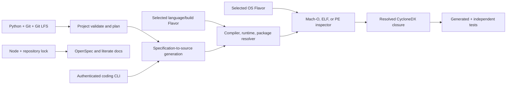

# Installation and first run

New to Literate AI? Watch the [onboarding film](https://github.com/jordanhubbard/literate-ai/raw/main/media/courses/sam-meets-literate-ai/video/sam-meets-literate-ai.mp4) and the
[instructional courses](../courses/README.md) for a guided tour before installing.

## Requirements

- GNU Make and Python 3.11 or newer are the stage-zero requirements for the repository
  convenience target. Native Windows users may invoke the Python installer directly.
- A tuple-specific native package manager: APT for Debian-family Linux, Homebrew for
  macOS, or WinGet for Windows. `make install` verifies its package records and runtime
  probes before changing the CLI environment.
- The package's pinned CycloneDX 1.7 JSON validation and VERS range-validation
  dependencies. `pip` installs them and their Python transitive closure from package
  metadata.
- Node.js is not required to install or import the Python framework.

Every successful initialization returns a
`literate-ai/project-initialization-prerequisites@1` report. It records the Python
runtime already executing `litai` and whether a supported coding CLI is visible on
`PATH`. The coding CLI is
reported but is not required to scaffold a project; it becomes required, and separately
must be authenticated, before model-backed generation or translation. Flavor-specific
compilers, build systems, and package tools remain scoped to the selected lifecycle
operation rather than being installed eagerly by `init`.

## Host preflight matrix

Routed sample workers assume a vanilla operating-system image. First use the
`skills/agent/configure-test-workers/SKILL.md` skill to obtain assignments in a
user-owned local or temporary matrix. `make install` detects the host tuple and reads
its native prerequisite SBOM before creating the CLI environment. Broader sample-worker
toolchains remain a separate worker-capability operation because they depend on the
selected languages, build systems, and accelerators. Python 3.11+ and working SSH access
are launch prerequisites; coding-CLI authentication remains a separate readiness gate.
The bootstrap also attempts NTP synchronization to `time.nist.gov`; a failed or skipped
attempt is recorded in `clock_sync` and does not fail capability readiness.
An absent package manager, noninteractive privilege, package, or credential fails the
worker explicitly.

Only the installed Python package is required for the canonical
project-management path; the
rest become required when the selected operation or Flavor needs them. Explicit
specification/Flavor versions and command pins are authoritative. Without a pin,
Literate AI normally searches compatible commands on `PATH` rather than guessing a
target or silently installing software. Bazel is the deliberate exception: it selects
an exact digest-matching binary from Bazelisk's SHA-addressed cache. Agents must obtain
user authorization before installing
or upgrading host compilers, package managers, and other toolchains. Completing
`make install` is standing authorization to replace that same prefix-installed
`litai` from GitHub Releases; see below.

| Dependency | Required for | Preflight and failure behavior |
| --- | --- | --- |
| Python 3.11+ | Framework CLI | Honor explicit `PYTHON`; Make otherwise tries `python3` then `python` in each `PATH` directory, uses the first compatible interpreter to create the ignored `.venv`, and fails when none is compatible. |
| CycloneDX and JSON Schema validators | Strict validation of every source/resolved SBOM and every migrated wire contract | Installed as `cyclonedx-python-lib[json-validation]==11.11.0` and `jsonschema==4.26.0`; absence or schema-validation failure stops admission or migration. |
| Version and range libraries | Parse package versions and prove that each resolved version satisfies source intent | Installed as `packaging==26.3`, `semantic-version==2.10.0`, and `univers==32.0.1`; an unsupported ecosystem, invalid range, or out-of-range lock stops pre-build dependency admission. |
| Codex, Claude, Cursor Agent, or OpenCode | Model generation | Honor `CODING_CLI` or select first on `PATH`; authenticate the same machine/user with login or supported environment tokens. Before model egress, OpenCode must pass the bounded `--pure run --help` capability probe or fail as `coding_cli.incompatible` with upgrade guidance. Missing authentication is `coding_cli.authentication_required`; neither failure permits provider fallback. |
| Git and Git LFS | Repository-source dependencies, Git source promotion, and worker checkout | Resolve both `git` and `git-lfs` on `PATH`. Exact revision, clean-tree, unchanged-source, recursive submodule, repository-local LFS setup, hydration, and unresolved-pointer checks fail closed. |
| Node.js/npm | Contributor OpenSpec/docs and JavaScript Flavors | Honor typed toolchain constraints; otherwise discover compatible `node`/`npm`. It is not required merely to import the Python package. |
| `uv` and NVIDIA SkillEvaluator | Admission of a new or modified skill | Install the source-pinned evaluator only for skill-authoring work with `make skill-evaluator-install`; `make skills-check` skips without the tool when no skill changed. |
| C++ compiler | C++ Flavors | Honor `CXX`/typed constraints; otherwise discover a compatible host compiler and report it missing rather than changing language. |
| `rustc` and optional Cargo | Rust Flavors | Honor typed constraints; discover on `PATH` only when unpinned. Cargo is conditional on the selected build plan. |
| Bazel | Resolved builds that actually select Bazel | `+flavor://literate-ai/build-bazel` is removable prompt guidance; only a resolved build requirement makes the executable mandatory. Explicit build Flavors and `-flavor://literate-ai/build-bazel` take precedence. Autodiscovery ignores PATH launchers. `BAZEL`, when set, must name the exact digest-matching direct Bazel 9 binary in Bazelisk's SHA-addressed cache; native Bazelisk is rejected. |
| Package resolvers and binary inspectors | Pre-build source admission and complete resolved SBOM before tests | Reconcile selected manifests, locks, and imports before compiling; after the build, inspect the binary closure without executing it. The reference adapters use exact `xcrun` + `dyld_info` on macOS and `readelf` + exact `ldconfig` loader-cache evidence on Linux. Windows chooses `dumpbin` first and otherwise `llvm-readobj --coff-imports`, then resolves API-set contracts against exact `System32\apisetschema.dll` evidence. Never use `ldd` on untrusted generated binaries. Bind the inspector and loader evidence paths, versions, digests, and bounded invocations; fail when any required closure member cannot be proven. |
| GNU Make | This repository's convenience targets only | Optional; native Windows users can invoke `litai` and the Python sample driver directly. |
| Swift | Selected Swift language/toolchain realization | Preflight runs before generation. macOS uses `xcrun swiftc` and reports missing Apple Command Line Tools. Linux follows the current [Swift.org Linux matrix](https://www.swift.org/install/linux/) for its distribution and architecture. Windows follows the [Swift.org Windows prerequisites](https://www.swift.org/install/windows/), including the documented Visual Studio/Windows SDK components. Detection never authorizes installation. |
| Chrome/Chromium | Mermaid rendering in the repository documentation gate | Prefer Puppeteer's managed sandbox. Ubuntu 23.10+ may require a system Chrome package discoverable through Puppeteer's `chrome` channel because AppArmor restricts unprivileged user namespaces. Never weaken the gate with `--no-sandbox`. |
| `sandbox-exec` or `bwrap` | Separately authorized dynamic source observation | Required only for the corresponding macOS or Linux source-to-specification operation; it fails closed when absent. |
| Other host/accelerator/build tools | Flavor-selected targets | Resolve exact pins first, then bounded compatible `PATH` discovery; never replace a missing selected target with another Flavor. |

The tiers are deliberately conditional: installing Literate AI does not silently pull
in every possible language or build ecosystem.

## Install the CLI

From a Literate AI checkout:

```console
make install
```

The target composes `flavors/os-base/toolchain.cdx.json` with the detected OS
Flavor's logical requirements, then reads one strict CycloneDX 1.7 realization from
`flavors/os-<family>/host-install/<os>/<architecture>/<accelerator>.cdx.json`. It
queries the declared native package manager and checks Python support, venv support
where separate, Git, Git LFS, the selected coding agent, and OS-only prerequisites.
Language runtimes, compilers, package tools, and build tools are added only by their
selected Flavor mix-ins. Identical capability declarations are de-duplicated with a
warning; incompatible declarations fail composition. When something is missing, an
interactive run asks whether to install the exact declared packages or integrity-pinned
per-user artifacts. Answering no prints the requirements, changes nothing, and exits.
Automation must opt in explicitly:

```console
LITAI_INSTALL_DEPENDENCIES=yes make install
```

For a managed coding agent, the tuple SBOM identifies the complete official package,
its digest, executable directory, and required runtime companions. Installation keeps
that package layout intact and reuses it only while the primary executable and every
declared companion remain present. This prevents a standalone CLI binary from being
mistaken for a usable installation when file-writing or sandbox operations require
adjacent helper processes.

An absent package manager or unsupported OS/CPU/GPU tuple fails with the supported
tuple inventory and the SBOM directory to copy when beginning a port. The core CLI has
no GPU prerequisite, so current files use accelerator coordinate `none`; Flavor-selected
GPU toolkits are resolved later. The pinned Python distribution dependencies remain in
`pyproject.toml` and the repository lock and are installed into the private environment
by `pip`.

On Linux and macOS the default is a private, non-editable Python environment at
`$HOME/.local/share/literate-ai/venv` and a prefix-relative launcher at
`$HOME/.local/bin/litai`. The launcher remains stable while the isolated environment is
replaced or upgraded. Ensure `$HOME/.local/bin` is on `PATH`.

A successful `make install` enrolls that prefix for GitHub Release self-update
([ADR 0037](../decisions/0037-prefix-installed-cli-self-update.md)). Later invocations
of that launcher normally check for a newer stable wheel in the background without
delaying the current command for GitHub. The next enrolled invocation may install the staged wheel
into the private environment, refresh the launcher, and re-exec the same arguments.
Checkout copies, CI, evidence runs, and `LITAI_NO_SELF_UPDATE=1` stay inert. Existing
installs keep the previous manifest until you run `make install` again.
An explicit `litai update` first performs a bounded, foreground release check,
bypassing the background check's daily cache. If a newer stable wheel is available,
the enrolled prefix installs it and re-executes the original arguments before
project-file reconciliation. Help and invalid arguments do not trigger this explicit
check. Network failure leaves the current CLI available and reports the skipped
check; self-update does not silently apply project changes or rebind lifecycle pins.
Pip, editable and otherwise unenrolled installations are not automatically modified;
use their installation manager to upgrade. Opt-outs above still apply to explicit
updates. Installations from the former `NVIDIA-dev/literate-ai` repository follow
[Moving from NVIDIA-dev/literate-ai](repository-migration.md).

`litai --version` shows the declared compatibility version together with source
provenance. Git/source installations are identified as development builds and include
the exact commit when available. Wheels retain their embedded Git revision. The
offline display says publication is unverified rather than claiming that package
metadata, a local Git tag, or a commit proves a published release. Use release
publication verification for that proof. Protocol and lifecycle version pins are
unchanged by this display.

`PREFIX` is authoritative when supplied:

```console
make install PREFIX=/usr/local
```

That installs the environment under `/usr/local/share/literate-ai/venv` and the launcher
under `/usr/local/bin/litai`; normal filesystem permissions still apply. On native
Windows the host-path policy defaults to the user's Local AppData application directory;
the installer writes `litai.cmd` and uses the environment's `Scripts` directory.
Contributor targets continue to use the separate ignored `.venv` and do not
change the installed CLI.

Remove only the installed Literate AI launcher and its private Python environment with:

```console
make uninstall
```

Use the same `PREFIX=...` value when the installation used an explicit prefix. The
uninstaller requires the exact installation ownership manifest, refuses symbolic links
or foreign files beneath the application install root, and is safe to run again after
the files are absent. It deliberately retains native packages installed by APT,
Homebrew, WinGet, or another package manager because other applications may depend on
them. It also retains durable operator configuration, state, caches, generated
projects, and build outputs; remove those separately only when their own retention
requirements permit it.

Verify the actual prefix layout and the initialized-project command contract with:

```console
make install-check
```

The check installs into a fresh temporary prefix, invokes that installed launcher,
creates a project in the same temporary root, then runs `init`, `project validate`,
`lock --check`, and `plan` against its generated hello Component. It neither depends on
nor accidentally imports the checkout's editable environment.



The Git prerequisite does not imply ambient cloning by the generation CLI. The current
`litai generate` command fails closed for a declared repository-source dependency until
an integration supplies the exact lock, snapshot, index, admission, and cache evidence
from the provider-neutral repository-source service.

## Recorded host bootstrap recipes

The root `SKILL.md` and every newly initialized project's `SKILL.md` carry this same
bootstrap knowledge so an onboarding agent sees it before changing the project. These
observations are dated 2026-08-04 and were revalidated on 2026-08-05. They are not
hidden version pins: explicit specification/Flavor constraints still win, while
unpinned tools follow the documented tool-specific discovery rule. Installation always
requires user authorization.

### Ubuntu 26.04 LTS

The x86-64 support host already supplied Python 3.14.4 with `venv`/pip, Git 2.53.0,
GNU Make 4.4.1, GCC/G++ 15.2.0, Clang 20, CMake 4.2.3, Node 22.22.2/npm
10.9.7, curl, rsync, binutils/readelf 2.46, and glibc/`ldconfig` 2.43. The
following commands record the additions actually made for framework and sample
validation:

```console
sudo apt-get update
sudo apt-get install -y --no-install-recommends rustc cargo
sudo npm install --global --no-audit --no-fund \
  @openai/codex@0.146.0
make install
make dev-install
make tools-install
make skill-evaluator-install
```

The run observed Rust/Cargo 1.93.1, Codex 0.146.0, Ruff
0.15.22, and OpenSpec 1.7.0. The later sample matrix populated a direct Bazel 9.2.0
binary through pinned Bazelisk 1.28.1:

```console
npm install --global --prefix "$HOME/.local" @bazel/bazelisk@1.28.1
"$HOME/.local/bin/bazelisk" --version
```

That explicit bootstrap probe populated Bazelisk's SHA-256-addressed cache; Literate AI
then verified and invoked the direct binary without requiring a PATH link. The
contributor Node closure—including Mermaid CLI 11.16.0 and Puppeteer 24.43.1—comes from
`tools/openspec/package-lock.json`, rather than an undocumented global install.

Puppeteer's downloaded browser was denied by Ubuntu's AppArmor user-namespace policy.
The secure fallback installed the official
`google-chrome-stable_current_amd64.deb`, which the existing `channel: chrome`
configuration discovered without disabling Chrome's sandbox. The observed package was
Chrome 151.0.7922.75-1, download SHA-256
`cb7359a53308fbe441bef6d5bdd61b408c1b40f980e8bf7d02eb311617918d10`.
Because the `current` artifact changes, verify a new download independently rather than
treating that observation as a permanent pin.

The exact dated installation evidence was:

```console
curl -fL https://dl.google.com/linux/direct/google-chrome-stable_current_amd64.deb \
  -o /tmp/google-chrome-stable_current_amd64.deb
printf '%s  %s\n' \
  cb7359a53308fbe441bef6d5bdd61b408c1b40f980e8bf7d02eb311617918d10 \
  /tmp/google-chrome-stable_current_amd64.deb | sha256sum --check
sudo apt-get install -y --no-install-recommends \
  /tmp/google-chrome-stable_current_amd64.deb
```

### Ubuntu 24.04 LTS

This x86-64 host began with Python 3.12.3 and `venv`/pip, Git 2.54.0, GNU
Make 4.3, GCC/G++ 13.3.0, Clang 18.1.3, CMake 3.28.3, curl 8.5.0,
rsync 3.2.7, binutils/readelf 2.42, glibc/`ldconfig` 2.39, Bubblewrap 0.9.0,
and system Chrome 151.0.7922.71. Node, Rust, a coding CLI, and Bazel
were absent. The APT additions were Rust/Cargo 1.75.0 plus
`libhttp-parser2.9`, `libssh2-1t64`, `libgit2-1.7`, `libllvm17t64`,
`libstd-rust-1.75`, and `libstd-rust-dev`:

```console
sudo apt-get update
sudo apt-get install -y --no-install-recommends rustc cargo
```

Ubuntu 24.04's repository Node is below the repository's Node 20.19 floor. The
support run therefore installed the official Node 24.19.0 x86-64 distribution after
checking its published SHA-256, then installed and exposed Codex:

```console
curl -fL https://nodejs.org/dist/v24.19.0/node-v24.19.0-linux-x64.tar.xz \
  -o /tmp/node-v24.19.0-linux-x64.tar.xz
printf '%s  %s\n' \
  14b342e71204f811bde6153be8e04b62aef63c236fef92b55f9c83154b409647 \
  /tmp/node-v24.19.0-linux-x64.tar.xz | sha256sum --check
sudo tar -xJf /tmp/node-v24.19.0-linux-x64.tar.xz -C /opt
sudo ln -s /opt/node-v24.19.0-linux-x64/bin/{node,npm,npx,corepack} \
  /usr/local/bin/
sudo npm install --global --no-audit --no-fund \
  @openai/codex@0.146.0
sudo ln -s /opt/node-v24.19.0-linux-x64/bin/codex /usr/local/bin/
```

The resulting versions were Node 24.19.0/npm 11.17.0 and
Codex 0.146.0. Existing system Chrome satisfied the sandboxed documentation fallback
at first. On 2026-10-09 the reprovisioned host had no system Chrome, and Puppeteer's
managed Chrome 152 failed twice: first for missing shared libraries, then with "No
usable sandbox" because `kernel.apparmor_restrict_unprivileged_userns = 1`. The same
secure fallback as Ubuntu 26.04 restored the gate. Two independent downloads of the
`current` package agreed on SHA-256
`c58aa0f2cd66179c9f050e062c882d27aa9b9f8c2b7c73fee3498560b5ed0b38`
(Chrome 155.0.8059.39-1); verify a new download the same way:

```console
curl -fL https://dl.google.com/linux/direct/google-chrome-stable_current_amd64.deb \
  -o /tmp/google-chrome-stable_current_amd64.deb
sha256sum /tmp/google-chrome-stable_current_amd64.deb
sudo apt-get install -y --no-install-recommends \
  /tmp/google-chrome-stable_current_amd64.deb
```

The package's own AppArmor profile grants user namespaces only to
`/opt/google/chrome/chrome`, so the sandbox stays enabled. The later sample matrix populated the same
direct Bazel 9.2.0 cache through pinned Bazelisk 1.28.1:

```console
npm install --global --prefix "$HOME/.local" @bazel/bazelisk@1.28.1
"$HOME/.local/bin/bazelisk" --version
```

Runtime discovery reads that standard cache and invokes the verified binary directly, so
noninteractive SSH does not require PATH links. This deliberately older
Rust/compiler/glibc combination is retained in the matrix to expose portability
assumptions hidden by Ubuntu 26.04.

The two Ubuntu workers are intentionally separate compatibility targets:

| Surface | Ubuntu 24.04.4 | Ubuntu 26.04 | Portability consequence |
| --- | --- | --- | --- |
| Kernel/glibc | Linux 6.8 / glibc 2.39 | Linux 7.0 / glibc 2.43 | Native output and ELF resolution must not assume the newest loader. |
| Python | 3.12.3 | 3.14.4 | Framework and generated Python must honor the declared 3.11 floor, not one development host. |
| GNU Make | 4.3 | 4.4.1 | Convenience targets must avoid newer Make-only behavior. |
| GCC/G++ | 13.3.0 | 15.2.0 | Portable C++17 cannot depend on recent compiler extensions or library additions. |
| Clang | 18.1.3 | 20 development build | Compiler discovery must bind the actual selected executable. |
| CMake | 3.28.3 | 4.2.3 | A selected CMake Flavor must state any higher floor explicitly. |
| binutils | 2.42 | 2.46 | ELF parsing must tolerate both observer versions while binding the exact one used. |
| Node/npm at start | absent | 22.22.2 / 10.9.7 | Unpinned discovery is not installation; 24.04 needed an authorized Node 24 bootstrap. |
| Rust/Cargo after APT | 1.75.0 | 1.93.1 | Rust 2021 samples must compile on the older supported compiler unless a Flavor pins newer. |
| Browser at start | Chrome 151.0.7922.71 (absent after the 2026-10-09 reprovision) | none usable by Puppeteer | Both keep the browser sandbox; each needed an authorized system package when Chrome was absent. |

### Windows 11

The native support host already supplied Python 3.12.10, Git 2.55.0.3, and
Chocolatey 2.7.3. From an elevated PowerShell session, the exact host installation
sequence was:

```powershell
choco install git nodejs-lts llvm rust make bazelisk -y --no-progress
winget install --id Microsoft.VisualStudio.2022.BuildTools --exact --silent `
  --disable-interactivity --accept-package-agreements --accept-source-agreements `
  --override "--wait --quiet --norestart --nocache --add Microsoft.VisualStudio.Workload.VCTools --includeRecommended"
npm install --global @openai/codex@0.146.0
bazel --version
```

Use a fresh shell or `refreshenv` after Chocolatey changes `PATH`. The support run
observed Node 24.19.0/npm 11.17.0, LLVM 22.1.7, Rust/Cargo 1.97.1, GNU
Make 4.4.1, Bazelisk 1.29.0/Bazel 9.2.0, and Codex 0.146.0.
The standalone LLVM and MinGW installations discovered during early bootstrap attempts
did not satisfy Bazel's Windows C++ toolchain contract. The bootstrap therefore requires
an x64 MSVC Build Tools installation and discovers `cl.exe` through `PATH`, `vswhere`, or
the standard Visual Studio installation roots; `llvm-readobj` remains the non-executing
PE dependency inspector. Native `dumpbin /?` emits its exact version and usage with
status `1100`; Literate AI admits that status only for the bounded version probe and
continues to require success for every image inspection. Bazelisk is required only when
a resolved build selects Bazel. The explicit
bootstrap version probe populates its SHA-256-addressed cache; Literate AI subsequently
verifies and invokes that direct Bazel binary rather than the dynamic launcher.
Git for Windows also supplies `bash.exe`, which Bazel's Windows test launcher requires.
The remote worker honors an existing absolute `BAZEL_SH`, otherwise searches `PATH` and
the standard Git-for-Windows `Program Files` locations, and fails with an installation
diagnostic if none exists. It does not download or substitute a shell during a run.
The Bazel adapter also uses `--batch` so a server JVM cannot retain its temporary
output-base files after a Windows build or analysis failure. Teardown addresses the
same validated temporary root through Win32's extended-length path namespace; this is
required because a compact root can still contain a ruleset-owned runfiles leaf beyond
the classic path limit.

Framework packages stayed out of the system interpreter. Native Windows setup used an
ignored project environment and the repository's Node lockfile:

```powershell
& C:\Python312\python.exe -m venv build\python-env
& .\build\python-env\Scripts\python.exe -m pip install -e ".[dev]"
npm --prefix tools\openspec ci
```

GNU Make on this host had no `sh.exe`. The repository Makefile's native `.cmd` resolver
still discovers `python3.exe` then `python.exe` in each `PATH` directory, so Make can be
parsed and inspected. Its contributor recipes remain POSIX-shell conveniences; the
support run performed the native gate by invoking the managed tools directly:

```powershell
$python = ".\build\python-env\Scripts\python.exe"
$ruff = ".\build\python-env\Scripts\ruff.exe"
$env:PYTHONPATH = "src"
& $python -m unittest discover -s tests
& $ruff check src tests scripts tests/conformance/support/sample_runner.py `
  scripts/run_samples.py tests/conformance/support/self_hosting_proof.py `
  scripts/run_source_to_specification_fixtures.py
& $ruff format --check src tests scripts tests/conformance/support/sample_runner.py `
  scripts/run_samples.py tests/conformance/support/self_hosting_proof.py `
  scripts/run_source_to_specification_fixtures.py
& .\tools\openspec\node_modules\.bin\openspec.cmd validate `
  --all --strict --no-interactive
npm --prefix tools\openspec run documentation:check
```

The platform run also established that the self-hosted replication proof needs a
portable timeout rather than a macOS-tuned one. Two exact isolated candidate replays
took 231 seconds total on macOS and 784 seconds total on Windows; each candidate remains
bounded by a 300-second subprocess ceiling.

The 2026-08-07 live revalidation confirmed authenticated Git access, same-user Codex
login, repository materialization, and framework installation on Windows. The current
published Codex CLI was 0.147.0. Its native elevated `workspace-write` profile launched
and reported the requested isolation, but stalled at the first `apply_patch` without
creating a file; the same behavior reproduced in a new `%TEMP%` directory outside
Literate AI. The configured Windows matrix worker is itself a disposable VM, so the
fanout driver now explicitly selects `LITAI_CODEX_SANDBOX=danger-full-access` there and
records the VM as the filesystem boundary. This is never an implicit ordinary-host
fallback. Codex still receives `--ask-for-approval never`, so remote execution cannot
pause to interact with a user. A live probe using that exact policy then completed the
previously blocked first `apply_patch` operation and verified its output on the host.

Python installation resolves the package's four pinned direct runtime dependencies and
their transitive closure; the support run's npm `ci` installed 332 packages from the
lockfile. Those package
graphs are dependency evidence, not extra undocumented host prerequisites.

All three remote hosts initially reported `Not logged in`. The Ubuntu 24.04 and Windows
operators then completed same-user Codex login. Ubuntu 24.04 became a passing live-E2E
member; Windows reached live generation but remains blocked by the independently
reproduced Codex sandbox failure above. Ubuntu 26.04 remained a valid non-live worker. A
host that is not authenticated correctly stops source generation until the same user runs
`codex login --device-auth`, pipes `OPENAI_API_KEY` to
`codex login --with-api-key`, or pipes `CODEX_ACCESS_TOKEN` to
`codex login --with-access-token`. Never copy a credential cache between machines.
Claude, Cursor Agent, or OpenCode may be selected
instead when installed and authenticated; provider selection never masks an
authentication failure.

The 2026-08-05 deterministic revalidation used the same private working tree copied to
`~/literate-ai` without Git metadata or generated source. macOS completed 758 tests in
392 seconds; Ubuntu 24.04 completed them in 610 seconds; Ubuntu 26.04 completed them in
1,125 seconds. Both Ubuntu hosts then passed Ruff, formatting, strict OpenSpec, all 43
Mermaid diagrams. Windows exposed the native Make-shell
assumption and the 120-second self-host timeout; the corrected native Make test and the
full two-replay proof then passed on that host. These timings are observations, not
performance requirements.

From a checkout, create an isolated environment and install the package:

```console
python3 -m venv .venv
. .venv/bin/activate
python -m pip install .
python -c 'import literate_ai; print(literate_ai.__version__)'
litai --help
```

For editable contributor use:

```console
make dev-install
```

Editable imports discover the repository's complete `schemas/` tree directly, so
source-to-specification bundles can be persisted and reviewed without installing data
files into the active interpreter's global data directory. An application that embeds
the `literate_ai` package and keeps schemas elsewhere should embed the complete `v1/`
and `v2/` tree from the same snapshot and export its absolute base directory:

```console
export LITERATE_AI_SCHEMA_CATALOG_ROOT=/absolute/path/to/literate-ai/schemas
```

This override is authoritative and fail-closed. Literate AI rejects relative paths,
symbolic-link catalog roots, missing versions or indexes, and invalid catalog contents;
it never combines an incomplete embedded copy with schemas from another installation.

If `PYTHON` is not set, Make examines each `PATH` directory in order and tries
`python3` then `python`, selecting the first interpreter that reports Python 3.11 or
newer. That exact system interpreter creates the ignored `.venv`; runtime
targets install the editable package and its pinned dependencies there, and contributor
targets add the pinned development tools to the same environment. Subsequent Python and
Ruff gates use that managed environment. `make help` lists targets without creating it.

When a project lifecycle driver uses `{python}`, `litai rebuild` launches through that
same environment path; it does not resolve a POSIX venv symlink into the base interpreter
and lose installed framework dependencies. The executable binding covers the invocation
path, resolved launcher path, and launcher bytes, so retargeting the venv link still
fails closed.

Set `PYTHON` to an explicit command when required. An explicit command is authoritative:
Make invokes it directly, does not create or use `.venv`, and does not fall
back when its version check or a downstream operation fails.

Contributor OpenSpec and documentation tooling are repository-pinned
under `tools/openspec/`. Install them when changing this framework:

```console
make tools-install
make validate
```

That contributor path requires Node.js 22.12 or newer for the pinned documentation
browser tooling; CI uses Node 24. This does not change generated applications'
selected Node runtime requirements. `make` prepends its local
`node_modules/.bin` directory, so repository documentation validation uses the
pinned OpenSpec tooling rather than an unrelated global install.

When a change creates or modifies any `SKILL.md`, install the separately pinned
evaluator and admit only the affected skills:

```console
make skill-evaluator-install
make skills-check
```

The evaluator requires Python 3.12 or 3.13; the install target asks `uv` for Python 3.13
without changing Literate AI's Python 3.11+ runtime. CI performs this installation only
when its Git base comparison finds a skill change.

## First useful command

For a new specification-led project, create and validate the canonical taxonomy:

```console
litai init path/to/project
cd path/to/project
litai project validate
```

The generated root `SKILL.md` is the provider-neutral onboarding entrypoint for agents.
Initialization never writes a partial project when scaffolding or preflight fails.
The scaffold includes a linked documentation spine and one current authority-review
marker. It also installs a content-pinned Bazel Flavor/specification and build skill,
then records `+flavor://literate-ai/build-bazel` as a removable generation-prompt
preference. Explicit Component
requirements, selected Flavors, an alternative build-system selector, and `-bazel`
remain authoritative over that default; it is not runtime enforcement. Later authority
or documentation changes require human review and an updated
marker calculated with `litai project documentation-review .`. The scaffold contains
no generated application source. It configures
`verification/current.json` as the one replaceable test-receipt path but does not create
a receipt policy, receipt, or claim that tests passed. `litai project validate`
reports that initial state as `policy-unconfigured`. Before accepting evidence, add an
explicit policy for the suite ID/version, runner content identity, required evidence,
and minimum test count. Continue with the
[project layout](project-layout.md), then add a Component and use `litai plan` before
generation.

The normal project path is `litai rebuild`, which invokes the exact content-pinned
project lifecycle driver. `litai build` and `litai run` use the same host-execution
acknowledgement. Choose a new runtime directory and candidate-receipt path
outside the project and explicitly acknowledge that the operation compiles and runs
generated host code. Fresh generation creates the complete implementation,
`source/tests/manifest.json`, and `source/.literate/sbom.cdx.json` from the exact current
recipe. Both source and post-build documents retain the complete Literate-AI-managed
Component/repository-source graph and exact managed relationships. After the build,
manifest/lock/import reconciliation and non-executing host inspection produce separately
validated post-build CycloneDX evidence before any generated or independent test runs.
Keep the generated tree disposable; after the driver produces a passing receipt
candidate, use the receipt commands in
[Configuration and CLI](configuration-and-cli.md#project-test-receipts).

For an existing source tree, list the reviewed, packaged inverse-authoring skills:

```console
litai spec skills
```

Then statically derive a quarantined draft from a local file or directory:

```console
litai spec derive path/to/source > bundle.json
litai spec coverage bundle.json
```

Static derivation inventories files as inert input and does not execute them. Without a
verified source attestation the bundle is intentionally non-promotable. Continue with
[source to specification](source-to-specification.md) when you want an accepted intent
draft and, separately, qualified regenerative release authority.

## Verify this checkout

The repository gates are:

```console
make validate
make release-check
```

`make release-check` adds an installed-wheel smoke test, a temporary-prefix initialized
hello-project E2E, the release-blocking live sample ladder documented in
[Samples and tutorials](samples.md), and a check that the committed passing receipt binds
the current full authority revision. It therefore
requires the host toolchains selected by the sample matrix, an authenticated `codex`,
`claude`, `cursor-agent`, or `opencode` command, and a current
`verification/current.json`; none is
a bootstrap dependency of the framework package. Use `make validate` for the complete
non-live contributor gate.

Native tool presence does not authorize a non-live gate to resolve dependencies or run
that toolchain. `make validate` therefore skips real-Bazel conformance even when Bazel
happens to be on `PATH`. Run `make native-toolchain-check` deliberately to select the
three real-Bazel lifecycle, cache, and restart cases; that target sets the explicit
native-test authorization and may update Bzlmod state or contact declared repositories.
It still fails closed when Bazel, dependency resolution, or the host trust
store is unhealthy.

The wheel build embeds its exact repository URL and Git commit as generated package
metadata. Normal checkout builds discover both from Git. A release builder operating on
an exported tree must provide `LITAI_BUILD_REPOSITORY_URL` and
`LITAI_BUILD_GIT_REVISION`; both are mandatory together, and the revision must be a
lowercase 40- or 64-character object ID. This is the upstream later recorded by
`litai init` and compared by `litai update`; Literate AI never substitutes a canonical
repository for a fork whose provenance was lost. Checkout builds and the installed-wheel
qualification gate also require a clean tree so uncommitted bytes cannot be mislabeled
as the recorded commit.
