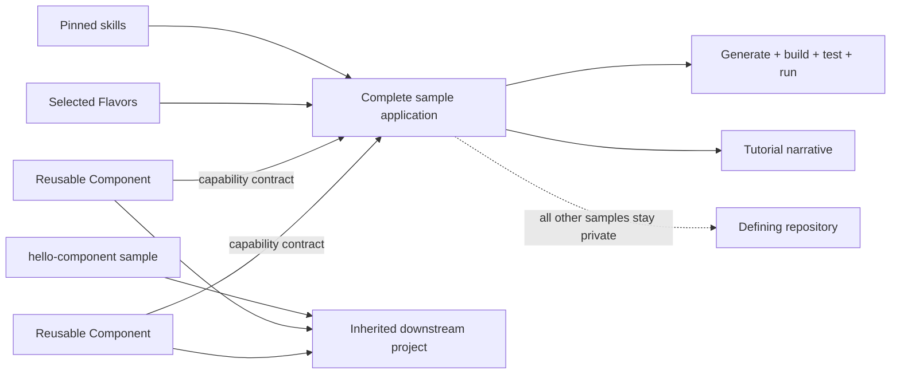
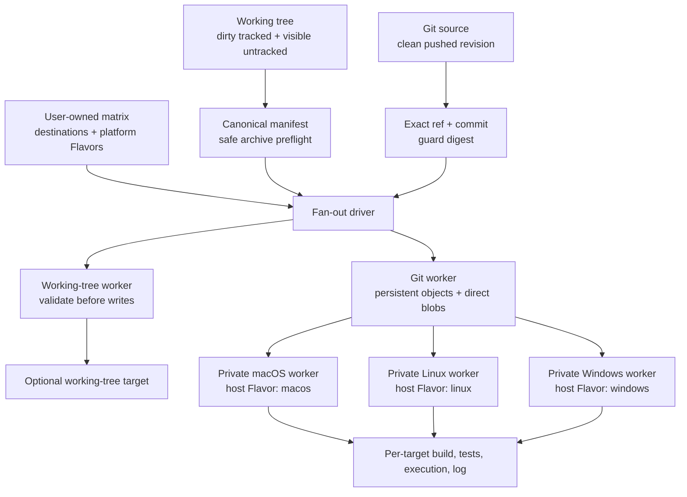
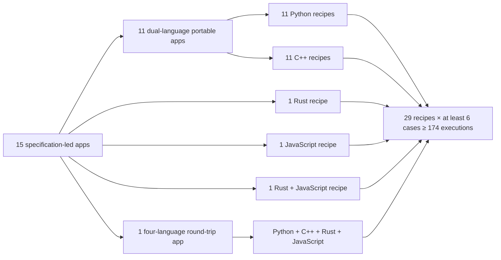
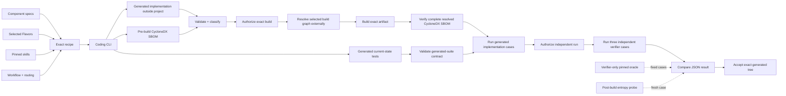
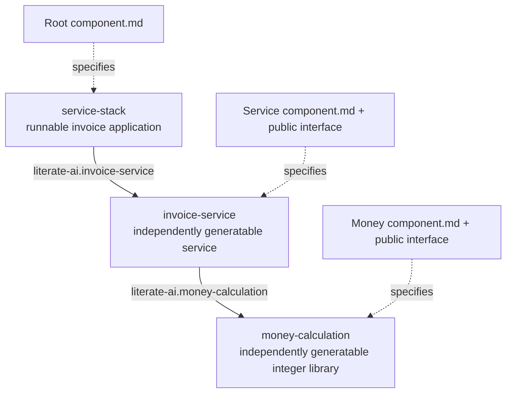
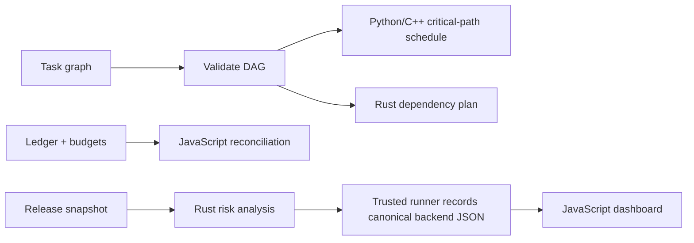
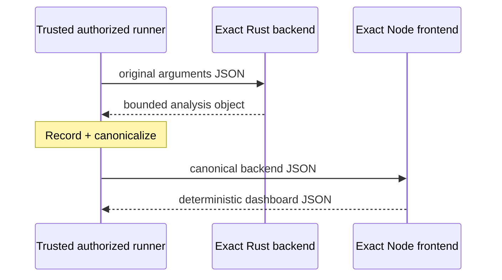
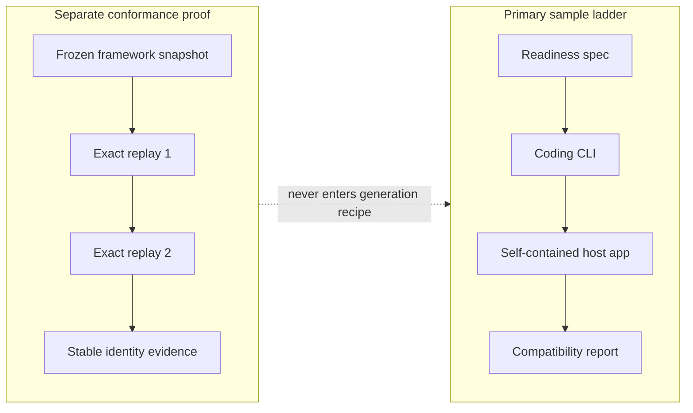

# Samples and tutorials

Samples are executable living demonstrations: complete libraries, applications, or
modules that compose reusable Components, Flavors, and skills to teach one concept and
prove the entire lifecycle. Canonical reusable providers belong in `components/`, not
`samples/`. Each demo has one complete, readable `component.md`; only real independently
consumed public interfaces justify another authored file. Generated source is absent
from the authoritative checkout, but accepted results are reusable under `BUILD_DIR`
and may be explicitly versioned as a derived cache.



Components are providers; samples are compositions and proofs; tutorials teach from
those proofs. Only `hello-component` crosses that last boundary automatically so a new
derived project always has one executable smoke test without inheriting the whole demo
portfolio.

Repository-only conformance metadata lives under `samples/_harness/`, outside the
author-facing Component directories. It binds the exact current Component/specification,
a value-free invocation/result-shape interface, and a separately pinned private oracle.
The interface may contribute a generation-safe ABI projection; expected results and
verifier labels cannot enter coding-agent context. Generated application source is deliberately
absent from the checkout. Every clean `major-rebuild` also derives a disposable
`source/tests/manifest.json` from the exact current specifications, selected Flavors,
and skills. A third, entropy-derived invocation is created only after each artifact
exists, with its expected value computed independently in verifier memory.

For a first tour, use this order:

1. **Greeting Card Starter** for the smallest readable end-to-end Component.
2. **Reproducible Release Manifest** for a broadly reusable single-Component utility.
3. **Composable Invoice Service** for a demo composition over the reusable invoice and
   exact-money Components.
4. **JavaScript Ledger Workbench** or the **Full-Stack Release Dashboard** for a richer
   application worth adapting.

The complete curated catalog is in the [samples directory](../../samples/), and the
[sample portfolio review](../architecture/sample-portfolio-review.md) separates product
reuse value from deliberate framework-test value.

Three samples are intentionally platform-pinned. Linux Cgroup Budget Interpreter selects
Linux, C++, and Conan; Windows Path Auditor selects Windows, C++, and Conan; macOS
LaunchAgent Catalog selects macOS, Apple Swift, and Homebrew. Discovery keeps all three
readable in the catalog but schedules only the matching sample on each worker. Two
portable Python samples select pip-wheel packaging, and the Rust Dependency Planner
selects Conan. In addition to exact package planning and compatibility, the opt-in
`make samples-packages` target runs Greeting Card Starter, Exact Statistics Library, and
Dependency Planner through their accepted Standard lifecycle, constructs the selected
wheel or Conan cache archive beneath `OBJ_DIR`, and independently verifies those bytes.
It does not publish or install them, and ordinary `make samples` does not pay this extra
packaging cost.
The macOS LaunchAgent sample has also completed the live Codex-to-Swift path through
compilation, generated tests, execution, an independent entropy-derived verifier probe,
CycloneDX resolution and the final lifecycle receipt.

## Run the lifecycle ladder

From the repository root, the full SDLC command is:

```console
litai rebuild . \
  --project . \
  --runtime-root /tmp/literate-ai-samples \
  --candidate-receipt /tmp/literate-ai-samples-receipt.json \
  --allow-host-execution
```

The native PowerShell equivalent keeps the public-style checkout at
`~/literate-ai` and uses a unique external runtime while persistent derived caches
remain separate. Run the detect-before-install bootstrap first; Bazel C++ samples require
the MSVC Build Tools capability and do not treat MinGW as a substitute:

```powershell
Set-Location (Join-Path $HOME "literate-ai")
$runId = [guid]::NewGuid().ToString("N")
$runtime = Join-Path $HOME "literate-ai-runtime\samples-$runId"
$candidate = Join-Path $HOME "literate-ai-runtime\samples-$runId-receipt.json"
litai rebuild . `
  --project . `
  --runtime-root $runtime `
  --candidate-receipt $candidate `
  --allow-host-execution
```

The repository convenience target runs the same sample matrix directly; use
`litai rebuild` when the project-driver, lifecycle request/command, and candidate-receipt
bindings are required:

```console
make samples
```

The Makefile exports `BUILD_DIR=$PWD/generated` and
`OBJ_DIR=$PWD/_build`. A second unchanged run should report source and build cache
hits and avoid both coding-agent generation and compilation. Use `make clean` to measure
a source-cache hit with a cold compiler cache, or `make really-clean` for a fully cold
run. Every fan-out target retains an equivalent cache outside its ephemeral,
identity-verified run tree: Git targets use a sibling `<repo>.litai-cache` directory and
working-tree targets use the configured matrix root's `cache/` directory.

Use the host round-trip target only when the coding CLI is authenticated and Bazel plus
all four implementation toolchains are available:

```console
make roundtrip-host
```

That target does not require every application to be reversible. It uses the deliberately
rich `regenerative-roundtrip` `literate-markdown` specification to generate, compile,
run, and reverse Python, C++, Rust, and JavaScript on this host. Its strict frontmatter
and canonical context graph exercise the readable provider on the forward path. The
target first builds and installs the exact current wheel into an isolated environment;
this binds every promoted project and clean qualification run to the framework and
Standard policy bytes actually under test. An editable source checkout is deliberately
not accepted as release lifecycle authority. Set `ROUNDTRIP_LANGUAGES=python` (or a
comma-separated subset) while diagnosing one translator. The target fully promotes and
regenerates every selected language result. It also runs the
Python `service-stack` composition through a three-node
inverse graph, promotion, composition, regeneration, build, and known-output check.
Sample Component directories are flat peers beneath `samples/`. The `hello-component`
starter retains the default inheritable behavior so every derived project can execute a
host end-to-end smoke test. Every other sample declares `inheritable: false`, exposing
the wider portfolio for inspection and explicit catalog copying without silently
installing every demonstration into a child.

For cross-platform regression, copy the checked-in worker and test examples to the
platform-resolved user configuration paths reported by `litai init`, replace the SSH
placeholders, and select those exact worker IDs:

```console
make samples-platform-regression
make samples-platform-regression SAMPLE='service-*'
make samples-platform-regression SAMPLE='*'
make samples-platform-regression TEST_CONFIG=/private/session/matrix.json \
  WORKER_CONFIG=/private/session/workers.json
```

The Make target selects the canonical `os.*` Flavor wildcard by default, so every
configured macOS, Linux, and Windows row participates regardless of the controller
host's operating system. Set `MATRIX_FLAVORS` explicitly only when intentionally
restricting that platform set; `SAMPLE_FLAVORS` continues to add language, build, or
other Flavor selectors to each selected worker.

The `skills/agent/configure-test-workers/SKILL.md` skill also explains how an agent may
ask for assignments during a CLI session or consume a
private dynamic-routing skill. The resolved matrix remains outside version control in
both cases. `LITAI_TEST_CONFIG` and `LITAI_WORKER_CONFIG` supply the same private paths
directly to the fan-out script.

Every worker declares an explicit SSH endpoint plus a `~/targetdir` or
`/absolute/targetdir` workspace and exact hardware qualifier. The matrix separately
binds that worker ID to its expected `linux`, `macos`, or `windows` Flavor. Paths use
the POSIX-style namespace exposed by the worker's OpenSSH
server even for Windows; drive-qualified forms such as `C:/targetdir` are rejected.
The matrix adds an exact `source_mode`:

- `working-tree` copies the current tree, including uncommitted specification changes
  but excluding Git-ignored content, Git metadata, and operational caches. A Git working
  tree contributes its currently visible tracked and nonignored untracked paths, so dirty
  tracked bytes are included while ignored credentials and environments are not. The
  driver requires the repository root, takes before/archive/after inventory and identity
  snapshots, rejects concurrent mutation, and records a stable canonical
  path/type/mode/content source identity separately from the gzip transport identity. It
  validates the finished archive locally with the same digest-bound guard used remotely,
  then uploads the archive and guard into an exclusive sibling staging directory. The
  worker verifies both transport digests and validates every member and payload before it
  creates the materialized `literate-ai/` tree; and
- `git` requires a clean local tree whose exact HEAD exists on `origin`, then makes the
  worker initialize or repair a persistent Git object store and its missing `origin`
  binding. The store's SHA-1 or SHA-256 object format is derived from and checked against
  the exact revision width; an existing, different format or origin is rejected. The
  worker fetches only the exact advertised ref at depth 1 by default and requires
  `FETCH_HEAD^{commit}` to equal the locally recorded commit. Branch, tag, and reachable
  commit-SHA requests use the same verification. History-sensitive jobs must explicitly
  pass `--repository-history-depth COMMITS` for bounded deepening or
  `--full-repository-history` to unshallow; a failed shallow fetch reports those choices
  instead of silently transferring all history.
  It then reads `src/literate_ai/remote_source_guard.py` from that commit, verifies the guard's
  locally recorded digest before writing it, and lets that guard read the commit tree and
  blob objects under sanitized Git configuration. The guard creates a unique destination
  directly from the verified blob bytes; it does not invoke checkout, worktree export, or
  `git archive`. No source archive is sent to a Git-backed target. The report retains both
  the commit revision and canonical verified source-tree identity.

Both lanes enforce one portable source model before generated code can run. Paths are
UTF-8 NFC, canonical repository-relative POSIX paths with no backslashes, drive prefixes,
control characters, traversal, Windows reserved names, trailing dots/spaces, or
case-insensitive path/prefix collisions. A file or symlink cannot be the parent of another
entry. Symlink targets must likewise be UTF-8 NFC, portable repository-relative POSIX
text; parent-relative targets are allowed only while they remain inside the repository.
Absolute, drive-qualified, backslash-containing, or escaping links fail closed. Git
submodule entries also fail closed because each submodule needs its own explicit recursive
source authority and identity.

The gzip tar is only a working-tree serialization and transport. Its SHA-256 proves which
archive bytes arrived; it does not make archive member semantics safe. The guard first
parses the entire member graph and payloads without extracting them, permits only the
canonical `literate-ai/` root plus directories, regular files, and portable symlinks,
rejects hard links and special files, checks duplicates and parent aliases, and compares
the resulting manifest identity with the captured authority. Only then does it write into
a new destination and reverify the materialized tree. System `tar` is deliberately not a
trust boundary: implementations vary in traversal, link, overwrite, Unicode, and
case-collision behavior and may write unsafe members while they are still being parsed.

The repository does not contain actual worker names. A user-owned matrix may select
long-lived hosts or temporary workers returned by a private routing skill. A Git worker
must have noninteractive access to the
configured origin, including any required organization SSO authorization and verified
SSH host key.
On native Windows, the larger Git bootstrap travels as a deterministic gzip-compressed,
base64 payload decoded only in memory by PowerShell. This keeps the SSH command below
`cmd.exe`'s command-line ceiling without weakening the exact guard, commit, or source-
tree checks or staging an unverified script on the worker.
Authentication and host trust are separate prerequisites: a valid GitHub credential can
still fail when the worker has no `github.com` entry in `known_hosts`. Add only GitHub's
published host key after verifying its published fingerprint; never work around this by
disabling strict host-key checking.

Worker IDs are conservative report basenames, and no two workers may name the same
canonical `username@hostname:path`; exclusive run-directory admission then rejects stale
or preplanted content. The ordinary sample driver resolves `platform.os=host` and fails if that exact
Flavor differs
from the configured worker. OS/Flavor runs execute concurrently by default while results
remain in configuration order. They leave a compact report plus per-host logs under
ignored `_build/test-matrix/<run>/` locally. Version-5 reports declare source authority as
per-worker, record the stable source identity for every worker, add `source_revision` for
Git and `transport_identity` for working-tree transfer, and distinguish requested
retention from the probed `present`, `staging`, `absent`, or `unknown` workspace state.
The harness stops launching new workers after the first failure, drains workers already
in flight, and atomically records their successful results in the compact ignored
`OBJ_DIR/test-matrix/checkpoint.json`. A repaired invocation skips those exact worker IDs
when its worker-and-pattern plan still matches. Such a mixed run is explicitly
non-authoritative and exits with status 2 after deleting the checkpoint; rerun once from
the beginning to obtain release evidence. Malformed, foreign, or plan-mismatched state
skips nothing.
Successful remote workspaces are removed. Failed workspaces are retained when they were
created; the diagnostic probe reports absence or uncertainty instead of claiming they
exist.
Pass `--retain-workspaces` to keep successful workspaces too. To select several patterns,
particular worker IDs, or an explicit concurrency limit, invoke
`scripts/fanout_samples.py` directly with repeated `--sample`/`--worker` options,
`--worker-config`, optional `--jobs`, and the explicit repository-history options above.
SSH/SCP uses noninteractive authentication,
one bounded connection attempt, and the worker's remaining wall-time budget. The sample worker additionally runs
under a remote process-group supervisor (a Windows process-tree termination on Windows)
that records status and terminates the tree before the client deadline. The generous
default is 3600 seconds, and `--timeout-seconds N` changes it. After completion or a
client-side timeout, a separately bounded diagnostic probe reports remote status and the
observed workspace state without extending execution authority.

The earlier Ubuntu 24.04 worker and the current Ubuntu 26.04 worker needed Bazelisk
because the selected sample lifecycle exercises the Bazel Flavor. Both use pinned
`@bazel/bazelisk@1.28.1`; an explicit bootstrap `bazelisk --version` populated Bazel
9.2.0 in Bazelisk's SHA-256-addressed cache. Runtime autodiscovery does not execute the
PATH launcher or depend on `~/.local/bin`: it verifies and invokes the cached Bazel
binary directly. Windows' Bazelisk 1.29.0 cache likewise contains direct Bazel 9.2.0.



When `PYTHON` is unset, the Make bootstrap walks `PATH` directory by directory and
probes `python3` before `python` within each directory, selecting the first Python 3.11+
runtime. That system interpreter creates the ignored `.venv`; `make samples`
runs through the framework and pinned runtime dependencies installed there.
`make PYTHON=... samples` is an authoritative direct override: it skips the managed
environment and fails closed instead of falling back. Python application builds resolve
a separate exact toolchain with the
same unpinned search rule. The Python and JavaScript Flavors contribute exact typed
toolchain artifacts requiring Python 3.11+ and Node.js 20+ respectively. A Component may
add a compatible content-pinned constraint through `authoring_inputs`; the runner
intersects it with the selected effective Flavor contributions before discovery. The
selected invocation, launcher bytes, reported runtime bytes, and version are bound into
build authorization and rechecked around compilation and execution. At the adapter
boundary, `pinned_command`, `minimum_version`, and `required_version` carry only these
resolved typed constraints; arbitrary prose does not create a pin. `PYTHON` and `NODE`
remain operator command pins, but must satisfy the effective version constraint. To
retain generated work outside the repository for inspection, run:

```console
python3 scripts/run_samples.py \
  --runtime-root /tmp/literate-ai-samples \
  --allow-host-execution \
  --pretty
```

Pass `--model MODEL` to set the pipeline-default coding-CLI model for every generated
sample. Component, selected-Flavor, and invoked-Skill model selections remain narrower
lexical overrides. The resolved selector is carried by each generated recipe and
correctness report; changing it invalidates source-cache and sample-checkpoint identity.

Use `python` when that is the compatible command selected from `PATH`. GNU Make is only
a convenience wrapper; native Windows users can invoke the same Python runner directly
from PowerShell or `cmd.exe` without installing Make.

The `make samples` target supplies the same acknowledgement. This permits generated
source to be built and generated code to run as your user. The runner validates
distinct exact, short-lived build and execution authorizations, but this portable
profile is not an OS sandbox. Both steps are therefore recorded as explicit `yolo`
profiles with the ambient host privileges they actually receive. Application stdout
and stderr are each capped at 1 MiB; compiler diagnostics are bounded independently.

The runner requires a C++17 compiler, a Rust compiler, Node.js 20 or newer, and an
authenticated coding CLI. Live sample generation does not search `PATH` for the first
available agent. Set `coding_cli` and `model` in project-scoped user `test.json`, or pass
`--coding-cli` / `--model` (or `CODING_CLI` / `LITAI_LIVE_MODEL`) for a one-shot
override. Remote fan-out requires `opencode` on each worker, configured with
credentials for the pinned model's provider. `CXX`, `RUSTC`, and `NODE` can select
explicit host commands.

The topology is intentionally uneven because the samples test different things:



The eleven portable applications each become a Python and a C++ recipe. The standalone
dependency planner adds Rust, the standalone ledger workbench adds JavaScript, and the
release dashboard exercises a Rust backend and JavaScript frontend together. Every
recipe set also includes the rich regenerative-roundtrip app in all four standalone
languages; its generated trees are the stable source inputs for the credentialed
semantic inverse test. Every
recipe combines its language topology with the actual host OS Flavor and performs
specification loading, Flavor resolution, exact skill resolution, compilation of the
content-pinned workflow and routing policy, a deterministic in-process planning stage,
coding-CLI generation on a distinct exact route, validation, classification, build
authorization, host build, generated checks, independent acceptance, workspace promotion,
and execution in separate host processes. The generation prompt receives the exact
Component-pinned invocation interface but no oracle value, path, or identity. That
interface names every required result field and type, so withholding example values
does not make the application API ambiguous.

The whole path, including the verifier boundary, is:



The solid path is the generation and host lifecycle. The generated suite is required
to contain distinct example, boundary, and invariant cases, cite only current
non-acceptance recipe documents, and avoid the acceptance interface's argument
vectors. The pinned acceptance interface is nevertheless part of recipe authority: the
prompt projector reveals only value-free callable signatures and complete result shape,
while withholding invocation values and oracle results. Generic acceptance contracts
without that callable shape remain pinned but prompt-hidden. It checks the generated
implementation's current state; because the same
model creates it, it is never the acceptance oracle. The dotted verifier inputs never
enter the coding-CLI request. The same checked-hash Python bytecode, native C++17 or
Rust 2021 executable, checked JavaScript bundle, or combined Rust/JavaScript artifact
is first run for every generated implementation case. The still-staged candidate then
runs all three verifier cases in its recipe. Generated cases must match the current suite;
verifier cases must
match independently computed JSON. The runtime probe is never written into the checkout,
generation recipe, model request, or retained runtime tree. The report records the
fixed-oracle guarantee as
`acceptance_oracle_excluded_from_generation_request`; coding-CLI transport limitations
remain the ones documented in [Models and generation](models-and-generation.md). Only
both passing gates permit the exact tree to become workspace truth.

The sample driver treats exactly four outcomes as rejection of a fungible generated
implementation-and-test candidate:

- a terminal static Bzlmod `validate` rejection whose event and
  `DependencyObservationError` carry the same allowlisted code, whose generation output
  binds the candidate tree, source bundle, and generated suite, and for which no
  lifecycle step was admitted. The exact closed set is
  `dependencies.bzlmod-authority-unsupported`,
  `dependencies.bzlmod-dependency-duplicate`,
  `dependencies.bzlmod-generated-lock-forbidden`,
  `dependencies.bzlmod-literal-invalid`,
  `dependencies.bzlmod-module-ambiguous`,
  `dependencies.bzlmod-module-invalid`,
  `dependencies.bzlmod-module-location-invalid`,
  `dependencies.bzlmod-module-name-invalid`,
  `dependencies.bzlmod-source-intent-invalid`, and
  `dependencies.bzlmod-workspace-unsupported`;
- a terminal `test-generated` mismatch whose failed run binds the generation-stage
  output, source bundle, built artifact, generated suite, and expected/observed result
  identities;
- an application or full-stack backend `host_execution.nonzero_exit` occurring only
  during a generated implementation case. Its typed evidence binds the case, expected-
  result identity, application/backend role, nonzero integer return code, and exact
  stdout and stderr digests; or
- a terminal C++ `build` rejection after successful validation, classification, and
  build authorization, with exact generated tree, source-bundle, and suite identities,
  no build result or downstream step, and an event-matching
  `builder.cpp_generated_source_rejected` `BuildError`. The C++ builder emits that code
  only when the candidate compile/link fails but a second compile-and-link canary
  succeeds with the same pinned toolchain. A failed canary remains terminal
  `builder.cpp_compile_failed`.

The driver reruns only that language variant, from a new empty attempt root, with the
same original recipe, for at most three total attempts. Earlier source, tests,
diagnostics, expectations, and verifier-only facts are not supplied to the next
coding-CLI request. Python, Rust, JavaScript, generic native, Bazel
build/resolve/analyze, toolchain, authorization, other dependency, malformed-suite, and
independent-verifier failures do not retry. Execution timeouts, launch or authorization
failures, invalid output, and missing or malformed process evidence are likewise
terminal. A nonzero process status during verifier execution never becomes candidate
feedback.
Bzlmod resolver/evidence failures, unknown validation codes, toolchain/framework errors,
and failures after any lifecycle result has been admitted are also terminal.

With the Bazel Flavor, resolution, analysis, source queries, the complete Bazel build,
and its checks normally run before the native delegate. Only a nonzero full build invokes
that exact authorized delegate diagnostically. Native success rethrows the generic Bazel
failure; generated C++ is retryable only when the diagnostic native build fails with the
candidate-specific code backed by its successful canary.

After eventual success, the version-7 conformance report records
`generation_candidate_attempt_count` and ordered
`rejected_generation_candidates`. Each
`literate-ai/generated-candidate-rejection@1` record contains the attempt, failure code,
rejection kind, run and generation-stage identities, and one compact diagnostic identity.
A validation record adds its allowlisted code plus candidate-tree, source-bundle, and
generated-suite identities and proves that no lifecycle step was admitted. A behavior
record adds case, source-bundle, artifact, generated-suite, and
expected/observed-result identities. An application nonzero record adds the case,
expected-result identity, application/backend role, execution failure code, nonzero
return code, and stdout/stderr digests to that same built-subject binding. A C++ build
record adds
`builder.cpp_generated_source_rejected` plus candidate-tree, source-bundle, and
generated-suite identities and has no artifact because the build did not complete.
No rejection record contains raw diagnostic text.
Exhausting all three attempts writes a compact
`literate-ai/generated-candidate-attempts@1` envelope with the variant, maximum, ordered
rejections, and envelope identity beneath the external attempt root, then fails. A
rejected tree is never admitted to workspace or source cache. The tracked receipt keeps
only the final report identity, not rejected source or diagnostic text.

The sample command validates and executes the generated suite and emits its conformance
report, but it does not replace the repository's `verification/current.json`.
The direct runner does not issue a public candidate. `litai rebuild` supplies its
driver-only provisional assertion path, validates exact source-cache lifecycle
membership, and writes the finalized candidate configured by `--candidate-receipt`.
`litai project test-receipt update PATH --project .` installs that finalized envelope's
compact raw receipt for an ordinary Git commit. Candidate production and installation
both enforce the root project's
`sample-host-e2e` suite version, exact checked-in runner identity, every complete
lifecycle evidence role—including `source-cache-lifecycle`, `source-sbom`, and
`resolved-sbom`—and the configured
minimum test count. Failed, skipped, or policy-mismatched results
cannot replace the last passing receipt. The optional
`litai project test-receipt check` command compares that exact external candidate
with the committed file. It does not compare a later live run: the entropy probe and
valid coding-CLI variation intentionally give later rebuilds new content identities.
The receipt's `project_revision` binds the complete authority-review graph, not only
`literate.project.json`; `project test-receipt require-current` is the release gate for
missing or stale evidence. The compact receipt remains a local Git assertion rather
than authenticated external attestation.

Every recipe resolves the same small skill matrix:

| Selected by | Skill responsibility | Workflow stage |
| --- | --- | --- |
| Component | Turn exact requirements and scenarios into a plan | `plan` |
| Component | Implement that plan and derive current-state tests as one clean rebuild | `generate` |
| Selected language Flavor or role Flavors | Apply each language's portable entrypoint, invocation, and generated-test rules | `generate` |

The Component and language Flavor files hold exact SHA-256 references to these
manifests. A single-language recipe records three skill identities; the full-stack
recipe adds both role-language skills to the two Component skills. The OS Flavor adds
platform requirements but no implementation technique, so it does not add a skill.

| Sample | What it proves |
| --- | --- |
| [`hello-component`](../../samples/hello-component/) | Summarizes messages and proves deterministic workflow restart. |
| [`generated-library`](../../samples/generated-library/) | Generates a separate library and computes exact rational statistics. |
| [`service-stack`](../../samples/service-stack/) | Drives the real `service-stack → invoice-service → money-calculation` graph through three independently bounded Standard lifecycle nodes; each compiles and runs its own tests, while explicit artifacts reach the executable invoice root. |
| [`multi-repository-component`](../../samples/multi-repository-component/) | Generates API/worker sources and processes hashed text jobs. |
| [`model-routing`](../../samples/model-routing/) | Selects a compatible offline endpoint with explicit fallback and no egress. |
| [`empty-cache-restart`](../../samples/empty-cache-restart/) | Writes content-addressed records and recovers them after cache restart. |
| [`publication-import`](../../samples/publication-import/) | Builds a canonical, hashed release manifest and proves publication roundtrip. |
| [`security-policies`](../../samples/security-policies/) | Evaluates findings, privilege requests, blocked builds, and explicit `yolo`. |
| [`flavor-matrix`](../../samples/flavor-matrix/) | Produces a portable OS/GPU/language build matrix and checks Flavor conflicts. |
| [`self-hosting`](../../samples/self-hosting/) | Builds a self-contained framework/skill readiness app; a separately pinned conformance fixture checks exact snapshot replay. |
| [`critical-path-scheduler`](../../samples/critical-path-scheduler/) | Computes deterministic forward/backward schedules, slack, and a representative critical path. |
| [`dependency-planner`](../../samples/dependency-planner/) | Compiles a standalone Rust DAG planner with deterministic parallel completion and critical-path results. |
| [`javascript-ledger-workbench`](../../samples/javascript-ledger-workbench/) | Runs a standalone JavaScript ledger reconciliation and integer budget analysis. |
| [`full-stack-rust-js`](../../samples/full-stack-rust-js/) | Runs a Rust release-risk backend and JavaScript dashboard frontend through one host-observed, authorized two-stage protocol. |

The newer work-oriented samples are different presentations of the same principle: the
specification describes real computation, while the selected Flavor determines how it
becomes host code.

The composition sample is a real catalog hierarchy rather than a diagram-only fiction:





The full-stack recipe does not pretend the two roles are independent builds. One
whole-tree request and one short-lived authorization bind the generated source, exact
Rust compiler, exact Node.js runtime, backend executable, and checked frontend scripts.
The trusted authorized runner invokes the exact backend first with the original JSON,
records its bounded response, serializes that response canonically, and only then
invokes the exact frontend with that canonical JSON. The frontend never receives a
backend path and never launches a process.



The backend stage object has exactly `release`, `release_status`, `services`,
`passed_checks`, `failed_checks`, `total_checks`, `blocked_services`,
`review_services`, `total_risk_points`, `pass_rate_basis_points`, and
`top_risk_service`; each service row has `name`, `risk_points`, and `status`. The
runner observes and authorizes both process boundaries, so generated presentation code
does not inherit process-orchestration authority.

Linux, macOS, Windows, Python, C++, Rust, JavaScript, and CPU requirements are modeled
as independently content-pinned Flavors in the repository's `flavors/` directory.
Exact conversion guidance is in `skills/specification-to-source/`. The runner
selects the actual host Flavor; portable base specifications do not embed OS- or
language-specific requirements. Eleven Components expose one language slot and are
expanded into separate Python and C++ recipes. The full-stack Component instead exposes
backend and frontend role slots on the same language axis, allowing Rust and JavaScript
to be selected together without merging their responsibilities.

To generate one recipe without running the full matrix:

```console
litai lock samples/hello-component --target linux-host --flavor=+flavor://literate-ai/lang-cpp --flavor=+flavor://literate-ai/os-linux
litai plan samples/hello-component --target linux-host --flavor=+flavor://literate-ai/lang-cpp --flavor=+flavor://literate-ai/os-linux
litai generate samples/hello-component \
  --output /tmp/literate-ai-hello-cpp \
  --target linux-host \
  --flavor=+flavor://literate-ai/lang-cpp \
  --flavor=+flavor://literate-ai/os-linux
```

Flavor selectors are ordered. Use `-flavor` before `+replacement` when changing a
selection on the same axis. Generated output must be outside the specification
directory, and primary samples never retain a generated `source/` tree in the
checkout. Each invocation creates a complete replacement implementation and
`source/tests/manifest.json`; a later rebuild must not read either as input.
The language requirements aim for reasonable portability across Linux, macOS, and
Windows, but this host mode is not hermetic: the selected compiler or runtime, its
dynamic libraries or SDK, and the host OS remain part of the environment.

The historically named self-hosting Component is deliberately less magical than its
name. The primary ladder sends only its compatibility/readiness specification and
portable skills to the coding CLI, then builds and runs a self-contained application.
Its execution contract has no runtime dependency on this repository.

Afterward, a verifier-only conformance manifest may replay an already frozen framework
snapshot through a deterministic adapter twice. The replication skill and proof
identities form a separate pin chain beneath `samples/_harness/self-hosting/`: its
metadata pins the proof manifest, and that manifest pins the replication skill. Neither
enters the public generation recipe. The
replay exercises lifecycle and candidate isolation; it does not use a coding CLI,
synthesize source, or establish that a model can redesign the framework.
Its lifecycle uses the explicit `non-executing-exact-tree` acceptance profile and a real
`source/tests/manifest.json` suite artifact whose byte identity is bound into both gates.
The separate isolated candidate probes remain the executable proof. Both replay
generations retain an explicit operator `PYTHON` toolchain selector while their
interpreter-control variables are replaced by the isolated candidate environment, so an
invocation pin cannot silently disappear between generations. Candidate imports may
come only from generated source, the projected declared dependency closure, or the
selected interpreter's exact existing standard-library and native-extension roots; this
covers split Windows `Lib`/`DLLs` layouts without trusting the whole installation prefix.



## Source-to-specification cases

Run every inverse-authoring case:

```console
PYTHONPATH=src python3 scripts/run_source_to_specification_fixtures.py
```

Or run one through the installed command:

```console
litai spec conformance \
  tests/fixtures/source_to_specification/state-machine/case.json
```

The cases cover:

- state transitions and invalid-operation errors;
- public library contract versus private cache implementation;
- two-revision incremental refresh;
- contradictory source and tests;
- prompt-injection isolation; and
- splitting base behavior from OS, CUDA, and language Flavors.

The repository-local `tests/fixtures/source_to_specification/README.md` adds fixture details.
Each case keeps analyzed source inside its fixture root, rejects symlink escapes,
preserves explicit version pins, and treats expected summaries as verifier data rather
than authoring evidence.
For an arbitrary checkout, use the attestation, review, and acceptance flow in
[Source to specification](source-to-specification.md).
