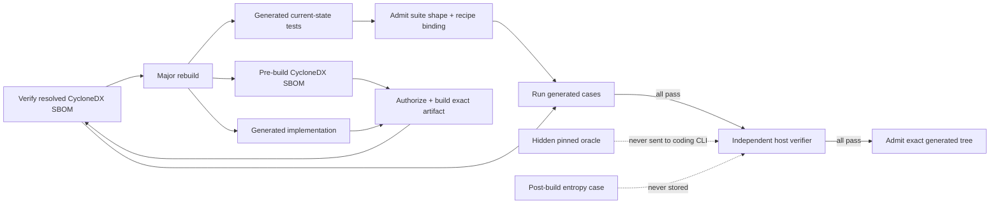
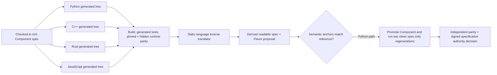
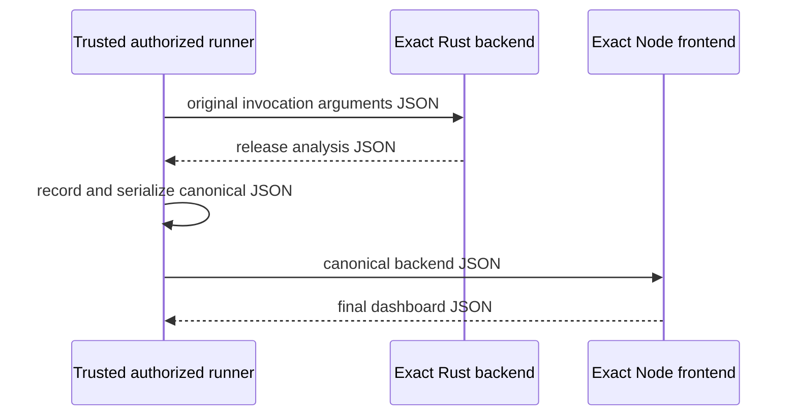

# Spec-to-host executable sample ladder

The twenty-one primary samples are complete applications. Each primary Component
directory now begins and, unless it exposes a real cross-Component boundary or delegates
behavior to a structured provider that cannot express the portable call/result shape,
ends with one `component.md`: readable metadata, story, diagram, application contract,
requirements, scenarios, and acceptance intent in the same document. DMN and SCXML
samples keep that call/result shape in one explicitly selected public-interface document
instead of leaving normative behavior in descriptive Component prose. Their source is
deliberately absent from this repository: each application is regenerated from that
Component, selected Flavors, and exact skills. Every clean `major-rebuild` also creates
`source/tests/manifest.json` and `source/.literate/sbom.cdx.json` beside the implementation
in the external generated tree. The suite is a disposable current-state check and the
SBOM is strict CycloneDX 1.7 pre-build evidence; neither is committed here.

The catalog itself admits Markdown specifications/documentation, JSON metadata, DMN
decision tables, and SCXML charts plus their JSON trace sidecars.
Framework runners live under `scripts/` and `tests/conformance/support/`; inverse-workflow
implementation fixtures live under `tests/fixtures/`. A conformance test enforces this
boundary so executable Python, generated source, and bytecode cannot drift back into
`samples/`.

Repository-specific executable vectors, runner selection, and expected-value oracles
live under [`_harness/`](_harness/) rather than pretending to be peer Component files.
The versioned harness metadata binds the exact current Component/specification and its
value-free execution interface; that interface defines multiple invocations and a
closed JSON result shape. Its separately pinned oracle defines ordered expected results
and is forbidden from the coding-agent closure. Copy `component.md` to fork a product;
copy harness fixtures only when extending this repository's conformance suite. After
each artifact has been generated and built, the
verifier also creates one entropy-derived invocation and expected result entirely in
memory. That runtime-generalization probe cannot be memorized from the checkout or
observed by the coding CLI.

## The capability matrix (ADR 0012)

The portfolio is a curated matrix, not an accumulation. Each sample owns specific
cells across three axes and one complexity tier; new samples must add a cell or a
tier, not duplicate an owned one.

| Tier | Sample | Language | OS | Build | Packaging | Deployment | Distinct skill path |
| --- | --- | --- | --- | --- | --- | --- | --- |
| starter | [hello-component](hello-component/) | any | host | make | pip | — | portable-application |
| starter | [loan-risk-gate](loan-risk-gate/) | any | host | make | pip | — | **dmn** + pinned `assets:` + public interface |
| starter | [playback-controller](playback-controller/) | any | host | make | pip | — | **scxml** + trace sidecar + public interface |
| composed | [containerized-log-tally](containerized-log-tally/) | python | host | make | pip | **docker** | docker-container-application |
| composed | [python-service-example](python-service-example/) | python | host | make | — | — | python-service-application |
| composed | [react-dashboard-example](react-dashboard-example/) | javascript | host | make | — | — | react-dashboard-application |
| frontier | [durable-split-service](durable-split-service/) | javascript + python | host | make | — | frontend + API + collector + SQLite | durable-split-service |
| frontier | full-stack-rust-js | rust+js | host | native | — | — | multi-role planning |
| frontier | [cuda-vector-transform-cpp](cuda-vector-transform-cpp/), [cuda-vector-transform-python](cuda-vector-transform-python/) | cpp/python | linux | cmake | conan | — | generate-nvidia-cuda-application |
| composed | service-stack | python | host | bazel | — | — | component graph |

Dormant-but-intentional: `swift` flavors are exercised by toolchain preflight tests
rather than a generated sample (tracked as revisit-or-retire); `google-workspace` /
`microsoft-365` are documentation-ecosystem targets exercised by `document-pair`.

## Pre-filled source cache

Accepted sample source ships in the committed cache at
`generated/committed-source-cache/` so a fresh clone runs samples without paying
cold-generation cost. It is ordinary non-authoritative cache: identity-keyed,
current-acceptance-untrusted, and safe to delete (`litai clean`) — regeneration from
the Component specifications remains the release gate. Object code, executables, and
fetched binaries are never committed.

## Choose a sample worth adapting

The stable directory names sometimes describe the framework path under test; the
human-facing names below describe the useful application now generated from that spec.

| Start with | What it gives you | Best reason to fork it |
| --- | --- | --- |
| [Greeting Card Starter](hello-component/) | normalization and aggregation in the smallest complete lifecycle | learn the system, then turn it into onboarding or notification output |
| [Loan Risk Gate](loan-risk-gate/) | UNIQUE DMN decision table plus pinned income-band JSON | underwriting, origination, or any closed numeric policy table |
| [Playback Controller](playback-controller/) | SCXML parallel regions with deep history | device transport, session restore, or any event-driven controller |
| [Reproducible Release Manifest](publication-import/) | canonical file manifest and immutable release identity | plugins, sites, configuration packs, or model assets |
| [Composable Invoice Service](service-stack/) | application → service → exact-money library Component graph | carts, quotes, subscriptions, billing, or procurement |
| [Durable Snapshot Dashboard](durable-split-service/) | independently deployed frontend, read-only API, leased collector, and SQLite cache | monitoring dashboards and scheduled snapshot pipelines that must survive reader restarts and partial collection failures |
| [Critical Path Scheduler](critical-path-scheduler/) | complete deterministic CPM schedule and slack | project, workflow, migration, or build planning |
| [Build Pipeline Dependency Planner](dependency-planner/) | smaller Rust DAG/topology/longest-chain kernel | build and release pipeline orchestration |
| [Content-Addressed Record Vault](empty-cache-restart/) | SHA-256 deduplication and restart recovery | artifact stores, immutable attachments, or offline queues |
| [Portable Deployment Matrix](flavor-matrix/) | target-to-artifact and toolchain planning | CI expansion, release packaging, or build-farm dispatch |
| [Full-Stack Rust and JavaScript Release Dashboard](full-stack-rust-js/) | compiled Rust analysis + JavaScript presentation roles | release governance, health, or compliance dashboards |
| [Exact Statistics Library](generated-library/) | reusable exact-rational statistics plus consumer | telemetry, benchmark, grading, or data-quality summaries |
| [JavaScript Ledger Workbench](javascript-ledger-workbench/) | integer-money reconciliation and budget analysis | personal finance, expenses, or project budgets |
| [Private AI Endpoint Router](model-routing/) | capability-aware local endpoint selection | privacy-preserving AI applications and explainable fallback |
| [Multi-Role Text Job Pipeline](multi-repository-component/) | separately generated API and worker roles | ingestion, queues, and document-processing topologies |
| [Warehouse Manifest Round-trip](regenerative-roundtrip/) | fulfillment logic and the richest forward/inverse oracle | inventory, orders, shipping, and semantic round-trip work |
| [Deployment Security Gate](security-policies/) | explicit admission decision and visible dangerous override | CI, plugin, infrastructure, or agent-execution policy |
| [Framework Compatibility Readiness](self-hosting/) | Literate AI version/skill conformance application | framework regression only; not the recommended product starter |
| [Linux Cgroup Budget Interpreter](linux-cgroup-budget/) | cgroup v2 CPU and memory limit interpretation in native C++ | Linux container launchers, observability agents, and Conan packaging |
| [Windows Path Auditor](windows-path-auditor/) | Windows drive, UNC, rooted, and relative path normalization in native C++ | installers, workspace managers, and Conan packaging on Windows |
| [macOS LaunchAgent Catalog](macos-launch-agent/) | Swift LaunchAgent declaration validation and cataloging | Apple Swift, Homebrew packaging, and macOS service tooling |
| [Cluster Health Service](python-service-example/) | sample-host JSON probe over paginated HTTP, typed 404, embedded MCP, and scheduled worker on SQLite | persistent Python services that never query upstream from a request path |
| [Cluster Metrics Dashboard](react-dashboard-example/) | interchangeable graph and table views over one fetched dataset | JavaScript dashboards that keep selection and sort across view switches |

The [portfolio review](../docs/architecture/sample-portfolio-review.md) scores every
sample independently for reuse and framework-test value and records the remaining gaps.

The generated suite and verifier acceptance deliberately do different jobs:



Generation validates that the suite is recipe-bound, contains example, boundary, and
invariant cases, cites current non-acceptance specs, and does not copy acceptance
arguments. The runner executes those cases as current implementation checks against the
exact artifact. Its two fixed oracle cases plus fresh entropy case remain the independent
known-output proof; model-produced expectations are never treated as the verifier oracle.

Eleven language-neutral samples are each exercised with the shared Python and C++
Flavors. Two further language-neutral samples exercise the DMN and SCXML
specification providers on that same Python/C++ host matrix. A standalone dependency planner selects Rust, a standalone ledger workbench
selects JavaScript, and a full-stack release dashboard selects both Rust for its backend
and JavaScript for its frontend. The regenerative-roundtrip manifest application selects
Python, C++, Rust, and JavaScript independently so the same rich behavior can be compared
through both authoring directions. On each host the runner also selects the shared Linux,
macOS, or Windows Flavor; the Flavor-matrix application additionally selects CPU. This
produces 37 complete generation recipes from 21 behavior specifications across the
portable and three OS-pinned targets. A worker executes only its 35 compatible recipes:
the Linux cgroup, Windows path, and macOS Swift/Homebrew samples are admitted solely on
their matching operating system. Each recipe
runs at least three generated implementation cases. Each ordinary single-artifact
recipe also runs two pinned verifier cases and one post-build entropy-derived case. The
durable split portfolio replaces that single-invocation probe with a verifier-owned
stateful flow over four independently generated and built Components.

Packaging is part of the selected Flavor authority for representative samples. Greeting
Card Starter and Exact Statistics Library select `package-pip`; Dependency Planner plus
the Linux and Windows native utilities select `package-conan`; the macOS Swift sample
selects `package-brew`. This proves specification composition, target compatibility, and
package planning. Native wheel, Conan, and Homebrew byte construction remains gated on
provider implementation: pip wheels and Conan cache archives now build from accepted
sample artifacts through `make samples-packages` and are independently verified under
`OBJ_DIR`; Homebrew construction remains open. The package target is opt-in so the
ordinary behavior matrix does not repeat native package work.
The macOS sample additionally has a live end-to-end proof through generated Swift source,
guarded compilation, generated tests, execution, independent runtime generalization,
CycloneDX and receipt emission.

## Bidirectional round-trip oracle

[`regenerative-roundtrip`](regenerative-roundtrip/) is the stable semantic reference for
forward and inverse conversion. Its self-rooted `component.md` demonstrates strict
human-readable frontmatter and canonical context while retaining addressable
Requirement/Scenario bodies. It deliberately combines input validation,
whitespace and identifier normalization, repeated-key aggregation, integer rounding,
deterministic ordering, tie-breaking, and a portable JSON executable boundary. No
generated implementation is retained.



Run the credentialed round trip explicitly:

```console
LITERATE_AI_RUN_LIVE_ROUNDTRIP=1 CODING_CLI=codex \
  PYTHONPATH=src python3 -m unittest \
  tests.conformance.test_live_bidirectional_roundtrip
```

The full-stack recipe uses an explicitly host-observed protocol. Generated roles never
launch one another:



The recorded backend object contains exactly `release`, `release_status`, `services`,
`passed_checks`, `failed_checks`, `total_checks`, `blocked_services`,
`review_services`, `total_risk_points`, `pass_rate_basis_points`, and
`top_risk_service`. This keeps process authority in the trusted runner while leaving
the generated backend responsible for analysis and the generated frontend responsible
for presentation.

## Build and run every sample

Requirements are Python 3.11 or newer (the framework
executes the package's native bundle); a C++17 compiler on `PATH` (or selected by
`CXX`); a Rust compiler on `PATH` (or selected by `RUSTC`); Node.js 20 or newer on
`PATH` (or selected by `NODE`); and an authenticated `codex`, `claude`, `cursor-agent`,
or `opencode` command. When the selected effective recipe actually includes the Bazel
Flavor, Bazelisk must first populate its SHA-256-addressed cache with a direct Bazel 9
binary; Literate AI verifies and runs that binary, never the PATH Bazelisk launcher.

```console
litai rebuild . \
  --project . \
  --runtime-root /tmp/literate-ai-samples \
  --candidate-receipt /tmp/literate-ai-samples-receipt.json \
  --allow-host-execution
```

On native Windows, keep the public-style checkout and disposable runtime separate and
select the portable MinGW compiler when MSVC is not installed:

```powershell
Set-Location (Join-Path $HOME "literate-ai")
$env:CXX = "g++"
$runId = [guid]::NewGuid().ToString("N")
$runtime = Join-Path $HOME "literate-ai-runtime\samples-$runId"
$candidate = Join-Path $HOME "literate-ai-runtime\samples-$runId-receipt.json"
litai rebuild . `
  --project . `
  --runtime-root $runtime `
  --candidate-receipt $candidate `
  --allow-host-execution
```

`make samples` is the direct-runner convenience target when lifecycle command/request
and candidate-receipt bindings are not needed.

The Makefile follows `PATH`, probing `python3` and then `python` in each directory and
selecting the first compatible interpreter. If that interpreter is named `python3`, the
equivalent command is:

```console
python3 scripts/run_samples.py --allow-host-execution
```

Use `python` instead when that is the selected compatible command. GNU Make is a
convenience, not an application requirement; on native Windows the same runner command
works from PowerShell or `cmd.exe` with `python.exe` from `PATH`. Set `PYTHON` when a
specific interpreter command is required for Make.

`make samples` includes the same explicit acknowledgement. Generated source is built and
the resulting applications run with the authority of your user account; this
portable build-and-run mode is authorization-gated, but it is not an operating-system
sandbox. Both grants are explicitly classified as `yolo` and bind the ambient
privileges they actually receive. Application stdout and stderr are capped at 1 MiB
each; compiler diagnostics are bounded independently.

Set `coding_cli` and `model` in ignored `literate.test.json` for live `make samples`.
Command-line `--coding-cli` / `--model` override that file for one invocation:

```console
PYTHONPATH=src python -m literate_ai ... --coding-cli opencode --model openai/gpt-5
```

If those pins are omitted, live sample generation fails closed instead of picking the
first `codex`, `claude`, `cursor-agent`, or `opencode` binary on `PATH`.

The default run uses temporary directories. To retain generated source, generated
current-state tests, workspaces, and built artifacts without putting them in the
checkout, provide a new or empty directory outside the repository:

```console
python3 scripts/run_samples.py \
  --runtime-root /tmp/literate-ai-samples \
  --allow-host-execution \
  --pretty
```

For each recipe the runner composes the base and selected Flavor specifications and the
Component's two exact planning/portable-implementation skills with the selected
language Flavor's exact implementation skill. It derives a canonical generation
interface directly from the Component, with every invocation, the exact output field
shape, and no oracle value, path, or identity. It compiles the Component's pinned
workflow and routing documents
into the execution plan, routes the exact `plan` stage to the local deterministic
planner, and routes only `generate` to the selected coding CLI. The report records both
distinct route identities. It then validates and scans the generated tree, authorizes
its exact digest—including the required generated test-suite and source-SBOM
identities—builds it, validates the exact post-build dependency graph, and
runs every admitted generated case against that exact artifact. It then loads the
metadata-pinned oracle outside the model closure, verifies its interface binding, checks
a distinct exact grant, and runs every verifier case against the same built artifact.
Only both passing gates permit workspace preparation and commit. The
four host modes are checked-hash Python bytecode, a native C++17 executable, a native
Rust 2021 executable, and a Node.js-checked JavaScript bundle. The full-stack topology
uses one whole-tree build request and authorization to bind both the Rust compiler and
Node.js runtime, then seals the backend executable and frontend scripts into one exact
artifact tree. For each case, the trusted authorized runner invokes the exact backend
with the original JSON, records its bounded JSON result, and invokes the exact frontend
with the canonical backend JSON. Only after artifact capture does the verifier create
a fresh, in-memory generalization case from cryptographic entropy; that invocation is
run through the same authorization path without being written to a specification,
recipe, source tree, or runtime file. Every fixed and runtime result must equal its
verifier-computed JSON value. The report calls the fixed-oracle boundary
`acceptance_oracle_excluded_from_generation_request`; it does not claim the selected
coding CLI is otherwise hermetic.

The runner recognizes exactly four ways for fungible generated source to reject its
complete model-produced source-and-test candidate. A static Bzlmod source-validation
rejection must have an exact failed `validate` event and matching
`DependencyObservationError`, bind the generated tree, source bundle, and suite, use one
of the exact finite authoring codes, and have no admitted lifecycle step. The closed set
is `dependencies.bzlmod-authority-unsupported`,
`dependencies.bzlmod-dependency-duplicate`,
`dependencies.bzlmod-generated-lock-forbidden`,
`dependencies.bzlmod-literal-invalid`, `dependencies.bzlmod-module-ambiguous`,
`dependencies.bzlmod-module-invalid`,
`dependencies.bzlmod-module-location-invalid`,
`dependencies.bzlmod-module-name-invalid`,
`dependencies.bzlmod-source-intent-invalid`, and
`dependencies.bzlmod-workspace-unsupported`. An exact
terminal `test-generated` behavior mismatch must bind its run, generation output, source
bundle, built artifact, generated suite, and expected/observed result identities. An
application or full-stack backend `host_execution.nonzero_exit` is eligible only during
a generated implementation case and must bind its case, expected-result identity,
application/backend role, nonzero
integer return code, and exact stdout/stderr digests. An exact terminal `build`
rejection is currently C++-only: it must follow completed validation, classification,
and authorization, bind the generated tree, source bundle, and suite, have no build
result or downstream step, and carry an event-matching
`builder.cpp_generated_source_rejected` `BuildError`. The C++ builder emits that code
only after the candidate compile/link fails but a second compile-and-link canary succeeds
with the same pinned toolchain. A failed canary remains terminal
`builder.cpp_compile_failed`. Python, Rust, JavaScript, generic native, all Bazel
build/resolve/analyze, toolchain, authorization, and all other dependency failures remain terminal.
So do verifier failures, timeouts, launch or execution-authorization failures, invalid
output, and missing process evidence.
Bzlmod resolver/evidence, toolchain/framework, unknown-code, and already-admitted
failures are also terminal; only the static authority/declaration allowlist qualifies.

Any of those rejections gives that language variant a fresh empty root, the unchanged
recipe, and the earlier rejection records with their bounded, redacted
`diagnostic_excerpt`, never earlier source or verifier facts, for at most three total
attempts. Every other failure—including independent acceptance—remains
fail-stop, and no rejected tree can enter workspace or source cache.

An eventually passing `literate-ai/conformance-report@7` records the attempt count and
ordered compact `literate-ai/generated-candidate-rejection@1` records whose only
diagnostic text is that bounded, redacted excerpt. Exhaustion persists a
content-identified `literate-ai/generated-candidate-attempts@1` envelope below the
external attempt root before failing. The Git receipt binds the final report identity;
it does not retain
rejected source or diagnostic text.

The direct sample command emits its conformance report but does not mutate this
repository's `verification/current.json` or issue a promotable receipt. To record a
completed run, use `litai rebuild` with
`--candidate-receipt /tmp/test-candidate.json`, then run
`litai project test-receipt update /tmp/test-candidate.json --project .` and commit
the one replacement file. The manifest admits only `sample-host-e2e` at the configured
version from the exact checked-in runner, with every required complete-lifecycle
evidence role—including `source-cache-lifecycle`, `source-sbom`, and
`resolved-sbom`—and the configured minimum
test count. Failure, skips, or a policy mismatch cannot produce or replace the last passing
receipt. `litai project test-receipt check` compares the committed receipt with the
exact outer-finalized candidate from a completed run. The driver-side `--test-receipt`
path is a provisional assertion used only inside the pinned lifecycle protocol. It is
not a public promotion surface. `check` is not a live-rerun reproducibility
test: the entropy probe and valid coding-CLI variation intentionally give later runs
new content identities. The candidate binds the complete current authority-review
identity, so a Component, specification, Flavor, skill, workflow, routing, project, or
declared-documentation change makes it stale. Release automation can enforce this with
`litai project test-receipt require-current --project .`. This is a local Git
assertion; the receipt service does not authenticate the external evidence identities.

## Generate one recipe

Inspect the exact recipe first, then generate one application into a new directory:

```console
litai lock samples/hello-component --target linux-host --flavor=+cpp --flavor=+linux
litai plan samples/hello-component --target linux-host --flavor=+cpp --flavor=+linux
litai generate samples/hello-component \
  --output /tmp/literate-ai-hello-cpp \
  --target linux-host \
  --flavor=+cpp \
  --flavor=+linux
```

Replace the OS selector with the intended target. Flavor operations are ordered, so a
selection can be replaced explicitly:

```console
--flavor=+python --flavor=-python --flavor=+cpp
```

Selecting two Flavors on the same axis without subtracting the first is rejected. The
Python and C++ definitions also declare their conflict directly. A model selection in
the routing policy or a selected Flavor is passed to the chosen coding CLI; a Flavor
selection overrides the routing selection for that CLI.

The output is a complete replacement, not an incremental patch. It includes the
application entrypoint, `source/tests/manifest.json`, and
`source/.literate/sbom.cdx.json`; none should be moved into the sample directory or
reused as input to a later generation.

## What the applications do

The generated programs perform concrete work: greeting and message analysis, exact
integer statistics, invoice calculation, multi-source text jobs, model routing,
release-manifest hashing, policy evaluation, content-cache recovery, portable build
matrix planning, framework-readiness inspection, critical-path scheduling, Rust
dependency planning, JavaScript ledger reconciliation, and a Rust-backed JavaScript
release-risk dashboard. Expected outputs are specified, not inferred from execution:
fixed examples are content-pinned, while the fresh probe's expected result is
independently computed from the specified behavior after the build.

The shared Flavor catalog is the top-level `flavors/` catalog declared by
`literate.project.json`. OS requirements remain language-neutral; Python, C++, Rust,
and JavaScript requirements remain OS-neutral. Generated application sources are never
checked into a sample directory, and neither are their generated implementation tests.

All reusable conversion manifests are under top-level
`skills/specification-to-source/`. Components pin the planning and portable
implementation skills; Python, C++, Rust, and JavaScript Flavors pin their
language-specific skills.
Dependencies pin the exact required skill version and content identity. A missing or
changed skill, dependency mismatch, or nonexistent workflow stage stops before source
generation. A single-language recipe resolves three skills; the Rust/JavaScript
full-stack recipe resolves both language skills in addition to the two Component
skills. The coding CLI receives only that exact resolved set, and the report records
every identity. Root `SKILL.md` is agent onboarding and is not injected.

Source-to-specification implementation fixtures live under
`tests/fixtures/source_to_specification/`, outside this catalog. They are inverse-test
inputs, not sample Components or cached outputs from the forward applications.

The historically named self-hosting Component is a normal generated readiness app. Its
Python and C++ artifacts are self-contained and evaluate the spec-declared framework
version and packaged skill inventory; they neither import the checkout nor reproduce
framework source.

Its verifier metadata separately pins an exact-snapshot replication proof. That
deterministic fixture replays already frozen framework bytes through real lifecycle
adapters twice and verifies candidate isolation plus stable semantic identities. The
proof invokes no coding CLI and its replication skill never enters the application's
generation recipe. It is a conformance test of lifecycle plumbing, not evidence of AI
self-generation.

The replay's lifecycle acceptance is explicitly `non-executing-exact-tree`. A concrete
`source/tests/manifest.json` artifact binds the frozen subject and check profile; the
runner does not invent a suite ID. Executable evidence still comes from the isolated
candidate probes after each deterministic replication.

Operational caches, host paths, artifact paths, and timestamps are outside semantic
comparison. The guarded builders and explicit host runner are authorization-bound but
are not hardened operating-system sandboxes.
