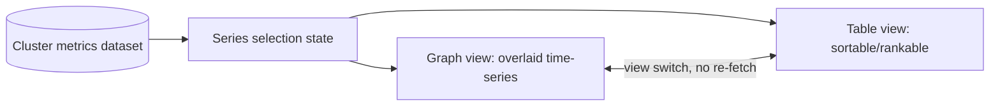

# Cluster Metrics Dashboard

A small, representative instance of the `react-dashboard-application` skill: one
already-fetched dataset (one row per cluster per observation, one column per statistic
such as CPU and memory utilization), rendered through two interchangeable views the user
can switch between without discarding selection, sort order, or loaded data.

## Application contract

| Concern | Decision |
| --- | --- |
| Application ID | `cluster-metrics-dashboard` |
| Kind | `web-application` |
| Entrypoint | `dashboard` |
| UI | Required `ui-react` (alias `lang-javascript-react`) |
| Dataset shape | One row per cluster per observation timestamp; one column per statistic |
| Views | Graph (overlaid time-series) and Table (sortable/rankable), same fetched dataset |

### Requirement: Series selection independent of fetched data

The Component SHALL track which statistics (e.g. `cpu_utilization`, `memory_utilization`)
are currently selected for display as local UI state, independent of the fetched
dataset. Toggling a statistic on or off SHALL NOT trigger a re-fetch of already-loaded
data.

#### Scenario: Toggling a series does not re-fetch

- **WHEN** the user deselects one previously selected statistic
- **THEN** the dashboard still holds the complete previously fetched dataset and only
  the graph/table rendering changes
- **AND** its fetch count, which includes the initial load, is still 1

### Requirement: Graph view overlays selected series

Every currently selected statistic SHALL render as its own series on one shared
time-series chart, keyed by a stable identity (statistic name plus cluster ID), so
toggling series does not remount or reset another series' rendering.

#### Scenario: Adding a series does not reset existing series

- **WHEN** a second statistic is selected while a first is already displayed
- **THEN** the first series' rendering (e.g. its visible time range) is unaffected

### Requirement: Table view supports multi-key sort

The table view SHALL show one column per statistic, each independently sortable
ascending or descending, with the active sort column and direction visible, and SHALL
support ranking by a primary statistic with one or more tie-breaking secondary
statistics. Table rows SHALL use a stable key derived from cluster identity, not row
position.

#### Scenario: Secondary sort key breaks ties

- **WHEN** two clusters have equal `cpu_utilization` and the table is sorted primarily by
  `cpu_utilization` descending with `memory_utilization` descending as a tie-breaker
- **THEN** the cluster with higher `memory_utilization` is ordered first

### Requirement: View switching preserves state

Switching between graph and table view SHALL be a display-mode toggle over the same
already-fetched dataset, current selection, and current sort order; it SHALL NOT discard
that state or trigger a new fetch.

#### Scenario: Switching view keeps the current selection and sort

- **WHEN** the user selects two statistics, sorts the table by one of them, then
  switches to graph view and back to table view
- **THEN** the same two statistics remain selected and the table's sort order is
  unchanged
